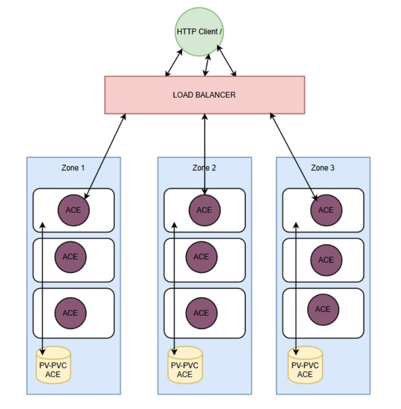
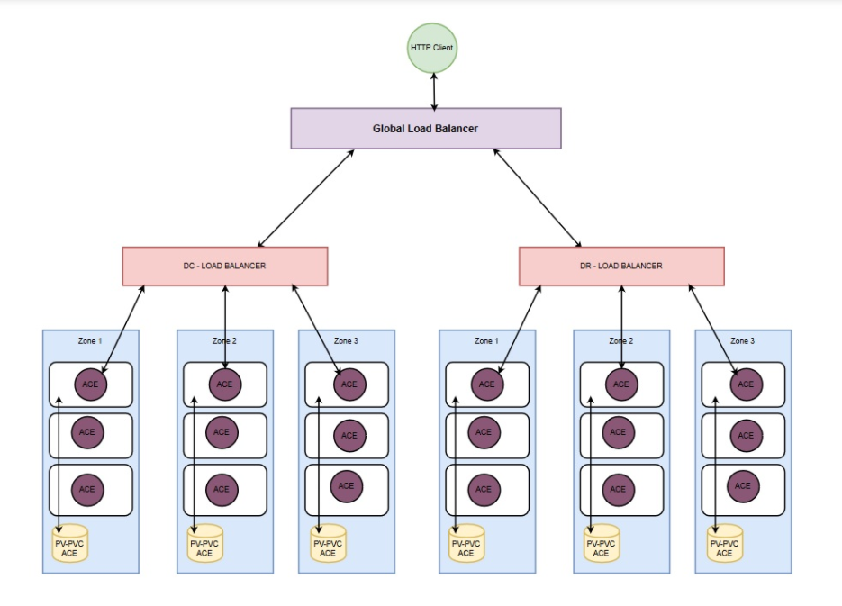

# AD-001

### Name

App Connect Deployment Strategy

### Status

accepted

### Last Update

2021-05-28

### Subject Area

Using Cloud Pack For Integration Along With OpenShift Container Platform vs App Connect SaaS Offering

### Topic

App Connect Deployment Strategy

### Issue or Problem Statement

As currently designed, using ACE SaaS offering on IBM cloud; we’ve experienced the following issues:
    • Lack of monitoring for container’s consumption (CPU/Memory)

    • Automated deployment is not supported in ACE SaaS offering, only manual deployments through the dashboard

    • Occurrence of multiple unplanned outage incidents with ACE SaaS

    • There are no supported management APIs to manage the running servers and perform health checks

    • Container logs are not meeting technical requirements for logging necessary business data in order to support in troubleshooting integration flows

### Assumptions

### Motivation

    • Considering the aggressive workload and expected throughput for Brexit, the current ACE SaaS architecture wouldn’t support HA and auto-scalability
    • More reliable deployments with Red Hat OpenShift and utilization of docker and container orchestration capabilities

    • Automated deployments for integration flows and eliminate the risk caused by manual interference

 

### Notes

[Expand all](#){ .md-button .same-line }

### Alternatives

    

ACE SaaS Offering with HA Implementation

<table>
    <caption></caption>
    <thead>
        <tr>
            <th></th>
            <th></th>
        </tr>
    </thead>
    <tr>
        <td> <strong>Name</strong> </td>
        <td>ACE SaaS Offering with HA Implementation</td>
    </tr>
    <tr>
        <td> <strong>Description</strong> </td>
        <td>ACE SaaS offering with HA implementation, which can be achieved by provisioning multiple instances in different geographical regions while considering an increase in the integration servers’ replicas</td>
    </tr>
    <tr>
        <td> <strong>Best Applied</strong> </td>
        <td></td>
    </tr>
    <tr>
        <td> <strong>Contraindications</strong> </td>
        <td></td>
    </tr>
</table>

    

Using CP4I Along With OpenShift Container Platform

<table>
    <caption></caption>
    <thead>
        <tr>
            <th></th>
            <th></th>
        </tr>
    </thead>
    <tr>
        <td> <strong>Name</strong> </td>
        <td>Using CP4I Along With OpenShift Container Platform</td>
    </tr>
    <tr>
        <td> <strong>Description</strong> </td>
        <td>
Deployment strategy to be as follows:

 

Deployment of the integration flows over three different zones, In each zone, there are multiple integration server pods running ACE flows and processing the client requests with the implemented integration logic as in the figure below

 

 

 

 

 

    • For HA implementation, the workload is completely balanced between two clusters deployed on two different regions. A global load balancer is configured to transfer the request between both regions. Both clusters are in completely different location geographically and in a different network. There is no internal network communication among them as in the below figure

 

 
</td>
    </tr>
    <tr>
        <td> <strong>Best Applied</strong> </td>
        <td></td>
    </tr>
    <tr>
        <td> <strong>Contraindications</strong> </td>
        <td></td>
    </tr>
</table>

    

### Decision

Using CP4I Along With OpenShift Container Platform

### Justification

    • Fine-grained deployment and pipeline automated deployments are supported through OpenShift container platform
    • IBM Cloud Paks for integration provides logging service (based on the ELK stack) and monitoring service (based on Prometheus and Grafana)

    • Monitoring for integration servers’ consumption would alert if any expected failures and action can be taken to increase scalability

### Implications

    • Increase agility and productivity
    • Fully support the agile integration architecture concepts.
    • Dynamic scalability and inherit resilience
    • Management and maintainability provided with OpenShift CP4I

### Derived Requirements

Additional AppOps scope is added

### Related Decisions

    • RH OpenShift container platform to deploy cloud pack for integration
    • Non-production environment to only have different entitlement and HA won’t be supported for cost saving

