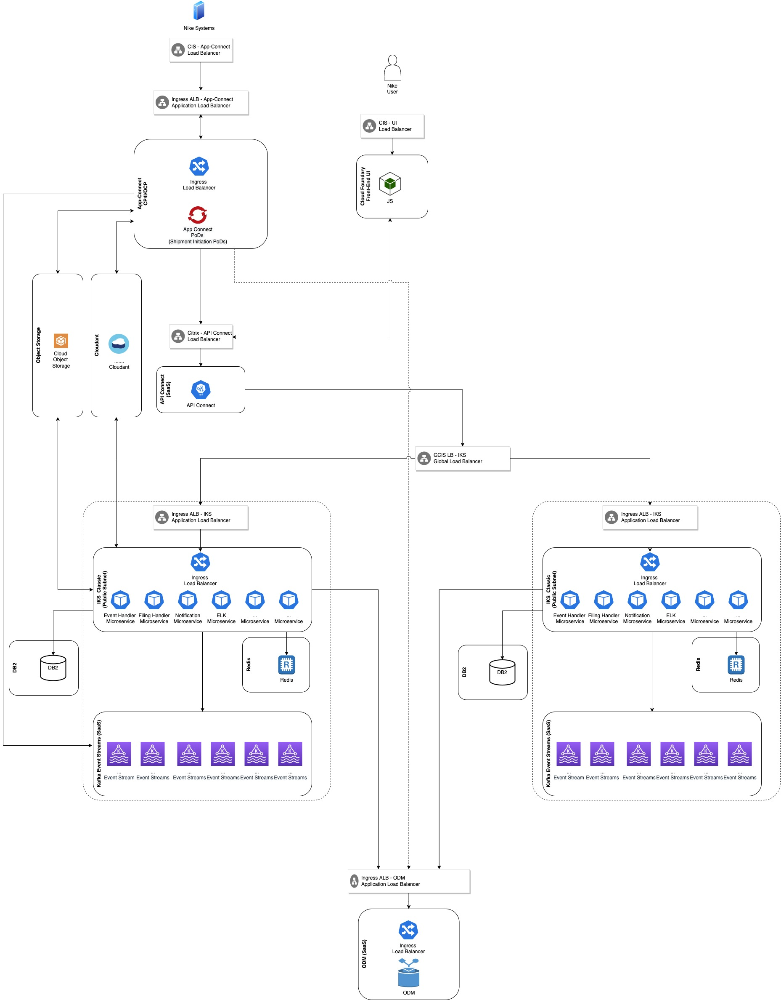
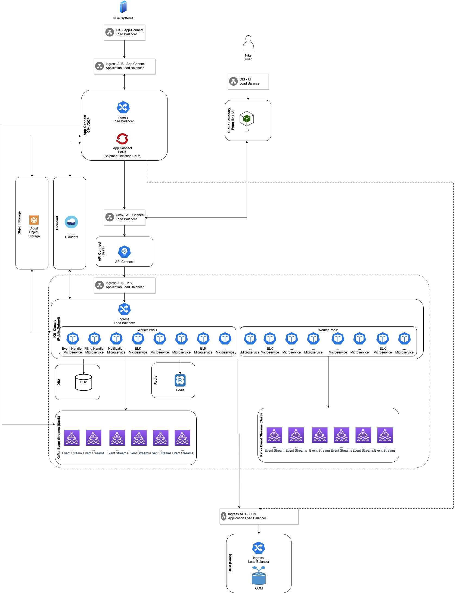
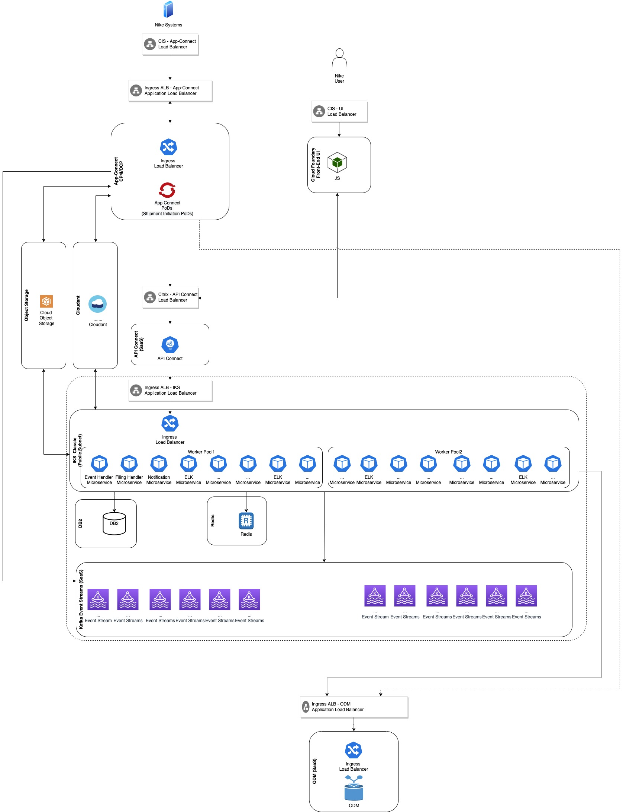

# AD-025

### Name

Event Streams & IKS Micro Services Elasticity

### Status

proposed

### Last Update

### Subject Area

Elasticity

### Topic

### Issue or Problem Statement

Need to address how the elasticity to scale up and scale down the event streams and Kubernetes environments that host the micro services will be addressed.

### Assumptions

The micro services hosted on Kubernetes cluster need to be tied to specific event streams end point. If the end point changes the service pods need to be restarted.

### Motivation

Scaling up and scaling down are currently manual process and need to be automated. There is a need to scale up the environment in several cases such as:
* High traffic happen in the system 

* In preparation of anticipated high work loads (e.g. Black week or Promotions).

* In case of moving the traffic to a lower capacity environment (e.g. Standby environment with partial capacity)

 

Also the solution need to take into consideration the feasibility of scaling down again after there is no more need of the higher capacity environment.

### Notes

[Expand all](#){ .md-button .same-line }

### Alternatives

    

Scale Event Streams in a new Cluster and the IKS hosted Micro Services in a new Cluster

<table>
    <caption></caption>
    <thead>
        <tr>
            <th></th>
            <th></th>
        </tr>
    </thead>
    <tr>
        <td> <strong>Name</strong> </td>
        <td>Scale Event Streams in a new Cluster and the IKS hosted Micro Services in a new Cluster</td>
    </tr>
    <tr>
        <td> <strong>Description</strong> </td>
        <td>
In this alternative, the Event Streams upscaling will create its own event streams cluster. Also the Micro services will be scaled up by creating a new Kubernetes cluster. These newly created micro services will be pointing to the newly created events streams. Accordingly there will be groups of micro services cluster coupled with their event streams cluster.

<ol><li>Create and configure a new Event Streams cluster</li><li>Create and configure a new Kubernetes cluster.</li><li>Create a new set of micro services on the Kubernetes cluster that point to the newly created event streams</li></ol>Configure the load balancer to utilize the new Kubernetes cluster.

 

In case of downscaling, the traffic coming to the micro services will be stopped. Accordingly after a while, all the events in the event stream cluster will be consumed. At this stage downscaling can be completed by decommissioning both the event streams cluster and the Kubernetes cluster that host the micro services.

<ol><li>Stop the traffic to the newly created set of micro services by removing them from the load balancer.</li><li>Wait till all the events in the associated even streams cluster are consumed.</li><li>Delete the newly created Kubernetes cluster.</li><li>Delete the newly created event streams cluster.</li></ol>

 

 
</td>
    </tr>
    <tr>
        <td> <strong>Best Applied</strong> </td>
        <td>
<ul><li>Downscaling will be simpler than other approaches.</li><li>This process can be repeated multiple times to get new clusters.</li><li>The upscaling can be done in another data center.</li><li>Better control over the capacity to be added for each cluster</li></ul>
</td>
    </tr>
    <tr>
        <td> <strong>Contraindications</strong> </td>
        <td><ul><li>Scaling up and down will be step wise according to the cluster granularity.</li><li>Have overhead for a new IKS cluster (Master nodes, ... etc.)</li></ul></td>
    </tr>
</table>

    

Scale Event Streams in a new Cluster and the IKS hosted Micro Services in a the same Cluster

<table>
    <caption></caption>
    <thead>
        <tr>
            <th></th>
            <th></th>
        </tr>
    </thead>
    <tr>
        <td> <strong>Name</strong> </td>
        <td>Scale Event Streams in a new Cluster and the IKS hosted Micro Services in a the same Cluster</td>
    </tr>
    <tr>
        <td> <strong>Description</strong> </td>
        <td>
In this alternative, a new event streams cluster will be created. Also The existing Kubernetes cluster will be scaled horizontally by adding new worker nodes. After add the new worker nodes, a new set of the micro services will be created to point to the new event streams.

 

<ol><li>Create and configure a new Event Streams cluster</li><li>Add worker nodes to the Kubernetes cluster</li><li>Create a new set of micro services on the Kubernetes cluster that point to the newly created event streams</li><li>Add the new micro services to the load balancer</li></ol>
 

Downscaling will be achieved by stopping the traffic to the newly created micro services and when the associated events it their associated event stream cluster are consumed the process for downscaling will be completed by decommissioning the newly created event streams and then deleting the pods of the micro service that are using these event streams. At the end we can delete the worker nodes.

<ol><li>Stop the traffic to the newly created set of micro services by removing them from the load balancer.</li><li>Wait till all the events in the associated even streams cluster are consumed.</li><li>Delete the newly created micro services</li><li>Delete the newly created event streams cluster</li><li>Delete the worker nodes from the Kubernetes cluster.</li></ol>

 

 

 

 

</td>
    </tr>
    <tr>
        <td> <strong>Best Applied</strong> </td>
        <td>
<ul><li>Utilize the existing IKS cluster by using the same cluster management nodes</li></ul>
</td>
    </tr>
    <tr>
        <td> <strong>Contraindications</strong> </td>
        <td><ul><li>Splitting the traffic between the old and the new micro services could be challenging.</li><li>Can not be scaled up using another data center/region.</li></ul></td>
    </tr>
</table>

    

Scale Event Streams independent of Kubernetes hosted Micro Services Using Existing Clusters

<table>
    <caption></caption>
    <thead>
        <tr>
            <th></th>
            <th></th>
        </tr>
    </thead>
    <tr>
        <td> <strong>Name</strong> </td>
        <td>Scale Event Streams independent of Kubernetes hosted Micro Services Using Existing Clusters</td>
    </tr>
    <tr>
        <td> <strong>Description</strong> </td>
        <td>

This alternative relies on the existing Kubernetes and Event Stream Clusters to scale up the environment

 

 

Up Scaling Steps
<ol><li>Scale up the event streams cluster by requesting additional capacity and additional storage</li><li>Create a new set of Worker nodes/Worker pool in the Kubernetes cluster</li><li>Create a new set of the IKS micro services by increasing the number of Pods of the existing services</li></ol>

 

 

Down Scaling steps:

<ol><li>Create a new scaled down Event Streams cluster with a lower capacity </li><li>Create a new set of Worker nodes/Worker pool in the Kubernetes cluster
</li><li>Create a new set of the IKS micro services to point to the new scaled down Event Streams cluster</li><li>Stop the traffic to the old micro services</li><li>Wait till all the events in the high spec Event Streams cluster is consumed</li><li>Delete the old micro services that use the high spec Event Streams cluster</li><li>Delete the high spec Event Streams cluster
</li><li>Scale the number of worker nodes in the Kubernetes cluster</li></ol>

 

 

 
</td>
    </tr>
    <tr>
        <td> <strong>Best Applied</strong> </td>
        <td><ul><li>Fast scaling in the same infrastructure</li></ul></td>
    </tr>
    <tr>
        <td> <strong>Contraindications</strong> </td>
        <td><ul><li>Scaling down is challenging</li><li>Can not be scaled up using another data center/region</li></ul></td>
    </tr>
</table>

    

### Decision

Scale Event Streams in a new Cluster and the IKS hosted Micro Services in a the same Cluster

### Justification

It will be feasible to scale down after there is no need to keep the scaled up event streams and IKS micro services.

### Implications

Need to develop and test the scripts for upscaling and downscaling of both the Event Streams and the Kubernetes hosting the micro services.

### Derived Requirements

### Related Decisions

