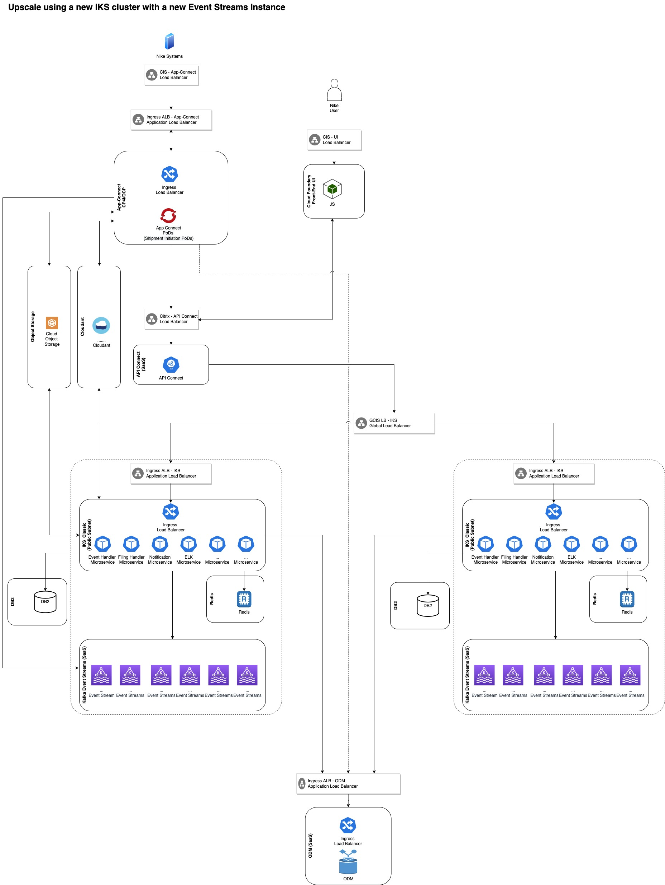
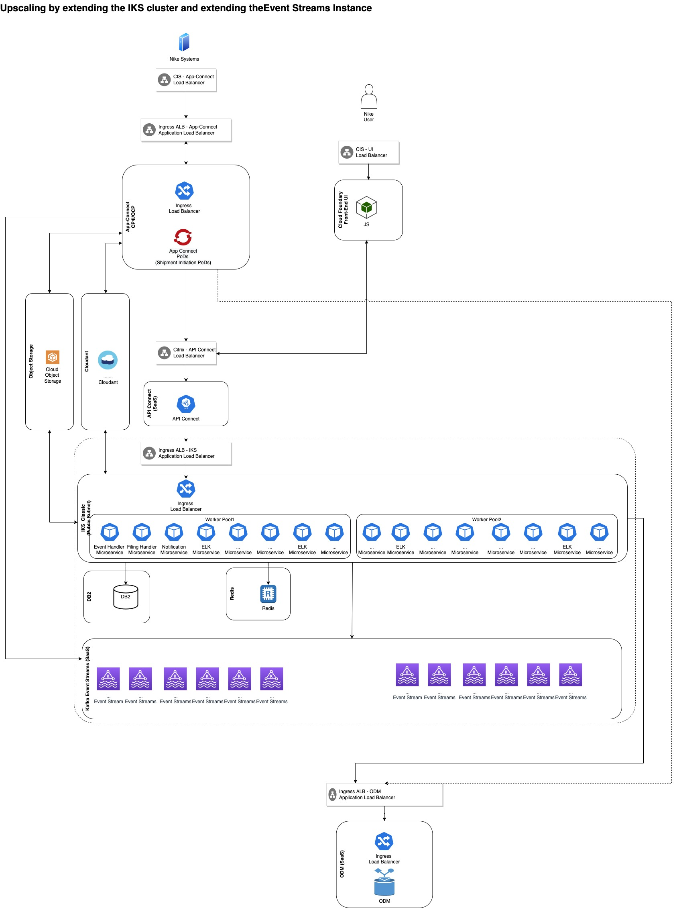
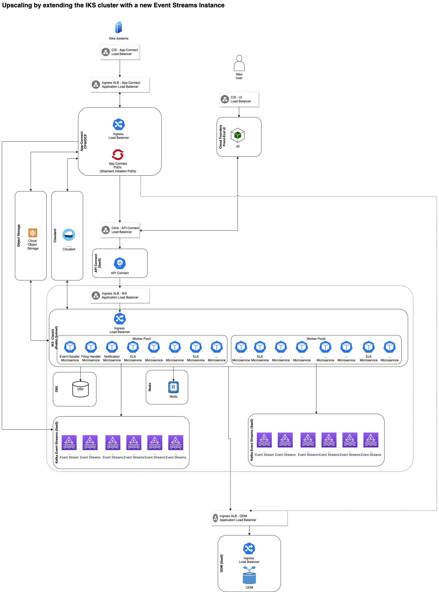

# AD-023

### Name

Event Streams & IKS Elasticity

### Status

proposed

### Last Update

2022-08-16

### Subject Area

Elasticity

### Topic

Scaling up/down for IKS and Event Streams

### Issue or Problem Statement

Select an Approach for the Scaling up/down for IKS and Event Streams

### Assumptions

### Motivation

Able to scale up and down the services based on the expected traffic workload.

### Notes

[Expand all](#){ .md-button .same-line }

### Alternatives

    

Upscale using a new IKS cluster with a new Event Streams Instance

<table>
    <caption></caption>
    <thead>
        <tr>
            <th></th>
            <th></th>
        </tr>
    </thead>
    <tr>
        <td> <strong>Name</strong> </td>
        <td>Upscale using a new IKS cluster with a new Event Streams Instance</td>
    </tr>
    <tr>
        <td> <strong>Description</strong> </td>
        <td>
 
In this option the following steps will be used for scaling up:
<ol><li>A new instance of Event Streams will be created </li><li>A new IKS cluster hosting the micro-services will be created with its worker pool and its set of worker nodes</li><li>A new set of micro-services will be created and will be pointing to the new event streams instance.</li><li>The traffic will be directed to the old and new micro-services</li></ol>

In this option the following steps will be used for scaling down:

<ol><li>The traffic will not be directed to the new micro-services.</li><li>The new micro-services will be removed by deleting the new IKS cluster with its worker pool and its worker nodes.</li><li>The new instance of Event Streams will be deleted </li></ol>
 

</td>
    </tr>
    <tr>
        <td> <strong>Best Applied</strong> </td>
        <td><ul><li>Easy to downscale after all the traffic is stopped from IKS.</li><li>Flexibility of the location of the upscaled components in different regions or different zones or even the same zone.</li></ul></td>
    </tr>
    <tr>
        <td> <strong>Contraindications</strong> </td>
        <td><ul><li>Treating the IKS and its associated event streams as one unit of upscaling or downscaling.</li><li>Granularity of up/downscaling is in steps (not smooth) for both IKS and Event Streams</li></ul></td>
    </tr>
</table>

    

Upscaling by extending the IKS cluster and extending the Event Streams Instance

<table>
    <caption></caption>
    <thead>
        <tr>
            <th></th>
            <th></th>
        </tr>
    </thead>
    <tr>
        <td> <strong>Name</strong> </td>
        <td>Upscaling by extending the IKS cluster and extending the Event Streams Instance</td>
    </tr>
    <tr>
        <td> <strong>Description</strong> </td>
        <td>

In this option the following steps will be used for scaling up:

<ol><li>The capacity of the existing Event Streams will be increased.</li><li>The existing IKS cluster hosting the micro-services will be extended by adding a new worker pool with its set of worker nodes to the same IKS cluster.</li><li>A new set of micro-services will be created and will be pointing to the existing event streams instance.</li><li>The traffic will be directed to the old and new micro-services
</li></ol>

In this option the following steps will be used for scaling down:

<ol><li>The traffic will not be directed to the new micro-services.</li><li>The new micro-services will be removed by deleting the new worker pool and its worker nodes</li><li>However, there is no way figured out yet for scaling down the event streams. 
</li></ol>
 

Conclusion: This option is not fully workable due to there is no clear way for scaling down the event stream instance.

 

 
</td>
    </tr>
    <tr>
        <td> <strong>Best Applied</strong> </td>
        <td><ul><li>Utilizing the existing IKS and Event Streams instances.</li></ul></td>
    </tr>
    <tr>
        <td> <strong>Contraindications</strong> </td>
        <td><ul><li>There is no way figured out yet for scaling down the event streams. </li></ul></td>
    </tr>
</table>

    

Upscaling by extending the IKS cluster with a new Event Streams Instance

<table>
    <caption></caption>
    <thead>
        <tr>
            <th></th>
            <th></th>
        </tr>
    </thead>
    <tr>
        <td> <strong>Name</strong> </td>
        <td>Upscaling by extending the IKS cluster with a new Event Streams Instance</td>
    </tr>
    <tr>
        <td> <strong>Description</strong> </td>
        <td>
In this option the following steps will be used for scaling up:

<ol><li>A new instance of Event Streams will be created </li><li>The existing IKS cluster hosting the micro-services will be extended by adding a new worker pool with its set of worker nodes to the same IKS cluster</li><li>A new set of micro-services will be created and will be pointing to the new event streams instance.</li><li>The traffic will be directed to the old and new micro-services</li></ol>

In this option the following steps will be used for scaling down:

<ol><li>The traffic will not be directed to the new micro-services.</li><li>The new micro-services will be removed by deleting the new worker pool and its worker nodes</li><li>The new instance of Event Streams will be deleted 
</li></ol>

 

 

 
</td>
    </tr>
    <tr>
        <td> <strong>Best Applied</strong> </td>
        <td><ul><li>Easy to downscale after all the traffic is stopped from IKS.
</li><li>
Utilizing the same IKS cluster overhead</li></ul></td>
    </tr>
    <tr>
        <td> <strong>Contraindications</strong> </td>
        <td><ul><li>Upscaling can be done in the same region only.</li><li>Granularity of up/downscaling is in steps (not smooth) for the Event Streams.</li></ul></td>
    </tr>
</table>

    

### Decision

### Justification

### Implications

### Derived Requirements

### Related Decisions

