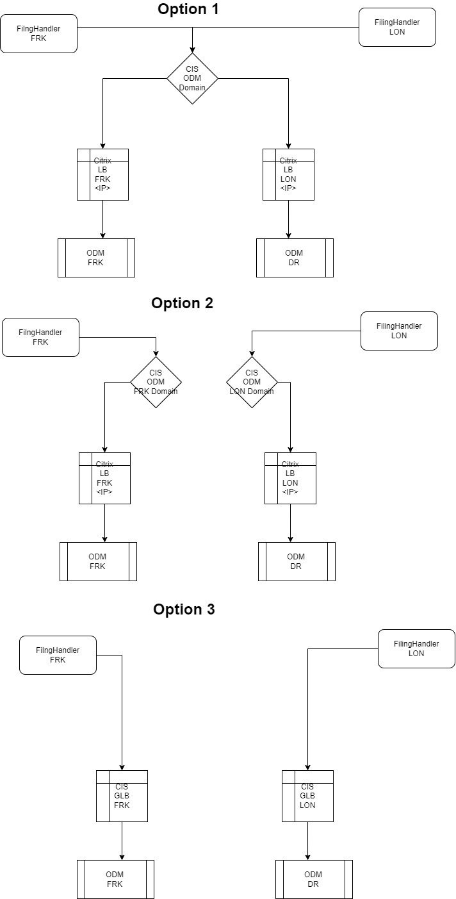

# AD-019

### Name

Active-Active

### Status

proposed

### Last Update

2022-05-30

### Subject Area

All application layers and load balancers

### Topic

Active-Active

### Issue or Problem Statement

Active-Active for High availability for all application layers

### Assumptions

### Motivation

### Notes

[Expand all](#){ .md-button .same-line }

### Alternatives

    

Region Affinity - Approach 3 - using CIS

<table>
    <caption></caption>
    <thead>
        <tr>
            <th></th>
            <th></th>
        </tr>
    </thead>
    <tr>
        <td> <strong>Name</strong> </td>
        <td>Region Affinity - Approach 3 - using CIS</td>
    </tr>
    <tr>
        <td> <strong>Description</strong> </td>
        <td>Diagram to be added</td>
    </tr>
    <tr>
        <td> <strong>Best Applied</strong> </td>
        <td>- Disaster situation: LB to switch to the other region  without restarting Filing Handler</td>
    </tr>
    <tr>
        <td> <strong>Contraindications</strong> </td>
        <td>- two CIS LBs instead of one.. two integration points (one for each region)

- BE configuration will point to two endpoints

- APP Connect configuration impacted needs separate endpoints for FRK and LON

 
</td>
    </tr>
</table>

    

Region affinity - Approach 1 - using single endpoint

<table>
    <caption></caption>
    <thead>
        <tr>
            <th></th>
            <th></th>
        </tr>
    </thead>
    <tr>
        <td> <strong>Name</strong> </td>
        <td>Region affinity - Approach 1 - using single endpoint</td>
    </tr>
    <tr>
        <td> <strong>Description</strong> </td>
        <td>CCS flow starting point is from API Connect calls. Whether the call is triggered from Integration layer or Front end, we need to make sure that once the BE receives the call in a certain region --&gt; the whole flow should continue in the same region.
 

Approach:

- One single domain CIS

- two citrix LB - one in FRK and one in LON

- When CIS receives the request, it should route the request to either Citrix FRK or Citrix LON based on the caller region

- Citrix FRK will send the calls to ODM FRK and Citrix LON will send the calls to ODM LON

 
</td>
    </tr>
    <tr>
        <td> <strong>Best Applied</strong> </td>
        <td>
- One endpoint without separating endpoints for different regions

- No network latency as all calls will be on the same region
</td>
    </tr>
    <tr>
        <td> <strong>Contraindications</strong> </td>
        <td> - Difficulty in implementation. When CIS receives the request, it doesn't know the region of the caller. A ticket will be created with IBM Cloud support  to investigate further. Could be through edge functions, or checking header parameters that are pre-calculated by cloudflare CIS
- Citrix is not needed. We could have only CIB that routes the requests to ODM FRK or LON. However, due to cloudflare issues than occur when CIS is configured to call different ODM domains --&gt; Citrix is required as a workaround. If cloudflare issue is resolved --&gt; Citrix could be removed from this 
</td>
    </tr>
</table>

    

Region affinity - Approach 2 - two endpoints using citrix

<table>
    <caption></caption>
    <thead>
        <tr>
            <th></th>
            <th></th>
        </tr>
    </thead>
    <tr>
        <td> <strong>Name</strong> </td>
        <td>Region affinity - Approach 2 - two endpoints using citrix</td>
    </tr>
    <tr>
        <td> <strong>Description</strong> </td>
        <td>CCS flow starting point is from API Connect calls. Whether the call is triggered from Integration layer or Front end, we need to make sure that once the BE receives the call in a certain region --&gt; the whole flow should continue in the same region.

Approach:

- Two layers depending on CIS (acting as DNS and protection layer). CIS above citrix

- FRK rill route to FRK, LON route to LON
</td>
    </tr>
    <tr>
        <td> <strong>Best Applied</strong> </td>
        <td>

- Request will continue in the same region - no latency

- Straight forward implementation
</td>
    </tr>
    <tr>
        <td> <strong>Contraindications</strong> </td>
        <td>- separate endpoints that will need to be handled in the configuration of backend, interation
- Two endpoints for APIs shared with NIKE?
</td>
    </tr>
</table>

    

Switch round robin between the two ODM subscriptions

<table>
    <caption></caption>
    <thead>
        <tr>
            <th></th>
            <th></th>
        </tr>
    </thead>
    <tr>
        <td> <strong>Name</strong> </td>
        <td>Switch round robin between the two ODM subscriptions</td>
    </tr>
    <tr>
        <td> <strong>Description</strong> </td>
        <td>Switch round robin between the two ODM subscriptions. Same applies for other CCS components</td>
    </tr>
    <tr>
        <td> <strong>Best Applied</strong> </td>
        <td>1. Easy and straight forward implementation</td>
    </tr>
    <tr>
        <td> <strong>Contraindications</strong> </td>
        <td>1. Latency between regions FRK &amp; LON
History: Last year black week tests results showed that there is network latency when the calls are triggered from FRK to ODM London. Based on this decision, we decided to depend mainly on the same region and keep the other region as backup.
</td>
    </tr>
</table>

    

### Decision

Region affinity - Approach 1 - using single endpoint

### Justification

<ul><li>If the flow started in FRK, it should continue in FRK. Same applies for LON</li></ul>
 

Notes:

1. CIS can't work on two regions at the same time due to the issues of CIS - different domain without changing page rule.

Citrix doesn't have this issue and can route to different regions at the same time

2. How to know the region to direct the call to the region.. not supported by GLB.. it must support routing policy but will not work with CIS

 

 

 

### Implications

### Derived Requirements

### Related Decisions

