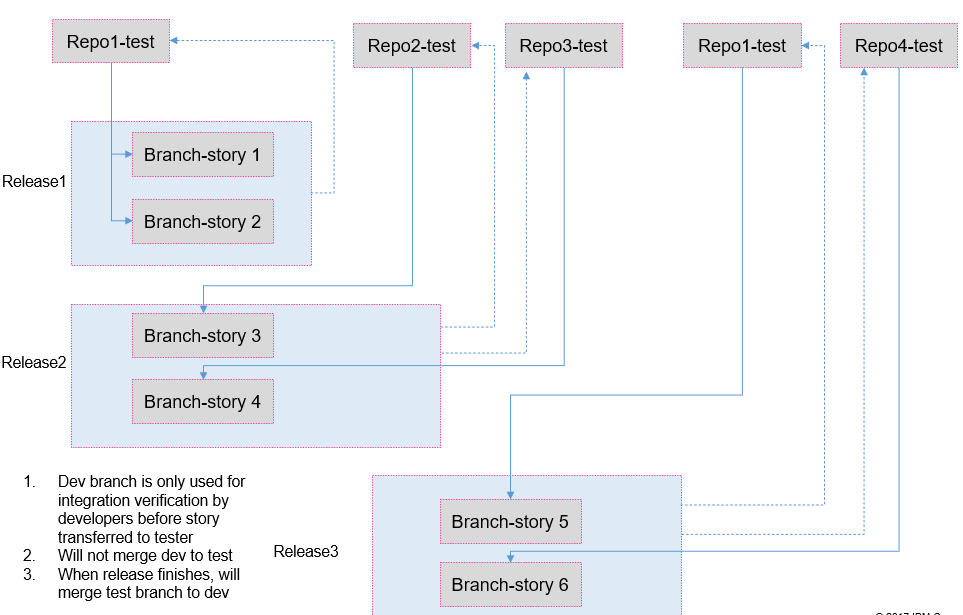
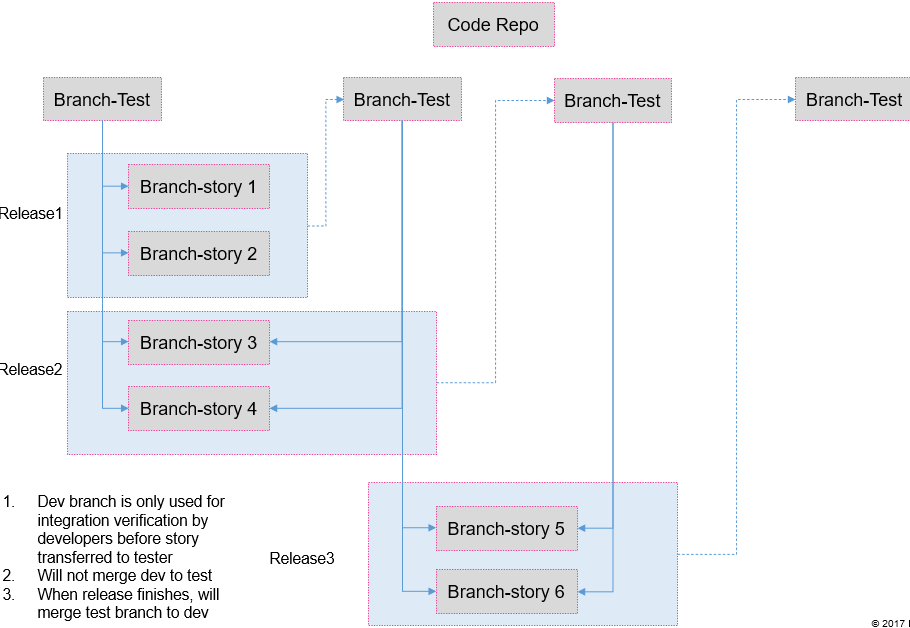

# AD-020

### Name

Decouple CA frontend to multiple code repos

### Status

proposed

### Last Update

2022-01-11

### Subject Area

Micro-frontend

### Topic

Frontend Architecture

### Issue or Problem Statement

Current develop and release model/process can not support rapid release.  Since frontend is a single big web application,  code change of stories are mixed and may have conflict. Also test and regression scope is not clear.

### Assumptions

### Motivation

### Notes

[Expand all](#){ .md-button .same-line }

### Alternatives

    

Decouple frontend to multiple web repositories

<table>
    <caption></caption>
    <thead>
        <tr>
            <th></th>
            <th></th>
        </tr>
    </thead>
    <tr>
        <td> <strong>Name</strong> </td>
        <td>Decouple frontend to multiple web repositories</td>
    </tr>
    <tr>
        <td> <strong>Description</strong> </td>
        <td>
<b>Pros</b>

<ol><li>physically decouple one big web app to several small ones with separate repo
</li><li>can develop/deploy individual application
</li><li>clear test/regression scope (per application)
</li></ol>

<b>Cons</b>

<ol><li>need effort to update devpos to support multiple applications build and version management
</li><li>page navigiation between application is not smooth
</li><li>multiple page resource load (per application for 1st time)
</li><li>contain reduntant code
</li><li>complicated invocation between applications and hard to share data
</li><li>effort to convert single application to multiple ones</li></ol>
</td>
    </tr>
    <tr>
        <td> <strong>Best Applied</strong> </td>
        <td></td>
    </tr>
    <tr>
        <td> <strong>Contraindications</strong> </td>
        <td></td>
    </tr>
</table>

    

One web repository and leverage multiple branches to release story

<table>
    <caption></caption>
    <thead>
        <tr>
            <th></th>
            <th></th>
        </tr>
    </thead>
    <tr>
        <td> <strong>Name</strong> </td>
        <td>One web repository and leverage multiple branches to release story</td>
    </tr>
    <tr>
        <td> <strong>Description</strong> </td>
        <td>
<b>Pros</b>

<ol><li>Single web application: smooth page navigation
</li><li>Single web application: one-time page resource load
</li><li>Easily to reuse components (inside one application) and no redundant code 
</li></ol>

<b>Cons</b>

<ol><li>it's risky having more other code update than planned stories
</li><li>it's risky having the wrong test/regression scope per human evaluation
</li><li>code merge between branches could bring issues: code conflict and lost
</li><li>need repeat test after code merge
</li><li>need to deploy whole application for any release</li></ol>

 
</td>
    </tr>
    <tr>
        <td> <strong>Best Applied</strong> </td>
        <td></td>
    </tr>
    <tr>
        <td> <strong>Contraindications</strong> </td>
        <td></td>
    </tr>
</table>

    

### Decision

Decouple frontend to multiple web repositories

### Justification

<ol><li>Physically code repository isolation is more important for 1)developer: not impact other story development; 2) test: clear test/regression scope</li><li>Frequent code merge for stories is not good to bring code conflict and lost</li></ol>

### Implications

### Derived Requirements

### Related Decisions

