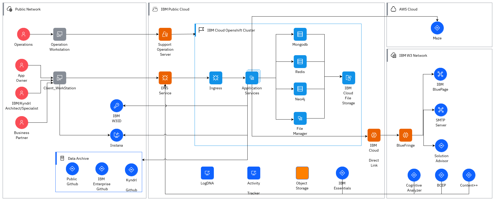

## Diagram

### Name

IT System View - IBM Cloud Based

### Description

### Reference(s)

## Element

[Expand all](#){ .md-button .diff-line }

### Actor

    

App Owner

<table>
    <caption></caption>
    <thead>
        <tr>
            <th></th>
            <th></th>
        </tr>
    </thead>
    <tr>
        <td> <strong>Name</strong> </td>
        <td>App Owner</td>
    </tr>
    <tr>
        <td> <strong>Description</strong> </td>
        <td>The user who has admin permission. For example, publish architecture, grant user new role, send app In-App Notification.</td>
    </tr>
    <tr>
        <td> <strong>Type</strong> </td>
        <td>Human</td>
    </tr>
    <tr>
        <td> <strong>Generic Group</strong> </td>
<td>
        
</td>
    </tr>
</table>

    

BCEP

<table>
    <caption></caption>
    <thead>
        <tr>
            <th></th>
            <th></th>
        </tr>
    </thead>
    <tr>
        <td> <strong>Name</strong> </td>
        <td>BCEP</td>
    </tr>
    <tr>
        <td> <strong>Description</strong> </td>
        <td>Business Continuity Engineering Platform (BCEP) is a centralized managed engineering platform which provides tools for supporting end to end client project engagement and delivery. This platform enable different personas of the teams to deliver to clients faster, more effectively and transparently, from geo-distributed locations.</td>
    </tr>
    <tr>
        <td> <strong>Type</strong> </td>
        <td>IT System</td>
    </tr>
    <tr>
        <td> <strong>Generic Group</strong> </td>
<td>
        
</td>
    </tr>
</table>

    

Business Partner

<table>
    <caption></caption>
    <thead>
        <tr>
            <th></th>
            <th></th>
        </tr>
    </thead>
    <tr>
        <td> <strong>Name</strong> </td>
        <td>Business Partner</td>
    </tr>
    <tr>
        <td> <strong>Description</strong> </td>
        <td>The client facing IBMers</td>
    </tr>
    <tr>
        <td> <strong>Type</strong> </td>
        <td>Human</td>
    </tr>
    <tr>
        <td> <strong>Generic Group</strong> </td>
<td>
        
</td>
    </tr>
</table>

    

Cognitive Analyzer

<table>
    <caption></caption>
    <thead>
        <tr>
            <th></th>
            <th></th>
        </tr>
    </thead>
    <tr>
        <td> <strong>Name</strong> </td>
        <td>Cognitive Analyzer</td>
    </tr>
    <tr>
        <td> <strong>Description</strong> </td>
        <td>It analyzes RFPs and automatically and creates the solution. It integrates Cognitive Architect to provide the options to the user to modify the automatically created solution, by referencing to reference architecture and add or remove solution components. Also modify the solution to a different technology platform.</td>
    </tr>
    <tr>
        <td> <strong>Type</strong> </td>
        <td>IT System</td>
    </tr>
    <tr>
        <td> <strong>Generic Group</strong> </td>
<td>
        
</td>
    </tr>
</table>

    

Content++

<table>
    <caption></caption>
    <thead>
        <tr>
            <th></th>
            <th></th>
        </tr>
    </thead>
    <tr>
        <td> <strong>Name</strong> </td>
        <td>Content++</td>
    </tr>
    <tr>
        <td> <strong>Description</strong> </td>
        <td></td>
    </tr>
    <tr>
        <td> <strong>Type</strong> </td>
        <td>IT System</td>
    </tr>
    <tr>
        <td> <strong>Generic Group</strong> </td>
<td>
        
</td>
    </tr>
</table>

    

IBM BluePage

<table>
    <caption></caption>
    <thead>
        <tr>
            <th></th>
            <th></th>
        </tr>
    </thead>
    <tr>
        <td> <strong>Name</strong> </td>
        <td>IBM BluePage</td>
    </tr>
    <tr>
        <td> <strong>Description</strong> </td>
        <td>IBM BluePage provides users profile information, including firstnName, lastName, avatar, notesId</td>
    </tr>
    <tr>
        <td> <strong>Type</strong> </td>
        <td>IT System</td>
    </tr>
    <tr>
        <td> <strong>Generic Group</strong> </td>
<td>
        
</td>
    </tr>
</table>

    

IBM Enterprise Github

<table>
    <caption></caption>
    <thead>
        <tr>
            <th></th>
            <th></th>
        </tr>
    </thead>
    <tr>
        <td> <strong>Name</strong> </td>
        <td>IBM Enterprise Github</td>
    </tr>
    <tr>
        <td> <strong>Description</strong> </td>
        <td></td>
    </tr>
    <tr>
        <td> <strong>Type</strong> </td>
        <td>IT System</td>
    </tr>
    <tr>
        <td> <strong>Generic Group</strong> </td>
<td>
        
</td>
    </tr>
</table>

    

IBM Essentials

<table>
    <caption></caption>
    <thead>
        <tr>
            <th></th>
            <th></th>
        </tr>
    </thead>
    <tr>
        <td> <strong>Name</strong> </td>
        <td>IBM Essentials</td>
    </tr>
    <tr>
        <td> <strong>Description</strong> </td>
        <td></td>
    </tr>
    <tr>
        <td> <strong>Type</strong> </td>
        <td>IT System</td>
    </tr>
    <tr>
        <td> <strong>Generic Group</strong> </td>
<td>
        
</td>
    </tr>
</table>

    

IBM W3ID

<table>
    <caption></caption>
    <thead>
        <tr>
            <th></th>
            <th></th>
        </tr>
    </thead>
    <tr>
        <td> <strong>Name</strong> </td>
        <td>IBM W3ID</td>
    </tr>
    <tr>
        <td> <strong>Description</strong> </td>
        <td>Leverage IBM W3ID for IBMer authentication</td>
    </tr>
    <tr>
        <td> <strong>Type</strong> </td>
        <td>IT System</td>
    </tr>
    <tr>
        <td> <strong>Generic Group</strong> </td>
<td>
        
</td>
    </tr>
</table>

    

IBM/Kyndrl Architect/Specialist

<table>
    <caption></caption>
    <thead>
        <tr>
            <th></th>
            <th></th>
        </tr>
    </thead>
    <tr>
        <td> <strong>Name</strong> </td>
        <td>IBM/Kyndrl Architect/Specialist</td>
    </tr>
    <tr>
        <td> <strong>Description</strong> </td>
        <td>The user with the basic permission, like Architecture Compose, Search, Collaborate</td>
    </tr>
    <tr>
        <td> <strong>Type</strong> </td>
        <td>Human</td>
    </tr>
    <tr>
        <td> <strong>Generic Group</strong> </td>
<td>
        
</td>
    </tr>
</table>

    

Instana

<table>
    <caption></caption>
    <thead>
        <tr>
            <th></th>
            <th></th>
        </tr>
    </thead>
    <tr>
        <td> <strong>Name</strong> </td>
        <td>Instana</td>
    </tr>
    <tr>
        <td> <strong>Description</strong> </td>
        <td>Leverage Instana for Servers, Middlewares, and Applications Monitor</td>
    </tr>
    <tr>
        <td> <strong>Type</strong> </td>
        <td>IT System</td>
    </tr>
    <tr>
        <td> <strong>Generic Group</strong> </td>
<td>
        
</td>
    </tr>
</table>

    

Kyndrl Github

<table>
    <caption></caption>
    <thead>
        <tr>
            <th></th>
            <th></th>
        </tr>
    </thead>
    <tr>
        <td> <strong>Name</strong> </td>
        <td>Kyndrl Github</td>
    </tr>
    <tr>
        <td> <strong>Description</strong> </td>
        <td></td>
    </tr>
    <tr>
        <td> <strong>Type</strong> </td>
        <td>IT System</td>
    </tr>
    <tr>
        <td> <strong>Generic Group</strong> </td>
<td>
        
</td>
    </tr>
</table>

    

Maze

<table>
    <caption></caption>
    <thead>
        <tr>
            <th></th>
            <th></th>
        </tr>
    </thead>
    <tr>
        <td> <strong>Name</strong> </td>
        <td>Maze</td>
    </tr>
    <tr>
        <td> <strong>Description</strong> </td>
        <td>Cognitive Architect integrated Maze for Cloud Deployment Diagram Render and Auto Deployment</td>
    </tr>
    <tr>
        <td> <strong>Type</strong> </td>
        <td>IT System</td>
    </tr>
    <tr>
        <td> <strong>Generic Group</strong> </td>
<td>
        
</td>
    </tr>
</table>

    

Operations

<table>
    <caption></caption>
    <thead>
        <tr>
            <th></th>
            <th></th>
        </tr>
    </thead>
    <tr>
        <td> <strong>Name</strong> </td>
        <td>Operations</td>
    </tr>
    <tr>
        <td> <strong>Description</strong> </td>
        <td>The user who maintains the system infrastructure & DevOps</td>
    </tr>
    <tr>
        <td> <strong>Type</strong> </td>
        <td>Human</td>
    </tr>
    <tr>
        <td> <strong>Generic Group</strong> </td>
<td>
        
</td>
    </tr>
</table>

    

Public Github

<table>
    <caption></caption>
    <thead>
        <tr>
            <th></th>
            <th></th>
        </tr>
    </thead>
    <tr>
        <td> <strong>Name</strong> </td>
        <td>Public Github</td>
    </tr>
    <tr>
        <td> <strong>Description</strong> </td>
        <td></td>
    </tr>
    <tr>
        <td> <strong>Type</strong> </td>
        <td>IT System</td>
    </tr>
    <tr>
        <td> <strong>Generic Group</strong> </td>
<td>
        
</td>
    </tr>
</table>

    

SMTP Server

<table>
    <caption></caption>
    <thead>
        <tr>
            <th></th>
            <th></th>
        </tr>
    </thead>
    <tr>
        <td> <strong>Name</strong> </td>
        <td>SMTP Server</td>
    </tr>
    <tr>
        <td> <strong>Description</strong> </td>
        <td>Uses Internal SMTP Server to send email notification</td>
    </tr>
    <tr>
        <td> <strong>Type</strong> </td>
        <td>IT System</td>
    </tr>
    <tr>
        <td> <strong>Generic Group</strong> </td>
<td>
        
</td>
    </tr>
</table>

    

Solution Advisor

<table>
    <caption></caption>
    <thead>
        <tr>
            <th></th>
            <th></th>
        </tr>
    </thead>
    <tr>
        <td> <strong>Name</strong> </td>
        <td>Solution Advisor</td>
    </tr>
    <tr>
        <td> <strong>Description</strong> </td>
        <td>Leverage solution Advisor to generate project effort estimation & plan</td>
    </tr>
    <tr>
        <td> <strong>Type</strong> </td>
        <td>IT System</td>
    </tr>
    <tr>
        <td> <strong>Generic Group</strong> </td>
<td>
        
</td>
    </tr>
</table>

    

### Subsystem

    

Data Archive

<table>
    <caption></caption>
    <thead>
        <tr>
            <th></th>
            <th></th>
        </tr>
    </thead>
    <tr>
        <td> <strong>Name</strong> </td>
        <td>Data Archive</td>
    </tr>
    <tr>
        <td> <strong>Description</strong> </td>
        <td></td>
    </tr>
    
</table>

    

IBM Cloud Openshift Cluster

<table>
    <caption></caption>
    <thead>
        <tr>
            <th></th>
            <th></th>
        </tr>
    </thead>
    <tr>
        <td> <strong>Name</strong> </td>
        <td>IBM Cloud Openshift Cluster</td>
    </tr>
    <tr>
        <td> <strong>Description</strong> </td>
        <td></td>
    </tr>
    
</table>

    

### Location

    

AWS Cloud

<table>
    <caption></caption>
    <thead>
        <tr>
            <th></th>
            <th></th>
        </tr>
    </thead>
    <tr>
        <td> <strong>Name</strong> </td>
        <td>AWS Cloud</td>
    </tr>
    <tr>
        <td> <strong>Description</strong> </td>
        <td></td>
    </tr>
</table>

    

IBM Public Cloud

<table>
    <caption></caption>
    <thead>
        <tr>
            <th></th>
            <th></th>
        </tr>
    </thead>
    <tr>
        <td> <strong>Name</strong> </td>
        <td>IBM Public Cloud</td>
    </tr>
    <tr>
        <td> <strong>Description</strong> </td>
        <td></td>
    </tr>
</table>

    

IBM W3 Network

<table>
    <caption></caption>
    <thead>
        <tr>
            <th></th>
            <th></th>
        </tr>
    </thead>
    <tr>
        <td> <strong>Name</strong> </td>
        <td>IBM W3 Network</td>
    </tr>
    <tr>
        <td> <strong>Description</strong> </td>
        <td>IBM Intranet Internet</td>
    </tr>
</table>

    

Public Network

<table>
    <caption></caption>
    <thead>
        <tr>
            <th></th>
            <th></th>
        </tr>
    </thead>
    <tr>
        <td> <strong>Name</strong> </td>
        <td>Public Network</td>
    </tr>
    <tr>
        <td> <strong>Description</strong> </td>
        <td></td>
    </tr>
</table>

    

### Logical Connection

    

<table>
    <caption></caption>
    <thead>
        <tr>
            <th></th>
            <th></th>
        </tr>
    </thead>
    <tr>
        <td> <strong>Name</strong> </td>
        <td></td>
    </tr>
    <tr>
        <td> <strong>Description</strong> </td>
        <td></td>
    </tr>
</table>

    

<table>
    <caption></caption>
    <thead>
        <tr>
            <th></th>
            <th></th>
        </tr>
    </thead>
    <tr>
        <td> <strong>Name</strong> </td>
        <td></td>
    </tr>
    <tr>
        <td> <strong>Description</strong> </td>
        <td></td>
    </tr>
</table>

    

<table>
    <caption></caption>
    <thead>
        <tr>
            <th></th>
            <th></th>
        </tr>
    </thead>
    <tr>
        <td> <strong>Name</strong> </td>
        <td></td>
    </tr>
    <tr>
        <td> <strong>Description</strong> </td>
        <td></td>
    </tr>
</table>

    

<table>
    <caption></caption>
    <thead>
        <tr>
            <th></th>
            <th></th>
        </tr>
    </thead>
    <tr>
        <td> <strong>Name</strong> </td>
        <td></td>
    </tr>
    <tr>
        <td> <strong>Description</strong> </td>
        <td></td>
    </tr>
</table>

    

<table>
    <caption></caption>
    <thead>
        <tr>
            <th></th>
            <th></th>
        </tr>
    </thead>
    <tr>
        <td> <strong>Name</strong> </td>
        <td></td>
    </tr>
    <tr>
        <td> <strong>Description</strong> </td>
        <td></td>
    </tr>
</table>

    

<table>
    <caption></caption>
    <thead>
        <tr>
            <th></th>
            <th></th>
        </tr>
    </thead>
    <tr>
        <td> <strong>Name</strong> </td>
        <td></td>
    </tr>
    <tr>
        <td> <strong>Description</strong> </td>
        <td></td>
    </tr>
</table>

    

<table>
    <caption></caption>
    <thead>
        <tr>
            <th></th>
            <th></th>
        </tr>
    </thead>
    <tr>
        <td> <strong>Name</strong> </td>
        <td></td>
    </tr>
    <tr>
        <td> <strong>Description</strong> </td>
        <td></td>
    </tr>
</table>

    

<table>
    <caption></caption>
    <thead>
        <tr>
            <th></th>
            <th></th>
        </tr>
    </thead>
    <tr>
        <td> <strong>Name</strong> </td>
        <td></td>
    </tr>
    <tr>
        <td> <strong>Description</strong> </td>
        <td></td>
    </tr>
</table>

    

<table>
    <caption></caption>
    <thead>
        <tr>
            <th></th>
            <th></th>
        </tr>
    </thead>
    <tr>
        <td> <strong>Name</strong> </td>
        <td></td>
    </tr>
    <tr>
        <td> <strong>Description</strong> </td>
        <td></td>
    </tr>
</table>

    

<table>
    <caption></caption>
    <thead>
        <tr>
            <th></th>
            <th></th>
        </tr>
    </thead>
    <tr>
        <td> <strong>Name</strong> </td>
        <td></td>
    </tr>
    <tr>
        <td> <strong>Description</strong> </td>
        <td></td>
    </tr>
</table>

    

<table>
    <caption></caption>
    <thead>
        <tr>
            <th></th>
            <th></th>
        </tr>
    </thead>
    <tr>
        <td> <strong>Name</strong> </td>
        <td></td>
    </tr>
    <tr>
        <td> <strong>Description</strong> </td>
        <td></td>
    </tr>
</table>

    

<table>
    <caption></caption>
    <thead>
        <tr>
            <th></th>
            <th></th>
        </tr>
    </thead>
    <tr>
        <td> <strong>Name</strong> </td>
        <td></td>
    </tr>
    <tr>
        <td> <strong>Description</strong> </td>
        <td></td>
    </tr>
</table>

    

<table>
    <caption></caption>
    <thead>
        <tr>
            <th></th>
            <th></th>
        </tr>
    </thead>
    <tr>
        <td> <strong>Name</strong> </td>
        <td></td>
    </tr>
    <tr>
        <td> <strong>Description</strong> </td>
        <td></td>
    </tr>
</table>

    

<table>
    <caption></caption>
    <thead>
        <tr>
            <th></th>
            <th></th>
        </tr>
    </thead>
    <tr>
        <td> <strong>Name</strong> </td>
        <td></td>
    </tr>
    <tr>
        <td> <strong>Description</strong> </td>
        <td></td>
    </tr>
</table>

    

<table>
    <caption></caption>
    <thead>
        <tr>
            <th></th>
            <th></th>
        </tr>
    </thead>
    <tr>
        <td> <strong>Name</strong> </td>
        <td></td>
    </tr>
    <tr>
        <td> <strong>Description</strong> </td>
        <td></td>
    </tr>
</table>

    

<table>
    <caption></caption>
    <thead>
        <tr>
            <th></th>
            <th></th>
        </tr>
    </thead>
    <tr>
        <td> <strong>Name</strong> </td>
        <td></td>
    </tr>
    <tr>
        <td> <strong>Description</strong> </td>
        <td></td>
    </tr>
</table>

    

<table>
    <caption></caption>
    <thead>
        <tr>
            <th></th>
            <th></th>
        </tr>
    </thead>
    <tr>
        <td> <strong>Name</strong> </td>
        <td></td>
    </tr>
    <tr>
        <td> <strong>Description</strong> </td>
        <td></td>
    </tr>
</table>

    

<table>
    <caption></caption>
    <thead>
        <tr>
            <th></th>
            <th></th>
        </tr>
    </thead>
    <tr>
        <td> <strong>Name</strong> </td>
        <td></td>
    </tr>
    <tr>
        <td> <strong>Description</strong> </td>
        <td></td>
    </tr>
</table>

    

<table>
    <caption></caption>
    <thead>
        <tr>
            <th></th>
            <th></th>
        </tr>
    </thead>
    <tr>
        <td> <strong>Name</strong> </td>
        <td></td>
    </tr>
    <tr>
        <td> <strong>Description</strong> </td>
        <td></td>
    </tr>
</table>

    

<table>
    <caption></caption>
    <thead>
        <tr>
            <th></th>
            <th></th>
        </tr>
    </thead>
    <tr>
        <td> <strong>Name</strong> </td>
        <td></td>
    </tr>
    <tr>
        <td> <strong>Description</strong> </td>
        <td></td>
    </tr>
</table>

    

<table>
    <caption></caption>
    <thead>
        <tr>
            <th></th>
            <th></th>
        </tr>
    </thead>
    <tr>
        <td> <strong>Name</strong> </td>
        <td></td>
    </tr>
    <tr>
        <td> <strong>Description</strong> </td>
        <td></td>
    </tr>
</table>

    

<table>
    <caption></caption>
    <thead>
        <tr>
            <th></th>
            <th></th>
        </tr>
    </thead>
    <tr>
        <td> <strong>Name</strong> </td>
        <td></td>
    </tr>
    <tr>
        <td> <strong>Description</strong> </td>
        <td></td>
    </tr>
</table>

    

<table>
    <caption></caption>
    <thead>
        <tr>
            <th></th>
            <th></th>
        </tr>
    </thead>
    <tr>
        <td> <strong>Name</strong> </td>
        <td></td>
    </tr>
    <tr>
        <td> <strong>Description</strong> </td>
        <td></td>
    </tr>
</table>

    

<table>
    <caption></caption>
    <thead>
        <tr>
            <th></th>
            <th></th>
        </tr>
    </thead>
    <tr>
        <td> <strong>Name</strong> </td>
        <td></td>
    </tr>
    <tr>
        <td> <strong>Description</strong> </td>
        <td></td>
    </tr>
</table>

    

<table>
    <caption></caption>
    <thead>
        <tr>
            <th></th>
            <th></th>
        </tr>
    </thead>
    <tr>
        <td> <strong>Name</strong> </td>
        <td></td>
    </tr>
    <tr>
        <td> <strong>Description</strong> </td>
        <td></td>
    </tr>
</table>

    

<table>
    <caption></caption>
    <thead>
        <tr>
            <th></th>
            <th></th>
        </tr>
    </thead>
    <tr>
        <td> <strong>Name</strong> </td>
        <td></td>
    </tr>
    <tr>
        <td> <strong>Description</strong> </td>
        <td></td>
    </tr>
</table>

    

<table>
    <caption></caption>
    <thead>
        <tr>
            <th></th>
            <th></th>
        </tr>
    </thead>
    <tr>
        <td> <strong>Name</strong> </td>
        <td></td>
    </tr>
    <tr>
        <td> <strong>Description</strong> </td>
        <td></td>
    </tr>
</table>

    

<table>
    <caption></caption>
    <thead>
        <tr>
            <th></th>
            <th></th>
        </tr>
    </thead>
    <tr>
        <td> <strong>Name</strong> </td>
        <td></td>
    </tr>
    <tr>
        <td> <strong>Description</strong> </td>
        <td></td>
    </tr>
</table>

    

<table>
    <caption></caption>
    <thead>
        <tr>
            <th></th>
            <th></th>
        </tr>
    </thead>
    <tr>
        <td> <strong>Name</strong> </td>
        <td></td>
    </tr>
    <tr>
        <td> <strong>Description</strong> </td>
        <td></td>
    </tr>
</table>

    

<table>
    <caption></caption>
    <thead>
        <tr>
            <th></th>
            <th></th>
        </tr>
    </thead>
    <tr>
        <td> <strong>Name</strong> </td>
        <td></td>
    </tr>
    <tr>
        <td> <strong>Description</strong> </td>
        <td></td>
    </tr>
</table>

    

<table>
    <caption></caption>
    <thead>
        <tr>
            <th></th>
            <th></th>
        </tr>
    </thead>
    <tr>
        <td> <strong>Name</strong> </td>
        <td></td>
    </tr>
    <tr>
        <td> <strong>Description</strong> </td>
        <td></td>
    </tr>
</table>

    

<table>
    <caption></caption>
    <thead>
        <tr>
            <th></th>
            <th></th>
        </tr>
    </thead>
    <tr>
        <td> <strong>Name</strong> </td>
        <td></td>
    </tr>
    <tr>
        <td> <strong>Description</strong> </td>
        <td></td>
    </tr>
</table>

    

<table>
    <caption></caption>
    <thead>
        <tr>
            <th></th>
            <th></th>
        </tr>
    </thead>
    <tr>
        <td> <strong>Name</strong> </td>
        <td></td>
    </tr>
    <tr>
        <td> <strong>Description</strong> </td>
        <td></td>
    </tr>
</table>

    

### Logical Node

    

Activity Tracker

<table>
    <caption></caption>
    <thead>
        <tr>
            <th></th>
            <th></th>
        </tr>
    </thead>
    <tr>
        <td> <strong>Name</strong> </td>
        <td>Activity Tracker</td>
    </tr>
    <tr>
        <td> <strong>Description</strong> </td>
        <td>Activity Tracker is the service provided by IBM Cloud, used to monitor the events in the Servers. </td>
    </tr>
    <tr>
        <td> <strong>Type</strong> </td>
        <td></td>
    </tr>
    <tr>
        <td> <strong>Primary Capability</strong> </td>
        <td>
            
                
audit monitoring

            
        </td>
    </tr>
    <tr>
        <td> <strong>Implementation</strong> </td>
        <td>
            
        </td>
    </tr>
    <tr>
        <td> <strong>Architectural Decision</strong> </td>
        <td>
            
        </td>
    </tr>
    <tr>
        <td> <strong>Non Functional Requirement</strong> </td>
        <td>
            
        </td>
    </tr>
    <tr>
        <td> <strong>Generic Group</strong> </td>
        <td></td>
    </tr>
    <tr>
        <td> <strong>Sub-level Diagram</strong> </td>
        <td></td>
    </tr>
    <tr>
        <td> <strong>Related Diagrams</strong> </td>
        <td>
            
                
<a href="../../IT-System-View/IT System View - IBM Cloud Based">IT System View - IBM Cloud Based</a>

            
        </td>
    </tr>
    <tr>
        <td> <strong>Related Elements</strong> </td>
        <td>
            
            
        </td>
    </tr>
    
</table>

    

Appllication Services

<table>
    <caption></caption>
    <thead>
        <tr>
            <th></th>
            <th></th>
        </tr>
    </thead>
    <tr>
        <td> <strong>Name</strong> </td>
        <td>Appllication Services</td>
    </tr>
    <tr>
        <td> <strong>Description</strong> </td>
        <td>CogArch is based on Microservices Architecture, uses Loopback, Spring Boot, Python Framework, and services interacts through REST API</td>
    </tr>
    <tr>
        <td> <strong>Type</strong> </td>
        <td></td>
    </tr>
    <tr>
        <td> <strong>Primary Capability</strong> </td>
        <td>
            
                
saas applications

            
        </td>
    </tr>
    <tr>
        <td> <strong>Implementation</strong> </td>
        <td>
            
                
<a href="">Node.js</a>

            
                
<a href="">Loopback3</a>

            
                
<a href="">Liberty</a>

            
                
<a href="">Spring Boot</a>

            
                
<a href="">POI</a>

            
                
<a href="">Express Gateway</a>

            
                
<a href="">Python</a>

            
                
<a href="">Loopback4</a>

            
        </td>
    </tr>
    <tr>
        <td> <strong>Architectural Decision</strong> </td>
        <td>
            
                
<a href="../../Architectural Decisions/architecturaldecision_HJ9D-ehaXNSnY">Use Loopback as API framework</a>

            
        </td>
    </tr>
    <tr>
        <td> <strong>Non Functional Requirement</strong> </td>
        <td>
            
        </td>
    </tr>
    <tr>
        <td> <strong>Generic Group</strong> </td>
        <td></td>
    </tr>
    <tr>
        <td> <strong>Sub-level Diagram</strong> </td>
        <td></td>
    </tr>
    <tr>
        <td> <strong>Related Diagrams</strong> </td>
        <td>
            
                
<a href="../../IT-System-View/IT System View - IBM Cloud Based">IT System View - IBM Cloud Based</a>

            
        </td>
    </tr>
    <tr>
        <td> <strong>Related Elements</strong> </td>
        <td>
            
                
Use Loopback as API framework

                
                    
                    <li><a href="../../IT-System-View/IT System View - IBM Cloud Based">IT System View - IBM Cloud Based</a></li>
                    
                
            
            
                
SYS_DU_3gD5h4O7qlt

                
            
                
SYS_DU_3gD5h4Khbfi

                
            
                
SYS_DU_3gD5h4FiuBp

                
            
                
SYS_DU_3gD5h4B5GuJ

                
            
                
SYS_DU_3gD5h4momUB

                
            
                
SYS_DU_3gD5h4wW5ut

                
            
                
SYS_DU_3gD5h4fiP3Q

                
            
                
SYS_DU_3gD5h4rwN3m

                
            
        </td>
    </tr>
    
</table>

    

BlueFringe

<table>
    <caption></caption>
    <thead>
        <tr>
            <th></th>
            <th></th>
        </tr>
    </thead>
    <tr>
        <td> <strong>Name</strong> </td>
        <td>BlueFringe</td>
    </tr>
    <tr>
        <td> <strong>Description</strong> </td>
        <td>BlueFringe is an offering from IBM CIO Network Engineering team, enable connections from IBM Cloud account to IBM's Intranet</td>
    </tr>
    <tr>
        <td> <strong>Type</strong> </td>
        <td></td>
    </tr>
    <tr>
        <td> <strong>Primary Capability</strong> </td>
        <td>
            
                
network routing

            
        </td>
    </tr>
    <tr>
        <td> <strong>Implementation</strong> </td>
        <td>
            
        </td>
    </tr>
    <tr>
        <td> <strong>Architectural Decision</strong> </td>
        <td>
            
                
<a href="../../Architectural Decisions/architecturaldecision_r1epW-pDe9">Use BlueFringe to connect w3 network</a>

            
        </td>
    </tr>
    <tr>
        <td> <strong>Non Functional Requirement</strong> </td>
        <td>
            
        </td>
    </tr>
    <tr>
        <td> <strong>Generic Group</strong> </td>
        <td></td>
    </tr>
    <tr>
        <td> <strong>Sub-level Diagram</strong> </td>
        <td></td>
    </tr>
    <tr>
        <td> <strong>Related Diagrams</strong> </td>
        <td>
            
                
<a href="../../Logical-Operational-View/CA Operational Model - OCP">CA Operational Model - OCP</a>

            
                
<a href="../../IT-System-View/IT System View - IBM Cloud Based">IT System View - IBM Cloud Based</a>

            
        </td>
    </tr>
    <tr>
        <td> <strong>Related Elements</strong> </td>
        <td>
            
                
Use BlueFringe to connect w3 network

                
                    
                    <li><a href="../../Logical-Operational-View/ITAA Operational Model - OCP">ITAA Operational Model - OCP</a></li>
                    
                    <li><a href="../../Logical-Operational-View/CA Operational Model - OCP">CA Operational Model - OCP</a></li>
                    
                    <li><a href="../../IT-System-View/IT System View - IBM Cloud Based">IT System View - IBM Cloud Based</a></li>
                    
                
            
                
IBM Cloud Network

                
                    
                    <li><a href="../../Logical-Operational-View/ITAA Operational Model - OCP">ITAA Operational Model - OCP</a></li>
                    
                    <li><a href="../../Logical-Operational-View/CA Operational Model - OCP">CA Operational Model - OCP</a></li>
                    
                
            
            
                
network routing

                
            
        </td>
    </tr>
    
</table>

    

Client_WorkStation

<table>
    <caption></caption>
    <thead>
        <tr>
            <th></th>
            <th></th>
        </tr>
    </thead>
    <tr>
        <td> <strong>Name</strong> </td>
        <td>Client_WorkStation</td>
    </tr>
    <tr>
        <td> <strong>Description</strong> </td>
        <td></td>
    </tr>
    <tr>
        <td> <strong>Type</strong> </td>
        <td></td>
    </tr>
    <tr>
        <td> <strong>Primary Capability</strong> </td>
        <td>
            
        </td>
    </tr>
    <tr>
        <td> <strong>Implementation</strong> </td>
        <td>
            
                
<a href="">Angular 10</a>

            
                
<a href="">Spring Boot</a>

            
                
<a href="">Tomcat</a>

            
                
<a href="">Loopback3</a>

            
                
<a href="">Node.js</a>

            
                
<a href="">MxGraph</a>

            
                
<a href="">Liberty</a>

            
                
<a href="">POI</a>

            
        </td>
    </tr>
    <tr>
        <td> <strong>Architectural Decision</strong> </td>
        <td>
            
        </td>
    </tr>
    <tr>
        <td> <strong>Non Functional Requirement</strong> </td>
        <td>
            
        </td>
    </tr>
    <tr>
        <td> <strong>Generic Group</strong> </td>
        <td></td>
    </tr>
    <tr>
        <td> <strong>Sub-level Diagram</strong> </td>
        <td></td>
    </tr>
    <tr>
        <td> <strong>Related Diagrams</strong> </td>
        <td>
            
                
<a href="../../Logical-Operational-View/LOM View - In updates">LOM View - In updates</a>

            
                
<a href="../../IT-System-View/IT System View - IBM Cloud Based">IT System View - IBM Cloud Based</a>

            
                
<a href="../../Prescribed-Operational-View/POM View - In updates">POM View - In updates</a>

            
        </td>
    </tr>
    <tr>
        <td> <strong>Related Elements</strong> </td>
        <td>
            
                
IBM Workstation

                
                    
                    <li><a href="../../Prescribed-Operational-View/POM View - In updates">POM View - In updates</a></li>
                    
                
            
                
Public Network2

                
                    
                    <li><a href="../../Logical-Operational-View/LOM View - In updates">LOM View - In updates</a></li>
                    
                    <li><a href="../../Prescribed-Operational-View/POM View - In updates">POM View - In updates</a></li>
                    
                
            
            
                
D_Offline_Data

                
            
                
E_Export_Service

                
                    
                    <li>
<a href="../../Prescribed-Operational-View/POM View - In updates">POM View - In updates</a>
</li>
                    
                    <li>
<a href="../../Logical-Operational-View/ITAA Operational Model - OCP">ITAA Operational Model - OCP</a>
</li>
                    
                    <li>
<a href="../../Logical-Operational-View/CA Operational Model - OCP">CA Operational Model - OCP</a>
</li>
                    
                    <li>
<a href="../../Logical-Operational-View/LOM View - In updates">LOM View - In updates</a>
</li>
                    
                    <li>
<a href="../../Services-View/Architecture Overview">Architecture Overview</a>
</li>
                    
                    <li>
<a href="../../Static-View/Overall Service Interaction">Overall Service Interaction</a>
</li>
                    
                
            
                
E_DocGen_Service

                
                    
                    <li>
<a href="../../Prescribed-Operational-View/POM View - In updates">POM View - In updates</a>
</li>
                    
                    <li>
<a href="../../Logical-Operational-View/ITAA Operational Model - OCP">ITAA Operational Model - OCP</a>
</li>
                    
                    <li>
<a href="../../Logical-Operational-View/CA Operational Model - OCP">CA Operational Model - OCP</a>
</li>
                    
                    <li>
<a href="../../Logical-Operational-View/LOM View - In updates">LOM View - In updates</a>
</li>
                    
                    <li>
<a href="../../Services-View/Architecture Overview">Architecture Overview</a>
</li>
                    
                    <li>
<a href="../../Sequence-View/ Customization Export Flow"> Customization Export Flow</a>
</li>
                    
                    <li>
<a href="../../Static-View/Overall Service Interaction">Overall Service Interaction</a>
</li>
                    
                
            
                
I_Offline_App_Installation_Scripts

                
                    
                    <li>
<a href="../../Prescribed-Operational-View/POM View - In updates">POM View - In updates</a>
</li>
                    
                    <li>
<a href="../../Logical-Operational-View/LOM View - In updates">LOM View - In updates</a>
</li>
                    
                    <li>
<a href="../../Services-View/Architecture Overview">Architecture Overview</a>
</li>
                    
                    <li>
<a href="../../Static-View/Overall Service Interaction">Overall Service Interaction</a>
</li>
                    
                
            
                
U_Offline_UI

                
                    
                    <li>
<a href="../../Prescribed-Operational-View/POM View - In updates">POM View - In updates</a>
</li>
                    
                    <li>
<a href="../../Logical-Operational-View/LOM View - In updates">LOM View - In updates</a>
</li>
                    
                    <li>
<a href="../../Services-View/Architecture Overview">Architecture Overview</a>
</li>
                    
                    <li>
<a href="../../Static-View/Overall Service Interaction">Overall Service Interaction</a>
</li>
                    
                
            
        </td>
    </tr>
    
</table>

    

DNS Service

<table>
    <caption></caption>
    <thead>
        <tr>
            <th></th>
            <th></th>
        </tr>
    </thead>
    <tr>
        <td> <strong>Name</strong> </td>
        <td>DNS Service</td>
    </tr>
    <tr>
        <td> <strong>Description</strong> </td>
        <td>
Leverage Webmaster as DNS Service, which provides DNS ends <b>ibm.com</b>

 

See the Webmaster link for details https://w3.ibm.com/webmaster/dns/

 
</td>
    </tr>
    <tr>
        <td> <strong>Type</strong> </td>
        <td></td>
    </tr>
    <tr>
        <td> <strong>Primary Capability</strong> </td>
        <td>
            
                
connectivity & transformation

            
        </td>
    </tr>
    <tr>
        <td> <strong>Implementation</strong> </td>
        <td>
            
        </td>
    </tr>
    <tr>
        <td> <strong>Architectural Decision</strong> </td>
        <td>
            
                
<a href="../../Architectural Decisions/architecturaldecision_H1eN5SOfe5">Use Webmaster as DNS Service</a>

            
        </td>
    </tr>
    <tr>
        <td> <strong>Non Functional Requirement</strong> </td>
        <td>
            
        </td>
    </tr>
    <tr>
        <td> <strong>Generic Group</strong> </td>
        <td></td>
    </tr>
    <tr>
        <td> <strong>Sub-level Diagram</strong> </td>
        <td></td>
    </tr>
    <tr>
        <td> <strong>Related Diagrams</strong> </td>
        <td>
            
                
<a href="../../Logical-Operational-View/LOM View - In updates">LOM View - In updates</a>

            
                
<a href="../../IT-System-View/IT System View - IBM Cloud Based">IT System View - IBM Cloud Based</a>

            
        </td>
    </tr>
    <tr>
        <td> <strong>Related Elements</strong> </td>
        <td>
            
                
Use Webmaster as DNS Service

                
                    
                    <li><a href="../../Logical-Operational-View/LOM View - In updates">LOM View - In updates</a></li>
                    
                    <li><a href="../../IT-System-View/IT System View - IBM Cloud Based">IT System View - IBM Cloud Based</a></li>
                    
                
            
            
                
connectivity & transformation

                
            
        </td>
    </tr>
    
</table>

    

File Manager

<table>
    <caption></caption>
    <thead>
        <tr>
            <th></th>
            <th></th>
        </tr>
    </thead>
    <tr>
        <td> <strong>Name</strong> </td>
        <td>File Manager</td>
    </tr>
    <tr>
        <td> <strong>Description</strong> </td>
        <td>CA leverages Loopback File Storage Services, to download / upload files. </td>
    </tr>
    <tr>
        <td> <strong>Type</strong> </td>
        <td></td>
    </tr>
    <tr>
        <td> <strong>Primary Capability</strong> </td>
        <td>
            
                
data

            
        </td>
    </tr>
    <tr>
        <td> <strong>Implementation</strong> </td>
        <td>
            
                
<a href="">Loopback3</a>

            
        </td>
    </tr>
    <tr>
        <td> <strong>Architectural Decision</strong> </td>
        <td>
            
        </td>
    </tr>
    <tr>
        <td> <strong>Non Functional Requirement</strong> </td>
        <td>
            
        </td>
    </tr>
    <tr>
        <td> <strong>Generic Group</strong> </td>
        <td></td>
    </tr>
    <tr>
        <td> <strong>Sub-level Diagram</strong> </td>
        <td></td>
    </tr>
    <tr>
        <td> <strong>Related Diagrams</strong> </td>
        <td>
            
                
<a href="../../Logical-Operational-View/LOM View - In updates">LOM View - In updates</a>

            
                
<a href="../../IT-System-View/IT System View - IBM Cloud Based">IT System View - IBM Cloud Based</a>

            
        </td>
    </tr>
    <tr>
        <td> <strong>Related Elements</strong> </td>
        <td>
            
                
IBM Public Cloud

                
                    
                    <li><a href="../../Logical-Operational-View/LOM View - In updates">LOM View - In updates</a></li>
                    
                    <li><a href="../../Prescribed-Operational-View/POM View - In updates">POM View - In updates</a></li>
                    
                
            
            
                
data

                
            
                
TE_FileManger

                
                    
                    <li>
<a href="../../Logical-Operational-View/LOM View - In updates">LOM View - In updates</a>
</li>
                    
                    <li>
<a href="../../Sequence-View/Export Markdown Flow">Export Markdown Flow</a>
</li>
                    
                    <li>
<a href="../../Sequence-View/User Login & Session Mgt Process">User Login & Session Mgt Process</a>
</li>
                    
                    <li>
<a href="../../Static-View/Overall Service Interaction">Overall Service Interaction</a>
</li>
                    
                
            
        </td>
    </tr>
    
</table>

    

IBM Cloud Direct Link

<table>
    <caption></caption>
    <thead>
        <tr>
            <th></th>
            <th></th>
        </tr>
    </thead>
    <tr>
        <td> <strong>Name</strong> </td>
        <td>IBM Cloud Direct Link</td>
    </tr>
    <tr>
        <td> <strong>Description</strong> </td>
        <td>
The IBM Cloud Direct Link solution is designed to seamlessly connect your on-premises resources to your cloud resources. The speed and reliability of IBM Cloud Direct Link helps enable you to extend organization’s data center network and provides consistent, higher-throughput connectivity — without touching the public internet.

 

BlueFringe requires IBM Cloud Direct Link to support connection from IBM Cloud to IBM Intranet 
 </td>
    </tr>
    <tr>
        <td> <strong>Type</strong> </td>
        <td></td>
    </tr>
    <tr>
        <td> <strong>Primary Capability</strong> </td>
        <td>
            
                
network routing

            
        </td>
    </tr>
    <tr>
        <td> <strong>Implementation</strong> </td>
        <td>
            
        </td>
    </tr>
    <tr>
        <td> <strong>Architectural Decision</strong> </td>
        <td>
            
                
<a href="../../Architectural Decisions/architecturaldecision_r1epW-pDe9">Use BlueFringe to connect w3 network</a>

            
        </td>
    </tr>
    <tr>
        <td> <strong>Non Functional Requirement</strong> </td>
        <td>
            
        </td>
    </tr>
    <tr>
        <td> <strong>Generic Group</strong> </td>
        <td></td>
    </tr>
    <tr>
        <td> <strong>Sub-level Diagram</strong> </td>
        <td></td>
    </tr>
    <tr>
        <td> <strong>Related Diagrams</strong> </td>
        <td>
            
                
<a href="../../IT-System-View/IT System View - IBM Cloud Based">IT System View - IBM Cloud Based</a>

            
        </td>
    </tr>
    <tr>
        <td> <strong>Related Elements</strong> </td>
        <td>
            
                
Use BlueFringe to connect w3 network

                
                    
                    <li><a href="../../Logical-Operational-View/ITAA Operational Model - OCP">ITAA Operational Model - OCP</a></li>
                    
                    <li><a href="../../Logical-Operational-View/CA Operational Model - OCP">CA Operational Model - OCP</a></li>
                    
                    <li><a href="../../IT-System-View/IT System View - IBM Cloud Based">IT System View - IBM Cloud Based</a></li>
                    
                
            
            
                
network routing

                
            
        </td>
    </tr>
    
</table>

    

IBM Cloud File Storage

<table>
    <caption></caption>
    <thead>
        <tr>
            <th></th>
            <th></th>
        </tr>
    </thead>
    <tr>
        <td> <strong>Name</strong> </td>
        <td>IBM Cloud File Storage</td>
    </tr>
    <tr>
        <td> <strong>Description</strong> </td>
        <td>IBM Cloud File Storage is flash-backed, durable, fast, and flexible NFS-based file storage. Used to store database and file data.</td>
    </tr>
    <tr>
        <td> <strong>Type</strong> </td>
        <td></td>
    </tr>
    <tr>
        <td> <strong>Primary Capability</strong> </td>
        <td>
            
                
data

            
        </td>
    </tr>
    <tr>
        <td> <strong>Implementation</strong> </td>
        <td>
            
        </td>
    </tr>
    <tr>
        <td> <strong>Architectural Decision</strong> </td>
        <td>
            
                
<a href="../../Architectural Decisions/architecturaldecision_BJf_Wlnpm4B2K">Leverage IBM Cloud PV Encryption to support data encryption at-rest for external version</a>

            
        </td>
    </tr>
    <tr>
        <td> <strong>Non Functional Requirement</strong> </td>
        <td>
            
                
<a href="../../Non Functional Requirements/nonfunctionalrequirement_rJMv-l2am4S2F">System Security</a>

            
                
<a href="../../Non Functional Requirements/nonfunctionalrequirement_H1TI-g2TQErnY">Data Backup</a>

            
        </td>
    </tr>
    <tr>
        <td> <strong>Generic Group</strong> </td>
        <td></td>
    </tr>
    <tr>
        <td> <strong>Sub-level Diagram</strong> </td>
        <td></td>
    </tr>
    <tr>
        <td> <strong>Related Diagrams</strong> </td>
        <td>
            
                
<a href="../../IT-System-View/IT System View - IBM Cloud Based">IT System View - IBM Cloud Based</a>

            
        </td>
    </tr>
    <tr>
        <td> <strong>Related Elements</strong> </td>
        <td>
            
                
System Security

                
                    
                    <li><a href="../../IT-System-View/IT System View - IBM Cloud Based">IT System View - IBM Cloud Based</a></li>
                    
                
            
                
Data Backup

                
                    
                    <li><a href="../../IT-System-View/IT System View - IBM Cloud Based">IT System View - IBM Cloud Based</a></li>
                    
                
            
                
Leverage IBM Cloud PV Encryption to support data encryption at-rest for external version

                
                    
                    <li><a href="../../IT-System-View/IT System View - IBM Cloud Based">IT System View - IBM Cloud Based</a></li>
                    
                
            
            
                
data

                
            
        </td>
    </tr>
    
</table>

    

Ingress

<table>
    <caption></caption>
    <thead>
        <tr>
            <th></th>
            <th></th>
        </tr>
    </thead>
    <tr>
        <td> <strong>Name</strong> </td>
        <td>Ingress</td>
    </tr>
    <tr>
        <td> <strong>Description</strong> </td>
        <td></td>
    </tr>
    <tr>
        <td> <strong>Type</strong> </td>
        <td></td>
    </tr>
    <tr>
        <td> <strong>Primary Capability</strong> </td>
        <td>
            
                
connectivity & transformation

            
        </td>
    </tr>
    <tr>
        <td> <strong>Implementation</strong> </td>
        <td>
            
        </td>
    </tr>
    <tr>
        <td> <strong>Architectural Decision</strong> </td>
        <td>
            
        </td>
    </tr>
    <tr>
        <td> <strong>Non Functional Requirement</strong> </td>
        <td>
            
        </td>
    </tr>
    <tr>
        <td> <strong>Generic Group</strong> </td>
        <td></td>
    </tr>
    <tr>
        <td> <strong>Sub-level Diagram</strong> </td>
        <td></td>
    </tr>
    <tr>
        <td> <strong>Related Diagrams</strong> </td>
        <td>
            
                
<a href="../../Logical-Operational-View/ITAA Operational Model - OCP">ITAA Operational Model - OCP</a>

            
                
<a href="../../Logical-Operational-View/CA Operational Model - OCP">CA Operational Model - OCP</a>

            
                
<a href="../../IT-System-View/IT System View - IBM Cloud Based">IT System View - IBM Cloud Based</a>

            
        </td>
    </tr>
    <tr>
        <td> <strong>Related Elements</strong> </td>
        <td>
            
                
IBM Cloud Network

                
                    
                    <li><a href="../../Logical-Operational-View/ITAA Operational Model - OCP">ITAA Operational Model - OCP</a></li>
                    
                    <li><a href="../../Logical-Operational-View/CA Operational Model - OCP">CA Operational Model - OCP</a></li>
                    
                
            
            
                
connectivity & transformation

                
            
        </td>
    </tr>
    
</table>

    

LogDNA

<table>
    <caption></caption>
    <thead>
        <tr>
            <th></th>
            <th></th>
        </tr>
    </thead>
    <tr>
        <td> <strong>Name</strong> </td>
        <td>LogDNA</td>
    </tr>
    <tr>
        <td> <strong>Description</strong> </td>
        <td>
LogDNA is the service provided by IBM Cloud, receives the container log by the LogDNA agent within the cluster.

 
</td>
    </tr>
    <tr>
        <td> <strong>Type</strong> </td>
        <td></td>
    </tr>
    <tr>
        <td> <strong>Primary Capability</strong> </td>
        <td>
            
        </td>
    </tr>
    <tr>
        <td> <strong>Implementation</strong> </td>
        <td>
            
        </td>
    </tr>
    <tr>
        <td> <strong>Architectural Decision</strong> </td>
        <td>
            
                
<a href="../../Architectural Decisions/architecturaldecision_Bylq3NTwl5">Use LogDNA as Logging Service</a>

            
        </td>
    </tr>
    <tr>
        <td> <strong>Non Functional Requirement</strong> </td>
        <td>
            
        </td>
    </tr>
    <tr>
        <td> <strong>Generic Group</strong> </td>
        <td></td>
    </tr>
    <tr>
        <td> <strong>Sub-level Diagram</strong> </td>
        <td></td>
    </tr>
    <tr>
        <td> <strong>Related Diagrams</strong> </td>
        <td>
            
                
<a href="../../IT-System-View/IT System View - IBM Cloud Based">IT System View - IBM Cloud Based</a>

            
        </td>
    </tr>
    <tr>
        <td> <strong>Related Elements</strong> </td>
        <td>
            
                
Use LogDNA as Logging Service

                
                    
                    <li><a href="../../IT-System-View/IT System View - IBM Cloud Based">IT System View - IBM Cloud Based</a></li>
                    
                
            
            
        </td>
    </tr>
    
</table>

    

Mongodb

<table>
    <caption></caption>
    <thead>
        <tr>
            <th></th>
            <th></th>
        </tr>
    </thead>
    <tr>
        <td> <strong>Name</strong> </td>
        <td>Mongodb</td>
    </tr>
    <tr>
        <td> <strong>Description</strong> </td>
        <td>Mongodb is used to store User Information, History Data, Audit, and Integration Data. </td>
    </tr>
    <tr>
        <td> <strong>Type</strong> </td>
        <td></td>
    </tr>
    <tr>
        <td> <strong>Primary Capability</strong> </td>
        <td>
            
                
data

            
        </td>
    </tr>
    <tr>
        <td> <strong>Implementation</strong> </td>
        <td>
            
        </td>
    </tr>
    <tr>
        <td> <strong>Architectural Decision</strong> </td>
        <td>
            
        </td>
    </tr>
    <tr>
        <td> <strong>Non Functional Requirement</strong> </td>
        <td>
            
        </td>
    </tr>
    <tr>
        <td> <strong>Generic Group</strong> </td>
        <td></td>
    </tr>
    <tr>
        <td> <strong>Sub-level Diagram</strong> </td>
        <td></td>
    </tr>
    <tr>
        <td> <strong>Related Diagrams</strong> </td>
        <td>
            
                
<a href="../../Logical-Operational-View/ITAA Operational Model - OCP">ITAA Operational Model - OCP</a>

            
                
<a href="../../Logical-Operational-View/CA Operational Model - OCP">CA Operational Model - OCP</a>

            
                
<a href="../../Logical-Operational-View/LOM View - In updates">LOM View - In updates</a>

            
                
<a href="../../IT-System-View/IT System View - IBM Cloud Based">IT System View - IBM Cloud Based</a>

            
        </td>
    </tr>
    <tr>
        <td> <strong>Related Elements</strong> </td>
        <td>
            
                
IBM Cloud Network

                
                    
                    <li><a href="../../Logical-Operational-View/ITAA Operational Model - OCP">ITAA Operational Model - OCP</a></li>
                    
                    <li><a href="../../Logical-Operational-View/CA Operational Model - OCP">CA Operational Model - OCP</a></li>
                    
                
            
            
                
data

                
            
        </td>
    </tr>
    
</table>

    

Neo4j

<table>
    <caption></caption>
    <thead>
        <tr>
            <th></th>
            <th></th>
        </tr>
    </thead>
    <tr>
        <td> <strong>Name</strong> </td>
        <td>Neo4j</td>
    </tr>
    <tr>
        <td> <strong>Description</strong> </td>
        <td>Neo4j is used store Architecture Meta Data, and Architecture Instana Data. </td>
    </tr>
    <tr>
        <td> <strong>Type</strong> </td>
        <td></td>
    </tr>
    <tr>
        <td> <strong>Primary Capability</strong> </td>
        <td>
            
                
data

            
        </td>
    </tr>
    <tr>
        <td> <strong>Implementation</strong> </td>
        <td>
            
        </td>
    </tr>
    <tr>
        <td> <strong>Architectural Decision</strong> </td>
        <td>
            
                
<a href="../../Architectural Decisions/architecturaldecision_HkB_Zx2a74HhY">Use Neo4j to store Architecture Data</a>

            
        </td>
    </tr>
    <tr>
        <td> <strong>Non Functional Requirement</strong> </td>
        <td>
            
                
<a href="../../Non Functional Requirements/nonfunctionalrequirement_rklwWx3pXEB2F">System Availability</a>

            
        </td>
    </tr>
    <tr>
        <td> <strong>Generic Group</strong> </td>
        <td></td>
    </tr>
    <tr>
        <td> <strong>Sub-level Diagram</strong> </td>
        <td></td>
    </tr>
    <tr>
        <td> <strong>Related Diagrams</strong> </td>
        <td>
            
                
<a href="../../Logical-Operational-View/ITAA Operational Model - OCP">ITAA Operational Model - OCP</a>

            
                
<a href="../../Logical-Operational-View/CA Operational Model - OCP">CA Operational Model - OCP</a>

            
                
<a href="../../Logical-Operational-View/LOM View - In updates">LOM View - In updates</a>

            
                
<a href="../../IT-System-View/IT System View - IBM Cloud Based">IT System View - IBM Cloud Based</a>

            
        </td>
    </tr>
    <tr>
        <td> <strong>Related Elements</strong> </td>
        <td>
            
                
System Availability

                
                    
                    <li><a href="../../Logical-Operational-View/ITAA Operational Model - OCP">ITAA Operational Model - OCP</a></li>
                    
                    <li><a href="../../Logical-Operational-View/CA Operational Model - OCP">CA Operational Model - OCP</a></li>
                    
                    <li><a href="../../Logical-Operational-View/LOM View - In updates">LOM View - In updates</a></li>
                    
                    <li><a href="../../IT-System-View/IT System View - IBM Cloud Based">IT System View - IBM Cloud Based</a></li>
                    
                
            
                
Use Neo4j to store Architecture Data

                
                    
                    <li><a href="../../Logical-Operational-View/ITAA Operational Model - OCP">ITAA Operational Model - OCP</a></li>
                    
                    <li><a href="../../Logical-Operational-View/CA Operational Model - OCP">CA Operational Model - OCP</a></li>
                    
                    <li><a href="../../Logical-Operational-View/LOM View - In updates">LOM View - In updates</a></li>
                    
                    <li><a href="../../IT-System-View/IT System View - IBM Cloud Based">IT System View - IBM Cloud Based</a></li>
                    
                
            
                
IBM Cloud Network

                
                    
                    <li><a href="../../Logical-Operational-View/ITAA Operational Model - OCP">ITAA Operational Model - OCP</a></li>
                    
                    <li><a href="../../Logical-Operational-View/CA Operational Model - OCP">CA Operational Model - OCP</a></li>
                    
                
            
            
                
data

                
            
        </td>
    </tr>
    
</table>

    

Object Storage

<table>
    <caption></caption>
    <thead>
        <tr>
            <th></th>
            <th></th>
        </tr>
    </thead>
    <tr>
        <td> <strong>Name</strong> </td>
        <td>Object Storage</td>
    </tr>
    <tr>
        <td> <strong>Description</strong> </td>
        <td>Provided by IBM Cloud, used to store backup data within 7 days.  </td>
    </tr>
    <tr>
        <td> <strong>Type</strong> </td>
        <td></td>
    </tr>
    <tr>
        <td> <strong>Primary Capability</strong> </td>
        <td>
            
                
object store

            
        </td>
    </tr>
    <tr>
        <td> <strong>Implementation</strong> </td>
        <td>
            
        </td>
    </tr>
    <tr>
        <td> <strong>Architectural Decision</strong> </td>
        <td>
            
        </td>
    </tr>
    <tr>
        <td> <strong>Non Functional Requirement</strong> </td>
        <td>
            
        </td>
    </tr>
    <tr>
        <td> <strong>Generic Group</strong> </td>
        <td></td>
    </tr>
    <tr>
        <td> <strong>Sub-level Diagram</strong> </td>
        <td></td>
    </tr>
    <tr>
        <td> <strong>Related Diagrams</strong> </td>
        <td>
            
                
<a href="../../IT-System-View/IT System View - IBM Cloud Based">IT System View - IBM Cloud Based</a>

            
        </td>
    </tr>
    <tr>
        <td> <strong>Related Elements</strong> </td>
        <td>
            
            
                
object store

                
            
        </td>
    </tr>
    
</table>

    

Operation Workstation

<table>
    <caption></caption>
    <thead>
        <tr>
            <th></th>
            <th></th>
        </tr>
    </thead>
    <tr>
        <td> <strong>Name</strong> </td>
        <td>Operation Workstation</td>
    </tr>
    <tr>
        <td> <strong>Description</strong> </td>
        <td>The workstation for operations </td>
    </tr>
    <tr>
        <td> <strong>Type</strong> </td>
        <td></td>
    </tr>
    <tr>
        <td> <strong>Primary Capability</strong> </td>
        <td>
            
        </td>
    </tr>
    <tr>
        <td> <strong>Implementation</strong> </td>
        <td>
            
        </td>
    </tr>
    <tr>
        <td> <strong>Architectural Decision</strong> </td>
        <td>
            
        </td>
    </tr>
    <tr>
        <td> <strong>Non Functional Requirement</strong> </td>
        <td>
            
        </td>
    </tr>
    <tr>
        <td> <strong>Generic Group</strong> </td>
        <td></td>
    </tr>
    <tr>
        <td> <strong>Sub-level Diagram</strong> </td>
        <td></td>
    </tr>
    <tr>
        <td> <strong>Related Diagrams</strong> </td>
        <td>
            
                
<a href="../../IT-System-View/IT System View - IBM Cloud Based">IT System View - IBM Cloud Based</a>

            
        </td>
    </tr>
    <tr>
        <td> <strong>Related Elements</strong> </td>
        <td>
            
            
        </td>
    </tr>
    
</table>

    

Redis

<table>
    <caption></caption>
    <thead>
        <tr>
            <th></th>
            <th></th>
        </tr>
    </thead>
    <tr>
        <td> <strong>Name</strong> </td>
        <td>Redis</td>
    </tr>
    <tr>
        <td> <strong>Description</strong> </td>
        <td>Redis is used for two capabilities
<ul><li>Used to cache frequent fetch data, like users private &amp; bookmarked architecture list</li><li>Used as notification framework to subscribe/emit events. </li></ul>
</td>
    </tr>
    <tr>
        <td> <strong>Type</strong> </td>
        <td></td>
    </tr>
    <tr>
        <td> <strong>Primary Capability</strong> </td>
        <td>
            
                
data

            
        </td>
    </tr>
    <tr>
        <td> <strong>Implementation</strong> </td>
        <td>
            
        </td>
    </tr>
    <tr>
        <td> <strong>Architectural Decision</strong> </td>
        <td>
            
        </td>
    </tr>
    <tr>
        <td> <strong>Non Functional Requirement</strong> </td>
        <td>
            
                
<a href="../../Non Functional Requirements/nonfunctionalrequirement_rklwWx3pXEB2F">System Availability</a>

            
        </td>
    </tr>
    <tr>
        <td> <strong>Generic Group</strong> </td>
        <td></td>
    </tr>
    <tr>
        <td> <strong>Sub-level Diagram</strong> </td>
        <td></td>
    </tr>
    <tr>
        <td> <strong>Related Diagrams</strong> </td>
        <td>
            
                
<a href="../../Logical-Operational-View/ITAA Operational Model - OCP">ITAA Operational Model - OCP</a>

            
                
<a href="../../Logical-Operational-View/CA Operational Model - OCP">CA Operational Model - OCP</a>

            
                
<a href="../../Logical-Operational-View/LOM View - In updates">LOM View - In updates</a>

            
                
<a href="../../IT-System-View/IT System View - IBM Cloud Based">IT System View - IBM Cloud Based</a>

            
        </td>
    </tr>
    <tr>
        <td> <strong>Related Elements</strong> </td>
        <td>
            
                
System Availability

                
                    
                    <li><a href="../../Logical-Operational-View/ITAA Operational Model - OCP">ITAA Operational Model - OCP</a></li>
                    
                    <li><a href="../../Logical-Operational-View/CA Operational Model - OCP">CA Operational Model - OCP</a></li>
                    
                    <li><a href="../../Logical-Operational-View/LOM View - In updates">LOM View - In updates</a></li>
                    
                    <li><a href="../../IT-System-View/IT System View - IBM Cloud Based">IT System View - IBM Cloud Based</a></li>
                    
                
            
                
IBM Cloud Network

                
                    
                    <li><a href="../../Logical-Operational-View/ITAA Operational Model - OCP">ITAA Operational Model - OCP</a></li>
                    
                    <li><a href="../../Logical-Operational-View/CA Operational Model - OCP">CA Operational Model - OCP</a></li>
                    
                
            
            
                
data

                
            
        </td>
    </tr>
    
</table>

    

Support Operation Server

<table>
    <caption></caption>
    <thead>
        <tr>
            <th></th>
            <th></th>
        </tr>
    </thead>
    <tr>
        <td> <strong>Name</strong> </td>
        <td>Support Operation Server</td>
    </tr>
    <tr>
        <td> <strong>Description</strong> </td>
        <td>The supporting vm in IBM Cloud, used for operations</td>
    </tr>
    <tr>
        <td> <strong>Type</strong> </td>
        <td></td>
    </tr>
    <tr>
        <td> <strong>Primary Capability</strong> </td>
        <td>
            
                
connectivity & transformation

            
        </td>
    </tr>
    <tr>
        <td> <strong>Implementation</strong> </td>
        <td>
            
        </td>
    </tr>
    <tr>
        <td> <strong>Architectural Decision</strong> </td>
        <td>
            
        </td>
    </tr>
    <tr>
        <td> <strong>Non Functional Requirement</strong> </td>
        <td>
            
        </td>
    </tr>
    <tr>
        <td> <strong>Generic Group</strong> </td>
        <td></td>
    </tr>
    <tr>
        <td> <strong>Sub-level Diagram</strong> </td>
        <td></td>
    </tr>
    <tr>
        <td> <strong>Related Diagrams</strong> </td>
        <td>
            
                
<a href="../../Logical-Operational-View/LOM View - In updates">LOM View - In updates</a>

            
                
<a href="../../IT-System-View/IT System View - IBM Cloud Based">IT System View - IBM Cloud Based</a>

            
        </td>
    </tr>
    <tr>
        <td> <strong>Related Elements</strong> </td>
        <td>
            
                
IBM Public Cloud

                
                    
                    <li><a href="../../Logical-Operational-View/LOM View - In updates">LOM View - In updates</a></li>
                    
                    <li><a href="../../Prescribed-Operational-View/POM View - In updates">POM View - In updates</a></li>
                    
                
            
            
                
connectivity & transformation

                
            
        </td>
    </tr>
    
</table>

    

