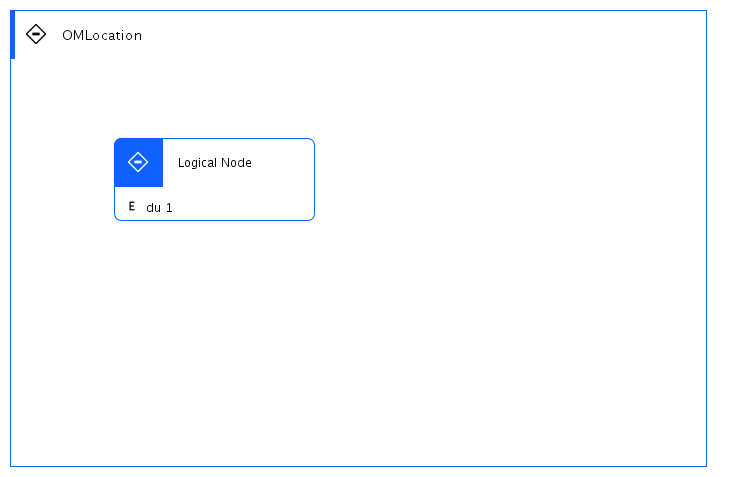

## Diagram

### Name

lom

### Description

### Reference(s)

## Element

[Expand all](#){ .md-button .diff-line }

### Actor

    

### Subsystem

### OMLocation

    

OMLocation

<table>
    <caption></caption>
    <thead>
        <tr>
            <th></th>
            <th></th>
        </tr>
    </thead>
    <tr>
        <td> <strong>Name</strong> </td>
        <td>OMLocation</td>
    </tr>
    <tr>
        <td> <strong>Description</strong> </td>
        <td></td>
    </tr>
</table>

    

### Logical Connection

    

### Logical Node

    

Logical Node

<table>
    <caption></caption>
    <thead>
        <tr>
            <th></th>
            <th></th>
        </tr>
    </thead>
    <tr>
        <td> <strong>Name</strong> </td>
        <td>Logical Node</td>
    </tr>
    <tr>
        <td> <strong>Description</strong> </td>
        <td></td>
    </tr>
    <tr>
        <td> <strong>Type</strong> </td>
        <td></td>
    </tr>
    <tr>
        <td> <strong>Primary Capability</strong> </td>
        <td>
            
        </td>
    </tr>
    <tr>
        <td> <strong>Implementation</strong> </td>
        <td>
            
        </td>
    </tr>
    <tr>
        <td> <strong>Architectural Decision</strong> </td>
        <td>
            
        </td>
    </tr>
    <tr>
        <td> <strong>Non Functional Requirement</strong> </td>
        <td>
            
                
<a href="../../Non Functional Requirements/nonfunctionalrequirement_S1lzHYpaCo_ryd7nMQyh">NFR1</a>

            
                
<a href="../../Non Functional Requirements/nonfunctionalrequirement_HkASFaa0j_ryd7nMQyh">NFR2</a>

            
                
<a href="../../Non Functional Requirements/nonfunctionalrequirement_r1pUFa6Ri_ryd7nMQyh">NFR3</a>

            
        </td>
    </tr>
    <tr>
        <td> <strong>Generic Group</strong> </td>
        <td></td>
    </tr>
    <tr>
        <td> <strong>Sub-level Diagram</strong> </td>
        <td></td>
    </tr>
    <tr>
        <td> <strong>Related Diagrams</strong> </td>
        <td>
            
                
<a href="../../Logical Operational View/lomview_3PMJF8xfpWm">lom2</a>

            
                
<a href="../../Logical Operational View/lomview_3PjefcXEu1m_ryd7nMQyh">lom</a>

            
                
<a href="../../Prescribed Operational View/pomview_3Pjfn1OH3VB_ryd7nMQyh">pom</a>

            
        </td>
    </tr>
    <tr>
        <td> <strong>Related Elements</strong> </td>
        <td>
            
                
OMLocation2

                
                    
                    <li><a href="../../Logical Operational View/lomview_3PMJF8xfpWm">lom2</a></li>
                    
                
            
                
PN

                
                    
                    <li><a href="../../Prescribed Operational View/pomview_3Pjfn1OH3VB_ryd7nMQyh">pom</a></li>
                    
                
            
                
OMLocation

                
                    
                    <li><a href="../../Prescribed Operational View/pomview_3Pjfn1OH3VB_ryd7nMQyh">pom</a></li>
                    
                    <li><a href="../../Logical Operational View/lomview_3PjefcXEu1m_ryd7nMQyh">lom</a></li>
                    
                
            
                
NFR1

                
            
                
NFR2

                
            
                
NFR3

                
            
            
                
du 1

                
                    
                    <li>
<a href="../../Prescribed Operational View/pomview_3Pjfn1OH3VB_ryd7nMQyh">pom</a>
</li>
                    
                    <li>
<a href="../../Logical Operational View/lomview_3PMJF8xfpWm">lom2</a>
</li>
                    
                    <li>
<a href="../../Logical Operational View/lomview_3PjefcXEu1m_ryd7nMQyh">lom</a>
</li>
                    
                    <li>
<a href="../../Static View/cmstaticview_3Pjf4AbboFC_ryd7nMQyh">stv</a>
</li>
                    
                    <li>
<a href="../../Services View/aodservices_3PjdKUI5Ww2_ryd7nMQyh">sv</a>
</li>
                    
                
            
        </td>
    </tr>
    
</table>

    

