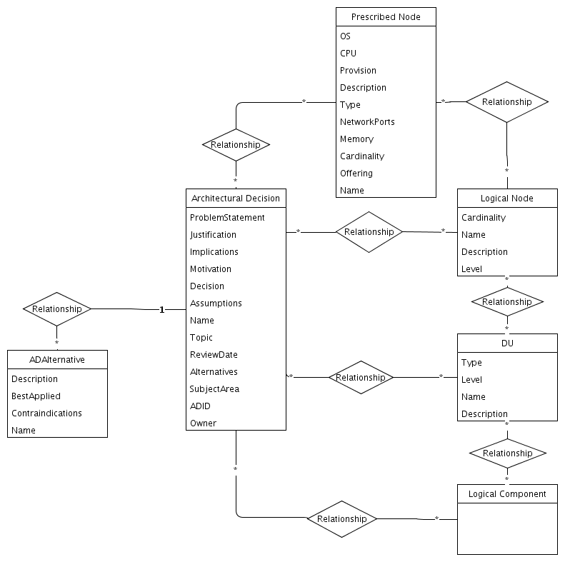

## Diagram

### Name

Architecture Data Model - Architectural Decision

### Description

### Reference(s)

## Element

[Expand all](#){ .md-button .diff-line }

### Entities

    

ADAlternative

<table>
    <caption></caption>
    <thead>
        <tr>
            <th></th>
            <th></th>
        </tr>
    </thead>
    <tr>
        <td> <strong>Name</strong> </td>
        <td>ADAlternative</td>
    </tr>
    <tr>
        <td> <strong>Description</strong> </td>
        <td></td>
    </tr>
    <tr>
        <td> <strong>Attributes</strong> </td>
        
        <td>
                
                
<strong>BestApplied,</strong>[String]

                

                
                
<strong>Contraindications,</strong>[String]

                

                
                
<strong>Description,</strong>[String]

                

                
                
<strong>Name,</strong>[String]

                

                
            </td>
        
    </tr>
</table>

    

Architectural Decision

<table>
    <caption></caption>
    <thead>
        <tr>
            <th></th>
            <th></th>
        </tr>
    </thead>
    <tr>
        <td> <strong>Name</strong> </td>
        <td>Architectural Decision</td>
    </tr>
    <tr>
        <td> <strong>Description</strong> </td>
        <td></td>
    </tr>
    <tr>
        <td> <strong>Attributes</strong> </td>
        
        <td>
                
                
<strong>ADID,</strong>[String]

                

                
                
<strong>Alternatives,</strong>[String]

                

                
                
<strong>Assumptions,</strong>[String]

                

                
                
<strong>Decision,</strong>[String]

                

                
                
<strong>Implications,</strong>[String]

                

                
                
<strong>Justification,</strong>[String]

                

                
                
<strong>Motivation,</strong>[String]

                

                
                
<strong>Name,</strong>[String]

                

                
                
<strong>Owner,</strong>[String]

                

                
                
<strong>ProblemStatement,</strong>[String]

                

                
                
<strong>ReviewDate,</strong>[Date]

                

                
                
<strong>SubjectArea,</strong>[String]

                

                
                
<strong>Topic,</strong>[String]

                

                
            </td>
        
    </tr>
</table>

    

DU

<table>
    <caption></caption>
    <thead>
        <tr>
            <th></th>
            <th></th>
        </tr>
    </thead>
    <tr>
        <td> <strong>Name</strong> </td>
        <td>DU</td>
    </tr>
    <tr>
        <td> <strong>Description</strong> </td>
        <td></td>
    </tr>
    <tr>
        <td> <strong>Attributes</strong> </td>
        
        <td>
                
                
<strong>Description,</strong>[String]

                

                
                
<strong>Level,</strong>[String]

                

                
                
<strong>Name,</strong>[String]

                

                
                
<strong>Type,</strong>[String]

                

                
            </td>
        
    </tr>
</table>

    

Logical Component

<table>
    <caption></caption>
    <thead>
        <tr>
            <th></th>
            <th></th>
        </tr>
    </thead>
    <tr>
        <td> <strong>Name</strong> </td>
        <td>Logical Component</td>
    </tr>
    <tr>
        <td> <strong>Description</strong> </td>
        <td></td>
    </tr>
    <tr>
        <td> <strong>Attributes</strong> </td>
        
        <td>
                
                
<strong>Description,</strong>[String]

                

                
                
<strong>Level,</strong>[String]

                

                
                
<strong>Name,</strong>[String]

                

                
            </td>
        
    </tr>
</table>

    

Logical Node

<table>
    <caption></caption>
    <thead>
        <tr>
            <th></th>
            <th></th>
        </tr>
    </thead>
    <tr>
        <td> <strong>Name</strong> </td>
        <td>Logical Node</td>
    </tr>
    <tr>
        <td> <strong>Description</strong> </td>
        <td></td>
    </tr>
    <tr>
        <td> <strong>Attributes</strong> </td>
        
        <td>
                
                
<strong>Cardinality,</strong>[String]

                

                
                
<strong>Description,</strong>[String]

                

                
                
<strong>Level,</strong>[String]

                

                
                
<strong>Name,</strong>[String]

                

                
            </td>
        
    </tr>
</table>

    

Prescribed Node

<table>
    <caption></caption>
    <thead>
        <tr>
            <th></th>
            <th></th>
        </tr>
    </thead>
    <tr>
        <td> <strong>Name</strong> </td>
        <td>Prescribed Node</td>
    </tr>
    <tr>
        <td> <strong>Description</strong> </td>
        <td></td>
    </tr>
    <tr>
        <td> <strong>Attributes</strong> </td>
        
        <td>
                
                
<strong>Cardinality,</strong>[String]

                

                
                
<strong>CPU,</strong>[String]

                

                
                
<strong>Description,</strong>[String]

                

                
                
<strong>Memory,</strong>[String]

                

                
                
<strong>Name,</strong>[String]

                

                
                
<strong>NetworkPorts,</strong>[String]

                

                
                
<strong>Offering,</strong>[String]

                

                
                
<strong>OS,</strong>[String]

                

                
                
<strong>Provision,</strong>[String]

                

                
                
<strong>Type,</strong>[String]

                

                
            </td>
        
    </tr>
</table>

    

### Relationships

    

Relationship

<table>
    <caption></caption>
    <thead>
        <tr>
            <th></th>
            <th></th>
        </tr>
    </thead>
    <tr>
        <td> <strong>Name</strong> </td>
        <td>Relationship</td>
    </tr>
    <tr>
        <td> <strong>Description</strong> </td>
        <td></td>
    </tr>
    <tr>
        <td> <strong>Attributes</strong> </td>
        
        <td>
                
            </td>
        
    </tr>
    <tr>
        <td> <strong>Relationship Connections</strong> </td>
        
        <td>
                
                
<strong>*,</strong>[*]

                
Prescribed Node

                
                
<strong>*,</strong>[*]

                
Architectural Decision

                
            </td>
        
    </tr>
</table>

    

Relationship

<table>
    <caption></caption>
    <thead>
        <tr>
            <th></th>
            <th></th>
        </tr>
    </thead>
    <tr>
        <td> <strong>Name</strong> </td>
        <td>Relationship</td>
    </tr>
    <tr>
        <td> <strong>Description</strong> </td>
        <td></td>
    </tr>
    <tr>
        <td> <strong>Attributes</strong> </td>
        
        <td>
                
            </td>
        
    </tr>
    <tr>
        <td> <strong>Relationship Connections</strong> </td>
        
        <td>
                
                
<strong>*,</strong>[*]

                
Architectural Decision

                
                
<strong>*,</strong>[*]

                
Logical Node

                
            </td>
        
    </tr>
</table>

    

Relationship

<table>
    <caption></caption>
    <thead>
        <tr>
            <th></th>
            <th></th>
        </tr>
    </thead>
    <tr>
        <td> <strong>Name</strong> </td>
        <td>Relationship</td>
    </tr>
    <tr>
        <td> <strong>Description</strong> </td>
        <td></td>
    </tr>
    <tr>
        <td> <strong>Attributes</strong> </td>
        
        <td>
                
            </td>
        
    </tr>
    <tr>
        <td> <strong>Relationship Connections</strong> </td>
        
        <td>
                
                
<strong>*,</strong>[*]

                
Logical Component

                
                
<strong>*,</strong>[*]

                
DU

                
            </td>
        
    </tr>
</table>

    

Relationship

<table>
    <caption></caption>
    <thead>
        <tr>
            <th></th>
            <th></th>
        </tr>
    </thead>
    <tr>
        <td> <strong>Name</strong> </td>
        <td>Relationship</td>
    </tr>
    <tr>
        <td> <strong>Description</strong> </td>
        <td></td>
    </tr>
    <tr>
        <td> <strong>Attributes</strong> </td>
        
        <td>
                
            </td>
        
    </tr>
    <tr>
        <td> <strong>Relationship Connections</strong> </td>
        
        <td>
                
                
<strong>*,</strong>[*]

                
Logical Component

                
                
<strong>*,</strong>[*]

                
Architectural Decision

                
            </td>
        
    </tr>
</table>

    

Relationship

<table>
    <caption></caption>
    <thead>
        <tr>
            <th></th>
            <th></th>
        </tr>
    </thead>
    <tr>
        <td> <strong>Name</strong> </td>
        <td>Relationship</td>
    </tr>
    <tr>
        <td> <strong>Description</strong> </td>
        <td></td>
    </tr>
    <tr>
        <td> <strong>Attributes</strong> </td>
        
        <td>
                
            </td>
        
    </tr>
    <tr>
        <td> <strong>Relationship Connections</strong> </td>
        
        <td>
                
                
<strong>*,</strong>[*]

                
DU

                
                
<strong>*,</strong>[*]

                
Architectural Decision

                
            </td>
        
    </tr>
</table>

    

Relationship

<table>
    <caption></caption>
    <thead>
        <tr>
            <th></th>
            <th></th>
        </tr>
    </thead>
    <tr>
        <td> <strong>Name</strong> </td>
        <td>Relationship</td>
    </tr>
    <tr>
        <td> <strong>Description</strong> </td>
        <td></td>
    </tr>
    <tr>
        <td> <strong>Attributes</strong> </td>
        
        <td>
                
            </td>
        
    </tr>
    <tr>
        <td> <strong>Relationship Connections</strong> </td>
        
        <td>
                
                
<strong>*,</strong>[*]

                
DU

                
                
<strong>*,</strong>[*]

                
Logical Node

                
            </td>
        
    </tr>
</table>

    

Relationship

<table>
    <caption></caption>
    <thead>
        <tr>
            <th></th>
            <th></th>
        </tr>
    </thead>
    <tr>
        <td> <strong>Name</strong> </td>
        <td>Relationship</td>
    </tr>
    <tr>
        <td> <strong>Description</strong> </td>
        <td></td>
    </tr>
    <tr>
        <td> <strong>Attributes</strong> </td>
        
        <td>
                
            </td>
        
    </tr>
    <tr>
        <td> <strong>Relationship Connections</strong> </td>
        
        <td>
                
                
<strong>1,</strong>[1]

                
Architectural Decision

                
                
<strong>*,</strong>[*]

                
ADAlternative

                
            </td>
        
    </tr>
</table>

    

Relationship

<table>
    <caption></caption>
    <thead>
        <tr>
            <th></th>
            <th></th>
        </tr>
    </thead>
    <tr>
        <td> <strong>Name</strong> </td>
        <td>Relationship</td>
    </tr>
    <tr>
        <td> <strong>Description</strong> </td>
        <td></td>
    </tr>
    <tr>
        <td> <strong>Attributes</strong> </td>
        
        <td>
                
            </td>
        
    </tr>
    <tr>
        <td> <strong>Relationship Connections</strong> </td>
        
        <td>
                
                
<strong>*,</strong>[*]

                
Prescribed Node

                
                
<strong>*,</strong>[*]

                
Logical Node

                
            </td>
        
    </tr>
</table>

    

