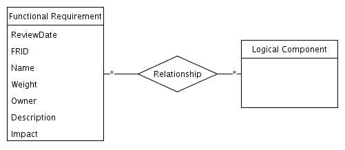

## Diagram

### Name

Architecture Data Model - Functional Requirement

### Description

### Reference(s)

## Element

[Expand all](#){ .md-button .diff-line }

### Entities

    

Functional Requirement

<table>
    <caption></caption>
    <thead>
        <tr>
            <th></th>
            <th></th>
        </tr>
    </thead>
    <tr>
        <td> <strong>Name</strong> </td>
        <td>Functional Requirement</td>
    </tr>
    <tr>
        <td> <strong>Description</strong> </td>
        <td></td>
    </tr>
    <tr>
        <td> <strong>Attributes</strong> </td>
        
        <td>
                
                
<strong>Description,</strong>[String]

                

                
                
<strong>FRID,</strong>[String]

                

                
                
<strong>Impact,</strong>[String]

                

                
                
<strong>Name,</strong>[String]

                

                
                
<strong>Owner,</strong>[String]

                

                
                
<strong>ReviewDate,</strong>[Date]

                

                
                
<strong>Weight,</strong>[String]

                

                
            </td>
        
    </tr>
</table>

    

Logical Component

<table>
    <caption></caption>
    <thead>
        <tr>
            <th></th>
            <th></th>
        </tr>
    </thead>
    <tr>
        <td> <strong>Name</strong> </td>
        <td>Logical Component</td>
    </tr>
    <tr>
        <td> <strong>Description</strong> </td>
        <td></td>
    </tr>
    <tr>
        <td> <strong>Attributes</strong> </td>
        
        <td>
                
                
<strong>Description,</strong>[String]

                

                
                
<strong>Level,</strong>[String]

                

                
                
<strong>Name,</strong>[String]

                

                
            </td>
        
    </tr>
</table>

    

### Relationships

    

Relationship

<table>
    <caption></caption>
    <thead>
        <tr>
            <th></th>
            <th></th>
        </tr>
    </thead>
    <tr>
        <td> <strong>Name</strong> </td>
        <td>Relationship</td>
    </tr>
    <tr>
        <td> <strong>Description</strong> </td>
        <td></td>
    </tr>
    <tr>
        <td> <strong>Attributes</strong> </td>
        
        <td>
                
            </td>
        
    </tr>
    <tr>
        <td> <strong>Relationship Connections</strong> </td>
        
        <td>
                
                
<strong>*,</strong>[*]

                
Functional Requirement

                
                
<strong>*,</strong>[*]

                
Logical Component

                
            </td>
        
    </tr>
</table>

    

