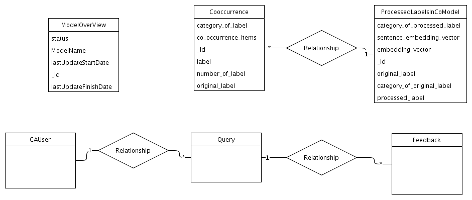

## Diagram

### Name

Cognitive Search Data Model

### Description

### Reference(s)

## Element

[Expand all](#){ .md-button .diff-line }

### Entities

    

CAUser

<table>
    <caption></caption>
    <thead>
        <tr>
            <th></th>
            <th></th>
        </tr>
    </thead>
    <tr>
        <td> <strong>Name</strong> </td>
        <td>CAUser</td>
    </tr>
    <tr>
        <td> <strong>Description</strong> </td>
        <td></td>
    </tr>
    <tr>
        <td> <strong>Attributes</strong> </td>
        
        <td>
                
                
<strong>avatar,</strong>[]

                

                
                
<strong>chatbotToken,</strong>[]

                

                
                
<strong>email,</strong>[]

                

                
                
<strong>focusRole,</strong>[]

                

                
                
<strong>fullname,</strong>[]

                

                
                
<strong>jobResponsibilities,</strong>[]

                

                
                
<strong>lastLoginDate,</strong>[]

                

                
                
<strong>notesId,</strong>[]

                

                
                
<strong>password,</strong>[]

                
placeholder will not store it

                
                
<strong>username,</strong>[]

                

                
            </td>
        
    </tr>
</table>

    

Cooccurrence

<table>
    <caption></caption>
    <thead>
        <tr>
            <th></th>
            <th></th>
        </tr>
    </thead>
    <tr>
        <td> <strong>Name</strong> </td>
        <td>Cooccurrence</td>
    </tr>
    <tr>
        <td> <strong>Description</strong> </td>
        <td></td>
    </tr>
    <tr>
        <td> <strong>Attributes</strong> </td>
        
        <td>
                
                
<strong>category_of_label,</strong>[String]

                

                
                
<strong>co_occurrence_items,</strong>[Array]

                

                
                
<strong>label,</strong>[String]

                

                
                
<strong>number_of_label,</strong>[Int]

                

                
                
<strong>original_label,</strong>[String]

                

                
                
<strong>_id,</strong>[String]

                

                
            </td>
        
    </tr>
</table>

    

Feedback

<table>
    <caption></caption>
    <thead>
        <tr>
            <th></th>
            <th></th>
        </tr>
    </thead>
    <tr>
        <td> <strong>Name</strong> </td>
        <td>Feedback</td>
    </tr>
    <tr>
        <td> <strong>Description</strong> </td>
        <td></td>
    </tr>
    <tr>
        <td> <strong>Attributes</strong> </td>
        
        <td>
                
                
<strong>archId,</strong>[]

                

                
                
<strong>comments,</strong>[]

                

                
                
<strong>relevence,</strong>[]

                

                
                
<strong>userId,</strong>[]

                

                
            </td>
        
    </tr>
</table>

    

ModelOverView

<table>
    <caption></caption>
    <thead>
        <tr>
            <th></th>
            <th></th>
        </tr>
    </thead>
    <tr>
        <td> <strong>Name</strong> </td>
        <td>ModelOverView</td>
    </tr>
    <tr>
        <td> <strong>Description</strong> </td>
        <td>record model training status</td>
    </tr>
    <tr>
        <td> <strong>Attributes</strong> </td>
        
        <td>
                
                
<strong>lastUpdateFinishDate,</strong>[Date String]

                
for example: 2021-09-24 05:03:01

                
                
<strong>lastUpdateStartDate,</strong>[Date String]

                
for example: 2021-09-24 05:03:01

                
                
<strong>ModelName,</strong>[String]

                
Co-occurrence

                
                
<strong>status,</strong>[String]

                
In Progress/Completed/Failed

                
                
<strong>_id,</strong>[String]

                

                
            </td>
        
    </tr>
</table>

    

ProcessedLabelsInCoModel

<table>
    <caption></caption>
    <thead>
        <tr>
            <th></th>
            <th></th>
        </tr>
    </thead>
    <tr>
        <td> <strong>Name</strong> </td>
        <td>ProcessedLabelsInCoModel</td>
    </tr>
    <tr>
        <td> <strong>Description</strong> </td>
        <td></td>
    </tr>
    <tr>
        <td> <strong>Attributes</strong> </td>
        
        <td>
                
                
<strong>category_of_original_label,</strong>[String]

                

                
                
<strong>category_of_processed_label,</strong>[String]

                

                
                
<strong>embedding_vector,</strong>[Array]

                

                
                
<strong>original_label,</strong>[String]

                

                
                
<strong>processed_label,</strong>[Array]

                

                
                
<strong>sentence_embedding_vector,</strong>[Array]

                

                
                
<strong>_id,</strong>[]

                

                
            </td>
        
    </tr>
</table>

    

Query

<table>
    <caption></caption>
    <thead>
        <tr>
            <th></th>
            <th></th>
        </tr>
    </thead>
    <tr>
        <td> <strong>Name</strong> </td>
        <td>Query</td>
    </tr>
    <tr>
        <td> <strong>Description</strong> </td>
        <td></td>
    </tr>
    <tr>
        <td> <strong>Attributes</strong> </td>
        
        <td>
                
                
<strong>text,</strong>[]

                

                
                
<strong>type,</strong>[]

                

                
                
<strong>_id,</strong>[]

                

                
            </td>
        
    </tr>
</table>

    

### Relationships

    

Relationship

<table>
    <caption></caption>
    <thead>
        <tr>
            <th></th>
            <th></th>
        </tr>
    </thead>
    <tr>
        <td> <strong>Name</strong> </td>
        <td>Relationship</td>
    </tr>
    <tr>
        <td> <strong>Description</strong> </td>
        <td></td>
    </tr>
    <tr>
        <td> <strong>Attributes</strong> </td>
        
        <td>
                
            </td>
        
    </tr>
    <tr>
        <td> <strong>Relationship Connections</strong> </td>
        
        <td>
                
                
<strong>*,</strong>[*]

                
Query

                
                
<strong>1,</strong>[1]

                
CAUser

                
            </td>
        
    </tr>
</table>

    

Relationship

<table>
    <caption></caption>
    <thead>
        <tr>
            <th></th>
            <th></th>
        </tr>
    </thead>
    <tr>
        <td> <strong>Name</strong> </td>
        <td>Relationship</td>
    </tr>
    <tr>
        <td> <strong>Description</strong> </td>
        <td></td>
    </tr>
    <tr>
        <td> <strong>Attributes</strong> </td>
        
        <td>
                
            </td>
        
    </tr>
    <tr>
        <td> <strong>Relationship Connections</strong> </td>
        
        <td>
                
                
<strong>1,</strong>[1]

                
Query

                
                
<strong>*,</strong>[*]

                
Feedback

                
            </td>
        
    </tr>
</table>

    

Relationship

<table>
    <caption></caption>
    <thead>
        <tr>
            <th></th>
            <th></th>
        </tr>
    </thead>
    <tr>
        <td> <strong>Name</strong> </td>
        <td>Relationship</td>
    </tr>
    <tr>
        <td> <strong>Description</strong> </td>
        <td></td>
    </tr>
    <tr>
        <td> <strong>Attributes</strong> </td>
        
        <td>
                
            </td>
        
    </tr>
    <tr>
        <td> <strong>Relationship Connections</strong> </td>
        
        <td>
                
                
<strong>*,</strong>[*]

                
Cooccurrence

                
                
<strong>1,</strong>[1]

                
ProcessedLabelsInCoModel

                
            </td>
        
    </tr>
</table>

    

