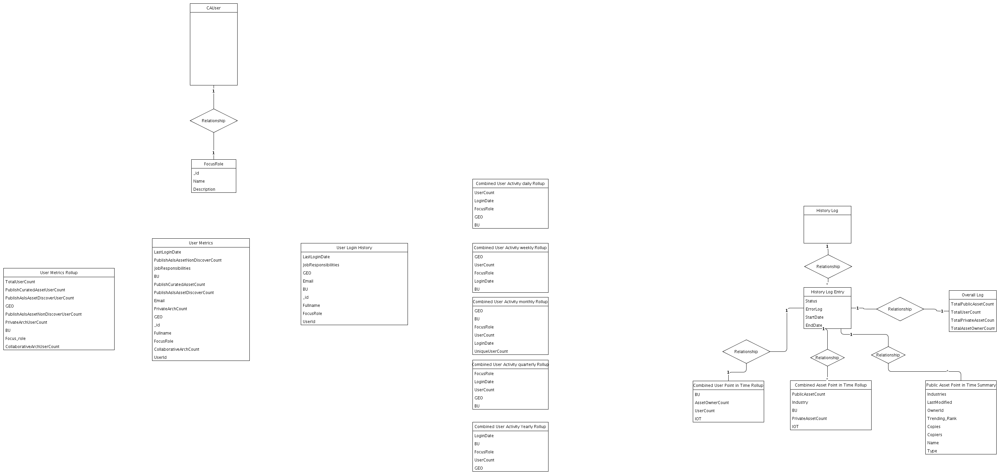

## Diagram

### Name

History Data Model

### Description

### Reference(s)

## Element

[Expand all](#){ .md-button .diff-line }

### Entities

    

CAUser

<table>
    <caption></caption>
    <thead>
        <tr>
            <th></th>
            <th></th>
        </tr>
    </thead>
    <tr>
        <td> <strong>Name</strong> </td>
        <td>CAUser</td>
    </tr>
    <tr>
        <td> <strong>Description</strong> </td>
        <td></td>
    </tr>
    <tr>
        <td> <strong>Attributes</strong> </td>
        
        <td>
                
                
<strong>avatar,</strong>[]

                

                
                
<strong>chatbotToken,</strong>[]

                

                
                
<strong>email,</strong>[]

                

                
                
<strong>focusRole,</strong>[]

                

                
                
<strong>fullname,</strong>[]

                

                
                
<strong>jobResponsibilities,</strong>[]

                

                
                
<strong>lastLoginDate,</strong>[]

                

                
                
<strong>notesId,</strong>[]

                

                
                
<strong>password,</strong>[]

                
placeholder will not store it

                
                
<strong>username,</strong>[]

                

                
            </td>
        
    </tr>
</table>

    

Combined Asset Point in Time Rollup

<table>
    <caption></caption>
    <thead>
        <tr>
            <th></th>
            <th></th>
        </tr>
    </thead>
    <tr>
        <td> <strong>Name</strong> </td>
        <td>Combined Asset Point in Time Rollup</td>
    </tr>
    <tr>
        <td> <strong>Description</strong> </td>
        <td></td>
    </tr>
    <tr>
        <td> <strong>Attributes</strong> </td>
        
        <td>
                
                
<strong>BU,</strong>[String]

                

                
                
<strong>Industry,</strong>[String]

                

                
                
<strong>IOT,</strong>[String]

                

                
                
<strong>PrivateAssetCount,</strong>[Integer]

                

                
                
<strong>PublicAssetCount,</strong>[Integer]

                

                
            </td>
        
    </tr>
</table>

    

Combined User Activity daily Rollup

<table>
    <caption></caption>
    <thead>
        <tr>
            <th></th>
            <th></th>
        </tr>
    </thead>
    <tr>
        <td> <strong>Name</strong> </td>
        <td>Combined User Activity daily Rollup</td>
    </tr>
    <tr>
        <td> <strong>Description</strong> </td>
        <td></td>
    </tr>
    <tr>
        <td> <strong>Attributes</strong> </td>
        
        <td>
                
                
<strong>BU,</strong>[String]

                

                
                
<strong>FocusRole,</strong>[String]

                

                
                
<strong>GEO,</strong>[String]

                

                
                
<strong>LoginDate,</strong>[String]

                

                
                
<strong>UserCount,</strong>[Integer]

                

                
            </td>
        
    </tr>
</table>

    

Combined User Activity monthly Rollup

<table>
    <caption></caption>
    <thead>
        <tr>
            <th></th>
            <th></th>
        </tr>
    </thead>
    <tr>
        <td> <strong>Name</strong> </td>
        <td>Combined User Activity monthly Rollup</td>
    </tr>
    <tr>
        <td> <strong>Description</strong> </td>
        <td></td>
    </tr>
    <tr>
        <td> <strong>Attributes</strong> </td>
        
        <td>
                
                
<strong>BU,</strong>[String]

                

                
                
<strong>FocusRole,</strong>[String]

                

                
                
<strong>GEO,</strong>[String]

                

                
                
<strong>LoginDate,</strong>[String]

                

                
                
<strong>UniqueUserCount,</strong>[Integer]

                

                
                
<strong>UserCount,</strong>[Integer]

                

                
            </td>
        
    </tr>
</table>

    

Combined User Activity quarterly Rollup

<table>
    <caption></caption>
    <thead>
        <tr>
            <th></th>
            <th></th>
        </tr>
    </thead>
    <tr>
        <td> <strong>Name</strong> </td>
        <td>Combined User Activity quarterly Rollup</td>
    </tr>
    <tr>
        <td> <strong>Description</strong> </td>
        <td></td>
    </tr>
    <tr>
        <td> <strong>Attributes</strong> </td>
        
        <td>
                
                
<strong>BU,</strong>[String]

                

                
                
<strong>FocusRole,</strong>[String]

                

                
                
<strong>GEO,</strong>[String]

                

                
                
<strong>LoginDate,</strong>[String]

                

                
                
<strong>UserCount,</strong>[Integer]

                

                
            </td>
        
    </tr>
</table>

    

Combined User Activity weekly Rollup

<table>
    <caption></caption>
    <thead>
        <tr>
            <th></th>
            <th></th>
        </tr>
    </thead>
    <tr>
        <td> <strong>Name</strong> </td>
        <td>Combined User Activity weekly Rollup</td>
    </tr>
    <tr>
        <td> <strong>Description</strong> </td>
        <td></td>
    </tr>
    <tr>
        <td> <strong>Attributes</strong> </td>
        
        <td>
                
                
<strong>BU,</strong>[String]

                

                
                
<strong>FocusRole,</strong>[String]

                

                
                
<strong>GEO,</strong>[String]

                

                
                
<strong>LoginDate,</strong>[String]

                

                
                
<strong>UserCount,</strong>[Integer]

                

                
            </td>
        
    </tr>
</table>

    

Combined User Activity Yearly Rollup

<table>
    <caption></caption>
    <thead>
        <tr>
            <th></th>
            <th></th>
        </tr>
    </thead>
    <tr>
        <td> <strong>Name</strong> </td>
        <td>Combined User Activity Yearly Rollup</td>
    </tr>
    <tr>
        <td> <strong>Description</strong> </td>
        <td></td>
    </tr>
    <tr>
        <td> <strong>Attributes</strong> </td>
        
        <td>
                
                
<strong>BU,</strong>[String]

                

                
                
<strong>FocusRole,</strong>[String]

                

                
                
<strong>GEO,</strong>[String]

                

                
                
<strong>LoginDate,</strong>[String]

                

                
                
<strong>UserCount,</strong>[Integer]

                

                
            </td>
        
    </tr>
</table>

    

Combined User Point in Time Rollup

<table>
    <caption></caption>
    <thead>
        <tr>
            <th></th>
            <th></th>
        </tr>
    </thead>
    <tr>
        <td> <strong>Name</strong> </td>
        <td>Combined User Point in Time Rollup</td>
    </tr>
    <tr>
        <td> <strong>Description</strong> </td>
        <td></td>
    </tr>
    <tr>
        <td> <strong>Attributes</strong> </td>
        
        <td>
                
                
<strong>AssetOwnerCount,</strong>[Integer]

                

                
                
<strong>BU,</strong>[String]

                

                
                
<strong>IOT,</strong>[String]

                

                
                
<strong>UserCount,</strong>[Integer]

                

                
            </td>
        
    </tr>
</table>

    

FocusRole

<table>
    <caption></caption>
    <thead>
        <tr>
            <th></th>
            <th></th>
        </tr>
    </thead>
    <tr>
        <td> <strong>Name</strong> </td>
        <td>FocusRole</td>
    </tr>
    <tr>
        <td> <strong>Description</strong> </td>
        <td></td>
    </tr>
    <tr>
        <td> <strong>Attributes</strong> </td>
        
        <td>
                
                
<strong>Description,</strong>[]

                

                
                
<strong>Name,</strong>[String]

                

                
                
<strong>_id,</strong>[String]

                

                
            </td>
        
    </tr>
</table>

    

History Log

<table>
    <caption></caption>
    <thead>
        <tr>
            <th></th>
            <th></th>
        </tr>
    </thead>
    <tr>
        <td> <strong>Name</strong> </td>
        <td>History Log</td>
    </tr>
    <tr>
        <td> <strong>Description</strong> </td>
        <td></td>
    </tr>
    <tr>
        <td> <strong>Attributes</strong> </td>
        
        <td>
                
            </td>
        
    </tr>
</table>

    

History Log Entry

<table>
    <caption></caption>
    <thead>
        <tr>
            <th></th>
            <th></th>
        </tr>
    </thead>
    <tr>
        <td> <strong>Name</strong> </td>
        <td>History Log Entry</td>
    </tr>
    <tr>
        <td> <strong>Description</strong> </td>
        <td></td>
    </tr>
    <tr>
        <td> <strong>Attributes</strong> </td>
        
        <td>
                
                
<strong>EndDate,</strong>[Date]

                

                
                
<strong>ErrorLog,</strong>[String]

                

                
                
<strong>StartDate,</strong>[Date]

                

                
                
<strong>Status,</strong>[String]

                

                
            </td>
        
    </tr>
</table>

    

Overall Log

<table>
    <caption></caption>
    <thead>
        <tr>
            <th></th>
            <th></th>
        </tr>
    </thead>
    <tr>
        <td> <strong>Name</strong> </td>
        <td>Overall Log</td>
    </tr>
    <tr>
        <td> <strong>Description</strong> </td>
        <td></td>
    </tr>
    <tr>
        <td> <strong>Attributes</strong> </td>
        
        <td>
                
                
<strong>TotalAssetOwnerCount,</strong>[Integer]

                

                
                
<strong>TotalPrivateAssetCount,</strong>[Integer]

                

                
                
<strong>TotalPublicAssetCount,</strong>[Integer]

                

                
                
<strong>TotalUserCount,</strong>[Integer]

                

                
            </td>
        
    </tr>
</table>

    

Public Asset Point in Time Summary

<table>
    <caption></caption>
    <thead>
        <tr>
            <th></th>
            <th></th>
        </tr>
    </thead>
    <tr>
        <td> <strong>Name</strong> </td>
        <td>Public Asset Point in Time Summary</td>
    </tr>
    <tr>
        <td> <strong>Description</strong> </td>
        <td></td>
    </tr>
    <tr>
        <td> <strong>Attributes</strong> </td>
        
        <td>
                
                
<strong>Copiers,</strong>[Array]

                

                
                
<strong>Copies,</strong>[Integer]

                

                
                
<strong>Industries,</strong>[Arrary]

                

                
                
<strong>LastModified,</strong>[Date]

                

                
                
<strong>Name,</strong>[String]

                

                
                
<strong>OwnerId,</strong>[String]

                

                
                
<strong>Trending_Rank,</strong>[Integer]

                

                
                
<strong>Type,</strong>[String]

                

                
            </td>
        
    </tr>
</table>

    

User Login History

<table>
    <caption></caption>
    <thead>
        <tr>
            <th></th>
            <th></th>
        </tr>
    </thead>
    <tr>
        <td> <strong>Name</strong> </td>
        <td>User Login History</td>
    </tr>
    <tr>
        <td> <strong>Description</strong> </td>
        <td></td>
    </tr>
    <tr>
        <td> <strong>Attributes</strong> </td>
        
        <td>
                
                
<strong>BU,</strong>[String]

                

                
                
<strong>Email,</strong>[String]

                

                
                
<strong>FocusRole,</strong>[String]

                

                
                
<strong>Fullname,</strong>[String]

                

                
                
<strong>GEO,</strong>[String]

                

                
                
<strong>JobResponsibilities,</strong>[String]

                

                
                
<strong>LastLoginDate,</strong>[date]

                

                
                
<strong>UserId,</strong>[String]

                

                
                
<strong>_id,</strong>[String]

                

                
            </td>
        
    </tr>
</table>

    

User Metrics

<table>
    <caption></caption>
    <thead>
        <tr>
            <th></th>
            <th></th>
        </tr>
    </thead>
    <tr>
        <td> <strong>Name</strong> </td>
        <td>User Metrics</td>
    </tr>
    <tr>
        <td> <strong>Description</strong> </td>
        <td></td>
    </tr>
    <tr>
        <td> <strong>Attributes</strong> </td>
        
        <td>
                
                
<strong>BU,</strong>[String]

                

                
                
<strong>CollaborativeArchCount,</strong>[Integer]

                

                
                
<strong>Email,</strong>[String]

                

                
                
<strong>FocusRole,</strong>[String]

                

                
                
<strong>Fullname,</strong>[String]

                

                
                
<strong>GEO,</strong>[String]

                

                
                
<strong>JobResponsibilities,</strong>[String]

                

                
                
<strong>LastLoginDate,</strong>[date]

                

                
                
<strong>PrivateArchCount,</strong>[Integer]

                

                
                
<strong>PublishAsIsAssetDiscoverCount,</strong>[Integer]

                

                
                
<strong>PublishAsIsAssetNonDiscoverCount,</strong>[integer]

                

                
                
<strong>PublishCuratedAssetCount,</strong>[Integer]

                

                
                
<strong>UserId,</strong>[String]

                

                
                
<strong>_id,</strong>[String]

                

                
            </td>
        
    </tr>
</table>

    

User Metrics Rollup

<table>
    <caption></caption>
    <thead>
        <tr>
            <th></th>
            <th></th>
        </tr>
    </thead>
    <tr>
        <td> <strong>Name</strong> </td>
        <td>User Metrics Rollup</td>
    </tr>
    <tr>
        <td> <strong>Description</strong> </td>
        <td></td>
    </tr>
    <tr>
        <td> <strong>Attributes</strong> </td>
        
        <td>
                
                
<strong>BU,</strong>[]

                

                
                
<strong>CollaborativeArchUserCount,</strong>[]

                

                
                
<strong>Focus_role,</strong>[]

                

                
                
<strong>GEO,</strong>[]

                

                
                
<strong>PrivateArchUserCount,</strong>[]

                

                
                
<strong>PublishAsIsAssetDiscoverUserCount,</strong>[]

                

                
                
<strong>PublishAsIsAssetNonDiscoverUserCount,</strong>[]

                

                
                
<strong>PublishCuratedAssetUserCount,</strong>[]

                

                
                
<strong>TotalUserCount,</strong>[integer]

                

                
            </td>
        
    </tr>
</table>

    

### Relationships

    

Relationship

<table>
    <caption></caption>
    <thead>
        <tr>
            <th></th>
            <th></th>
        </tr>
    </thead>
    <tr>
        <td> <strong>Name</strong> </td>
        <td>Relationship</td>
    </tr>
    <tr>
        <td> <strong>Description</strong> </td>
        <td></td>
    </tr>
    <tr>
        <td> <strong>Attributes</strong> </td>
        
        <td>
                
            </td>
        
    </tr>
    <tr>
        <td> <strong>Relationship Connections</strong> </td>
        
        <td>
                
                
<strong>1,</strong>[1]

                
History Log Entry

                
                
<strong>*,</strong>[*]

                
Combined Asset Point in Time Rollup

                
            </td>
        
    </tr>
</table>

    

Relationship

<table>
    <caption></caption>
    <thead>
        <tr>
            <th></th>
            <th></th>
        </tr>
    </thead>
    <tr>
        <td> <strong>Name</strong> </td>
        <td>Relationship</td>
    </tr>
    <tr>
        <td> <strong>Description</strong> </td>
        <td></td>
    </tr>
    <tr>
        <td> <strong>Attributes</strong> </td>
        
        <td>
                
            </td>
        
    </tr>
    <tr>
        <td> <strong>Relationship Connections</strong> </td>
        
        <td>
                
                
<strong>1,</strong>[1]

                
FocusRole

                
                
<strong>1,</strong>[1]

                
CAUser

                
            </td>
        
    </tr>
</table>

    

Relationship

<table>
    <caption></caption>
    <thead>
        <tr>
            <th></th>
            <th></th>
        </tr>
    </thead>
    <tr>
        <td> <strong>Name</strong> </td>
        <td>Relationship</td>
    </tr>
    <tr>
        <td> <strong>Description</strong> </td>
        <td></td>
    </tr>
    <tr>
        <td> <strong>Attributes</strong> </td>
        
        <td>
                
            </td>
        
    </tr>
    <tr>
        <td> <strong>Relationship Connections</strong> </td>
        
        <td>
                
                
<strong>*,</strong>[*]

                
History Log Entry

                
                
<strong>1,</strong>[1]

                
History Log

                
            </td>
        
    </tr>
</table>

    

Relationship

<table>
    <caption></caption>
    <thead>
        <tr>
            <th></th>
            <th></th>
        </tr>
    </thead>
    <tr>
        <td> <strong>Name</strong> </td>
        <td>Relationship</td>
    </tr>
    <tr>
        <td> <strong>Description</strong> </td>
        <td></td>
    </tr>
    <tr>
        <td> <strong>Attributes</strong> </td>
        
        <td>
                
            </td>
        
    </tr>
    <tr>
        <td> <strong>Relationship Connections</strong> </td>
        
        <td>
                
                
<strong>1,</strong>[1]

                
History Log Entry

                
                
<strong>1,</strong>[1]

                
Combined User Point in Time Rollup

                
            </td>
        
    </tr>
</table>

    

Relationship

<table>
    <caption></caption>
    <thead>
        <tr>
            <th></th>
            <th></th>
        </tr>
    </thead>
    <tr>
        <td> <strong>Name</strong> </td>
        <td>Relationship</td>
    </tr>
    <tr>
        <td> <strong>Description</strong> </td>
        <td></td>
    </tr>
    <tr>
        <td> <strong>Attributes</strong> </td>
        
        <td>
                
            </td>
        
    </tr>
    <tr>
        <td> <strong>Relationship Connections</strong> </td>
        
        <td>
                
                
<strong>*,</strong>[*]

                
Public Asset Point in Time Summary

                
                
<strong>1,</strong>[1]

                
History Log Entry

                
            </td>
        
    </tr>
</table>

    

Relationship

<table>
    <caption></caption>
    <thead>
        <tr>
            <th></th>
            <th></th>
        </tr>
    </thead>
    <tr>
        <td> <strong>Name</strong> </td>
        <td>Relationship</td>
    </tr>
    <tr>
        <td> <strong>Description</strong> </td>
        <td></td>
    </tr>
    <tr>
        <td> <strong>Attributes</strong> </td>
        
        <td>
                
            </td>
        
    </tr>
    <tr>
        <td> <strong>Relationship Connections</strong> </td>
        
        <td>
                
                
<strong>1,</strong>[1]

                
History Log Entry

                
                
<strong>1,</strong>[1]

                
Overall Log

                
            </td>
        
    </tr>
</table>

    

