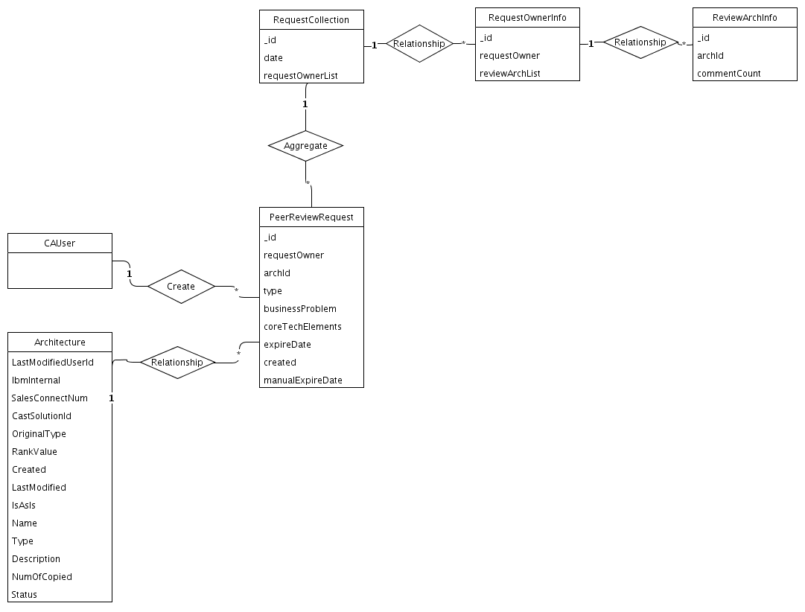

## Diagram

### Name

Peer Review Request Data Model

### Description

### Reference(s)

## Element

[Expand all](#){ .md-button .diff-line }

### Entities

    

Architecture

<table>
    <caption></caption>
    <thead>
        <tr>
            <th></th>
            <th></th>
        </tr>
    </thead>
    <tr>
        <td> <strong>Name</strong> </td>
        <td>Architecture</td>
    </tr>
    <tr>
        <td> <strong>Description</strong> </td>
        <td></td>
    </tr>
    <tr>
        <td> <strong>Attributes</strong> </td>
        
        <td>
                
                
<strong>CastSolutionId,</strong>[String]

                

                
                
<strong>Created,</strong>[Date]

                

                
                
<strong>Description,</strong>[String]

                

                
                
<strong>IbmInternal,</strong>[String]

                

                
                
<strong>IsAsIs,</strong>[Boolean]

                

                
                
<strong>LastModified,</strong>[Date]

                

                
                
<strong>LastModifiedUserId,</strong>[String]

                

                
                
<strong>Name,</strong>[String]

                

                
                
<strong>NumOfCopied,</strong>[Integer]

                

                
                
<strong>OriginalType,</strong>[String]

                

                
                
<strong>RankValue,</strong>[String]

                

                
                
<strong>SalesConnectNum,</strong>[String]

                

                
                
<strong>Status,</strong>[String]

                

                
                
<strong>Type,</strong>[String]

                

                
            </td>
        
    </tr>
</table>

    

CAUser

<table>
    <caption></caption>
    <thead>
        <tr>
            <th></th>
            <th></th>
        </tr>
    </thead>
    <tr>
        <td> <strong>Name</strong> </td>
        <td>CAUser</td>
    </tr>
    <tr>
        <td> <strong>Description</strong> </td>
        <td></td>
    </tr>
    <tr>
        <td> <strong>Attributes</strong> </td>
        
        <td>
                
                
<strong>avatar,</strong>[]

                

                
                
<strong>chatbotToken,</strong>[]

                

                
                
<strong>email,</strong>[]

                

                
                
<strong>focusRole,</strong>[]

                

                
                
<strong>fullname,</strong>[]

                

                
                
<strong>jobResponsibilities,</strong>[]

                

                
                
<strong>lastLoginDate,</strong>[]

                

                
                
<strong>notesId,</strong>[]

                

                
                
<strong>password,</strong>[]

                
placeholder will not store it

                
                
<strong>username,</strong>[]

                

                
            </td>
        
    </tr>
</table>

    

PeerReviewRequest

<table>
    <caption></caption>
    <thead>
        <tr>
            <th></th>
            <th></th>
        </tr>
    </thead>
    <tr>
        <td> <strong>Name</strong> </td>
        <td>PeerReviewRequest</td>
    </tr>
    <tr>
        <td> <strong>Description</strong> </td>
        <td>PeerReviewRequest in Mongo 
(ca-db-user or a new db)
</td>
    </tr>
    <tr>
        <td> <strong>Attributes</strong> </td>
        
        <td>
                
                
<strong>archId,</strong>[String]

                

                
                
<strong>businessProblem,</strong>[String]

                

                
                
<strong>coreTechElements,</strong>[String]

                

                
                
<strong>created,</strong>[Date]

                

                
                
<strong>expireDate,</strong>[Date]

                
To get all expired request in batch job, the expiration should be date time, but not in days.

                
                
<strong>manualExpireDate,</strong>[Date]

                
If this request is expired by request owner manually, then save the date of this manual expiration request.

                
                
<strong>requestOwner,</strong>[String]

                

                
                
<strong>type,</strong>[String]

                
pre-sale
delivery

                
                
<strong>_id,</strong>[String]

                

                
            </td>
        
    </tr>
</table>

    

RequestCollection

<table>
    <caption></caption>
    <thead>
        <tr>
            <th></th>
            <th></th>
        </tr>
    </thead>
    <tr>
        <td> <strong>Name</strong> </td>
        <td>RequestCollection</td>
    </tr>
    <tr>
        <td> <strong>Description</strong> </td>
        <td>ca-db-history</td>
    </tr>
    <tr>
        <td> <strong>Attributes</strong> </td>
        
        <td>
                
                
<strong>date,</strong>[Date]

                

                
                
<strong>requestOwnerList,</strong>[List]

                

                
                
<strong>_id,</strong>[String]

                

                
            </td>
        
    </tr>
</table>

    

RequestOwnerInfo

<table>
    <caption></caption>
    <thead>
        <tr>
            <th></th>
            <th></th>
        </tr>
    </thead>
    <tr>
        <td> <strong>Name</strong> </td>
        <td>RequestOwnerInfo</td>
    </tr>
    <tr>
        <td> <strong>Description</strong> </td>
        <td>ca-db-history</td>
    </tr>
    <tr>
        <td> <strong>Attributes</strong> </td>
        
        <td>
                
                
<strong>requestOwner,</strong>[String]

                

                
                
<strong>reviewArchList,</strong>[List]

                

                
                
<strong>_id,</strong>[String]

                

                
            </td>
        
    </tr>
</table>

    

ReviewArchInfo

<table>
    <caption></caption>
    <thead>
        <tr>
            <th></th>
            <th></th>
        </tr>
    </thead>
    <tr>
        <td> <strong>Name</strong> </td>
        <td>ReviewArchInfo</td>
    </tr>
    <tr>
        <td> <strong>Description</strong> </td>
        <td>ca-db-history</td>
    </tr>
    <tr>
        <td> <strong>Attributes</strong> </td>
        
        <td>
                
                
<strong>archId,</strong>[String]

                

                
                
<strong>commentCount,</strong>[Integer]

                

                
                
<strong>_id,</strong>[String]

                

                
            </td>
        
    </tr>
</table>

    

### Relationships

    

Aggregate

<table>
    <caption></caption>
    <thead>
        <tr>
            <th></th>
            <th></th>
        </tr>
    </thead>
    <tr>
        <td> <strong>Name</strong> </td>
        <td>Aggregate</td>
    </tr>
    <tr>
        <td> <strong>Description</strong> </td>
        <td></td>
    </tr>
    <tr>
        <td> <strong>Attributes</strong> </td>
        
        <td>
                
            </td>
        
    </tr>
    <tr>
        <td> <strong>Relationship Connections</strong> </td>
        
        <td>
                
                
<strong>1,</strong>[1]

                
RequestCollection

                
                
<strong>*,</strong>[*]

                
PeerReviewRequest

                
            </td>
        
    </tr>
</table>

    

Create

<table>
    <caption></caption>
    <thead>
        <tr>
            <th></th>
            <th></th>
        </tr>
    </thead>
    <tr>
        <td> <strong>Name</strong> </td>
        <td>Create</td>
    </tr>
    <tr>
        <td> <strong>Description</strong> </td>
        <td></td>
    </tr>
    <tr>
        <td> <strong>Attributes</strong> </td>
        
        <td>
                
            </td>
        
    </tr>
    <tr>
        <td> <strong>Relationship Connections</strong> </td>
        
        <td>
                
                
<strong>1,</strong>[1]

                
CAUser

                
                
<strong>*,</strong>[*]

                
PeerReviewRequest

                
            </td>
        
    </tr>
</table>

    

Relationship

<table>
    <caption></caption>
    <thead>
        <tr>
            <th></th>
            <th></th>
        </tr>
    </thead>
    <tr>
        <td> <strong>Name</strong> </td>
        <td>Relationship</td>
    </tr>
    <tr>
        <td> <strong>Description</strong> </td>
        <td></td>
    </tr>
    <tr>
        <td> <strong>Attributes</strong> </td>
        
        <td>
                
            </td>
        
    </tr>
    <tr>
        <td> <strong>Relationship Connections</strong> </td>
        
        <td>
                
                
<strong>1,</strong>[1]

                
RequestCollection

                
                
<strong>*,</strong>[*]

                
RequestOwnerInfo

                
            </td>
        
    </tr>
</table>

    

Relationship

<table>
    <caption></caption>
    <thead>
        <tr>
            <th></th>
            <th></th>
        </tr>
    </thead>
    <tr>
        <td> <strong>Name</strong> </td>
        <td>Relationship</td>
    </tr>
    <tr>
        <td> <strong>Description</strong> </td>
        <td></td>
    </tr>
    <tr>
        <td> <strong>Attributes</strong> </td>
        
        <td>
                
            </td>
        
    </tr>
    <tr>
        <td> <strong>Relationship Connections</strong> </td>
        
        <td>
                
                
<strong>*,</strong>[*]

                
ReviewArchInfo

                
                
<strong>1,</strong>[1]

                
RequestOwnerInfo

                
            </td>
        
    </tr>
</table>

    

Relationship

<table>
    <caption></caption>
    <thead>
        <tr>
            <th></th>
            <th></th>
        </tr>
    </thead>
    <tr>
        <td> <strong>Name</strong> </td>
        <td>Relationship</td>
    </tr>
    <tr>
        <td> <strong>Description</strong> </td>
        <td></td>
    </tr>
    <tr>
        <td> <strong>Attributes</strong> </td>
        
        <td>
                
            </td>
        
    </tr>
    <tr>
        <td> <strong>Relationship Connections</strong> </td>
        
        <td>
                
                
<strong>1,</strong>[1]

                
Architecture

                
                
<strong>*,</strong>[*]

                
PeerReviewRequest

                
            </td>
        
    </tr>
</table>

    

