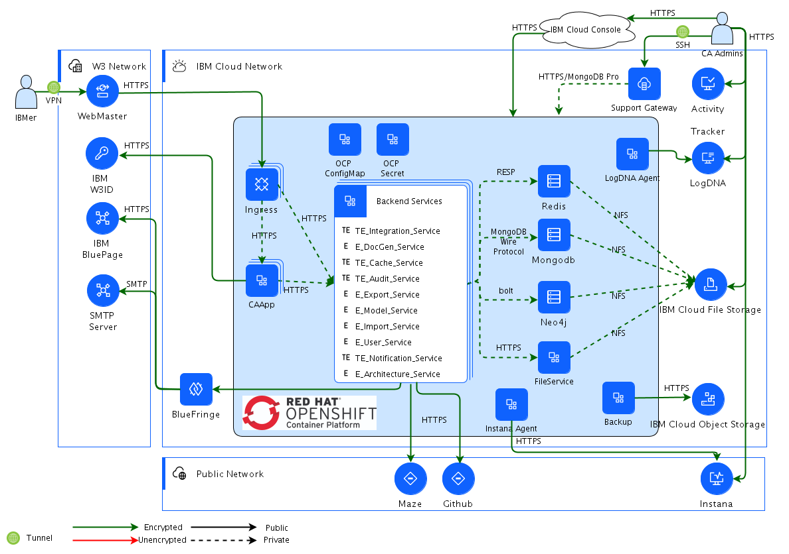

## Diagram

### Name

CA Operational Model - OCP

### Description

### Reference(s)

## Element

[Expand all](#){ .md-button .diff-line }

### Actor

    

Instana

<table>
    <caption></caption>
    <thead>
        <tr>
            <th></th>
            <th></th>
        </tr>
    </thead>
    <tr>
        <td> <strong>Name</strong> </td>
        <td>Instana</td>
    </tr>
    <tr>
        <td> <strong>Description</strong> </td>
        <td>Leverage Instana for Servers, Middlewares, and Applications Monitor</td>
    </tr>
    <tr>
        <td> <strong>Type</strong> </td>
        <td>IT System</td>
    </tr>
    <tr>
        <td> <strong>Generic Group</strong> </td>
<td>
        
</td>
    </tr>
</table>

    

Github

<table>
    <caption></caption>
    <thead>
        <tr>
            <th></th>
            <th></th>
        </tr>
    </thead>
    <tr>
        <td> <strong>Name</strong> </td>
        <td>Github</td>
    </tr>
    <tr>
        <td> <strong>Description</strong> </td>
        <td>Leverages Github for Architecture Data Archive</td>
    </tr>
    <tr>
        <td> <strong>Type</strong> </td>
        <td>IT System</td>
    </tr>
    <tr>
        <td> <strong>Generic Group</strong> </td>
<td>
        
</td>
    </tr>
</table>

    

Maze

<table>
    <caption></caption>
    <thead>
        <tr>
            <th></th>
            <th></th>
        </tr>
    </thead>
    <tr>
        <td> <strong>Name</strong> </td>
        <td>Maze</td>
    </tr>
    <tr>
        <td> <strong>Description</strong> </td>
        <td>Cognitive Architect integrated Maze for Cloud Deployment Diagram Render and Auto Deployment</td>
    </tr>
    <tr>
        <td> <strong>Type</strong> </td>
        <td>IT System</td>
    </tr>
    <tr>
        <td> <strong>Generic Group</strong> </td>
<td>
        
</td>
    </tr>
</table>

    

IBM BluePage

<table>
    <caption></caption>
    <thead>
        <tr>
            <th></th>
            <th></th>
        </tr>
    </thead>
    <tr>
        <td> <strong>Name</strong> </td>
        <td>IBM BluePage</td>
    </tr>
    <tr>
        <td> <strong>Description</strong> </td>
        <td>IBM BluePage provides users profile information, including firstnName, lastName, avatar, notesId</td>
    </tr>
    <tr>
        <td> <strong>Type</strong> </td>
        <td>IT System</td>
    </tr>
    <tr>
        <td> <strong>Generic Group</strong> </td>
<td>
        
</td>
    </tr>
</table>

    

SMTP Server

<table>
    <caption></caption>
    <thead>
        <tr>
            <th></th>
            <th></th>
        </tr>
    </thead>
    <tr>
        <td> <strong>Name</strong> </td>
        <td>SMTP Server</td>
    </tr>
    <tr>
        <td> <strong>Description</strong> </td>
        <td>Uses Internal SMTP Server to send email notification</td>
    </tr>
    <tr>
        <td> <strong>Type</strong> </td>
        <td>IT System</td>
    </tr>
    <tr>
        <td> <strong>Generic Group</strong> </td>
<td>
        
</td>
    </tr>
</table>

    

IBM W3ID

<table>
    <caption></caption>
    <thead>
        <tr>
            <th></th>
            <th></th>
        </tr>
    </thead>
    <tr>
        <td> <strong>Name</strong> </td>
        <td>IBM W3ID</td>
    </tr>
    <tr>
        <td> <strong>Description</strong> </td>
        <td>Leverage IBM W3ID for IBMer authentication</td>
    </tr>
    <tr>
        <td> <strong>Type</strong> </td>
        <td>IT System</td>
    </tr>
    <tr>
        <td> <strong>Generic Group</strong> </td>
<td>
        
</td>
    </tr>
</table>

    

WebMaster

<table>
    <caption></caption>
    <thead>
        <tr>
            <th></th>
            <th></th>
        </tr>
    </thead>
    <tr>
        <td> <strong>Name</strong> </td>
        <td>WebMaster</td>
    </tr>
    <tr>
        <td> <strong>Description</strong> </td>
        <td></td>
    </tr>
    <tr>
        <td> <strong>Type</strong> </td>
        <td>IT System</td>
    </tr>
    <tr>
        <td> <strong>Generic Group</strong> </td>
<td>
        
</td>
    </tr>
</table>

    

IBM Cloud Object Storage

<table>
    <caption></caption>
    <thead>
        <tr>
            <th></th>
            <th></th>
        </tr>
    </thead>
    <tr>
        <td> <strong>Name</strong> </td>
        <td>IBM Cloud Object Storage</td>
    </tr>
    <tr>
        <td> <strong>Description</strong> </td>
        <td>Provided by IBM Cloud, used to store backup data within 7 days.</td>
    </tr>
    <tr>
        <td> <strong>Type</strong> </td>
        <td>IT System</td>
    </tr>
    <tr>
        <td> <strong>Generic Group</strong> </td>
<td>
        
</td>
    </tr>
</table>

    

IBM Cloud File Storage

<table>
    <caption></caption>
    <thead>
        <tr>
            <th></th>
            <th></th>
        </tr>
    </thead>
    <tr>
        <td> <strong>Name</strong> </td>
        <td>IBM Cloud File Storage</td>
    </tr>
    <tr>
        <td> <strong>Description</strong> </td>
        <td>IBM Cloud File Storage is flash-backed, durable, fast, and flexible NFS-based file storage. Used to store database and file data.</td>
    </tr>
    <tr>
        <td> <strong>Type</strong> </td>
        <td>IT System</td>
    </tr>
    <tr>
        <td> <strong>Generic Group</strong> </td>
<td>
        
</td>
    </tr>
</table>

    

LogDNA

<table>
    <caption></caption>
    <thead>
        <tr>
            <th></th>
            <th></th>
        </tr>
    </thead>
    <tr>
        <td> <strong>Name</strong> </td>
        <td>LogDNA</td>
    </tr>
    <tr>
        <td> <strong>Description</strong> </td>
        <td>LogDNA is the service provided by IBM Cloud, receives the container log by the LogDNA agent within the cluster.</td>
    </tr>
    <tr>
        <td> <strong>Type</strong> </td>
        <td>IT System</td>
    </tr>
    <tr>
        <td> <strong>Generic Group</strong> </td>
<td>
        
</td>
    </tr>
</table>

    

Activity Tracker

<table>
    <caption></caption>
    <thead>
        <tr>
            <th></th>
            <th></th>
        </tr>
    </thead>
    <tr>
        <td> <strong>Name</strong> </td>
        <td>Activity Tracker</td>
    </tr>
    <tr>
        <td> <strong>Description</strong> </td>
        <td>Activity Tracker is the service provided by IBM Cloud, used to monitor the events in the Servers.</td>
    </tr>
    <tr>
        <td> <strong>Type</strong> </td>
        <td>IT System</td>
    </tr>
    <tr>
        <td> <strong>Generic Group</strong> </td>
<td>
        
</td>
    </tr>
</table>

    

### Subsystem

### OMLocation

    

IBM Cloud Network

<table>
    <caption></caption>
    <thead>
        <tr>
            <th></th>
            <th></th>
        </tr>
    </thead>
    <tr>
        <td> <strong>Name</strong> </td>
        <td>IBM Cloud Network</td>
    </tr>
    <tr>
        <td> <strong>Description</strong> </td>
        <td></td>
    </tr>
</table>

    

Public Network

<table>
    <caption></caption>
    <thead>
        <tr>
            <th></th>
            <th></th>
        </tr>
    </thead>
    <tr>
        <td> <strong>Name</strong> </td>
        <td>Public Network</td>
    </tr>
    <tr>
        <td> <strong>Description</strong> </td>
        <td></td>
    </tr>
</table>

    

W3 Network

<table>
    <caption></caption>
    <thead>
        <tr>
            <th></th>
            <th></th>
        </tr>
    </thead>
    <tr>
        <td> <strong>Name</strong> </td>
        <td>W3 Network</td>
    </tr>
    <tr>
        <td> <strong>Description</strong> </td>
        <td></td>
    </tr>
</table>

    

### Logical Connection

    

### Logical Node

    

Backend Services

<table>
    <caption></caption>
    <thead>
        <tr>
            <th></th>
            <th></th>
        </tr>
    </thead>
    <tr>
        <td> <strong>Name</strong> </td>
        <td>Backend Services</td>
    </tr>
    <tr>
        <td> <strong>Description</strong> </td>
        <td></td>
    </tr>
    <tr>
        <td> <strong>Type</strong> </td>
        <td></td>
    </tr>
    <tr>
        <td> <strong>Primary Capability</strong> </td>
        <td>
            
        </td>
    </tr>
    <tr>
        <td> <strong>Implementation</strong> </td>
        <td>
            
                
<a href="">Loopback4</a>

            
                
<a href="">Node.js</a>

            
                
<a href="">Redis Pub/Sub APIs</a>

            
                
<a href="">Redis SDK</a>

            
                
<a href="">Loopback3</a>

            
                
<a href="">Python</a>

            
                
<a href="">Liberty</a>

            
                
<a href="">POI</a>

            
                
<a href="">Spring Boot</a>

            
        </td>
    </tr>
    <tr>
        <td> <strong>Architectural Decision</strong> </td>
        <td>
            
        </td>
    </tr>
    <tr>
        <td> <strong>Non Functional Requirement</strong> </td>
        <td>
            
        </td>
    </tr>
    <tr>
        <td> <strong>Generic Group</strong> </td>
        <td></td>
    </tr>
    <tr>
        <td> <strong>Sub-level Diagram</strong> </td>
        <td></td>
    </tr>
    <tr>
        <td> <strong>Related Diagrams</strong> </td>
        <td>
            
                
<a href="../../Logical-Operational-View/ITAA Operational Model - OCP">ITAA Operational Model - OCP</a>

            
                
<a href="../../Logical-Operational-View/CA Operational Model - OCP">CA Operational Model - OCP</a>

            
        </td>
    </tr>
    <tr>
        <td> <strong>Related Elements</strong> </td>
        <td>
            
                
IBM Cloud Network

                
                    
                    <li><a href="../../Logical-Operational-View/ITAA Operational Model - OCP">ITAA Operational Model - OCP</a></li>
                    
                    <li><a href="../../Logical-Operational-View/CA Operational Model - OCP">CA Operational Model - OCP</a></li>
                    
                
            
            
                
E_User_Service

                
                    
                    <li>
<a href="../../Logical-Operational-View/ITAA Operational Model - OCP">ITAA Operational Model - OCP</a>
</li>
                    
                    <li>
<a href="../../Logical-Operational-View/CA Operational Model - OCP">CA Operational Model - OCP</a>
</li>
                    
                    <li>
<a href="../../Logical-Operational-View/LOM View - In updates">LOM View - In updates</a>
</li>
                    
                    <li>
<a href="../../Services-View/Architecture Overview">Architecture Overview</a>
</li>
                    
                    <li>
<a href="../../Sequence-View/CA authorization new scenarios">CA authorization new scenarios</a>
</li>
                    
                    <li>
<a href="../../Sequence-View/CA authorization old scenarios">CA authorization old scenarios</a>
</li>
                    
                    <li>
<a href="../../Sequence-View/User Login & Session Mgt Process">User Login & Session Mgt Process</a>
</li>
                    
                    <li>
<a href="../../Sequence-View/Peer Review Request - Expire process">Peer Review Request - Expire process</a>
</li>
                    
                    <li>
<a href="../../Sequence-View/ Customization Export Flow"> Customization Export Flow</a>
</li>
                    
                    <li>
<a href="../../Sequence-View/Peer Review Request - Request process">Peer Review Request - Request process</a>
</li>
                    
                    <li>
<a href="../../Static-View/Overall Service Interaction">Overall Service Interaction</a>
</li>
                    
                    <li>
<a href="../../Static-View/3-rd Party Service Interaction">3-rd Party Service Interaction</a>
</li>
                    
                
            
                
E_DocGen_Service

                
                    
                    <li>
<a href="../../Prescribed-Operational-View/POM View - In updates">POM View - In updates</a>
</li>
                    
                    <li>
<a href="../../Logical-Operational-View/ITAA Operational Model - OCP">ITAA Operational Model - OCP</a>
</li>
                    
                    <li>
<a href="../../Logical-Operational-View/CA Operational Model - OCP">CA Operational Model - OCP</a>
</li>
                    
                    <li>
<a href="../../Logical-Operational-View/LOM View - In updates">LOM View - In updates</a>
</li>
                    
                    <li>
<a href="../../Services-View/Architecture Overview">Architecture Overview</a>
</li>
                    
                    <li>
<a href="../../Sequence-View/ Customization Export Flow"> Customization Export Flow</a>
</li>
                    
                    <li>
<a href="../../Static-View/Overall Service Interaction">Overall Service Interaction</a>
</li>
                    
                
            
                
E_Model_Service

                
                    
                    <li>
<a href="../../Logical-Operational-View/ITAA Operational Model - OCP">ITAA Operational Model - OCP</a>
</li>
                    
                    <li>
<a href="../../Logical-Operational-View/CA Operational Model - OCP">CA Operational Model - OCP</a>
</li>
                    
                    <li>
<a href="../../Logical-Operational-View/LOM View - In updates">LOM View - In updates</a>
</li>
                    
                    <li>
<a href="../../Services-View/Architecture Overview">Architecture Overview</a>
</li>
                    
                    <li>
<a href="../../Sequence-View/Process Flow - Train co_occurrence model">Process Flow - Train co_occurrence model</a>
</li>
                    
                    <li>
<a href="../../Sequence-View/Process Flow - Search Architecture Assets">Process Flow - Search Architecture Assets</a>
</li>
                    
                    <li>
<a href="../../Static-View/Overall Service Interaction">Overall Service Interaction</a>
</li>
                    
                
            
                
E_Export_Service

                
                    
                    <li>
<a href="../../Prescribed-Operational-View/POM View - In updates">POM View - In updates</a>
</li>
                    
                    <li>
<a href="../../Logical-Operational-View/ITAA Operational Model - OCP">ITAA Operational Model - OCP</a>
</li>
                    
                    <li>
<a href="../../Logical-Operational-View/CA Operational Model - OCP">CA Operational Model - OCP</a>
</li>
                    
                    <li>
<a href="../../Logical-Operational-View/LOM View - In updates">LOM View - In updates</a>
</li>
                    
                    <li>
<a href="../../Services-View/Architecture Overview">Architecture Overview</a>
</li>
                    
                    <li>
<a href="../../Static-View/Overall Service Interaction">Overall Service Interaction</a>
</li>
                    
                
            
                
E_Architecture_Service

                
                    
                    <li>
<a href="../../Logical-Operational-View/ITAA Operational Model - OCP">ITAA Operational Model - OCP</a>
</li>
                    
                    <li>
<a href="../../Logical-Operational-View/CA Operational Model - OCP">CA Operational Model - OCP</a>
</li>
                    
                    <li>
<a href="../../Logical-Operational-View/LOM View - In updates">LOM View - In updates</a>
</li>
                    
                    <li>
<a href="../../Services-View/Architecture Overview">Architecture Overview</a>
</li>
                    
                    <li>
<a href="../../Sequence-View/IIAA-4071: create drill down diagram flow">IIAA-4071: create drill down diagram flow</a>
</li>
                    
                    <li>
<a href="../../Sequence-View/CA authorization new scenarios">CA authorization new scenarios</a>
</li>
                    
                    <li>
<a href="../../Sequence-View/CA authorization old scenarios">CA authorization old scenarios</a>
</li>
                    
                    <li>
<a href="../../Sequence-View/Peer Review Request - Expire process">Peer Review Request - Expire process</a>
</li>
                    
                    <li>
<a href="../../Sequence-View/Auto Return Pen Flow">Auto Return Pen Flow</a>
</li>
                    
                    <li>
<a href="../../Sequence-View/ Customization Export Flow"> Customization Export Flow</a>
</li>
                    
                    <li>
<a href="../../Sequence-View/Process Flow - Train co_occurrence model">Process Flow - Train co_occurrence model</a>
</li>
                    
                    <li>
<a href="../../Sequence-View/Peer Review Request - Request process">Peer Review Request - Request process</a>
</li>
                    
                    <li>
<a href="../../Sequence-View/Process Flow - Search Architecture Assets">Process Flow - Search Architecture Assets</a>
</li>
                    
                
            
                
E_Import_Service

                
                    
                    <li>
<a href="../../Logical-Operational-View/ITAA Operational Model - OCP">ITAA Operational Model - OCP</a>
</li>
                    
                    <li>
<a href="../../Logical-Operational-View/CA Operational Model - OCP">CA Operational Model - OCP</a>
</li>
                    
                    <li>
<a href="../../Logical-Operational-View/LOM View - In updates">LOM View - In updates</a>
</li>
                    
                    <li>
<a href="../../Services-View/Architecture Overview">Architecture Overview</a>
</li>
                    
                    <li>
<a href="../../Static-View/Overall Service Interaction">Overall Service Interaction</a>
</li>
                    
                
            
                
TE_Integration_Service

                
                    
                    <li>
<a href="../../Logical-Operational-View/ITAA Operational Model - OCP">ITAA Operational Model - OCP</a>
</li>
                    
                    <li>
<a href="../../Logical-Operational-View/CA Operational Model - OCP">CA Operational Model - OCP</a>
</li>
                    
                    <li>
<a href="../../Logical-Operational-View/LOM View - In updates">LOM View - In updates</a>
</li>
                    
                    <li>
<a href="../../Services-View/Architecture Overview">Architecture Overview</a>
</li>
                    
                    <li>
<a href="../../Sequence-View/Solution Advisor Integration - Update Opportunity">Solution Advisor Integration - Update Opportunity</a>
</li>
                    
                    <li>
<a href="../../Static-View/CA and Maze Integration">CA and Maze Integration</a>
</li>
                    
                    <li>
<a href="../../Static-View/Overall Service Interaction">Overall Service Interaction</a>
</li>
                    
                    <li>
<a href="../../Static-View/3-rd Party Service Interaction">3-rd Party Service Interaction</a>
</li>
                    
                
            
                
TE_Audit_Service

                
                    
                    <li>
<a href="../../Logical-Operational-View/ITAA Operational Model - OCP">ITAA Operational Model - OCP</a>
</li>
                    
                    <li>
<a href="../../Logical-Operational-View/CA Operational Model - OCP">CA Operational Model - OCP</a>
</li>
                    
                    <li>
<a href="../../Logical-Operational-View/LOM View - In updates">LOM View - In updates</a>
</li>
                    
                    <li>
<a href="../../Services-View/Architecture Overview">Architecture Overview</a>
</li>
                    
                    <li>
<a href="../../Sequence-View/CA authorization new scenarios">CA authorization new scenarios</a>
</li>
                    
                    <li>
<a href="../../Sequence-View/CA authorization old scenarios">CA authorization old scenarios</a>
</li>
                    
                    <li>
<a href="../../Sequence-View/Auto Return Pen Flow">Auto Return Pen Flow</a>
</li>
                    
                    <li>
<a href="../../Static-View/Overall Service Interaction">Overall Service Interaction</a>
</li>
                    
                
            
                
TE_Cache_Service

                
                    
                    <li>
<a href="../../Logical-Operational-View/ITAA Operational Model - OCP">ITAA Operational Model - OCP</a>
</li>
                    
                    <li>
<a href="../../Logical-Operational-View/CA Operational Model - OCP">CA Operational Model - OCP</a>
</li>
                    
                    <li>
<a href="../../Logical-Operational-View/LOM View - In updates">LOM View - In updates</a>
</li>
                    
                    <li>
<a href="../../Services-View/Architecture Overview">Architecture Overview</a>
</li>
                    
                    <li>
<a href="../../Sequence-View/Process Flow - Search Architecture Assets">Process Flow - Search Architecture Assets</a>
</li>
                    
                    <li>
<a href="../../Static-View/Overall Service Interaction">Overall Service Interaction</a>
</li>
                    
                
            
                
TE_Notification_Service

                
                    
                    <li>
<a href="../../Logical-Operational-View/ITAA Operational Model - OCP">ITAA Operational Model - OCP</a>
</li>
                    
                    <li>
<a href="../../Logical-Operational-View/CA Operational Model - OCP">CA Operational Model - OCP</a>
</li>
                    
                    <li>
<a href="../../Logical-Operational-View/LOM View - In updates">LOM View - In updates</a>
</li>
                    
                    <li>
<a href="../../Services-View/Architecture Overview">Architecture Overview</a>
</li>
                    
                    <li>
<a href="../../Sequence-View/Peer Review Request - Expire process">Peer Review Request - Expire process</a>
</li>
                    
                    <li>
<a href="../../Sequence-View/Auto Return Pen Flow">Auto Return Pen Flow</a>
</li>
                    
                    <li>
<a href="../../Sequence-View/Process Flow - Train co_occurrence model">Process Flow - Train co_occurrence model</a>
</li>
                    
                    <li>
<a href="../../Sequence-View/Peer Review Request - Request process">Peer Review Request - Request process</a>
</li>
                    
                    <li>
<a href="../../Static-View/Overall Service Interaction">Overall Service Interaction</a>
</li>
                    
                    <li>
<a href="../../Static-View/3-rd Party Service Interaction">3-rd Party Service Interaction</a>
</li>
                    
                
            
        </td>
    </tr>
    
</table>

    

Backup

<table>
    <caption></caption>
    <thead>
        <tr>
            <th></th>
            <th></th>
        </tr>
    </thead>
    <tr>
        <td> <strong>Name</strong> </td>
        <td>Backup</td>
    </tr>
    <tr>
        <td> <strong>Description</strong> </td>
        <td></td>
    </tr>
    <tr>
        <td> <strong>Type</strong> </td>
        <td></td>
    </tr>
    <tr>
        <td> <strong>Primary Capability</strong> </td>
        <td>
            
        </td>
    </tr>
    <tr>
        <td> <strong>Implementation</strong> </td>
        <td>
            
        </td>
    </tr>
    <tr>
        <td> <strong>Architectural Decision</strong> </td>
        <td>
            
        </td>
    </tr>
    <tr>
        <td> <strong>Non Functional Requirement</strong> </td>
        <td>
            
        </td>
    </tr>
    <tr>
        <td> <strong>Generic Group</strong> </td>
        <td></td>
    </tr>
    <tr>
        <td> <strong>Sub-level Diagram</strong> </td>
        <td></td>
    </tr>
    <tr>
        <td> <strong>Related Diagrams</strong> </td>
        <td>
            
                
<a href="../../Logical-Operational-View/ITAA Operational Model - OCP">ITAA Operational Model - OCP</a>

            
                
<a href="../../Logical-Operational-View/CA Operational Model - OCP">CA Operational Model - OCP</a>

            
        </td>
    </tr>
    <tr>
        <td> <strong>Related Elements</strong> </td>
        <td>
            
                
IBM Cloud Network

                
                    
                    <li><a href="../../Logical-Operational-View/ITAA Operational Model - OCP">ITAA Operational Model - OCP</a></li>
                    
                    <li><a href="../../Logical-Operational-View/CA Operational Model - OCP">CA Operational Model - OCP</a></li>
                    
                
            
            
        </td>
    </tr>
    
</table>

    

BlueFringe

<table>
    <caption></caption>
    <thead>
        <tr>
            <th></th>
            <th></th>
        </tr>
    </thead>
    <tr>
        <td> <strong>Name</strong> </td>
        <td>BlueFringe</td>
    </tr>
    <tr>
        <td> <strong>Description</strong> </td>
        <td>BlueFringe is an offering from IBM CIO Network Engineering team, enable connections from IBM Cloud account to IBM's Intranet</td>
    </tr>
    <tr>
        <td> <strong>Type</strong> </td>
        <td></td>
    </tr>
    <tr>
        <td> <strong>Primary Capability</strong> </td>
        <td>
            
                
network routing

            
        </td>
    </tr>
    <tr>
        <td> <strong>Implementation</strong> </td>
        <td>
            
        </td>
    </tr>
    <tr>
        <td> <strong>Architectural Decision</strong> </td>
        <td>
            
                
<a href="../../Architectural Decisions/architecturaldecision_r1epW-pDe9">Use BlueFringe to connect w3 network</a>

            
        </td>
    </tr>
    <tr>
        <td> <strong>Non Functional Requirement</strong> </td>
        <td>
            
        </td>
    </tr>
    <tr>
        <td> <strong>Generic Group</strong> </td>
        <td></td>
    </tr>
    <tr>
        <td> <strong>Sub-level Diagram</strong> </td>
        <td></td>
    </tr>
    <tr>
        <td> <strong>Related Diagrams</strong> </td>
        <td>
            
                
<a href="../../Logical-Operational-View/CA Operational Model - OCP">CA Operational Model - OCP</a>

            
                
<a href="../../IT-System-View/IT System View - IBM Cloud Based">IT System View - IBM Cloud Based</a>

            
        </td>
    </tr>
    <tr>
        <td> <strong>Related Elements</strong> </td>
        <td>
            
                
Use BlueFringe to connect w3 network

                
                    
                    <li><a href="../../Logical-Operational-View/ITAA Operational Model - OCP">ITAA Operational Model - OCP</a></li>
                    
                    <li><a href="../../Logical-Operational-View/CA Operational Model - OCP">CA Operational Model - OCP</a></li>
                    
                    <li><a href="../../IT-System-View/IT System View - IBM Cloud Based">IT System View - IBM Cloud Based</a></li>
                    
                
            
                
IBM Cloud Network

                
                    
                    <li><a href="../../Logical-Operational-View/ITAA Operational Model - OCP">ITAA Operational Model - OCP</a></li>
                    
                    <li><a href="../../Logical-Operational-View/CA Operational Model - OCP">CA Operational Model - OCP</a></li>
                    
                
            
            
                
network routing

                
            
        </td>
    </tr>
    
</table>

    

CAApp

<table>
    <caption></caption>
    <thead>
        <tr>
            <th></th>
            <th></th>
        </tr>
    </thead>
    <tr>
        <td> <strong>Name</strong> </td>
        <td>CAApp</td>
    </tr>
    <tr>
        <td> <strong>Description</strong> </td>
        <td></td>
    </tr>
    <tr>
        <td> <strong>Type</strong> </td>
        <td></td>
    </tr>
    <tr>
        <td> <strong>Primary Capability</strong> </td>
        <td>
            
        </td>
    </tr>
    <tr>
        <td> <strong>Implementation</strong> </td>
        <td>
            
        </td>
    </tr>
    <tr>
        <td> <strong>Architectural Decision</strong> </td>
        <td>
            
        </td>
    </tr>
    <tr>
        <td> <strong>Non Functional Requirement</strong> </td>
        <td>
            
        </td>
    </tr>
    <tr>
        <td> <strong>Generic Group</strong> </td>
        <td></td>
    </tr>
    <tr>
        <td> <strong>Sub-level Diagram</strong> </td>
        <td></td>
    </tr>
    <tr>
        <td> <strong>Related Diagrams</strong> </td>
        <td>
            
                
<a href="../../Logical-Operational-View/ITAA Operational Model - OCP">ITAA Operational Model - OCP</a>

            
                
<a href="../../Logical-Operational-View/CA Operational Model - OCP">CA Operational Model - OCP</a>

            
        </td>
    </tr>
    <tr>
        <td> <strong>Related Elements</strong> </td>
        <td>
            
                
IBM Cloud Network

                
                    
                    <li><a href="../../Logical-Operational-View/ITAA Operational Model - OCP">ITAA Operational Model - OCP</a></li>
                    
                    <li><a href="../../Logical-Operational-View/CA Operational Model - OCP">CA Operational Model - OCP</a></li>
                    
                
            
            
        </td>
    </tr>
    
</table>

    

FileService

<table>
    <caption></caption>
    <thead>
        <tr>
            <th></th>
            <th></th>
        </tr>
    </thead>
    <tr>
        <td> <strong>Name</strong> </td>
        <td>FileService</td>
    </tr>
    <tr>
        <td> <strong>Description</strong> </td>
        <td></td>
    </tr>
    <tr>
        <td> <strong>Type</strong> </td>
        <td></td>
    </tr>
    <tr>
        <td> <strong>Primary Capability</strong> </td>
        <td>
            
        </td>
    </tr>
    <tr>
        <td> <strong>Implementation</strong> </td>
        <td>
            
        </td>
    </tr>
    <tr>
        <td> <strong>Architectural Decision</strong> </td>
        <td>
            
        </td>
    </tr>
    <tr>
        <td> <strong>Non Functional Requirement</strong> </td>
        <td>
            
        </td>
    </tr>
    <tr>
        <td> <strong>Generic Group</strong> </td>
        <td></td>
    </tr>
    <tr>
        <td> <strong>Sub-level Diagram</strong> </td>
        <td></td>
    </tr>
    <tr>
        <td> <strong>Related Diagrams</strong> </td>
        <td>
            
                
<a href="../../Logical-Operational-View/ITAA Operational Model - OCP">ITAA Operational Model - OCP</a>

            
                
<a href="../../Logical-Operational-View/CA Operational Model - OCP">CA Operational Model - OCP</a>

            
        </td>
    </tr>
    <tr>
        <td> <strong>Related Elements</strong> </td>
        <td>
            
                
IBM Cloud Network

                
                    
                    <li><a href="../../Logical-Operational-View/ITAA Operational Model - OCP">ITAA Operational Model - OCP</a></li>
                    
                    <li><a href="../../Logical-Operational-View/CA Operational Model - OCP">CA Operational Model - OCP</a></li>
                    
                
            
            
        </td>
    </tr>
    
</table>

    

Ingress

<table>
    <caption></caption>
    <thead>
        <tr>
            <th></th>
            <th></th>
        </tr>
    </thead>
    <tr>
        <td> <strong>Name</strong> </td>
        <td>Ingress</td>
    </tr>
    <tr>
        <td> <strong>Description</strong> </td>
        <td></td>
    </tr>
    <tr>
        <td> <strong>Type</strong> </td>
        <td></td>
    </tr>
    <tr>
        <td> <strong>Primary Capability</strong> </td>
        <td>
            
                
connectivity & transformation

            
        </td>
    </tr>
    <tr>
        <td> <strong>Implementation</strong> </td>
        <td>
            
        </td>
    </tr>
    <tr>
        <td> <strong>Architectural Decision</strong> </td>
        <td>
            
        </td>
    </tr>
    <tr>
        <td> <strong>Non Functional Requirement</strong> </td>
        <td>
            
        </td>
    </tr>
    <tr>
        <td> <strong>Generic Group</strong> </td>
        <td></td>
    </tr>
    <tr>
        <td> <strong>Sub-level Diagram</strong> </td>
        <td></td>
    </tr>
    <tr>
        <td> <strong>Related Diagrams</strong> </td>
        <td>
            
                
<a href="../../Logical-Operational-View/ITAA Operational Model - OCP">ITAA Operational Model - OCP</a>

            
                
<a href="../../Logical-Operational-View/CA Operational Model - OCP">CA Operational Model - OCP</a>

            
                
<a href="../../IT-System-View/IT System View - IBM Cloud Based">IT System View - IBM Cloud Based</a>

            
        </td>
    </tr>
    <tr>
        <td> <strong>Related Elements</strong> </td>
        <td>
            
                
IBM Cloud Network

                
                    
                    <li><a href="../../Logical-Operational-View/ITAA Operational Model - OCP">ITAA Operational Model - OCP</a></li>
                    
                    <li><a href="../../Logical-Operational-View/CA Operational Model - OCP">CA Operational Model - OCP</a></li>
                    
                
            
            
                
connectivity & transformation

                
            
        </td>
    </tr>
    
</table>

    

Instana Agent

<table>
    <caption></caption>
    <thead>
        <tr>
            <th></th>
            <th></th>
        </tr>
    </thead>
    <tr>
        <td> <strong>Name</strong> </td>
        <td>Instana Agent</td>
    </tr>
    <tr>
        <td> <strong>Description</strong> </td>
        <td></td>
    </tr>
    <tr>
        <td> <strong>Type</strong> </td>
        <td></td>
    </tr>
    <tr>
        <td> <strong>Primary Capability</strong> </td>
        <td>
            
        </td>
    </tr>
    <tr>
        <td> <strong>Implementation</strong> </td>
        <td>
            
        </td>
    </tr>
    <tr>
        <td> <strong>Architectural Decision</strong> </td>
        <td>
            
        </td>
    </tr>
    <tr>
        <td> <strong>Non Functional Requirement</strong> </td>
        <td>
            
        </td>
    </tr>
    <tr>
        <td> <strong>Generic Group</strong> </td>
        <td></td>
    </tr>
    <tr>
        <td> <strong>Sub-level Diagram</strong> </td>
        <td></td>
    </tr>
    <tr>
        <td> <strong>Related Diagrams</strong> </td>
        <td>
            
                
<a href="../../Logical-Operational-View/CA Operational Model - OCP">CA Operational Model - OCP</a>

            
        </td>
    </tr>
    <tr>
        <td> <strong>Related Elements</strong> </td>
        <td>
            
                
IBM Cloud Network

                
                    
                    <li><a href="../../Logical-Operational-View/ITAA Operational Model - OCP">ITAA Operational Model - OCP</a></li>
                    
                    <li><a href="../../Logical-Operational-View/CA Operational Model - OCP">CA Operational Model - OCP</a></li>
                    
                
            
            
        </td>
    </tr>
    
</table>

    

LogDNA Agent

<table>
    <caption></caption>
    <thead>
        <tr>
            <th></th>
            <th></th>
        </tr>
    </thead>
    <tr>
        <td> <strong>Name</strong> </td>
        <td>LogDNA Agent</td>
    </tr>
    <tr>
        <td> <strong>Description</strong> </td>
        <td></td>
    </tr>
    <tr>
        <td> <strong>Type</strong> </td>
        <td></td>
    </tr>
    <tr>
        <td> <strong>Primary Capability</strong> </td>
        <td>
            
        </td>
    </tr>
    <tr>
        <td> <strong>Implementation</strong> </td>
        <td>
            
        </td>
    </tr>
    <tr>
        <td> <strong>Architectural Decision</strong> </td>
        <td>
            
        </td>
    </tr>
    <tr>
        <td> <strong>Non Functional Requirement</strong> </td>
        <td>
            
        </td>
    </tr>
    <tr>
        <td> <strong>Generic Group</strong> </td>
        <td></td>
    </tr>
    <tr>
        <td> <strong>Sub-level Diagram</strong> </td>
        <td></td>
    </tr>
    <tr>
        <td> <strong>Related Diagrams</strong> </td>
        <td>
            
                
<a href="../../Logical-Operational-View/ITAA Operational Model - OCP">ITAA Operational Model - OCP</a>

            
                
<a href="../../Logical-Operational-View/CA Operational Model - OCP">CA Operational Model - OCP</a>

            
        </td>
    </tr>
    <tr>
        <td> <strong>Related Elements</strong> </td>
        <td>
            
                
IBM Cloud Network

                
                    
                    <li><a href="../../Logical-Operational-View/ITAA Operational Model - OCP">ITAA Operational Model - OCP</a></li>
                    
                    <li><a href="../../Logical-Operational-View/CA Operational Model - OCP">CA Operational Model - OCP</a></li>
                    
                
            
            
        </td>
    </tr>
    
</table>

    

Mongodb

<table>
    <caption></caption>
    <thead>
        <tr>
            <th></th>
            <th></th>
        </tr>
    </thead>
    <tr>
        <td> <strong>Name</strong> </td>
        <td>Mongodb</td>
    </tr>
    <tr>
        <td> <strong>Description</strong> </td>
        <td>Mongodb is used to store User Information, History Data, Audit, and Integration Data. </td>
    </tr>
    <tr>
        <td> <strong>Type</strong> </td>
        <td></td>
    </tr>
    <tr>
        <td> <strong>Primary Capability</strong> </td>
        <td>
            
                
data

            
        </td>
    </tr>
    <tr>
        <td> <strong>Implementation</strong> </td>
        <td>
            
        </td>
    </tr>
    <tr>
        <td> <strong>Architectural Decision</strong> </td>
        <td>
            
        </td>
    </tr>
    <tr>
        <td> <strong>Non Functional Requirement</strong> </td>
        <td>
            
        </td>
    </tr>
    <tr>
        <td> <strong>Generic Group</strong> </td>
        <td></td>
    </tr>
    <tr>
        <td> <strong>Sub-level Diagram</strong> </td>
        <td></td>
    </tr>
    <tr>
        <td> <strong>Related Diagrams</strong> </td>
        <td>
            
                
<a href="../../Logical-Operational-View/ITAA Operational Model - OCP">ITAA Operational Model - OCP</a>

            
                
<a href="../../Logical-Operational-View/CA Operational Model - OCP">CA Operational Model - OCP</a>

            
                
<a href="../../Logical-Operational-View/LOM View - In updates">LOM View - In updates</a>

            
                
<a href="../../IT-System-View/IT System View - IBM Cloud Based">IT System View - IBM Cloud Based</a>

            
        </td>
    </tr>
    <tr>
        <td> <strong>Related Elements</strong> </td>
        <td>
            
                
IBM Cloud Network

                
                    
                    <li><a href="../../Logical-Operational-View/ITAA Operational Model - OCP">ITAA Operational Model - OCP</a></li>
                    
                    <li><a href="../../Logical-Operational-View/CA Operational Model - OCP">CA Operational Model - OCP</a></li>
                    
                
            
            
                
data

                
            
        </td>
    </tr>
    
</table>

    

Neo4j

<table>
    <caption></caption>
    <thead>
        <tr>
            <th></th>
            <th></th>
        </tr>
    </thead>
    <tr>
        <td> <strong>Name</strong> </td>
        <td>Neo4j</td>
    </tr>
    <tr>
        <td> <strong>Description</strong> </td>
        <td>Neo4j is used store Architecture Meta Data, and Architecture Instana Data. </td>
    </tr>
    <tr>
        <td> <strong>Type</strong> </td>
        <td></td>
    </tr>
    <tr>
        <td> <strong>Primary Capability</strong> </td>
        <td>
            
                
data

            
        </td>
    </tr>
    <tr>
        <td> <strong>Implementation</strong> </td>
        <td>
            
        </td>
    </tr>
    <tr>
        <td> <strong>Architectural Decision</strong> </td>
        <td>
            
                
<a href="../../Architectural Decisions/architecturaldecision_HkB_Zx2a74HhY">Use Neo4j to store Architecture Data</a>

            
        </td>
    </tr>
    <tr>
        <td> <strong>Non Functional Requirement</strong> </td>
        <td>
            
                
<a href="../../Non Functional Requirements/nonfunctionalrequirement_rklwWx3pXEB2F">System Availability</a>

            
        </td>
    </tr>
    <tr>
        <td> <strong>Generic Group</strong> </td>
        <td></td>
    </tr>
    <tr>
        <td> <strong>Sub-level Diagram</strong> </td>
        <td></td>
    </tr>
    <tr>
        <td> <strong>Related Diagrams</strong> </td>
        <td>
            
                
<a href="../../Logical-Operational-View/ITAA Operational Model - OCP">ITAA Operational Model - OCP</a>

            
                
<a href="../../Logical-Operational-View/CA Operational Model - OCP">CA Operational Model - OCP</a>

            
                
<a href="../../Logical-Operational-View/LOM View - In updates">LOM View - In updates</a>

            
                
<a href="../../IT-System-View/IT System View - IBM Cloud Based">IT System View - IBM Cloud Based</a>

            
        </td>
    </tr>
    <tr>
        <td> <strong>Related Elements</strong> </td>
        <td>
            
                
System Availability

                
                    
                    <li><a href="../../Logical-Operational-View/ITAA Operational Model - OCP">ITAA Operational Model - OCP</a></li>
                    
                    <li><a href="../../Logical-Operational-View/CA Operational Model - OCP">CA Operational Model - OCP</a></li>
                    
                    <li><a href="../../Logical-Operational-View/LOM View - In updates">LOM View - In updates</a></li>
                    
                    <li><a href="../../IT-System-View/IT System View - IBM Cloud Based">IT System View - IBM Cloud Based</a></li>
                    
                
            
                
Use Neo4j to store Architecture Data

                
                    
                    <li><a href="../../Logical-Operational-View/ITAA Operational Model - OCP">ITAA Operational Model - OCP</a></li>
                    
                    <li><a href="../../Logical-Operational-View/CA Operational Model - OCP">CA Operational Model - OCP</a></li>
                    
                    <li><a href="../../Logical-Operational-View/LOM View - In updates">LOM View - In updates</a></li>
                    
                    <li><a href="../../IT-System-View/IT System View - IBM Cloud Based">IT System View - IBM Cloud Based</a></li>
                    
                
            
                
IBM Cloud Network

                
                    
                    <li><a href="../../Logical-Operational-View/ITAA Operational Model - OCP">ITAA Operational Model - OCP</a></li>
                    
                    <li><a href="../../Logical-Operational-View/CA Operational Model - OCP">CA Operational Model - OCP</a></li>
                    
                
            
            
                
data

                
            
        </td>
    </tr>
    
</table>

    

OCP ConfigMap

<table>
    <caption></caption>
    <thead>
        <tr>
            <th></th>
            <th></th>
        </tr>
    </thead>
    <tr>
        <td> <strong>Name</strong> </td>
        <td>OCP ConfigMap</td>
    </tr>
    <tr>
        <td> <strong>Description</strong> </td>
        <td></td>
    </tr>
    <tr>
        <td> <strong>Type</strong> </td>
        <td></td>
    </tr>
    <tr>
        <td> <strong>Primary Capability</strong> </td>
        <td>
            
        </td>
    </tr>
    <tr>
        <td> <strong>Implementation</strong> </td>
        <td>
            
        </td>
    </tr>
    <tr>
        <td> <strong>Architectural Decision</strong> </td>
        <td>
            
        </td>
    </tr>
    <tr>
        <td> <strong>Non Functional Requirement</strong> </td>
        <td>
            
        </td>
    </tr>
    <tr>
        <td> <strong>Generic Group</strong> </td>
        <td></td>
    </tr>
    <tr>
        <td> <strong>Sub-level Diagram</strong> </td>
        <td></td>
    </tr>
    <tr>
        <td> <strong>Related Diagrams</strong> </td>
        <td>
            
                
<a href="../../Logical-Operational-View/ITAA Operational Model - OCP">ITAA Operational Model - OCP</a>

            
                
<a href="../../Logical-Operational-View/CA Operational Model - OCP">CA Operational Model - OCP</a>

            
        </td>
    </tr>
    <tr>
        <td> <strong>Related Elements</strong> </td>
        <td>
            
                
IBM Cloud Network

                
                    
                    <li><a href="../../Logical-Operational-View/ITAA Operational Model - OCP">ITAA Operational Model - OCP</a></li>
                    
                    <li><a href="../../Logical-Operational-View/CA Operational Model - OCP">CA Operational Model - OCP</a></li>
                    
                
            
            
        </td>
    </tr>
    
</table>

    

OCP Secret

<table>
    <caption></caption>
    <thead>
        <tr>
            <th></th>
            <th></th>
        </tr>
    </thead>
    <tr>
        <td> <strong>Name</strong> </td>
        <td>OCP Secret</td>
    </tr>
    <tr>
        <td> <strong>Description</strong> </td>
        <td></td>
    </tr>
    <tr>
        <td> <strong>Type</strong> </td>
        <td></td>
    </tr>
    <tr>
        <td> <strong>Primary Capability</strong> </td>
        <td>
            
        </td>
    </tr>
    <tr>
        <td> <strong>Implementation</strong> </td>
        <td>
            
        </td>
    </tr>
    <tr>
        <td> <strong>Architectural Decision</strong> </td>
        <td>
            
        </td>
    </tr>
    <tr>
        <td> <strong>Non Functional Requirement</strong> </td>
        <td>
            
        </td>
    </tr>
    <tr>
        <td> <strong>Generic Group</strong> </td>
        <td></td>
    </tr>
    <tr>
        <td> <strong>Sub-level Diagram</strong> </td>
        <td></td>
    </tr>
    <tr>
        <td> <strong>Related Diagrams</strong> </td>
        <td>
            
                
<a href="../../Logical-Operational-View/ITAA Operational Model - OCP">ITAA Operational Model - OCP</a>

            
                
<a href="../../Logical-Operational-View/CA Operational Model - OCP">CA Operational Model - OCP</a>

            
        </td>
    </tr>
    <tr>
        <td> <strong>Related Elements</strong> </td>
        <td>
            
                
IBM Cloud Network

                
                    
                    <li><a href="../../Logical-Operational-View/ITAA Operational Model - OCP">ITAA Operational Model - OCP</a></li>
                    
                    <li><a href="../../Logical-Operational-View/CA Operational Model - OCP">CA Operational Model - OCP</a></li>
                    
                
            
            
        </td>
    </tr>
    
</table>

    

Redis

<table>
    <caption></caption>
    <thead>
        <tr>
            <th></th>
            <th></th>
        </tr>
    </thead>
    <tr>
        <td> <strong>Name</strong> </td>
        <td>Redis</td>
    </tr>
    <tr>
        <td> <strong>Description</strong> </td>
        <td>Redis is used for two capabilities
<ul><li>Used to cache frequent fetch data, like users private &amp; bookmarked architecture list</li><li>Used as notification framework to subscribe/emit events. </li></ul>
</td>
    </tr>
    <tr>
        <td> <strong>Type</strong> </td>
        <td></td>
    </tr>
    <tr>
        <td> <strong>Primary Capability</strong> </td>
        <td>
            
                
data

            
        </td>
    </tr>
    <tr>
        <td> <strong>Implementation</strong> </td>
        <td>
            
        </td>
    </tr>
    <tr>
        <td> <strong>Architectural Decision</strong> </td>
        <td>
            
        </td>
    </tr>
    <tr>
        <td> <strong>Non Functional Requirement</strong> </td>
        <td>
            
                
<a href="../../Non Functional Requirements/nonfunctionalrequirement_rklwWx3pXEB2F">System Availability</a>

            
        </td>
    </tr>
    <tr>
        <td> <strong>Generic Group</strong> </td>
        <td></td>
    </tr>
    <tr>
        <td> <strong>Sub-level Diagram</strong> </td>
        <td></td>
    </tr>
    <tr>
        <td> <strong>Related Diagrams</strong> </td>
        <td>
            
                
<a href="../../Logical-Operational-View/ITAA Operational Model - OCP">ITAA Operational Model - OCP</a>

            
                
<a href="../../Logical-Operational-View/CA Operational Model - OCP">CA Operational Model - OCP</a>

            
                
<a href="../../Logical-Operational-View/LOM View - In updates">LOM View - In updates</a>

            
                
<a href="../../IT-System-View/IT System View - IBM Cloud Based">IT System View - IBM Cloud Based</a>

            
        </td>
    </tr>
    <tr>
        <td> <strong>Related Elements</strong> </td>
        <td>
            
                
System Availability

                
                    
                    <li><a href="../../Logical-Operational-View/ITAA Operational Model - OCP">ITAA Operational Model - OCP</a></li>
                    
                    <li><a href="../../Logical-Operational-View/CA Operational Model - OCP">CA Operational Model - OCP</a></li>
                    
                    <li><a href="../../Logical-Operational-View/LOM View - In updates">LOM View - In updates</a></li>
                    
                    <li><a href="../../IT-System-View/IT System View - IBM Cloud Based">IT System View - IBM Cloud Based</a></li>
                    
                
            
                
IBM Cloud Network

                
                    
                    <li><a href="../../Logical-Operational-View/ITAA Operational Model - OCP">ITAA Operational Model - OCP</a></li>
                    
                    <li><a href="../../Logical-Operational-View/CA Operational Model - OCP">CA Operational Model - OCP</a></li>
                    
                
            
            
                
data

                
            
        </td>
    </tr>
    
</table>

    

Support Gateway

<table>
    <caption></caption>
    <thead>
        <tr>
            <th></th>
            <th></th>
        </tr>
    </thead>
    <tr>
        <td> <strong>Name</strong> </td>
        <td>Support Gateway</td>
    </tr>
    <tr>
        <td> <strong>Description</strong> </td>
        <td></td>
    </tr>
    <tr>
        <td> <strong>Type</strong> </td>
        <td></td>
    </tr>
    <tr>
        <td> <strong>Primary Capability</strong> </td>
        <td>
            
        </td>
    </tr>
    <tr>
        <td> <strong>Implementation</strong> </td>
        <td>
            
        </td>
    </tr>
    <tr>
        <td> <strong>Architectural Decision</strong> </td>
        <td>
            
        </td>
    </tr>
    <tr>
        <td> <strong>Non Functional Requirement</strong> </td>
        <td>
            
        </td>
    </tr>
    <tr>
        <td> <strong>Generic Group</strong> </td>
        <td></td>
    </tr>
    <tr>
        <td> <strong>Sub-level Diagram</strong> </td>
        <td></td>
    </tr>
    <tr>
        <td> <strong>Related Diagrams</strong> </td>
        <td>
            
                
<a href="../../Logical-Operational-View/ITAA Operational Model - OCP">ITAA Operational Model - OCP</a>

            
                
<a href="../../Logical-Operational-View/CA Operational Model - OCP">CA Operational Model - OCP</a>

            
        </td>
    </tr>
    <tr>
        <td> <strong>Related Elements</strong> </td>
        <td>
            
                
IBM Cloud Network

                
                    
                    <li><a href="../../Logical-Operational-View/ITAA Operational Model - OCP">ITAA Operational Model - OCP</a></li>
                    
                    <li><a href="../../Logical-Operational-View/CA Operational Model - OCP">CA Operational Model - OCP</a></li>
                    
                
            
            
        </td>
    </tr>
    
</table>

    

