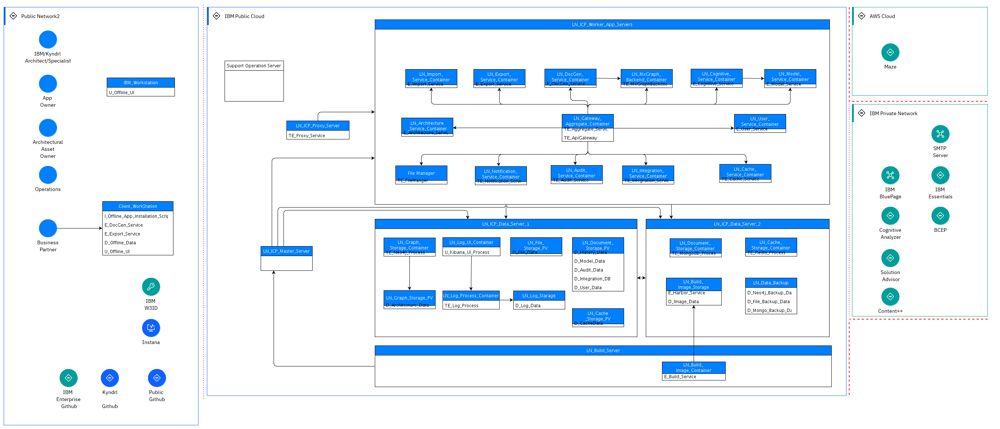

## Diagram

### Name

LOM View - In updates

### Description

### Reference(s)

## Element

[Expand all](#){ .md-button .diff-line }

### Actor

    

Maze

<table>
    <caption></caption>
    <thead>
        <tr>
            <th></th>
            <th></th>
        </tr>
    </thead>
    <tr>
        <td> <strong>Name</strong> </td>
        <td>Maze</td>
    </tr>
    <tr>
        <td> <strong>Description</strong> </td>
        <td>Cognitive Architect integrated Maze for Cloud Deployment Diagram Render and Auto Deployment</td>
    </tr>
    <tr>
        <td> <strong>Type</strong> </td>
        <td>IT System</td>
    </tr>
    <tr>
        <td> <strong>Generic Group</strong> </td>
<td>
        
</td>
    </tr>
</table>

    

BCEP

<table>
    <caption></caption>
    <thead>
        <tr>
            <th></th>
            <th></th>
        </tr>
    </thead>
    <tr>
        <td> <strong>Name</strong> </td>
        <td>BCEP</td>
    </tr>
    <tr>
        <td> <strong>Description</strong> </td>
        <td>Business Continuity Engineering Platform (BCEP) is a centralized managed engineering platform which provides tools for supporting end to end client project engagement and delivery. This platform enable different personas of the teams to deliver to clients faster, more effectively and transparently, from geo-distributed locations.</td>
    </tr>
    <tr>
        <td> <strong>Type</strong> </td>
        <td>IT System</td>
    </tr>
    <tr>
        <td> <strong>Generic Group</strong> </td>
<td>
        
</td>
    </tr>
</table>

    

SMTP Server

<table>
    <caption></caption>
    <thead>
        <tr>
            <th></th>
            <th></th>
        </tr>
    </thead>
    <tr>
        <td> <strong>Name</strong> </td>
        <td>SMTP Server</td>
    </tr>
    <tr>
        <td> <strong>Description</strong> </td>
        <td>Uses Internal SMTP Server to send email notification</td>
    </tr>
    <tr>
        <td> <strong>Type</strong> </td>
        <td>IT System</td>
    </tr>
    <tr>
        <td> <strong>Generic Group</strong> </td>
<td>
        
</td>
    </tr>
</table>

    

IBM Essentials

<table>
    <caption></caption>
    <thead>
        <tr>
            <th></th>
            <th></th>
        </tr>
    </thead>
    <tr>
        <td> <strong>Name</strong> </td>
        <td>IBM Essentials</td>
    </tr>
    <tr>
        <td> <strong>Description</strong> </td>
        <td></td>
    </tr>
    <tr>
        <td> <strong>Type</strong> </td>
        <td>IT System</td>
    </tr>
    <tr>
        <td> <strong>Generic Group</strong> </td>
<td>
        
</td>
    </tr>
</table>

    

IBM BluePage

<table>
    <caption></caption>
    <thead>
        <tr>
            <th></th>
            <th></th>
        </tr>
    </thead>
    <tr>
        <td> <strong>Name</strong> </td>
        <td>IBM BluePage</td>
    </tr>
    <tr>
        <td> <strong>Description</strong> </td>
        <td>IBM BluePage provides users profile information, including firstnName, lastName, avatar, notesId</td>
    </tr>
    <tr>
        <td> <strong>Type</strong> </td>
        <td>IT System</td>
    </tr>
    <tr>
        <td> <strong>Generic Group</strong> </td>
<td>
        
</td>
    </tr>
</table>

    

Cognitive Analyzer

<table>
    <caption></caption>
    <thead>
        <tr>
            <th></th>
            <th></th>
        </tr>
    </thead>
    <tr>
        <td> <strong>Name</strong> </td>
        <td>Cognitive Analyzer</td>
    </tr>
    <tr>
        <td> <strong>Description</strong> </td>
        <td>It analyzes RFPs and automatically and creates the solution. It integrates Cognitive Architect to provide the options to the user to modify the automatically created solution, by referencing to reference architecture and add or remove solution components. Also modify the solution to a different technology platform.</td>
    </tr>
    <tr>
        <td> <strong>Type</strong> </td>
        <td>IT System</td>
    </tr>
    <tr>
        <td> <strong>Generic Group</strong> </td>
<td>
        
</td>
    </tr>
</table>

    

Solution Advisor

<table>
    <caption></caption>
    <thead>
        <tr>
            <th></th>
            <th></th>
        </tr>
    </thead>
    <tr>
        <td> <strong>Name</strong> </td>
        <td>Solution Advisor</td>
    </tr>
    <tr>
        <td> <strong>Description</strong> </td>
        <td>Leverage solution Advisor to generate project effort estimation & plan</td>
    </tr>
    <tr>
        <td> <strong>Type</strong> </td>
        <td>IT System</td>
    </tr>
    <tr>
        <td> <strong>Generic Group</strong> </td>
<td>
        
</td>
    </tr>
</table>

    

Content++

<table>
    <caption></caption>
    <thead>
        <tr>
            <th></th>
            <th></th>
        </tr>
    </thead>
    <tr>
        <td> <strong>Name</strong> </td>
        <td>Content++</td>
    </tr>
    <tr>
        <td> <strong>Description</strong> </td>
        <td></td>
    </tr>
    <tr>
        <td> <strong>Type</strong> </td>
        <td>IT System</td>
    </tr>
    <tr>
        <td> <strong>Generic Group</strong> </td>
<td>
        
</td>
    </tr>
</table>

    

IBM/Kyndrl Architect/Specialist

<table>
    <caption></caption>
    <thead>
        <tr>
            <th></th>
            <th></th>
        </tr>
    </thead>
    <tr>
        <td> <strong>Name</strong> </td>
        <td>IBM/Kyndrl Architect/Specialist</td>
    </tr>
    <tr>
        <td> <strong>Description</strong> </td>
        <td>The user with the basic permission, like Architecture Compose, Search, Collaborate</td>
    </tr>
    <tr>
        <td> <strong>Type</strong> </td>
        <td>Human</td>
    </tr>
    <tr>
        <td> <strong>Generic Group</strong> </td>
<td>
        
</td>
    </tr>
</table>

    

App Owner

<table>
    <caption></caption>
    <thead>
        <tr>
            <th></th>
            <th></th>
        </tr>
    </thead>
    <tr>
        <td> <strong>Name</strong> </td>
        <td>App Owner</td>
    </tr>
    <tr>
        <td> <strong>Description</strong> </td>
        <td>The user who has admin permission. For example, publish architecture, grant user new role, send app In-App Notification.</td>
    </tr>
    <tr>
        <td> <strong>Type</strong> </td>
        <td>Human</td>
    </tr>
    <tr>
        <td> <strong>Generic Group</strong> </td>
<td>
        
</td>
    </tr>
</table>

    

Architectural Asset Owner

<table>
    <caption></caption>
    <thead>
        <tr>
            <th></th>
            <th></th>
        </tr>
    </thead>
    <tr>
        <td> <strong>Name</strong> </td>
        <td>Architectural Asset Owner</td>
    </tr>
    <tr>
        <td> <strong>Description</strong> </td>
        <td>The user who owns published Architecture</td>
    </tr>
    <tr>
        <td> <strong>Type</strong> </td>
        <td>Human</td>
    </tr>
    <tr>
        <td> <strong>Generic Group</strong> </td>
<td>
        
</td>
    </tr>
</table>

    

Operations

<table>
    <caption></caption>
    <thead>
        <tr>
            <th></th>
            <th></th>
        </tr>
    </thead>
    <tr>
        <td> <strong>Name</strong> </td>
        <td>Operations</td>
    </tr>
    <tr>
        <td> <strong>Description</strong> </td>
        <td>The user who maintains the system infrastructure & DevOps</td>
    </tr>
    <tr>
        <td> <strong>Type</strong> </td>
        <td>Human</td>
    </tr>
    <tr>
        <td> <strong>Generic Group</strong> </td>
<td>
        
</td>
    </tr>
</table>

    

Business Partner

<table>
    <caption></caption>
    <thead>
        <tr>
            <th></th>
            <th></th>
        </tr>
    </thead>
    <tr>
        <td> <strong>Name</strong> </td>
        <td>Business Partner</td>
    </tr>
    <tr>
        <td> <strong>Description</strong> </td>
        <td>The client facing IBMers</td>
    </tr>
    <tr>
        <td> <strong>Type</strong> </td>
        <td>Human</td>
    </tr>
    <tr>
        <td> <strong>Generic Group</strong> </td>
<td>
        
</td>
    </tr>
</table>

    

IBM W3ID

<table>
    <caption></caption>
    <thead>
        <tr>
            <th></th>
            <th></th>
        </tr>
    </thead>
    <tr>
        <td> <strong>Name</strong> </td>
        <td>IBM W3ID</td>
    </tr>
    <tr>
        <td> <strong>Description</strong> </td>
        <td>Leverage IBM W3ID for IBMer authentication</td>
    </tr>
    <tr>
        <td> <strong>Type</strong> </td>
        <td>IT System</td>
    </tr>
    <tr>
        <td> <strong>Generic Group</strong> </td>
<td>
        
</td>
    </tr>
</table>

    

Instana

<table>
    <caption></caption>
    <thead>
        <tr>
            <th></th>
            <th></th>
        </tr>
    </thead>
    <tr>
        <td> <strong>Name</strong> </td>
        <td>Instana</td>
    </tr>
    <tr>
        <td> <strong>Description</strong> </td>
        <td>Leverage Instana for Servers, Middlewares, and Applications Monitor</td>
    </tr>
    <tr>
        <td> <strong>Type</strong> </td>
        <td>IT System</td>
    </tr>
    <tr>
        <td> <strong>Generic Group</strong> </td>
<td>
        
</td>
    </tr>
</table>

    

IBM Enterprise Github

<table>
    <caption></caption>
    <thead>
        <tr>
            <th></th>
            <th></th>
        </tr>
    </thead>
    <tr>
        <td> <strong>Name</strong> </td>
        <td>IBM Enterprise Github</td>
    </tr>
    <tr>
        <td> <strong>Description</strong> </td>
        <td></td>
    </tr>
    <tr>
        <td> <strong>Type</strong> </td>
        <td>IT System</td>
    </tr>
    <tr>
        <td> <strong>Generic Group</strong> </td>
<td>
        
</td>
    </tr>
</table>

    

Kyndrl Github

<table>
    <caption></caption>
    <thead>
        <tr>
            <th></th>
            <th></th>
        </tr>
    </thead>
    <tr>
        <td> <strong>Name</strong> </td>
        <td>Kyndrl Github</td>
    </tr>
    <tr>
        <td> <strong>Description</strong> </td>
        <td></td>
    </tr>
    <tr>
        <td> <strong>Type</strong> </td>
        <td>IT System</td>
    </tr>
    <tr>
        <td> <strong>Generic Group</strong> </td>
<td>
        
</td>
    </tr>
</table>

    

Public Github

<table>
    <caption></caption>
    <thead>
        <tr>
            <th></th>
            <th></th>
        </tr>
    </thead>
    <tr>
        <td> <strong>Name</strong> </td>
        <td>Public Github</td>
    </tr>
    <tr>
        <td> <strong>Description</strong> </td>
        <td></td>
    </tr>
    <tr>
        <td> <strong>Type</strong> </td>
        <td>IT System</td>
    </tr>
    <tr>
        <td> <strong>Generic Group</strong> </td>
<td>
        
</td>
    </tr>
</table>

    

Internal Email Service

<table>
    <caption></caption>
    <thead>
        <tr>
            <th></th>
            <th></th>
        </tr>
    </thead>
    <tr>
        <td> <strong>Name</strong> </td>
        <td>Internal Email Service</td>
    </tr>
    <tr>
        <td> <strong>Description</strong> </td>
        <td>Internal Email Provider</td>
    </tr>
    <tr>
        <td> <strong>Type</strong> </td>
        <td>IT System</td>
    </tr>
    <tr>
        <td> <strong>Generic Group</strong> </td>
<td>
        
</td>
    </tr>
</table>

    

Internal IAM Service

<table>
    <caption></caption>
    <thead>
        <tr>
            <th></th>
            <th></th>
        </tr>
    </thead>
    <tr>
        <td> <strong>Name</strong> </td>
        <td>Internal IAM Service</td>
    </tr>
    <tr>
        <td> <strong>Description</strong> </td>
        <td>Based on IBM W3ID</td>
    </tr>
    <tr>
        <td> <strong>Type</strong> </td>
        <td>IT System</td>
    </tr>
    <tr>
        <td> <strong>Generic Group</strong> </td>
<td>
        
</td>
    </tr>
</table>

    

IBM Users

<table>
    <caption></caption>
    <thead>
        <tr>
            <th></th>
            <th></th>
        </tr>
    </thead>
    <tr>
        <td> <strong>Name</strong> </td>
        <td>IBM Users</td>
    </tr>
    <tr>
        <td> <strong>Description</strong> </td>
        <td>Including IBM Architects, Architectural Asset Owner, App Owner,  Operations and Administrator, Business Partners. </td>
    </tr>
    <tr>
        <td> <strong>Type</strong> </td>
        <td>Human</td>
    </tr>
    <tr>
        <td> <strong>Generic Group</strong> </td>
<td>
        
</td>
    </tr>
</table>

    

### Subsystem

### OMLocation

    

AWS Cloud

<table>
    <caption></caption>
    <thead>
        <tr>
            <th></th>
            <th></th>
        </tr>
    </thead>
    <tr>
        <td> <strong>Name</strong> </td>
        <td>AWS Cloud</td>
    </tr>
    <tr>
        <td> <strong>Description</strong> </td>
        <td></td>
    </tr>
</table>

    

IBM Private Network

<table>
    <caption></caption>
    <thead>
        <tr>
            <th></th>
            <th></th>
        </tr>
    </thead>
    <tr>
        <td> <strong>Name</strong> </td>
        <td>IBM Private Network</td>
    </tr>
    <tr>
        <td> <strong>Description</strong> </td>
        <td></td>
    </tr>
</table>

    

IBM Public Cloud

<table>
    <caption></caption>
    <thead>
        <tr>
            <th></th>
            <th></th>
        </tr>
    </thead>
    <tr>
        <td> <strong>Name</strong> </td>
        <td>IBM Public Cloud</td>
    </tr>
    <tr>
        <td> <strong>Description</strong> </td>
        <td></td>
    </tr>
</table>

    

Public Network2

<table>
    <caption></caption>
    <thead>
        <tr>
            <th></th>
            <th></th>
        </tr>
    </thead>
    <tr>
        <td> <strong>Name</strong> </td>
        <td>Public Network2</td>
    </tr>
    <tr>
        <td> <strong>Description</strong> </td>
        <td></td>
    </tr>
</table>

    

### Logical Connection

    

<table>
    <caption></caption>
    <thead>
        <tr>
            <th></th>
            <th></th>
        </tr>
    </thead>
    <tr>
        <td> <strong>Name</strong> </td>
        <td></td>
    </tr>
    <tr>
        <td> <strong>Description</strong> </td>
        <td></td>
    </tr>
</table>

    

<table>
    <caption></caption>
    <thead>
        <tr>
            <th></th>
            <th></th>
        </tr>
    </thead>
    <tr>
        <td> <strong>Name</strong> </td>
        <td></td>
    </tr>
    <tr>
        <td> <strong>Description</strong> </td>
        <td></td>
    </tr>
</table>

    

<table>
    <caption></caption>
    <thead>
        <tr>
            <th></th>
            <th></th>
        </tr>
    </thead>
    <tr>
        <td> <strong>Name</strong> </td>
        <td></td>
    </tr>
    <tr>
        <td> <strong>Description</strong> </td>
        <td></td>
    </tr>
</table>

    

<table>
    <caption></caption>
    <thead>
        <tr>
            <th></th>
            <th></th>
        </tr>
    </thead>
    <tr>
        <td> <strong>Name</strong> </td>
        <td></td>
    </tr>
    <tr>
        <td> <strong>Description</strong> </td>
        <td></td>
    </tr>
</table>

    

<table>
    <caption></caption>
    <thead>
        <tr>
            <th></th>
            <th></th>
        </tr>
    </thead>
    <tr>
        <td> <strong>Name</strong> </td>
        <td></td>
    </tr>
    <tr>
        <td> <strong>Description</strong> </td>
        <td></td>
    </tr>
</table>

    

<table>
    <caption></caption>
    <thead>
        <tr>
            <th></th>
            <th></th>
        </tr>
    </thead>
    <tr>
        <td> <strong>Name</strong> </td>
        <td></td>
    </tr>
    <tr>
        <td> <strong>Description</strong> </td>
        <td></td>
    </tr>
</table>

    

<table>
    <caption></caption>
    <thead>
        <tr>
            <th></th>
            <th></th>
        </tr>
    </thead>
    <tr>
        <td> <strong>Name</strong> </td>
        <td></td>
    </tr>
    <tr>
        <td> <strong>Description</strong> </td>
        <td></td>
    </tr>
</table>

    

<table>
    <caption></caption>
    <thead>
        <tr>
            <th></th>
            <th></th>
        </tr>
    </thead>
    <tr>
        <td> <strong>Name</strong> </td>
        <td></td>
    </tr>
    <tr>
        <td> <strong>Description</strong> </td>
        <td></td>
    </tr>
</table>

    

<table>
    <caption></caption>
    <thead>
        <tr>
            <th></th>
            <th></th>
        </tr>
    </thead>
    <tr>
        <td> <strong>Name</strong> </td>
        <td></td>
    </tr>
    <tr>
        <td> <strong>Description</strong> </td>
        <td></td>
    </tr>
</table>

    

<table>
    <caption></caption>
    <thead>
        <tr>
            <th></th>
            <th></th>
        </tr>
    </thead>
    <tr>
        <td> <strong>Name</strong> </td>
        <td></td>
    </tr>
    <tr>
        <td> <strong>Description</strong> </td>
        <td></td>
    </tr>
</table>

    

<table>
    <caption></caption>
    <thead>
        <tr>
            <th></th>
            <th></th>
        </tr>
    </thead>
    <tr>
        <td> <strong>Name</strong> </td>
        <td></td>
    </tr>
    <tr>
        <td> <strong>Description</strong> </td>
        <td></td>
    </tr>
</table>

    

<table>
    <caption></caption>
    <thead>
        <tr>
            <th></th>
            <th></th>
        </tr>
    </thead>
    <tr>
        <td> <strong>Name</strong> </td>
        <td></td>
    </tr>
    <tr>
        <td> <strong>Description</strong> </td>
        <td></td>
    </tr>
</table>

    

<table>
    <caption></caption>
    <thead>
        <tr>
            <th></th>
            <th></th>
        </tr>
    </thead>
    <tr>
        <td> <strong>Name</strong> </td>
        <td></td>
    </tr>
    <tr>
        <td> <strong>Description</strong> </td>
        <td></td>
    </tr>
</table>

    

<table>
    <caption></caption>
    <thead>
        <tr>
            <th></th>
            <th></th>
        </tr>
    </thead>
    <tr>
        <td> <strong>Name</strong> </td>
        <td></td>
    </tr>
    <tr>
        <td> <strong>Description</strong> </td>
        <td></td>
    </tr>
</table>

    

<table>
    <caption></caption>
    <thead>
        <tr>
            <th></th>
            <th></th>
        </tr>
    </thead>
    <tr>
        <td> <strong>Name</strong> </td>
        <td></td>
    </tr>
    <tr>
        <td> <strong>Description</strong> </td>
        <td></td>
    </tr>
</table>

    

<table>
    <caption></caption>
    <thead>
        <tr>
            <th></th>
            <th></th>
        </tr>
    </thead>
    <tr>
        <td> <strong>Name</strong> </td>
        <td></td>
    </tr>
    <tr>
        <td> <strong>Description</strong> </td>
        <td></td>
    </tr>
</table>

    

<table>
    <caption></caption>
    <thead>
        <tr>
            <th></th>
            <th></th>
        </tr>
    </thead>
    <tr>
        <td> <strong>Name</strong> </td>
        <td></td>
    </tr>
    <tr>
        <td> <strong>Description</strong> </td>
        <td></td>
    </tr>
</table>

    

<table>
    <caption></caption>
    <thead>
        <tr>
            <th></th>
            <th></th>
        </tr>
    </thead>
    <tr>
        <td> <strong>Name</strong> </td>
        <td></td>
    </tr>
    <tr>
        <td> <strong>Description</strong> </td>
        <td></td>
    </tr>
</table>

    

<table>
    <caption></caption>
    <thead>
        <tr>
            <th></th>
            <th></th>
        </tr>
    </thead>
    <tr>
        <td> <strong>Name</strong> </td>
        <td></td>
    </tr>
    <tr>
        <td> <strong>Description</strong> </td>
        <td></td>
    </tr>
</table>

    

<table>
    <caption></caption>
    <thead>
        <tr>
            <th></th>
            <th></th>
        </tr>
    </thead>
    <tr>
        <td> <strong>Name</strong> </td>
        <td></td>
    </tr>
    <tr>
        <td> <strong>Description</strong> </td>
        <td></td>
    </tr>
</table>

    

<table>
    <caption></caption>
    <thead>
        <tr>
            <th></th>
            <th></th>
        </tr>
    </thead>
    <tr>
        <td> <strong>Name</strong> </td>
        <td></td>
    </tr>
    <tr>
        <td> <strong>Description</strong> </td>
        <td></td>
    </tr>
</table>

    

<table>
    <caption></caption>
    <thead>
        <tr>
            <th></th>
            <th></th>
        </tr>
    </thead>
    <tr>
        <td> <strong>Name</strong> </td>
        <td></td>
    </tr>
    <tr>
        <td> <strong>Description</strong> </td>
        <td></td>
    </tr>
</table>

    

<table>
    <caption></caption>
    <thead>
        <tr>
            <th></th>
            <th></th>
        </tr>
    </thead>
    <tr>
        <td> <strong>Name</strong> </td>
        <td></td>
    </tr>
    <tr>
        <td> <strong>Description</strong> </td>
        <td></td>
    </tr>
</table>

    

<table>
    <caption></caption>
    <thead>
        <tr>
            <th></th>
            <th></th>
        </tr>
    </thead>
    <tr>
        <td> <strong>Name</strong> </td>
        <td></td>
    </tr>
    <tr>
        <td> <strong>Description</strong> </td>
        <td></td>
    </tr>
</table>

    

<table>
    <caption></caption>
    <thead>
        <tr>
            <th></th>
            <th></th>
        </tr>
    </thead>
    <tr>
        <td> <strong>Name</strong> </td>
        <td></td>
    </tr>
    <tr>
        <td> <strong>Description</strong> </td>
        <td></td>
    </tr>
</table>

    

<table>
    <caption></caption>
    <thead>
        <tr>
            <th></th>
            <th></th>
        </tr>
    </thead>
    <tr>
        <td> <strong>Name</strong> </td>
        <td></td>
    </tr>
    <tr>
        <td> <strong>Description</strong> </td>
        <td></td>
    </tr>
</table>

    

<table>
    <caption></caption>
    <thead>
        <tr>
            <th></th>
            <th></th>
        </tr>
    </thead>
    <tr>
        <td> <strong>Name</strong> </td>
        <td></td>
    </tr>
    <tr>
        <td> <strong>Description</strong> </td>
        <td></td>
    </tr>
</table>

    

<table>
    <caption></caption>
    <thead>
        <tr>
            <th></th>
            <th></th>
        </tr>
    </thead>
    <tr>
        <td> <strong>Name</strong> </td>
        <td></td>
    </tr>
    <tr>
        <td> <strong>Description</strong> </td>
        <td></td>
    </tr>
</table>

    

### Logical Node

    

LN_Architecture _Service_Container

<table>
    <caption></caption>
    <thead>
        <tr>
            <th></th>
            <th></th>
        </tr>
    </thead>
    <tr>
        <td> <strong>Name</strong> </td>
        <td>LN_Architecture _Service_Container</td>
    </tr>
    <tr>
        <td> <strong>Description</strong> </td>
        <td></td>
    </tr>
    <tr>
        <td> <strong>Type</strong> </td>
        <td></td>
    </tr>
    <tr>
        <td> <strong>Primary Capability</strong> </td>
        <td>
            
        </td>
    </tr>
    <tr>
        <td> <strong>Implementation</strong> </td>
        <td>
            
                
<a href="">Node.js</a>

            
                
<a href="">Loopback3</a>

            
        </td>
    </tr>
    <tr>
        <td> <strong>Architectural Decision</strong> </td>
        <td>
            
        </td>
    </tr>
    <tr>
        <td> <strong>Non Functional Requirement</strong> </td>
        <td>
            
        </td>
    </tr>
    <tr>
        <td> <strong>Generic Group</strong> </td>
        <td></td>
    </tr>
    <tr>
        <td> <strong>Sub-level Diagram</strong> </td>
        <td></td>
    </tr>
    <tr>
        <td> <strong>Related Diagrams</strong> </td>
        <td>
            
                
<a href="../../Logical-Operational-View/LOM View - In updates">LOM View - In updates</a>

            
        </td>
    </tr>
    <tr>
        <td> <strong>Related Elements</strong> </td>
        <td>
            
                
IBM Public Cloud

                
                    
                    <li><a href="../../Logical-Operational-View/LOM View - In updates">LOM View - In updates</a></li>
                    
                    <li><a href="../../Prescribed-Operational-View/POM View - In updates">POM View - In updates</a></li>
                    
                
            
            
                
E_Architecture_Service

                
                    
                    <li>
<a href="../../Logical-Operational-View/ITAA Operational Model - OCP">ITAA Operational Model - OCP</a>
</li>
                    
                    <li>
<a href="../../Logical-Operational-View/CA Operational Model - OCP">CA Operational Model - OCP</a>
</li>
                    
                    <li>
<a href="../../Logical-Operational-View/LOM View - In updates">LOM View - In updates</a>
</li>
                    
                    <li>
<a href="../../Services-View/Architecture Overview">Architecture Overview</a>
</li>
                    
                    <li>
<a href="../../Sequence-View/IIAA-4071: create drill down diagram flow">IIAA-4071: create drill down diagram flow</a>
</li>
                    
                    <li>
<a href="../../Sequence-View/CA authorization new scenarios">CA authorization new scenarios</a>
</li>
                    
                    <li>
<a href="../../Sequence-View/CA authorization old scenarios">CA authorization old scenarios</a>
</li>
                    
                    <li>
<a href="../../Sequence-View/Peer Review Request - Expire process">Peer Review Request - Expire process</a>
</li>
                    
                    <li>
<a href="../../Sequence-View/Auto Return Pen Flow">Auto Return Pen Flow</a>
</li>
                    
                    <li>
<a href="../../Sequence-View/ Customization Export Flow"> Customization Export Flow</a>
</li>
                    
                    <li>
<a href="../../Sequence-View/Process Flow - Train co_occurrence model">Process Flow - Train co_occurrence model</a>
</li>
                    
                    <li>
<a href="../../Sequence-View/Peer Review Request - Request process">Peer Review Request - Request process</a>
</li>
                    
                    <li>
<a href="../../Sequence-View/Process Flow - Search Architecture Assets">Process Flow - Search Architecture Assets</a>
</li>
                    
                
            
        </td>
    </tr>
    
</table>

    

LN_Audit_ Service_Container

<table>
    <caption></caption>
    <thead>
        <tr>
            <th></th>
            <th></th>
        </tr>
    </thead>
    <tr>
        <td> <strong>Name</strong> </td>
        <td>LN_Audit_ Service_Container</td>
    </tr>
    <tr>
        <td> <strong>Description</strong> </td>
        <td></td>
    </tr>
    <tr>
        <td> <strong>Type</strong> </td>
        <td></td>
    </tr>
    <tr>
        <td> <strong>Primary Capability</strong> </td>
        <td>
            
        </td>
    </tr>
    <tr>
        <td> <strong>Implementation</strong> </td>
        <td>
            
                
<a href="">Loopback4</a>

            
                
<a href="">Node.js</a>

            
        </td>
    </tr>
    <tr>
        <td> <strong>Architectural Decision</strong> </td>
        <td>
            
        </td>
    </tr>
    <tr>
        <td> <strong>Non Functional Requirement</strong> </td>
        <td>
            
        </td>
    </tr>
    <tr>
        <td> <strong>Generic Group</strong> </td>
        <td></td>
    </tr>
    <tr>
        <td> <strong>Sub-level Diagram</strong> </td>
        <td></td>
    </tr>
    <tr>
        <td> <strong>Related Diagrams</strong> </td>
        <td>
            
                
<a href="../../Logical-Operational-View/LOM View - In updates">LOM View - In updates</a>

            
        </td>
    </tr>
    <tr>
        <td> <strong>Related Elements</strong> </td>
        <td>
            
                
IBM Public Cloud

                
                    
                    <li><a href="../../Logical-Operational-View/LOM View - In updates">LOM View - In updates</a></li>
                    
                    <li><a href="../../Prescribed-Operational-View/POM View - In updates">POM View - In updates</a></li>
                    
                
            
            
                
TE_Audit_Service

                
                    
                    <li>
<a href="../../Logical-Operational-View/ITAA Operational Model - OCP">ITAA Operational Model - OCP</a>
</li>
                    
                    <li>
<a href="../../Logical-Operational-View/CA Operational Model - OCP">CA Operational Model - OCP</a>
</li>
                    
                    <li>
<a href="../../Logical-Operational-View/LOM View - In updates">LOM View - In updates</a>
</li>
                    
                    <li>
<a href="../../Services-View/Architecture Overview">Architecture Overview</a>
</li>
                    
                    <li>
<a href="../../Sequence-View/CA authorization new scenarios">CA authorization new scenarios</a>
</li>
                    
                    <li>
<a href="../../Sequence-View/CA authorization old scenarios">CA authorization old scenarios</a>
</li>
                    
                    <li>
<a href="../../Sequence-View/Auto Return Pen Flow">Auto Return Pen Flow</a>
</li>
                    
                    <li>
<a href="../../Static-View/Overall Service Interaction">Overall Service Interaction</a>
</li>
                    
                
            
        </td>
    </tr>
    
</table>

    

LN_Build_ Image_Storage

<table>
    <caption></caption>
    <thead>
        <tr>
            <th></th>
            <th></th>
        </tr>
    </thead>
    <tr>
        <td> <strong>Name</strong> </td>
        <td>LN_Build_ Image_Storage</td>
    </tr>
    <tr>
        <td> <strong>Description</strong> </td>
        <td></td>
    </tr>
    <tr>
        <td> <strong>Type</strong> </td>
        <td></td>
    </tr>
    <tr>
        <td> <strong>Primary Capability</strong> </td>
        <td>
            
        </td>
    </tr>
    <tr>
        <td> <strong>Implementation</strong> </td>
        <td>
            
        </td>
    </tr>
    <tr>
        <td> <strong>Architectural Decision</strong> </td>
        <td>
            
        </td>
    </tr>
    <tr>
        <td> <strong>Non Functional Requirement</strong> </td>
        <td>
            
        </td>
    </tr>
    <tr>
        <td> <strong>Generic Group</strong> </td>
        <td></td>
    </tr>
    <tr>
        <td> <strong>Sub-level Diagram</strong> </td>
        <td></td>
    </tr>
    <tr>
        <td> <strong>Related Diagrams</strong> </td>
        <td>
            
                
<a href="../../Logical-Operational-View/LOM View - In updates">LOM View - In updates</a>

            
        </td>
    </tr>
    <tr>
        <td> <strong>Related Elements</strong> </td>
        <td>
            
                
IBM Public Cloud

                
                    
                    <li><a href="../../Logical-Operational-View/LOM View - In updates">LOM View - In updates</a></li>
                    
                    <li><a href="../../Prescribed-Operational-View/POM View - In updates">POM View - In updates</a></li>
                    
                
            
            
                
E_Harbor_Service

                
            
                
D_Image_Data

                
            
        </td>
    </tr>
    
</table>

    

LN_Build_ Image_Container

<table>
    <caption></caption>
    <thead>
        <tr>
            <th></th>
            <th></th>
        </tr>
    </thead>
    <tr>
        <td> <strong>Name</strong> </td>
        <td>LN_Build_ Image_Container</td>
    </tr>
    <tr>
        <td> <strong>Description</strong> </td>
        <td>For Cognitive Architect, Leverage Harbor to manage build images

For IT Architect Assistant, Leverage Kubernetes Images Registry to store images</td>
    </tr>
    <tr>
        <td> <strong>Type</strong> </td>
        <td></td>
    </tr>
    <tr>
        <td> <strong>Primary Capability</strong> </td>
        <td>
            
        </td>
    </tr>
    <tr>
        <td> <strong>Implementation</strong> </td>
        <td>
            
        </td>
    </tr>
    <tr>
        <td> <strong>Architectural Decision</strong> </td>
        <td>
            
        </td>
    </tr>
    <tr>
        <td> <strong>Non Functional Requirement</strong> </td>
        <td>
            
        </td>
    </tr>
    <tr>
        <td> <strong>Generic Group</strong> </td>
        <td></td>
    </tr>
    <tr>
        <td> <strong>Sub-level Diagram</strong> </td>
        <td></td>
    </tr>
    <tr>
        <td> <strong>Related Diagrams</strong> </td>
        <td>
            
                
<a href="../../Logical-Operational-View/LOM View - In updates">LOM View - In updates</a>

            
        </td>
    </tr>
    <tr>
        <td> <strong>Related Elements</strong> </td>
        <td>
            
                
IBM Public Cloud

                
                    
                    <li><a href="../../Logical-Operational-View/LOM View - In updates">LOM View - In updates</a></li>
                    
                    <li><a href="../../Prescribed-Operational-View/POM View - In updates">POM View - In updates</a></li>
                    
                
            
            
                
E_Build_Service

                
            
        </td>
    </tr>
    
</table>

    

LN_Cache _Storage_PV

<table>
    <caption></caption>
    <thead>
        <tr>
            <th></th>
            <th></th>
        </tr>
    </thead>
    <tr>
        <td> <strong>Name</strong> </td>
        <td>LN_Cache _Storage_PV</td>
    </tr>
    <tr>
        <td> <strong>Description</strong> </td>
        <td></td>
    </tr>
    <tr>
        <td> <strong>Type</strong> </td>
        <td></td>
    </tr>
    <tr>
        <td> <strong>Primary Capability</strong> </td>
        <td>
            
        </td>
    </tr>
    <tr>
        <td> <strong>Implementation</strong> </td>
        <td>
            
                
<a href="">Redis</a>

            
        </td>
    </tr>
    <tr>
        <td> <strong>Architectural Decision</strong> </td>
        <td>
            
        </td>
    </tr>
    <tr>
        <td> <strong>Non Functional Requirement</strong> </td>
        <td>
            
        </td>
    </tr>
    <tr>
        <td> <strong>Generic Group</strong> </td>
        <td></td>
    </tr>
    <tr>
        <td> <strong>Sub-level Diagram</strong> </td>
        <td></td>
    </tr>
    <tr>
        <td> <strong>Related Diagrams</strong> </td>
        <td>
            
                
<a href="../../Logical-Operational-View/LOM View - In updates">LOM View - In updates</a>

            
        </td>
    </tr>
    <tr>
        <td> <strong>Related Elements</strong> </td>
        <td>
            
                
IBM Public Cloud

                
                    
                    <li><a href="../../Logical-Operational-View/LOM View - In updates">LOM View - In updates</a></li>
                    
                    <li><a href="../../Prescribed-Operational-View/POM View - In updates">POM View - In updates</a></li>
                    
                
            
            
                
D_CacheData

                
                    
                    <li>
<a href="../../Logical-Operational-View/LOM View - In updates">LOM View - In updates</a>
</li>
                    
                    <li>
<a href="../../Services-View/Architecture Overview">Architecture Overview</a>
</li>
                    
                    <li>
<a href="../../Sequence-View/Auto Return Pen Flow">Auto Return Pen Flow</a>
</li>
                    
                    <li>
<a href="../../Sequence-View/Process Flow - Search Architecture Assets">Process Flow - Search Architecture Assets</a>
</li>
                    
                    <li>
<a href="../../Static-View/Overall Service Interaction">Overall Service Interaction</a>
</li>
                    
                
            
        </td>
    </tr>
    
</table>

    

LN_Cache_ Service_Container

<table>
    <caption></caption>
    <thead>
        <tr>
            <th></th>
            <th></th>
        </tr>
    </thead>
    <tr>
        <td> <strong>Name</strong> </td>
        <td>LN_Cache_ Service_Container</td>
    </tr>
    <tr>
        <td> <strong>Description</strong> </td>
        <td></td>
    </tr>
    <tr>
        <td> <strong>Type</strong> </td>
        <td></td>
    </tr>
    <tr>
        <td> <strong>Primary Capability</strong> </td>
        <td>
            
        </td>
    </tr>
    <tr>
        <td> <strong>Implementation</strong> </td>
        <td>
            
                
<a href="">Redis SDK</a>

            
                
<a href="">Loopback3</a>

            
                
<a href="">Node.js</a>

            
        </td>
    </tr>
    <tr>
        <td> <strong>Architectural Decision</strong> </td>
        <td>
            
        </td>
    </tr>
    <tr>
        <td> <strong>Non Functional Requirement</strong> </td>
        <td>
            
        </td>
    </tr>
    <tr>
        <td> <strong>Generic Group</strong> </td>
        <td></td>
    </tr>
    <tr>
        <td> <strong>Sub-level Diagram</strong> </td>
        <td></td>
    </tr>
    <tr>
        <td> <strong>Related Diagrams</strong> </td>
        <td>
            
                
<a href="../../Logical-Operational-View/LOM View - In updates">LOM View - In updates</a>

            
        </td>
    </tr>
    <tr>
        <td> <strong>Related Elements</strong> </td>
        <td>
            
                
IBM Public Cloud

                
                    
                    <li><a href="../../Logical-Operational-View/LOM View - In updates">LOM View - In updates</a></li>
                    
                    <li><a href="../../Prescribed-Operational-View/POM View - In updates">POM View - In updates</a></li>
                    
                
            
            
                
TE_Cache_Service

                
                    
                    <li>
<a href="../../Logical-Operational-View/ITAA Operational Model - OCP">ITAA Operational Model - OCP</a>
</li>
                    
                    <li>
<a href="../../Logical-Operational-View/CA Operational Model - OCP">CA Operational Model - OCP</a>
</li>
                    
                    <li>
<a href="../../Logical-Operational-View/LOM View - In updates">LOM View - In updates</a>
</li>
                    
                    <li>
<a href="../../Services-View/Architecture Overview">Architecture Overview</a>
</li>
                    
                    <li>
<a href="../../Sequence-View/Process Flow - Search Architecture Assets">Process Flow - Search Architecture Assets</a>
</li>
                    
                    <li>
<a href="../../Static-View/Overall Service Interaction">Overall Service Interaction</a>
</li>
                    
                
            
        </td>
    </tr>
    
</table>

    

LN_Cache_ Storage_Container

<table>
    <caption></caption>
    <thead>
        <tr>
            <th></th>
            <th></th>
        </tr>
    </thead>
    <tr>
        <td> <strong>Name</strong> </td>
        <td>LN_Cache_ Storage_Container</td>
    </tr>
    <tr>
        <td> <strong>Description</strong> </td>
        <td></td>
    </tr>
    <tr>
        <td> <strong>Type</strong> </td>
        <td></td>
    </tr>
    <tr>
        <td> <strong>Primary Capability</strong> </td>
        <td>
            
        </td>
    </tr>
    <tr>
        <td> <strong>Implementation</strong> </td>
        <td>
            
                
<a href="">Redis</a>

            
        </td>
    </tr>
    <tr>
        <td> <strong>Architectural Decision</strong> </td>
        <td>
            
        </td>
    </tr>
    <tr>
        <td> <strong>Non Functional Requirement</strong> </td>
        <td>
            
        </td>
    </tr>
    <tr>
        <td> <strong>Generic Group</strong> </td>
        <td></td>
    </tr>
    <tr>
        <td> <strong>Sub-level Diagram</strong> </td>
        <td></td>
    </tr>
    <tr>
        <td> <strong>Related Diagrams</strong> </td>
        <td>
            
                
<a href="../../Logical-Operational-View/LOM View - In updates">LOM View - In updates</a>

            
        </td>
    </tr>
    <tr>
        <td> <strong>Related Elements</strong> </td>
        <td>
            
                
IBM Public Cloud

                
                    
                    <li><a href="../../Logical-Operational-View/LOM View - In updates">LOM View - In updates</a></li>
                    
                    <li><a href="../../Prescribed-Operational-View/POM View - In updates">POM View - In updates</a></li>
                    
                
            
            
                
TE_Redis_Process

                
                    
                    <li>
<a href="../../Logical-Operational-View/LOM View - In updates">LOM View - In updates</a>
</li>
                    
                    <li>
<a href="../../Services-View/Architecture Overview">Architecture Overview</a>
</li>
                    
                    <li>
<a href="../../Sequence-View/Auto Return Pen Flow">Auto Return Pen Flow</a>
</li>
                    
                    <li>
<a href="../../Sequence-View/Process Flow - Search Architecture Assets">Process Flow - Search Architecture Assets</a>
</li>
                    
                    <li>
<a href="../../Static-View/Overall Service Interaction">Overall Service Interaction</a>
</li>
                    
                
            
        </td>
    </tr>
    
</table>

    

LN_Cognitive_ Service_Container

<table>
    <caption></caption>
    <thead>
        <tr>
            <th></th>
            <th></th>
        </tr>
    </thead>
    <tr>
        <td> <strong>Name</strong> </td>
        <td>LN_Cognitive_ Service_Container</td>
    </tr>
    <tr>
        <td> <strong>Description</strong> </td>
        <td></td>
    </tr>
    <tr>
        <td> <strong>Type</strong> </td>
        <td></td>
    </tr>
    <tr>
        <td> <strong>Primary Capability</strong> </td>
        <td>
            
        </td>
    </tr>
    <tr>
        <td> <strong>Implementation</strong> </td>
        <td>
            
                
<a href="">Node.js</a>

            
                
<a href="">Loopback4</a>

            
        </td>
    </tr>
    <tr>
        <td> <strong>Architectural Decision</strong> </td>
        <td>
            
        </td>
    </tr>
    <tr>
        <td> <strong>Non Functional Requirement</strong> </td>
        <td>
            
        </td>
    </tr>
    <tr>
        <td> <strong>Generic Group</strong> </td>
        <td></td>
    </tr>
    <tr>
        <td> <strong>Sub-level Diagram</strong> </td>
        <td></td>
    </tr>
    <tr>
        <td> <strong>Related Diagrams</strong> </td>
        <td>
            
                
<a href="../../Logical-Operational-View/LOM View - In updates">LOM View - In updates</a>

            
        </td>
    </tr>
    <tr>
        <td> <strong>Related Elements</strong> </td>
        <td>
            
                
IBM Public Cloud

                
                    
                    <li><a href="../../Logical-Operational-View/LOM View - In updates">LOM View - In updates</a></li>
                    
                    <li><a href="../../Prescribed-Operational-View/POM View - In updates">POM View - In updates</a></li>
                    
                
            
            
                
E_Cognitive_Service

                
                    
                    <li>
<a href="../../Logical-Operational-View/LOM View - In updates">LOM View - In updates</a>
</li>
                    
                    <li>
<a href="../../Services-View/Architecture Overview">Architecture Overview</a>
</li>
                    
                    <li>
<a href="../../Sequence-View/Process Flow - Train co_occurrence model">Process Flow - Train co_occurrence model</a>
</li>
                    
                    <li>
<a href="../../Sequence-View/Process Flow - Search Architecture Assets">Process Flow - Search Architecture Assets</a>
</li>
                    
                    <li>
<a href="../../Static-View/Overall Service Interaction">Overall Service Interaction</a>
</li>
                    
                
            
        </td>
    </tr>
    
</table>

    

LN_DocGen_ Service_Container

<table>
    <caption></caption>
    <thead>
        <tr>
            <th></th>
            <th></th>
        </tr>
    </thead>
    <tr>
        <td> <strong>Name</strong> </td>
        <td>LN_DocGen_ Service_Container</td>
    </tr>
    <tr>
        <td> <strong>Description</strong> </td>
        <td></td>
    </tr>
    <tr>
        <td> <strong>Type</strong> </td>
        <td></td>
    </tr>
    <tr>
        <td> <strong>Primary Capability</strong> </td>
        <td>
            
        </td>
    </tr>
    <tr>
        <td> <strong>Implementation</strong> </td>
        <td>
            
                
<a href="">Liberty</a>

            
                
<a href="">POI</a>

            
                
<a href="">Spring Boot</a>

            
        </td>
    </tr>
    <tr>
        <td> <strong>Architectural Decision</strong> </td>
        <td>
            
        </td>
    </tr>
    <tr>
        <td> <strong>Non Functional Requirement</strong> </td>
        <td>
            
        </td>
    </tr>
    <tr>
        <td> <strong>Generic Group</strong> </td>
        <td></td>
    </tr>
    <tr>
        <td> <strong>Sub-level Diagram</strong> </td>
        <td></td>
    </tr>
    <tr>
        <td> <strong>Related Diagrams</strong> </td>
        <td>
            
                
<a href="../../Logical-Operational-View/LOM View - In updates">LOM View - In updates</a>

            
        </td>
    </tr>
    <tr>
        <td> <strong>Related Elements</strong> </td>
        <td>
            
                
IBM Public Cloud

                
                    
                    <li><a href="../../Logical-Operational-View/LOM View - In updates">LOM View - In updates</a></li>
                    
                    <li><a href="../../Prescribed-Operational-View/POM View - In updates">POM View - In updates</a></li>
                    
                
            
            
                
E_DocGen_Service

                
                    
                    <li>
<a href="../../Prescribed-Operational-View/POM View - In updates">POM View - In updates</a>
</li>
                    
                    <li>
<a href="../../Logical-Operational-View/ITAA Operational Model - OCP">ITAA Operational Model - OCP</a>
</li>
                    
                    <li>
<a href="../../Logical-Operational-View/CA Operational Model - OCP">CA Operational Model - OCP</a>
</li>
                    
                    <li>
<a href="../../Logical-Operational-View/LOM View - In updates">LOM View - In updates</a>
</li>
                    
                    <li>
<a href="../../Services-View/Architecture Overview">Architecture Overview</a>
</li>
                    
                    <li>
<a href="../../Sequence-View/ Customization Export Flow"> Customization Export Flow</a>
</li>
                    
                    <li>
<a href="../../Static-View/Overall Service Interaction">Overall Service Interaction</a>
</li>
                    
                
            
        </td>
    </tr>
    
</table>

    

LN_Document_ Storage_Container

<table>
    <caption></caption>
    <thead>
        <tr>
            <th></th>
            <th></th>
        </tr>
    </thead>
    <tr>
        <td> <strong>Name</strong> </td>
        <td>LN_Document_ Storage_Container</td>
    </tr>
    <tr>
        <td> <strong>Description</strong> </td>
        <td></td>
    </tr>
    <tr>
        <td> <strong>Type</strong> </td>
        <td></td>
    </tr>
    <tr>
        <td> <strong>Primary Capability</strong> </td>
        <td>
            
        </td>
    </tr>
    <tr>
        <td> <strong>Implementation</strong> </td>
        <td>
            
                
<a href="vdvdvd">MongoDB</a>

            
        </td>
    </tr>
    <tr>
        <td> <strong>Architectural Decision</strong> </td>
        <td>
            
        </td>
    </tr>
    <tr>
        <td> <strong>Non Functional Requirement</strong> </td>
        <td>
            
        </td>
    </tr>
    <tr>
        <td> <strong>Generic Group</strong> </td>
        <td></td>
    </tr>
    <tr>
        <td> <strong>Sub-level Diagram</strong> </td>
        <td></td>
    </tr>
    <tr>
        <td> <strong>Related Diagrams</strong> </td>
        <td>
            
                
<a href="../../Logical-Operational-View/LOM View - In updates">LOM View - In updates</a>

            
        </td>
    </tr>
    <tr>
        <td> <strong>Related Elements</strong> </td>
        <td>
            
                
IBM Public Cloud

                
                    
                    <li><a href="../../Logical-Operational-View/LOM View - In updates">LOM View - In updates</a></li>
                    
                    <li><a href="../../Prescribed-Operational-View/POM View - In updates">POM View - In updates</a></li>
                    
                
            
            
                
TE_Mongodb_Process

                
                    
                    <li>
<a href="../../Logical-Operational-View/LOM View - In updates">LOM View - In updates</a>
</li>
                    
                    <li>
<a href="../../Services-View/Architecture Overview">Architecture Overview</a>
</li>
                    
                    <li>
<a href="../../Static-View/Overall Service Interaction">Overall Service Interaction</a>
</li>
                    
                
            
        </td>
    </tr>
    
</table>

    

LN_Document_ Storage_PV

<table>
    <caption></caption>
    <thead>
        <tr>
            <th></th>
            <th></th>
        </tr>
    </thead>
    <tr>
        <td> <strong>Name</strong> </td>
        <td>LN_Document_ Storage_PV</td>
    </tr>
    <tr>
        <td> <strong>Description</strong> </td>
        <td></td>
    </tr>
    <tr>
        <td> <strong>Type</strong> </td>
        <td></td>
    </tr>
    <tr>
        <td> <strong>Primary Capability</strong> </td>
        <td>
            
        </td>
    </tr>
    <tr>
        <td> <strong>Implementation</strong> </td>
        <td>
            
                
<a href="vdvdvd">MongoDB</a>

            
        </td>
    </tr>
    <tr>
        <td> <strong>Architectural Decision</strong> </td>
        <td>
            
        </td>
    </tr>
    <tr>
        <td> <strong>Non Functional Requirement</strong> </td>
        <td>
            
        </td>
    </tr>
    <tr>
        <td> <strong>Generic Group</strong> </td>
        <td></td>
    </tr>
    <tr>
        <td> <strong>Sub-level Diagram</strong> </td>
        <td></td>
    </tr>
    <tr>
        <td> <strong>Related Diagrams</strong> </td>
        <td>
            
                
<a href="../../Logical-Operational-View/LOM View - In updates">LOM View - In updates</a>

            
        </td>
    </tr>
    <tr>
        <td> <strong>Related Elements</strong> </td>
        <td>
            
                
IBM Public Cloud

                
                    
                    <li><a href="../../Logical-Operational-View/LOM View - In updates">LOM View - In updates</a></li>
                    
                    <li><a href="../../Prescribed-Operational-View/POM View - In updates">POM View - In updates</a></li>
                    
                
            
            
                
D_Model_Data

                
                    
                    <li>
<a href="../../Logical-Operational-View/LOM View - In updates">LOM View - In updates</a>
</li>
                    
                    <li>
<a href="../../Services-View/Architecture Overview">Architecture Overview</a>
</li>
                    
                    <li>
<a href="../../Static-View/Overall Service Interaction">Overall Service Interaction</a>
</li>
                    
                
            
                
D_User_Data

                
                    
                    <li>
<a href="../../Logical-Operational-View/LOM View - In updates">LOM View - In updates</a>
</li>
                    
                    <li>
<a href="../../Services-View/Architecture Overview">Architecture Overview</a>
</li>
                    
                    <li>
<a href="../../Static-View/Overall Service Interaction">Overall Service Interaction</a>
</li>
                    
                
            
                
D_History_Data

                
                    
                    <li>
<a href="../../Logical-Operational-View/LOM View - In updates">LOM View - In updates</a>
</li>
                    
                    <li>
<a href="../../Services-View/Architecture Overview">Architecture Overview</a>
</li>
                    
                    <li>
<a href="../../Static-View/Overall Service Interaction">Overall Service Interaction</a>
</li>
                    
                
            
                
D_Audit_Data

                
                    
                    <li>
<a href="../../Logical-Operational-View/LOM View - In updates">LOM View - In updates</a>
</li>
                    
                    <li>
<a href="../../Services-View/Architecture Overview">Architecture Overview</a>
</li>
                    
                    <li>
<a href="../../Static-View/Overall Service Interaction">Overall Service Interaction</a>
</li>
                    
                
            
                
D_Integration_DB

                
                    
                    <li>
<a href="../../Logical-Operational-View/LOM View - In updates">LOM View - In updates</a>
</li>
                    
                    <li>
<a href="../../Services-View/Architecture Overview">Architecture Overview</a>
</li>
                    
                    <li>
<a href="../../Static-View/Overall Service Interaction">Overall Service Interaction</a>
</li>
                    
                
            
        </td>
    </tr>
    
</table>

    

LN_Export_ Service_Container

<table>
    <caption></caption>
    <thead>
        <tr>
            <th></th>
            <th></th>
        </tr>
    </thead>
    <tr>
        <td> <strong>Name</strong> </td>
        <td>LN_Export_ Service_Container</td>
    </tr>
    <tr>
        <td> <strong>Description</strong> </td>
        <td></td>
    </tr>
    <tr>
        <td> <strong>Type</strong> </td>
        <td></td>
    </tr>
    <tr>
        <td> <strong>Primary Capability</strong> </td>
        <td>
            
        </td>
    </tr>
    <tr>
        <td> <strong>Implementation</strong> </td>
        <td>
            
                
<a href="">Loopback3</a>

            
                
<a href="">Node.js</a>

            
        </td>
    </tr>
    <tr>
        <td> <strong>Architectural Decision</strong> </td>
        <td>
            
        </td>
    </tr>
    <tr>
        <td> <strong>Non Functional Requirement</strong> </td>
        <td>
            
        </td>
    </tr>
    <tr>
        <td> <strong>Generic Group</strong> </td>
        <td></td>
    </tr>
    <tr>
        <td> <strong>Sub-level Diagram</strong> </td>
        <td></td>
    </tr>
    <tr>
        <td> <strong>Related Diagrams</strong> </td>
        <td>
            
                
<a href="../../Logical-Operational-View/LOM View - In updates">LOM View - In updates</a>

            
        </td>
    </tr>
    <tr>
        <td> <strong>Related Elements</strong> </td>
        <td>
            
                
IBM Public Cloud

                
                    
                    <li><a href="../../Logical-Operational-View/LOM View - In updates">LOM View - In updates</a></li>
                    
                    <li><a href="../../Prescribed-Operational-View/POM View - In updates">POM View - In updates</a></li>
                    
                
            
            
                
E_Export_Service

                
                    
                    <li>
<a href="../../Prescribed-Operational-View/POM View - In updates">POM View - In updates</a>
</li>
                    
                    <li>
<a href="../../Logical-Operational-View/ITAA Operational Model - OCP">ITAA Operational Model - OCP</a>
</li>
                    
                    <li>
<a href="../../Logical-Operational-View/CA Operational Model - OCP">CA Operational Model - OCP</a>
</li>
                    
                    <li>
<a href="../../Logical-Operational-View/LOM View - In updates">LOM View - In updates</a>
</li>
                    
                    <li>
<a href="../../Services-View/Architecture Overview">Architecture Overview</a>
</li>
                    
                    <li>
<a href="../../Static-View/Overall Service Interaction">Overall Service Interaction</a>
</li>
                    
                
            
        </td>
    </tr>
    
</table>

    

LN_File_ Storage_PV

<table>
    <caption></caption>
    <thead>
        <tr>
            <th></th>
            <th></th>
        </tr>
    </thead>
    <tr>
        <td> <strong>Name</strong> </td>
        <td>LN_File_ Storage_PV</td>
    </tr>
    <tr>
        <td> <strong>Description</strong> </td>
        <td></td>
    </tr>
    <tr>
        <td> <strong>Type</strong> </td>
        <td></td>
    </tr>
    <tr>
        <td> <strong>Primary Capability</strong> </td>
        <td>
            
        </td>
    </tr>
    <tr>
        <td> <strong>Implementation</strong> </td>
        <td>
            
                
<a href="">File System</a>

            
        </td>
    </tr>
    <tr>
        <td> <strong>Architectural Decision</strong> </td>
        <td>
            
        </td>
    </tr>
    <tr>
        <td> <strong>Non Functional Requirement</strong> </td>
        <td>
            
        </td>
    </tr>
    <tr>
        <td> <strong>Generic Group</strong> </td>
        <td></td>
    </tr>
    <tr>
        <td> <strong>Sub-level Diagram</strong> </td>
        <td></td>
    </tr>
    <tr>
        <td> <strong>Related Diagrams</strong> </td>
        <td>
            
                
<a href="../../Logical-Operational-View/LOM View - In updates">LOM View - In updates</a>

            
        </td>
    </tr>
    <tr>
        <td> <strong>Related Elements</strong> </td>
        <td>
            
                
IBM Public Cloud

                
                    
                    <li><a href="../../Logical-Operational-View/LOM View - In updates">LOM View - In updates</a></li>
                    
                    <li><a href="../../Prescribed-Operational-View/POM View - In updates">POM View - In updates</a></li>
                    
                
            
            
                
D_File_Data

                
                    
                    <li>
<a href="../../Logical-Operational-View/LOM View - In updates">LOM View - In updates</a>
</li>
                    
                    <li>
<a href="../../Services-View/Architecture Overview">Architecture Overview</a>
</li>
                    
                    <li>
<a href="../../Static-View/Overall Service Interaction">Overall Service Interaction</a>
</li>
                    
                
            
        </td>
    </tr>
    
</table>

    

LN_Gateway_ Aggregate_Container

<table>
    <caption></caption>
    <thead>
        <tr>
            <th></th>
            <th></th>
        </tr>
    </thead>
    <tr>
        <td> <strong>Name</strong> </td>
        <td>LN_Gateway_ Aggregate_Container</td>
    </tr>
    <tr>
        <td> <strong>Description</strong> </td>
        <td></td>
    </tr>
    <tr>
        <td> <strong>Type</strong> </td>
        <td></td>
    </tr>
    <tr>
        <td> <strong>Primary Capability</strong> </td>
        <td>
            
        </td>
    </tr>
    <tr>
        <td> <strong>Implementation</strong> </td>
        <td>
            
                
<a href="">Node.js</a>

            
                
<a href="">Loopback3</a>

            
                
<a href="">Express Gateway</a>

            
        </td>
    </tr>
    <tr>
        <td> <strong>Architectural Decision</strong> </td>
        <td>
            
        </td>
    </tr>
    <tr>
        <td> <strong>Non Functional Requirement</strong> </td>
        <td>
            
        </td>
    </tr>
    <tr>
        <td> <strong>Generic Group</strong> </td>
        <td></td>
    </tr>
    <tr>
        <td> <strong>Sub-level Diagram</strong> </td>
        <td></td>
    </tr>
    <tr>
        <td> <strong>Related Diagrams</strong> </td>
        <td>
            
                
<a href="../../Logical-Operational-View/LOM View - In updates">LOM View - In updates</a>

            
        </td>
    </tr>
    <tr>
        <td> <strong>Related Elements</strong> </td>
        <td>
            
                
IBM Public Cloud

                
                    
                    <li><a href="../../Logical-Operational-View/LOM View - In updates">LOM View - In updates</a></li>
                    
                    <li><a href="../../Prescribed-Operational-View/POM View - In updates">POM View - In updates</a></li>
                    
                
            
            
                
TE_ApiGateway

                
                    
                    <li>
<a href="../../Logical-Operational-View/LOM View - In updates">LOM View - In updates</a>
</li>
                    
                    <li>
<a href="../../Services-View/Architecture Overview">Architecture Overview</a>
</li>
                    
                    <li>
<a href="../../Sequence-View/CA authorization new scenarios">CA authorization new scenarios</a>
</li>
                    
                    <li>
<a href="../../Sequence-View/CA authorization old scenarios">CA authorization old scenarios</a>
</li>
                    
                    <li>
<a href="../../Sequence-View/User Login & Session Mgt Process">User Login & Session Mgt Process</a>
</li>
                    
                    <li>
<a href="../../Sequence-View/Process Flow - Integration With CAST/BCEP">Process Flow - Integration With CAST/BCEP</a>
</li>
                    
                    <li>
<a href="../../Sequence-View/Process Flow - Train co_occurrence model">Process Flow - Train co_occurrence model</a>
</li>
                    
                    <li>
<a href="../../Sequence-View/3-rd Integration Login flow">3-rd Integration Login flow</a>
</li>
                    
                    <li>
<a href="../../Sequence-View/Process Flow - Search Architecture Assets">Process Flow - Search Architecture Assets</a>
</li>
                    
                    <li>
<a href="../../Static-View/Overall Service Interaction">Overall Service Interaction</a>
</li>
                    
                    <li>
<a href="../../Static-View/3-rd Party Service Interaction">3-rd Party Service Interaction</a>
</li>
                    
                
            
                
TE_Aggregate_Service

                
                    
                    <li>
<a href="../../Logical-Operational-View/LOM View - In updates">LOM View - In updates</a>
</li>
                    
                    <li>
<a href="../../Services-View/Architecture Overview">Architecture Overview</a>
</li>
                    
                    <li>
<a href="../../Sequence-View/Process Flow - Data Privacy Compliance - Withdrawal of Consent">Process Flow - Data Privacy Compliance - Withdrawal of Consent</a>
</li>
                    
                    <li>
<a href="../../Sequence-View/Process Flow - Integration With CAST/BCEP">Process Flow - Integration With CAST/BCEP</a>
</li>
                    
                    <li>
<a href="../../Sequence-View/Peer Review Request - Expire process">Peer Review Request - Expire process</a>
</li>
                    
                    <li>
<a href="../../Sequence-View/Auto Return Pen Flow">Auto Return Pen Flow</a>
</li>
                    
                    <li>
<a href="../../Sequence-View/ Customization Export Flow"> Customization Export Flow</a>
</li>
                    
                    <li>
<a href="../../Sequence-View/Solution Advisor Integration - Update Opportunity">Solution Advisor Integration - Update Opportunity</a>
</li>
                    
                    <li>
<a href="../../Sequence-View/Process Flow - Train co_occurrence model">Process Flow - Train co_occurrence model</a>
</li>
                    
                    <li>
<a href="../../Sequence-View/ Process Flow - Data Privacy Compliance - Access Renewal"> Process Flow - Data Privacy Compliance - Access Renewal</a>
</li>
                    
                    <li>
<a href="../../Sequence-View/Peer Review Request - Request process">Peer Review Request - Request process</a>
</li>
                    
                    <li>
<a href="../../Sequence-View/Process Flow - Search Architecture Assets">Process Flow - Search Architecture Assets</a>
</li>
                    
                    <li>
<a href="../../Static-View/CA and Maze Integration">CA and Maze Integration</a>
</li>
                    
                    <li>
<a href="../../Static-View/Overall Service Interaction">Overall Service Interaction</a>
</li>
                    
                
            
        </td>
    </tr>
    
</table>

    

LN_Graph_ Storage_Container

<table>
    <caption></caption>
    <thead>
        <tr>
            <th></th>
            <th></th>
        </tr>
    </thead>
    <tr>
        <td> <strong>Name</strong> </td>
        <td>LN_Graph_ Storage_Container</td>
    </tr>
    <tr>
        <td> <strong>Description</strong> </td>
        <td></td>
    </tr>
    <tr>
        <td> <strong>Type</strong> </td>
        <td></td>
    </tr>
    <tr>
        <td> <strong>Primary Capability</strong> </td>
        <td>
            
        </td>
    </tr>
    <tr>
        <td> <strong>Implementation</strong> </td>
        <td>
            
                
<a href="">Neo4j</a>

            
        </td>
    </tr>
    <tr>
        <td> <strong>Architectural Decision</strong> </td>
        <td>
            
        </td>
    </tr>
    <tr>
        <td> <strong>Non Functional Requirement</strong> </td>
        <td>
            
        </td>
    </tr>
    <tr>
        <td> <strong>Generic Group</strong> </td>
        <td></td>
    </tr>
    <tr>
        <td> <strong>Sub-level Diagram</strong> </td>
        <td></td>
    </tr>
    <tr>
        <td> <strong>Related Diagrams</strong> </td>
        <td>
            
                
<a href="../../Logical-Operational-View/LOM View - In updates">LOM View - In updates</a>

            
        </td>
    </tr>
    <tr>
        <td> <strong>Related Elements</strong> </td>
        <td>
            
                
IBM Public Cloud

                
                    
                    <li><a href="../../Logical-Operational-View/LOM View - In updates">LOM View - In updates</a></li>
                    
                    <li><a href="../../Prescribed-Operational-View/POM View - In updates">POM View - In updates</a></li>
                    
                
            
            
                
TE_Neo4j_Process

                
                    
                    <li>
<a href="../../Logical-Operational-View/LOM View - In updates">LOM View - In updates</a>
</li>
                    
                    <li>
<a href="../../Services-View/Architecture Overview">Architecture Overview</a>
</li>
                    
                    <li>
<a href="../../Static-View/Overall Service Interaction">Overall Service Interaction</a>
</li>
                    
                
            
        </td>
    </tr>
    
</table>

    

LN_Import_ Service_Container

<table>
    <caption></caption>
    <thead>
        <tr>
            <th></th>
            <th></th>
        </tr>
    </thead>
    <tr>
        <td> <strong>Name</strong> </td>
        <td>LN_Import_ Service_Container</td>
    </tr>
    <tr>
        <td> <strong>Description</strong> </td>
        <td></td>
    </tr>
    <tr>
        <td> <strong>Type</strong> </td>
        <td></td>
    </tr>
    <tr>
        <td> <strong>Primary Capability</strong> </td>
        <td>
            
        </td>
    </tr>
    <tr>
        <td> <strong>Implementation</strong> </td>
        <td>
            
                
<a href="">Node.js</a>

            
                
<a href="">Loopback3</a>

            
        </td>
    </tr>
    <tr>
        <td> <strong>Architectural Decision</strong> </td>
        <td>
            
        </td>
    </tr>
    <tr>
        <td> <strong>Non Functional Requirement</strong> </td>
        <td>
            
        </td>
    </tr>
    <tr>
        <td> <strong>Generic Group</strong> </td>
        <td></td>
    </tr>
    <tr>
        <td> <strong>Sub-level Diagram</strong> </td>
        <td></td>
    </tr>
    <tr>
        <td> <strong>Related Diagrams</strong> </td>
        <td>
            
                
<a href="../../Logical-Operational-View/LOM View - In updates">LOM View - In updates</a>

            
        </td>
    </tr>
    <tr>
        <td> <strong>Related Elements</strong> </td>
        <td>
            
                
IBM Public Cloud

                
                    
                    <li><a href="../../Logical-Operational-View/LOM View - In updates">LOM View - In updates</a></li>
                    
                    <li><a href="../../Prescribed-Operational-View/POM View - In updates">POM View - In updates</a></li>
                    
                
            
            
                
E_Import_Service

                
                    
                    <li>
<a href="../../Logical-Operational-View/ITAA Operational Model - OCP">ITAA Operational Model - OCP</a>
</li>
                    
                    <li>
<a href="../../Logical-Operational-View/CA Operational Model - OCP">CA Operational Model - OCP</a>
</li>
                    
                    <li>
<a href="../../Logical-Operational-View/LOM View - In updates">LOM View - In updates</a>
</li>
                    
                    <li>
<a href="../../Services-View/Architecture Overview">Architecture Overview</a>
</li>
                    
                    <li>
<a href="../../Static-View/Overall Service Interaction">Overall Service Interaction</a>
</li>
                    
                
            
        </td>
    </tr>
    
</table>

    

LN_Integration_ Service_Container

<table>
    <caption></caption>
    <thead>
        <tr>
            <th></th>
            <th></th>
        </tr>
    </thead>
    <tr>
        <td> <strong>Name</strong> </td>
        <td>LN_Integration_ Service_Container</td>
    </tr>
    <tr>
        <td> <strong>Description</strong> </td>
        <td></td>
    </tr>
    <tr>
        <td> <strong>Type</strong> </td>
        <td></td>
    </tr>
    <tr>
        <td> <strong>Primary Capability</strong> </td>
        <td>
            
        </td>
    </tr>
    <tr>
        <td> <strong>Implementation</strong> </td>
        <td>
            
                
<a href="">Loopback4</a>

            
                
<a href="">Node.js</a>

            
        </td>
    </tr>
    <tr>
        <td> <strong>Architectural Decision</strong> </td>
        <td>
            
        </td>
    </tr>
    <tr>
        <td> <strong>Non Functional Requirement</strong> </td>
        <td>
            
        </td>
    </tr>
    <tr>
        <td> <strong>Generic Group</strong> </td>
        <td></td>
    </tr>
    <tr>
        <td> <strong>Sub-level Diagram</strong> </td>
        <td></td>
    </tr>
    <tr>
        <td> <strong>Related Diagrams</strong> </td>
        <td>
            
                
<a href="../../Logical-Operational-View/LOM View - In updates">LOM View - In updates</a>

            
        </td>
    </tr>
    <tr>
        <td> <strong>Related Elements</strong> </td>
        <td>
            
                
IBM Public Cloud

                
                    
                    <li><a href="../../Logical-Operational-View/LOM View - In updates">LOM View - In updates</a></li>
                    
                    <li><a href="../../Prescribed-Operational-View/POM View - In updates">POM View - In updates</a></li>
                    
                
            
            
                
TE_Integration_Service

                
                    
                    <li>
<a href="../../Logical-Operational-View/ITAA Operational Model - OCP">ITAA Operational Model - OCP</a>
</li>
                    
                    <li>
<a href="../../Logical-Operational-View/CA Operational Model - OCP">CA Operational Model - OCP</a>
</li>
                    
                    <li>
<a href="../../Logical-Operational-View/LOM View - In updates">LOM View - In updates</a>
</li>
                    
                    <li>
<a href="../../Services-View/Architecture Overview">Architecture Overview</a>
</li>
                    
                    <li>
<a href="../../Sequence-View/Solution Advisor Integration - Update Opportunity">Solution Advisor Integration - Update Opportunity</a>
</li>
                    
                    <li>
<a href="../../Static-View/CA and Maze Integration">CA and Maze Integration</a>
</li>
                    
                    <li>
<a href="../../Static-View/Overall Service Interaction">Overall Service Interaction</a>
</li>
                    
                    <li>
<a href="../../Static-View/3-rd Party Service Interaction">3-rd Party Service Interaction</a>
</li>
                    
                
            
        </td>
    </tr>
    
</table>

    

LN_Model_ Service_Container

<table>
    <caption></caption>
    <thead>
        <tr>
            <th></th>
            <th></th>
        </tr>
    </thead>
    <tr>
        <td> <strong>Name</strong> </td>
        <td>LN_Model_ Service_Container</td>
    </tr>
    <tr>
        <td> <strong>Description</strong> </td>
        <td></td>
    </tr>
    <tr>
        <td> <strong>Type</strong> </td>
        <td></td>
    </tr>
    <tr>
        <td> <strong>Primary Capability</strong> </td>
        <td>
            
        </td>
    </tr>
    <tr>
        <td> <strong>Implementation</strong> </td>
        <td>
            
                
<a href="">Python</a>

            
        </td>
    </tr>
    <tr>
        <td> <strong>Architectural Decision</strong> </td>
        <td>
            
        </td>
    </tr>
    <tr>
        <td> <strong>Non Functional Requirement</strong> </td>
        <td>
            
        </td>
    </tr>
    <tr>
        <td> <strong>Generic Group</strong> </td>
        <td></td>
    </tr>
    <tr>
        <td> <strong>Sub-level Diagram</strong> </td>
        <td></td>
    </tr>
    <tr>
        <td> <strong>Related Diagrams</strong> </td>
        <td>
            
                
<a href="../../Logical-Operational-View/LOM View - In updates">LOM View - In updates</a>

            
        </td>
    </tr>
    <tr>
        <td> <strong>Related Elements</strong> </td>
        <td>
            
                
IBM Public Cloud

                
                    
                    <li><a href="../../Logical-Operational-View/LOM View - In updates">LOM View - In updates</a></li>
                    
                    <li><a href="../../Prescribed-Operational-View/POM View - In updates">POM View - In updates</a></li>
                    
                
            
            
                
E_Model_Service

                
                    
                    <li>
<a href="../../Logical-Operational-View/ITAA Operational Model - OCP">ITAA Operational Model - OCP</a>
</li>
                    
                    <li>
<a href="../../Logical-Operational-View/CA Operational Model - OCP">CA Operational Model - OCP</a>
</li>
                    
                    <li>
<a href="../../Logical-Operational-View/LOM View - In updates">LOM View - In updates</a>
</li>
                    
                    <li>
<a href="../../Services-View/Architecture Overview">Architecture Overview</a>
</li>
                    
                    <li>
<a href="../../Sequence-View/Process Flow - Train co_occurrence model">Process Flow - Train co_occurrence model</a>
</li>
                    
                    <li>
<a href="../../Sequence-View/Process Flow - Search Architecture Assets">Process Flow - Search Architecture Assets</a>
</li>
                    
                    <li>
<a href="../../Static-View/Overall Service Interaction">Overall Service Interaction</a>
</li>
                    
                
            
        </td>
    </tr>
    
</table>

    

LN_MxGraph_ Backend_Container

<table>
    <caption></caption>
    <thead>
        <tr>
            <th></th>
            <th></th>
        </tr>
    </thead>
    <tr>
        <td> <strong>Name</strong> </td>
        <td>LN_MxGraph_ Backend_Container</td>
    </tr>
    <tr>
        <td> <strong>Description</strong> </td>
        <td></td>
    </tr>
    <tr>
        <td> <strong>Type</strong> </td>
        <td></td>
    </tr>
    <tr>
        <td> <strong>Primary Capability</strong> </td>
        <td>
            
        </td>
    </tr>
    <tr>
        <td> <strong>Implementation</strong> </td>
        <td>
            
                
<a href="">MxGraph</a>

            
                
<a href="">Spring Boot</a>

            
                
<a href="">Liberty</a>

            
        </td>
    </tr>
    <tr>
        <td> <strong>Architectural Decision</strong> </td>
        <td>
            
        </td>
    </tr>
    <tr>
        <td> <strong>Non Functional Requirement</strong> </td>
        <td>
            
        </td>
    </tr>
    <tr>
        <td> <strong>Generic Group</strong> </td>
        <td></td>
    </tr>
    <tr>
        <td> <strong>Sub-level Diagram</strong> </td>
        <td></td>
    </tr>
    <tr>
        <td> <strong>Related Diagrams</strong> </td>
        <td>
            
                
<a href="../../Logical-Operational-View/LOM View - In updates">LOM View - In updates</a>

            
        </td>
    </tr>
    <tr>
        <td> <strong>Related Elements</strong> </td>
        <td>
            
                
IBM Public Cloud

                
                    
                    <li><a href="../../Logical-Operational-View/LOM View - In updates">LOM View - In updates</a></li>
                    
                    <li><a href="../../Prescribed-Operational-View/POM View - In updates">POM View - In updates</a></li>
                    
                
            
            
                
TE_MxGraphBackend_Service

                
                    
                    <li>
<a href="../../Logical-Operational-View/LOM View - In updates">LOM View - In updates</a>
</li>
                    
                    <li>
<a href="../../Services-View/Architecture Overview">Architecture Overview</a>
</li>
                    
                    <li>
<a href="../../Sequence-View/ Customization Export Flow"> Customization Export Flow</a>
</li>
                    
                
            
        </td>
    </tr>
    
</table>

    

LN_Notification_ Service_Container

<table>
    <caption></caption>
    <thead>
        <tr>
            <th></th>
            <th></th>
        </tr>
    </thead>
    <tr>
        <td> <strong>Name</strong> </td>
        <td>LN_Notification_ Service_Container</td>
    </tr>
    <tr>
        <td> <strong>Description</strong> </td>
        <td></td>
    </tr>
    <tr>
        <td> <strong>Type</strong> </td>
        <td></td>
    </tr>
    <tr>
        <td> <strong>Primary Capability</strong> </td>
        <td>
            
        </td>
    </tr>
    <tr>
        <td> <strong>Implementation</strong> </td>
        <td>
            
                
<a href="">Loopback4</a>

            
                
<a href="">Node.js</a>

            
                
<a href="">Redis Pub/Sub APIs</a>

            
        </td>
    </tr>
    <tr>
        <td> <strong>Architectural Decision</strong> </td>
        <td>
            
        </td>
    </tr>
    <tr>
        <td> <strong>Non Functional Requirement</strong> </td>
        <td>
            
        </td>
    </tr>
    <tr>
        <td> <strong>Generic Group</strong> </td>
        <td></td>
    </tr>
    <tr>
        <td> <strong>Sub-level Diagram</strong> </td>
        <td></td>
    </tr>
    <tr>
        <td> <strong>Related Diagrams</strong> </td>
        <td>
            
                
<a href="../../Logical-Operational-View/LOM View - In updates">LOM View - In updates</a>

            
        </td>
    </tr>
    <tr>
        <td> <strong>Related Elements</strong> </td>
        <td>
            
                
IBM Public Cloud

                
                    
                    <li><a href="../../Logical-Operational-View/LOM View - In updates">LOM View - In updates</a></li>
                    
                    <li><a href="../../Prescribed-Operational-View/POM View - In updates">POM View - In updates</a></li>
                    
                
            
            
                
TE_Notification_Service

                
                    
                    <li>
<a href="../../Logical-Operational-View/ITAA Operational Model - OCP">ITAA Operational Model - OCP</a>
</li>
                    
                    <li>
<a href="../../Logical-Operational-View/CA Operational Model - OCP">CA Operational Model - OCP</a>
</li>
                    
                    <li>
<a href="../../Logical-Operational-View/LOM View - In updates">LOM View - In updates</a>
</li>
                    
                    <li>
<a href="../../Services-View/Architecture Overview">Architecture Overview</a>
</li>
                    
                    <li>
<a href="../../Sequence-View/Peer Review Request - Expire process">Peer Review Request - Expire process</a>
</li>
                    
                    <li>
<a href="../../Sequence-View/Auto Return Pen Flow">Auto Return Pen Flow</a>
</li>
                    
                    <li>
<a href="../../Sequence-View/Process Flow - Train co_occurrence model">Process Flow - Train co_occurrence model</a>
</li>
                    
                    <li>
<a href="../../Sequence-View/Peer Review Request - Request process">Peer Review Request - Request process</a>
</li>
                    
                    <li>
<a href="../../Static-View/Overall Service Interaction">Overall Service Interaction</a>
</li>
                    
                    <li>
<a href="../../Static-View/3-rd Party Service Interaction">3-rd Party Service Interaction</a>
</li>
                    
                
            
        </td>
    </tr>
    
</table>

    

LN_User_ Service_Container

<table>
    <caption></caption>
    <thead>
        <tr>
            <th></th>
            <th></th>
        </tr>
    </thead>
    <tr>
        <td> <strong>Name</strong> </td>
        <td>LN_User_ Service_Container</td>
    </tr>
    <tr>
        <td> <strong>Description</strong> </td>
        <td></td>
    </tr>
    <tr>
        <td> <strong>Type</strong> </td>
        <td></td>
    </tr>
    <tr>
        <td> <strong>Primary Capability</strong> </td>
        <td>
            
        </td>
    </tr>
    <tr>
        <td> <strong>Implementation</strong> </td>
        <td>
            
                
<a href="">Node.js</a>

            
        </td>
    </tr>
    <tr>
        <td> <strong>Architectural Decision</strong> </td>
        <td>
            
        </td>
    </tr>
    <tr>
        <td> <strong>Non Functional Requirement</strong> </td>
        <td>
            
        </td>
    </tr>
    <tr>
        <td> <strong>Generic Group</strong> </td>
        <td></td>
    </tr>
    <tr>
        <td> <strong>Sub-level Diagram</strong> </td>
        <td></td>
    </tr>
    <tr>
        <td> <strong>Related Diagrams</strong> </td>
        <td>
            
                
<a href="../../Logical-Operational-View/LOM View - In updates">LOM View - In updates</a>

            
        </td>
    </tr>
    <tr>
        <td> <strong>Related Elements</strong> </td>
        <td>
            
                
IBM Public Cloud

                
                    
                    <li><a href="../../Logical-Operational-View/LOM View - In updates">LOM View - In updates</a></li>
                    
                    <li><a href="../../Prescribed-Operational-View/POM View - In updates">POM View - In updates</a></li>
                    
                
            
            
                
E_User_Service

                
                    
                    <li>
<a href="../../Logical-Operational-View/ITAA Operational Model - OCP">ITAA Operational Model - OCP</a>
</li>
                    
                    <li>
<a href="../../Logical-Operational-View/CA Operational Model - OCP">CA Operational Model - OCP</a>
</li>
                    
                    <li>
<a href="../../Logical-Operational-View/LOM View - In updates">LOM View - In updates</a>
</li>
                    
                    <li>
<a href="../../Services-View/Architecture Overview">Architecture Overview</a>
</li>
                    
                    <li>
<a href="../../Sequence-View/CA authorization new scenarios">CA authorization new scenarios</a>
</li>
                    
                    <li>
<a href="../../Sequence-View/CA authorization old scenarios">CA authorization old scenarios</a>
</li>
                    
                    <li>
<a href="../../Sequence-View/User Login & Session Mgt Process">User Login & Session Mgt Process</a>
</li>
                    
                    <li>
<a href="../../Sequence-View/Peer Review Request - Expire process">Peer Review Request - Expire process</a>
</li>
                    
                    <li>
<a href="../../Sequence-View/ Customization Export Flow"> Customization Export Flow</a>
</li>
                    
                    <li>
<a href="../../Sequence-View/Peer Review Request - Request process">Peer Review Request - Request process</a>
</li>
                    
                    <li>
<a href="../../Static-View/Overall Service Interaction">Overall Service Interaction</a>
</li>
                    
                    <li>
<a href="../../Static-View/3-rd Party Service Interaction">3-rd Party Service Interaction</a>
</li>
                    
                
            
        </td>
    </tr>
    
</table>

    

Client_WorkStation

<table>
    <caption></caption>
    <thead>
        <tr>
            <th></th>
            <th></th>
        </tr>
    </thead>
    <tr>
        <td> <strong>Name</strong> </td>
        <td>Client_WorkStation</td>
    </tr>
    <tr>
        <td> <strong>Description</strong> </td>
        <td></td>
    </tr>
    <tr>
        <td> <strong>Type</strong> </td>
        <td></td>
    </tr>
    <tr>
        <td> <strong>Primary Capability</strong> </td>
        <td>
            
        </td>
    </tr>
    <tr>
        <td> <strong>Implementation</strong> </td>
        <td>
            
                
<a href="">Angular 10</a>

            
                
<a href="">Spring Boot</a>

            
                
<a href="">Tomcat</a>

            
                
<a href="">Loopback3</a>

            
                
<a href="">Node.js</a>

            
                
<a href="">MxGraph</a>

            
                
<a href="">Liberty</a>

            
                
<a href="">POI</a>

            
        </td>
    </tr>
    <tr>
        <td> <strong>Architectural Decision</strong> </td>
        <td>
            
        </td>
    </tr>
    <tr>
        <td> <strong>Non Functional Requirement</strong> </td>
        <td>
            
        </td>
    </tr>
    <tr>
        <td> <strong>Generic Group</strong> </td>
        <td></td>
    </tr>
    <tr>
        <td> <strong>Sub-level Diagram</strong> </td>
        <td></td>
    </tr>
    <tr>
        <td> <strong>Related Diagrams</strong> </td>
        <td>
            
                
<a href="../../Logical-Operational-View/LOM View - In updates">LOM View - In updates</a>

            
                
<a href="../../IT-System-View/IT System View - IBM Cloud Based">IT System View - IBM Cloud Based</a>

            
                
<a href="../../Prescribed-Operational-View/POM View - In updates">POM View - In updates</a>

            
        </td>
    </tr>
    <tr>
        <td> <strong>Related Elements</strong> </td>
        <td>
            
                
IBM Workstation

                
                    
                    <li><a href="../../Prescribed-Operational-View/POM View - In updates">POM View - In updates</a></li>
                    
                
            
                
Public Network2

                
                    
                    <li><a href="../../Logical-Operational-View/LOM View - In updates">LOM View - In updates</a></li>
                    
                    <li><a href="../../Prescribed-Operational-View/POM View - In updates">POM View - In updates</a></li>
                    
                
            
            
                
D_Offline_Data

                
            
                
E_Export_Service

                
                    
                    <li>
<a href="../../Prescribed-Operational-View/POM View - In updates">POM View - In updates</a>
</li>
                    
                    <li>
<a href="../../Logical-Operational-View/ITAA Operational Model - OCP">ITAA Operational Model - OCP</a>
</li>
                    
                    <li>
<a href="../../Logical-Operational-View/CA Operational Model - OCP">CA Operational Model - OCP</a>
</li>
                    
                    <li>
<a href="../../Logical-Operational-View/LOM View - In updates">LOM View - In updates</a>
</li>
                    
                    <li>
<a href="../../Services-View/Architecture Overview">Architecture Overview</a>
</li>
                    
                    <li>
<a href="../../Static-View/Overall Service Interaction">Overall Service Interaction</a>
</li>
                    
                
            
                
E_DocGen_Service

                
                    
                    <li>
<a href="../../Prescribed-Operational-View/POM View - In updates">POM View - In updates</a>
</li>
                    
                    <li>
<a href="../../Logical-Operational-View/ITAA Operational Model - OCP">ITAA Operational Model - OCP</a>
</li>
                    
                    <li>
<a href="../../Logical-Operational-View/CA Operational Model - OCP">CA Operational Model - OCP</a>
</li>
                    
                    <li>
<a href="../../Logical-Operational-View/LOM View - In updates">LOM View - In updates</a>
</li>
                    
                    <li>
<a href="../../Services-View/Architecture Overview">Architecture Overview</a>
</li>
                    
                    <li>
<a href="../../Sequence-View/ Customization Export Flow"> Customization Export Flow</a>
</li>
                    
                    <li>
<a href="../../Static-View/Overall Service Interaction">Overall Service Interaction</a>
</li>
                    
                
            
                
I_Offline_App_Installation_Scripts

                
                    
                    <li>
<a href="../../Prescribed-Operational-View/POM View - In updates">POM View - In updates</a>
</li>
                    
                    <li>
<a href="../../Logical-Operational-View/LOM View - In updates">LOM View - In updates</a>
</li>
                    
                    <li>
<a href="../../Services-View/Architecture Overview">Architecture Overview</a>
</li>
                    
                    <li>
<a href="../../Static-View/Overall Service Interaction">Overall Service Interaction</a>
</li>
                    
                
            
                
U_Offline_UI

                
                    
                    <li>
<a href="../../Prescribed-Operational-View/POM View - In updates">POM View - In updates</a>
</li>
                    
                    <li>
<a href="../../Logical-Operational-View/LOM View - In updates">LOM View - In updates</a>
</li>
                    
                    <li>
<a href="../../Services-View/Architecture Overview">Architecture Overview</a>
</li>
                    
                    <li>
<a href="../../Static-View/Overall Service Interaction">Overall Service Interaction</a>
</li>
                    
                
            
        </td>
    </tr>
    
</table>

    

DNS Service

<table>
    <caption></caption>
    <thead>
        <tr>
            <th></th>
            <th></th>
        </tr>
    </thead>
    <tr>
        <td> <strong>Name</strong> </td>
        <td>DNS Service</td>
    </tr>
    <tr>
        <td> <strong>Description</strong> </td>
        <td>
Leverage Webmaster as DNS Service, which provides DNS ends <b>ibm.com</b>

 

See the Webmaster link for details https://w3.ibm.com/webmaster/dns/

 
</td>
    </tr>
    <tr>
        <td> <strong>Type</strong> </td>
        <td></td>
    </tr>
    <tr>
        <td> <strong>Primary Capability</strong> </td>
        <td>
            
                
connectivity & transformation

            
        </td>
    </tr>
    <tr>
        <td> <strong>Implementation</strong> </td>
        <td>
            
        </td>
    </tr>
    <tr>
        <td> <strong>Architectural Decision</strong> </td>
        <td>
            
                
<a href="../../Architectural Decisions/architecturaldecision_H1eN5SOfe5">Use Webmaster as DNS Service</a>

            
        </td>
    </tr>
    <tr>
        <td> <strong>Non Functional Requirement</strong> </td>
        <td>
            
        </td>
    </tr>
    <tr>
        <td> <strong>Generic Group</strong> </td>
        <td></td>
    </tr>
    <tr>
        <td> <strong>Sub-level Diagram</strong> </td>
        <td></td>
    </tr>
    <tr>
        <td> <strong>Related Diagrams</strong> </td>
        <td>
            
                
<a href="../../Logical-Operational-View/LOM View - In updates">LOM View - In updates</a>

            
                
<a href="../../IT-System-View/IT System View - IBM Cloud Based">IT System View - IBM Cloud Based</a>

            
        </td>
    </tr>
    <tr>
        <td> <strong>Related Elements</strong> </td>
        <td>
            
                
Use Webmaster as DNS Service

                
                    
                    <li><a href="../../Logical-Operational-View/LOM View - In updates">LOM View - In updates</a></li>
                    
                    <li><a href="../../IT-System-View/IT System View - IBM Cloud Based">IT System View - IBM Cloud Based</a></li>
                    
                
            
            
                
connectivity & transformation

                
            
        </td>
    </tr>
    
</table>

    

File Manager

<table>
    <caption></caption>
    <thead>
        <tr>
            <th></th>
            <th></th>
        </tr>
    </thead>
    <tr>
        <td> <strong>Name</strong> </td>
        <td>File Manager</td>
    </tr>
    <tr>
        <td> <strong>Description</strong> </td>
        <td>CA leverages Loopback File Storage Services, to download / upload files. </td>
    </tr>
    <tr>
        <td> <strong>Type</strong> </td>
        <td></td>
    </tr>
    <tr>
        <td> <strong>Primary Capability</strong> </td>
        <td>
            
                
data

            
        </td>
    </tr>
    <tr>
        <td> <strong>Implementation</strong> </td>
        <td>
            
                
<a href="">Loopback3</a>

            
        </td>
    </tr>
    <tr>
        <td> <strong>Architectural Decision</strong> </td>
        <td>
            
        </td>
    </tr>
    <tr>
        <td> <strong>Non Functional Requirement</strong> </td>
        <td>
            
        </td>
    </tr>
    <tr>
        <td> <strong>Generic Group</strong> </td>
        <td></td>
    </tr>
    <tr>
        <td> <strong>Sub-level Diagram</strong> </td>
        <td></td>
    </tr>
    <tr>
        <td> <strong>Related Diagrams</strong> </td>
        <td>
            
                
<a href="../../Logical-Operational-View/LOM View - In updates">LOM View - In updates</a>

            
                
<a href="../../IT-System-View/IT System View - IBM Cloud Based">IT System View - IBM Cloud Based</a>

            
        </td>
    </tr>
    <tr>
        <td> <strong>Related Elements</strong> </td>
        <td>
            
                
IBM Public Cloud

                
                    
                    <li><a href="../../Logical-Operational-View/LOM View - In updates">LOM View - In updates</a></li>
                    
                    <li><a href="../../Prescribed-Operational-View/POM View - In updates">POM View - In updates</a></li>
                    
                
            
            
                
data

                
            
                
TE_FileManger

                
                    
                    <li>
<a href="../../Logical-Operational-View/LOM View - In updates">LOM View - In updates</a>
</li>
                    
                    <li>
<a href="../../Sequence-View/Export Markdown Flow">Export Markdown Flow</a>
</li>
                    
                    <li>
<a href="../../Sequence-View/User Login & Session Mgt Process">User Login & Session Mgt Process</a>
</li>
                    
                    <li>
<a href="../../Static-View/Overall Service Interaction">Overall Service Interaction</a>
</li>
                    
                
            
        </td>
    </tr>
    
</table>

    

IBM_Workstation

<table>
    <caption></caption>
    <thead>
        <tr>
            <th></th>
            <th></th>
        </tr>
    </thead>
    <tr>
        <td> <strong>Name</strong> </td>
        <td>IBM_Workstation</td>
    </tr>
    <tr>
        <td> <strong>Description</strong> </td>
        <td></td>
    </tr>
    <tr>
        <td> <strong>Type</strong> </td>
        <td></td>
    </tr>
    <tr>
        <td> <strong>Primary Capability</strong> </td>
        <td>
            
        </td>
    </tr>
    <tr>
        <td> <strong>Implementation</strong> </td>
        <td>
            
                
<a href="">Angular 10</a>

            
                
<a href="">Spring Boot</a>

            
                
<a href="">Tomcat</a>

            
                
<a href="">Loopback3</a>

            
                
<a href="">Node.js</a>

            
                
<a href="">MxGraph</a>

            
        </td>
    </tr>
    <tr>
        <td> <strong>Architectural Decision</strong> </td>
        <td>
            
        </td>
    </tr>
    <tr>
        <td> <strong>Non Functional Requirement</strong> </td>
        <td>
            
        </td>
    </tr>
    <tr>
        <td> <strong>Generic Group</strong> </td>
        <td></td>
    </tr>
    <tr>
        <td> <strong>Sub-level Diagram</strong> </td>
        <td></td>
    </tr>
    <tr>
        <td> <strong>Related Diagrams</strong> </td>
        <td>
            
                
<a href="../../Logical-Operational-View/LOM View - In updates">LOM View - In updates</a>

            
                
<a href="../../Prescribed-Operational-View/POM View - In updates">POM View - In updates</a>

            
        </td>
    </tr>
    <tr>
        <td> <strong>Related Elements</strong> </td>
        <td>
            
                
Public Network2

                
                    
                    <li><a href="../../Logical-Operational-View/LOM View - In updates">LOM View - In updates</a></li>
                    
                    <li><a href="../../Prescribed-Operational-View/POM View - In updates">POM View - In updates</a></li>
                    
                
            
                
Notebook

                
                    
                    <li><a href="../../Prescribed-Operational-View/POM View - In updates">POM View - In updates</a></li>
                    
                
            
            
                
U_Offline_UI

                
                    
                    <li>
<a href="../../Prescribed-Operational-View/POM View - In updates">POM View - In updates</a>
</li>
                    
                    <li>
<a href="../../Logical-Operational-View/LOM View - In updates">LOM View - In updates</a>
</li>
                    
                    <li>
<a href="../../Services-View/Architecture Overview">Architecture Overview</a>
</li>
                    
                    <li>
<a href="../../Static-View/Overall Service Interaction">Overall Service Interaction</a>
</li>
                    
                
            
        </td>
    </tr>
    
</table>

    

LN_Build_Server

<table>
    <caption></caption>
    <thead>
        <tr>
            <th></th>
            <th></th>
        </tr>
    </thead>
    <tr>
        <td> <strong>Name</strong> </td>
        <td>LN_Build_Server</td>
    </tr>
    <tr>
        <td> <strong>Description</strong> </td>
        <td></td>
    </tr>
    <tr>
        <td> <strong>Type</strong> </td>
        <td></td>
    </tr>
    <tr>
        <td> <strong>Primary Capability</strong> </td>
        <td>
            
        </td>
    </tr>
    <tr>
        <td> <strong>Implementation</strong> </td>
        <td>
            
        </td>
    </tr>
    <tr>
        <td> <strong>Architectural Decision</strong> </td>
        <td>
            
        </td>
    </tr>
    <tr>
        <td> <strong>Non Functional Requirement</strong> </td>
        <td>
            
        </td>
    </tr>
    <tr>
        <td> <strong>Generic Group</strong> </td>
        <td></td>
    </tr>
    <tr>
        <td> <strong>Sub-level Diagram</strong> </td>
        <td></td>
    </tr>
    <tr>
        <td> <strong>Related Diagrams</strong> </td>
        <td>
            
                
<a href="../../Logical-Operational-View/LOM View - In updates">LOM View - In updates</a>

            
                
<a href="../../Prescribed-Operational-View/POM View - In updates">POM View - In updates</a>

            
        </td>
    </tr>
    <tr>
        <td> <strong>Related Elements</strong> </td>
        <td>
            
                
Build Server (Shared)

                
                    
                    <li><a href="../../Prescribed-Operational-View/POM View - In updates">POM View - In updates</a></li>
                    
                
            
                
IBM Public Cloud

                
                    
                    <li><a href="../../Logical-Operational-View/LOM View - In updates">LOM View - In updates</a></li>
                    
                    <li><a href="../../Prescribed-Operational-View/POM View - In updates">POM View - In updates</a></li>
                    
                
            
            
        </td>
    </tr>
    
</table>

    

LN_Data_Backup

<table>
    <caption></caption>
    <thead>
        <tr>
            <th></th>
            <th></th>
        </tr>
    </thead>
    <tr>
        <td> <strong>Name</strong> </td>
        <td>LN_Data_Backup</td>
    </tr>
    <tr>
        <td> <strong>Description</strong> </td>
        <td></td>
    </tr>
    <tr>
        <td> <strong>Type</strong> </td>
        <td></td>
    </tr>
    <tr>
        <td> <strong>Primary Capability</strong> </td>
        <td>
            
        </td>
    </tr>
    <tr>
        <td> <strong>Implementation</strong> </td>
        <td>
            
        </td>
    </tr>
    <tr>
        <td> <strong>Architectural Decision</strong> </td>
        <td>
            
        </td>
    </tr>
    <tr>
        <td> <strong>Non Functional Requirement</strong> </td>
        <td>
            
        </td>
    </tr>
    <tr>
        <td> <strong>Generic Group</strong> </td>
        <td></td>
    </tr>
    <tr>
        <td> <strong>Sub-level Diagram</strong> </td>
        <td></td>
    </tr>
    <tr>
        <td> <strong>Related Diagrams</strong> </td>
        <td>
            
                
<a href="../../Logical-Operational-View/LOM View - In updates">LOM View - In updates</a>

            
        </td>
    </tr>
    <tr>
        <td> <strong>Related Elements</strong> </td>
        <td>
            
                
IBM Public Cloud

                
                    
                    <li><a href="../../Logical-Operational-View/LOM View - In updates">LOM View - In updates</a></li>
                    
                    <li><a href="../../Prescribed-Operational-View/POM View - In updates">POM View - In updates</a></li>
                    
                
            
            
                
D_Mongo_Backup_Data

                
            
                
D_File_Backup_Data

                
            
                
D_Neo4j_Backup_Data

                
            
        </td>
    </tr>
    
</table>

    

LN_Data_Server_Backup

<table>
    <caption></caption>
    <thead>
        <tr>
            <th></th>
            <th></th>
        </tr>
    </thead>
    <tr>
        <td> <strong>Name</strong> </td>
        <td>LN_Data_Server_Backup</td>
    </tr>
    <tr>
        <td> <strong>Description</strong> </td>
        <td>Data Backup Server is supposed to periodically backup master db data</td>
    </tr>
    <tr>
        <td> <strong>Type</strong> </td>
        <td></td>
    </tr>
    <tr>
        <td> <strong>Primary Capability</strong> </td>
        <td>
            
        </td>
    </tr>
    <tr>
        <td> <strong>Implementation</strong> </td>
        <td>
            
        </td>
    </tr>
    <tr>
        <td> <strong>Architectural Decision</strong> </td>
        <td>
            
        </td>
    </tr>
    <tr>
        <td> <strong>Non Functional Requirement</strong> </td>
        <td>
            
        </td>
    </tr>
    <tr>
        <td> <strong>Generic Group</strong> </td>
        <td></td>
    </tr>
    <tr>
        <td> <strong>Sub-level Diagram</strong> </td>
        <td></td>
    </tr>
    <tr>
        <td> <strong>Related Diagrams</strong> </td>
        <td>
            
                
<a href="../../Logical-Operational-View/LOM View - In updates">LOM View - In updates</a>

            
        </td>
    </tr>
    <tr>
        <td> <strong>Related Elements</strong> </td>
        <td>
            
            
        </td>
    </tr>
    
</table>

    

LN_Data_Store

<table>
    <caption></caption>
    <thead>
        <tr>
            <th></th>
            <th></th>
        </tr>
    </thead>
    <tr>
        <td> <strong>Name</strong> </td>
        <td>LN_Data_Store</td>
    </tr>
    <tr>
        <td> <strong>Description</strong> </td>
        <td></td>
    </tr>
    <tr>
        <td> <strong>Type</strong> </td>
        <td></td>
    </tr>
    <tr>
        <td> <strong>Primary Capability</strong> </td>
        <td>
            
        </td>
    </tr>
    <tr>
        <td> <strong>Implementation</strong> </td>
        <td>
            
        </td>
    </tr>
    <tr>
        <td> <strong>Architectural Decision</strong> </td>
        <td>
            
        </td>
    </tr>
    <tr>
        <td> <strong>Non Functional Requirement</strong> </td>
        <td>
            
        </td>
    </tr>
    <tr>
        <td> <strong>Generic Group</strong> </td>
        <td></td>
    </tr>
    <tr>
        <td> <strong>Sub-level Diagram</strong> </td>
        <td></td>
    </tr>
    <tr>
        <td> <strong>Related Diagrams</strong> </td>
        <td>
            
                
<a href="../../Logical-Operational-View/LOM View - In updates">LOM View - In updates</a>

            
        </td>
    </tr>
    <tr>
        <td> <strong>Related Elements</strong> </td>
        <td>
            
            
        </td>
    </tr>
    
</table>

    

LN_File_PV

<table>
    <caption></caption>
    <thead>
        <tr>
            <th></th>
            <th></th>
        </tr>
    </thead>
    <tr>
        <td> <strong>Name</strong> </td>
        <td>LN_File_PV</td>
    </tr>
    <tr>
        <td> <strong>Description</strong> </td>
        <td></td>
    </tr>
    <tr>
        <td> <strong>Type</strong> </td>
        <td></td>
    </tr>
    <tr>
        <td> <strong>Primary Capability</strong> </td>
        <td>
            
        </td>
    </tr>
    <tr>
        <td> <strong>Implementation</strong> </td>
        <td>
            
        </td>
    </tr>
    <tr>
        <td> <strong>Architectural Decision</strong> </td>
        <td>
            
        </td>
    </tr>
    <tr>
        <td> <strong>Non Functional Requirement</strong> </td>
        <td>
            
        </td>
    </tr>
    <tr>
        <td> <strong>Generic Group</strong> </td>
        <td></td>
    </tr>
    <tr>
        <td> <strong>Sub-level Diagram</strong> </td>
        <td></td>
    </tr>
    <tr>
        <td> <strong>Related Diagrams</strong> </td>
        <td>
            
                
<a href="../../Logical-Operational-View/LOM View - In updates">LOM View - In updates</a>

            
        </td>
    </tr>
    <tr>
        <td> <strong>Related Elements</strong> </td>
        <td>
            
            
        </td>
    </tr>
    
</table>

    

LN_FileSystem

<table>
    <caption></caption>
    <thead>
        <tr>
            <th></th>
            <th></th>
        </tr>
    </thead>
    <tr>
        <td> <strong>Name</strong> </td>
        <td>LN_FileSystem</td>
    </tr>
    <tr>
        <td> <strong>Description</strong> </td>
        <td></td>
    </tr>
    <tr>
        <td> <strong>Type</strong> </td>
        <td></td>
    </tr>
    <tr>
        <td> <strong>Primary Capability</strong> </td>
        <td>
            
        </td>
    </tr>
    <tr>
        <td> <strong>Implementation</strong> </td>
        <td>
            
        </td>
    </tr>
    <tr>
        <td> <strong>Architectural Decision</strong> </td>
        <td>
            
        </td>
    </tr>
    <tr>
        <td> <strong>Non Functional Requirement</strong> </td>
        <td>
            
        </td>
    </tr>
    <tr>
        <td> <strong>Generic Group</strong> </td>
        <td></td>
    </tr>
    <tr>
        <td> <strong>Sub-level Diagram</strong> </td>
        <td></td>
    </tr>
    <tr>
        <td> <strong>Related Diagrams</strong> </td>
        <td>
            
                
<a href="../../Logical-Operational-View/LOM View - In updates">LOM View - In updates</a>

            
        </td>
    </tr>
    <tr>
        <td> <strong>Related Elements</strong> </td>
        <td>
            
            
        </td>
    </tr>
    
</table>

    

LN_Graph_Storage_PV

<table>
    <caption></caption>
    <thead>
        <tr>
            <th></th>
            <th></th>
        </tr>
    </thead>
    <tr>
        <td> <strong>Name</strong> </td>
        <td>LN_Graph_Storage_PV</td>
    </tr>
    <tr>
        <td> <strong>Description</strong> </td>
        <td></td>
    </tr>
    <tr>
        <td> <strong>Type</strong> </td>
        <td></td>
    </tr>
    <tr>
        <td> <strong>Primary Capability</strong> </td>
        <td>
            
        </td>
    </tr>
    <tr>
        <td> <strong>Implementation</strong> </td>
        <td>
            
                
<a href="">Neo4j</a>

            
                
<a href="vdvdvd">MongoDB</a>

            
        </td>
    </tr>
    <tr>
        <td> <strong>Architectural Decision</strong> </td>
        <td>
            
        </td>
    </tr>
    <tr>
        <td> <strong>Non Functional Requirement</strong> </td>
        <td>
            
        </td>
    </tr>
    <tr>
        <td> <strong>Generic Group</strong> </td>
        <td></td>
    </tr>
    <tr>
        <td> <strong>Sub-level Diagram</strong> </td>
        <td></td>
    </tr>
    <tr>
        <td> <strong>Related Diagrams</strong> </td>
        <td>
            
                
<a href="../../Logical-Operational-View/LOM View - In updates">LOM View - In updates</a>

            
        </td>
    </tr>
    <tr>
        <td> <strong>Related Elements</strong> </td>
        <td>
            
                
IBM Public Cloud

                
                    
                    <li><a href="../../Logical-Operational-View/LOM View - In updates">LOM View - In updates</a></li>
                    
                    <li><a href="../../Prescribed-Operational-View/POM View - In updates">POM View - In updates</a></li>
                    
                
            
            
                
D_Architecture_Data

                
                    
                    <li>
<a href="../../Logical-Operational-View/LOM View - In updates">LOM View - In updates</a>
</li>
                    
                    <li>
<a href="../../Services-View/Architecture Overview">Architecture Overview</a>
</li>
                    
                    <li>
<a href="../../Static-View/Overall Service Interaction">Overall Service Interaction</a>
</li>
                    
                
            
        </td>
    </tr>
    
</table>

    

LN_ICP_Data_Server_1

<table>
    <caption></caption>
    <thead>
        <tr>
            <th></th>
            <th></th>
        </tr>
    </thead>
    <tr>
        <td> <strong>Name</strong> </td>
        <td>LN_ICP_Data_Server_1</td>
    </tr>
    <tr>
        <td> <strong>Description</strong> </td>
        <td></td>
    </tr>
    <tr>
        <td> <strong>Type</strong> </td>
        <td></td>
    </tr>
    <tr>
        <td> <strong>Primary Capability</strong> </td>
        <td>
            
        </td>
    </tr>
    <tr>
        <td> <strong>Implementation</strong> </td>
        <td>
            
        </td>
    </tr>
    <tr>
        <td> <strong>Architectural Decision</strong> </td>
        <td>
            
        </td>
    </tr>
    <tr>
        <td> <strong>Non Functional Requirement</strong> </td>
        <td>
            
        </td>
    </tr>
    <tr>
        <td> <strong>Generic Group</strong> </td>
        <td></td>
    </tr>
    <tr>
        <td> <strong>Sub-level Diagram</strong> </td>
        <td></td>
    </tr>
    <tr>
        <td> <strong>Related Diagrams</strong> </td>
        <td>
            
                
<a href="../../Logical-Operational-View/LOM View - In updates">LOM View - In updates</a>

            
                
<a href="../../Prescribed-Operational-View/POM View - In updates">POM View - In updates</a>

            
        </td>
    </tr>
    <tr>
        <td> <strong>Related Elements</strong> </td>
        <td>
            
                
IBM Public Cloud

                
                    
                    <li><a href="../../Logical-Operational-View/LOM View - In updates">LOM View - In updates</a></li>
                    
                    <li><a href="../../Prescribed-Operational-View/POM View - In updates">POM View - In updates</a></li>
                    
                
            
                
IBM Cloud Private Worker Node - Data 1

                
                    
                    <li><a href="../../Prescribed-Operational-View/POM View - In updates">POM View - In updates</a></li>
                    
                
            
            
        </td>
    </tr>
    
</table>

    

LN_ICP_Data_Server_2

<table>
    <caption></caption>
    <thead>
        <tr>
            <th></th>
            <th></th>
        </tr>
    </thead>
    <tr>
        <td> <strong>Name</strong> </td>
        <td>LN_ICP_Data_Server_2</td>
    </tr>
    <tr>
        <td> <strong>Description</strong> </td>
        <td></td>
    </tr>
    <tr>
        <td> <strong>Type</strong> </td>
        <td></td>
    </tr>
    <tr>
        <td> <strong>Primary Capability</strong> </td>
        <td>
            
        </td>
    </tr>
    <tr>
        <td> <strong>Implementation</strong> </td>
        <td>
            
        </td>
    </tr>
    <tr>
        <td> <strong>Architectural Decision</strong> </td>
        <td>
            
        </td>
    </tr>
    <tr>
        <td> <strong>Non Functional Requirement</strong> </td>
        <td>
            
        </td>
    </tr>
    <tr>
        <td> <strong>Generic Group</strong> </td>
        <td></td>
    </tr>
    <tr>
        <td> <strong>Sub-level Diagram</strong> </td>
        <td></td>
    </tr>
    <tr>
        <td> <strong>Related Diagrams</strong> </td>
        <td>
            
                
<a href="../../Logical-Operational-View/LOM View - In updates">LOM View - In updates</a>

            
                
<a href="../../Prescribed-Operational-View/POM View - In updates">POM View - In updates</a>

            
        </td>
    </tr>
    <tr>
        <td> <strong>Related Elements</strong> </td>
        <td>
            
                
IBM Cloud Private Worker Node - Data 2

                
                    
                    <li><a href="../../Prescribed-Operational-View/POM View - In updates">POM View - In updates</a></li>
                    
                
            
                
IBM Public Cloud

                
                    
                    <li><a href="../../Logical-Operational-View/LOM View - In updates">LOM View - In updates</a></li>
                    
                    <li><a href="../../Prescribed-Operational-View/POM View - In updates">POM View - In updates</a></li>
                    
                
            
            
        </td>
    </tr>
    
</table>

    

LN_ICP_Master_Server

<table>
    <caption></caption>
    <thead>
        <tr>
            <th></th>
            <th></th>
        </tr>
    </thead>
    <tr>
        <td> <strong>Name</strong> </td>
        <td>LN_ICP_Master_Server</td>
    </tr>
    <tr>
        <td> <strong>Description</strong> </td>
        <td></td>
    </tr>
    <tr>
        <td> <strong>Type</strong> </td>
        <td></td>
    </tr>
    <tr>
        <td> <strong>Primary Capability</strong> </td>
        <td>
            
        </td>
    </tr>
    <tr>
        <td> <strong>Implementation</strong> </td>
        <td>
            
        </td>
    </tr>
    <tr>
        <td> <strong>Architectural Decision</strong> </td>
        <td>
            
        </td>
    </tr>
    <tr>
        <td> <strong>Non Functional Requirement</strong> </td>
        <td>
            
        </td>
    </tr>
    <tr>
        <td> <strong>Generic Group</strong> </td>
        <td></td>
    </tr>
    <tr>
        <td> <strong>Sub-level Diagram</strong> </td>
        <td></td>
    </tr>
    <tr>
        <td> <strong>Related Diagrams</strong> </td>
        <td>
            
                
<a href="../../Logical-Operational-View/LOM View - In updates">LOM View - In updates</a>

            
                
<a href="../../Prescribed-Operational-View/POM View - In updates">POM View - In updates</a>

            
        </td>
    </tr>
    <tr>
        <td> <strong>Related Elements</strong> </td>
        <td>
            
                
IBM Public Cloud

                
                    
                    <li><a href="../../Logical-Operational-View/LOM View - In updates">LOM View - In updates</a></li>
                    
                    <li><a href="../../Prescribed-Operational-View/POM View - In updates">POM View - In updates</a></li>
                    
                
            
                
IBM Cloud Private Master Node (Shared)

                
                    
                    <li><a href="../../Prescribed-Operational-View/POM View - In updates">POM View - In updates</a></li>
                    
                
            
            
        </td>
    </tr>
    
</table>

    

LN_ICP_Proxy_Node

<table>
    <caption></caption>
    <thead>
        <tr>
            <th></th>
            <th></th>
        </tr>
    </thead>
    <tr>
        <td> <strong>Name</strong> </td>
        <td>LN_ICP_Proxy_Node</td>
    </tr>
    <tr>
        <td> <strong>Description</strong> </td>
        <td></td>
    </tr>
    <tr>
        <td> <strong>Type</strong> </td>
        <td></td>
    </tr>
    <tr>
        <td> <strong>Primary Capability</strong> </td>
        <td>
            
        </td>
    </tr>
    <tr>
        <td> <strong>Implementation</strong> </td>
        <td>
            
        </td>
    </tr>
    <tr>
        <td> <strong>Architectural Decision</strong> </td>
        <td>
            
        </td>
    </tr>
    <tr>
        <td> <strong>Non Functional Requirement</strong> </td>
        <td>
            
        </td>
    </tr>
    <tr>
        <td> <strong>Generic Group</strong> </td>
        <td></td>
    </tr>
    <tr>
        <td> <strong>Sub-level Diagram</strong> </td>
        <td></td>
    </tr>
    <tr>
        <td> <strong>Related Diagrams</strong> </td>
        <td>
            
                
<a href="../../Logical-Operational-View/LOM View - In updates">LOM View - In updates</a>

            
        </td>
    </tr>
    <tr>
        <td> <strong>Related Elements</strong> </td>
        <td>
            
            
        </td>
    </tr>
    
</table>

    

LN_ICP_Proxy_Server

<table>
    <caption></caption>
    <thead>
        <tr>
            <th></th>
            <th></th>
        </tr>
    </thead>
    <tr>
        <td> <strong>Name</strong> </td>
        <td>LN_ICP_Proxy_Server</td>
    </tr>
    <tr>
        <td> <strong>Description</strong> </td>
        <td></td>
    </tr>
    <tr>
        <td> <strong>Type</strong> </td>
        <td></td>
    </tr>
    <tr>
        <td> <strong>Primary Capability</strong> </td>
        <td>
            
        </td>
    </tr>
    <tr>
        <td> <strong>Implementation</strong> </td>
        <td>
            
        </td>
    </tr>
    <tr>
        <td> <strong>Architectural Decision</strong> </td>
        <td>
            
        </td>
    </tr>
    <tr>
        <td> <strong>Non Functional Requirement</strong> </td>
        <td>
            
        </td>
    </tr>
    <tr>
        <td> <strong>Generic Group</strong> </td>
        <td></td>
    </tr>
    <tr>
        <td> <strong>Sub-level Diagram</strong> </td>
        <td></td>
    </tr>
    <tr>
        <td> <strong>Related Diagrams</strong> </td>
        <td>
            
                
<a href="../../Logical-Operational-View/LOM View - In updates">LOM View - In updates</a>

            
                
<a href="../../Prescribed-Operational-View/POM View - In updates">POM View - In updates</a>

            
        </td>
    </tr>
    <tr>
        <td> <strong>Related Elements</strong> </td>
        <td>
            
                
IBM Public Cloud

                
                    
                    <li><a href="../../Logical-Operational-View/LOM View - In updates">LOM View - In updates</a></li>
                    
                    <li><a href="../../Prescribed-Operational-View/POM View - In updates">POM View - In updates</a></li>
                    
                
            
                
IBM Cloud Private Proxy Node (Shared)

                
                    
                    <li><a href="../../Prescribed-Operational-View/POM View - In updates">POM View - In updates</a></li>
                    
                
            
            
                
TE_Proxy_Service

                
            
        </td>
    </tr>
    
</table>

    

LN_ICP_Worker_App_Servers

<table>
    <caption></caption>
    <thead>
        <tr>
            <th></th>
            <th></th>
        </tr>
    </thead>
    <tr>
        <td> <strong>Name</strong> </td>
        <td>LN_ICP_Worker_App_Servers</td>
    </tr>
    <tr>
        <td> <strong>Description</strong> </td>
        <td></td>
    </tr>
    <tr>
        <td> <strong>Type</strong> </td>
        <td></td>
    </tr>
    <tr>
        <td> <strong>Primary Capability</strong> </td>
        <td>
            
        </td>
    </tr>
    <tr>
        <td> <strong>Implementation</strong> </td>
        <td>
            
        </td>
    </tr>
    <tr>
        <td> <strong>Architectural Decision</strong> </td>
        <td>
            
        </td>
    </tr>
    <tr>
        <td> <strong>Non Functional Requirement</strong> </td>
        <td>
            
        </td>
    </tr>
    <tr>
        <td> <strong>Generic Group</strong> </td>
        <td></td>
    </tr>
    <tr>
        <td> <strong>Sub-level Diagram</strong> </td>
        <td></td>
    </tr>
    <tr>
        <td> <strong>Related Diagrams</strong> </td>
        <td>
            
                
<a href="../../Logical-Operational-View/LOM View - In updates">LOM View - In updates</a>

            
                
<a href="../../Prescribed-Operational-View/POM View - In updates">POM View - In updates</a>

            
        </td>
    </tr>
    <tr>
        <td> <strong>Related Elements</strong> </td>
        <td>
            
                
IBM Cloud Private Worker Nodes - App

                
                    
                    <li><a href="../../Prescribed-Operational-View/POM View - In updates">POM View - In updates</a></li>
                    
                
            
                
IBM Public Cloud

                
                    
                    <li><a href="../../Logical-Operational-View/LOM View - In updates">LOM View - In updates</a></li>
                    
                    <li><a href="../../Prescribed-Operational-View/POM View - In updates">POM View - In updates</a></li>
                    
                
            
            
        </td>
    </tr>
    
</table>

    

LN_ICP_Worker_Node_2

<table>
    <caption></caption>
    <thead>
        <tr>
            <th></th>
            <th></th>
        </tr>
    </thead>
    <tr>
        <td> <strong>Name</strong> </td>
        <td>LN_ICP_Worker_Node_2</td>
    </tr>
    <tr>
        <td> <strong>Description</strong> </td>
        <td></td>
    </tr>
    <tr>
        <td> <strong>Type</strong> </td>
        <td></td>
    </tr>
    <tr>
        <td> <strong>Primary Capability</strong> </td>
        <td>
            
        </td>
    </tr>
    <tr>
        <td> <strong>Implementation</strong> </td>
        <td>
            
        </td>
    </tr>
    <tr>
        <td> <strong>Architectural Decision</strong> </td>
        <td>
            
        </td>
    </tr>
    <tr>
        <td> <strong>Non Functional Requirement</strong> </td>
        <td>
            
        </td>
    </tr>
    <tr>
        <td> <strong>Generic Group</strong> </td>
        <td></td>
    </tr>
    <tr>
        <td> <strong>Sub-level Diagram</strong> </td>
        <td></td>
    </tr>
    <tr>
        <td> <strong>Related Diagrams</strong> </td>
        <td>
            
                
<a href="../../Logical-Operational-View/LOM View - In updates">LOM View - In updates</a>

            
        </td>
    </tr>
    <tr>
        <td> <strong>Related Elements</strong> </td>
        <td>
            
            
        </td>
    </tr>
    
</table>

    

LN_Log_Process_Container

<table>
    <caption></caption>
    <thead>
        <tr>
            <th></th>
            <th></th>
        </tr>
    </thead>
    <tr>
        <td> <strong>Name</strong> </td>
        <td>LN_Log_Process_Container</td>
    </tr>
    <tr>
        <td> <strong>Description</strong> </td>
        <td></td>
    </tr>
    <tr>
        <td> <strong>Type</strong> </td>
        <td></td>
    </tr>
    <tr>
        <td> <strong>Primary Capability</strong> </td>
        <td>
            
        </td>
    </tr>
    <tr>
        <td> <strong>Implementation</strong> </td>
        <td>
            
        </td>
    </tr>
    <tr>
        <td> <strong>Architectural Decision</strong> </td>
        <td>
            
        </td>
    </tr>
    <tr>
        <td> <strong>Non Functional Requirement</strong> </td>
        <td>
            
        </td>
    </tr>
    <tr>
        <td> <strong>Generic Group</strong> </td>
        <td></td>
    </tr>
    <tr>
        <td> <strong>Sub-level Diagram</strong> </td>
        <td></td>
    </tr>
    <tr>
        <td> <strong>Related Diagrams</strong> </td>
        <td>
            
                
<a href="../../Logical-Operational-View/LOM View - In updates">LOM View - In updates</a>

            
        </td>
    </tr>
    <tr>
        <td> <strong>Related Elements</strong> </td>
        <td>
            
                
IBM Public Cloud

                
                    
                    <li><a href="../../Logical-Operational-View/LOM View - In updates">LOM View - In updates</a></li>
                    
                    <li><a href="../../Prescribed-Operational-View/POM View - In updates">POM View - In updates</a></li>
                    
                
            
            
                
TE_Log_Process

                
            
        </td>
    </tr>
    
</table>

    

LN_Log_Starage

<table>
    <caption></caption>
    <thead>
        <tr>
            <th></th>
            <th></th>
        </tr>
    </thead>
    <tr>
        <td> <strong>Name</strong> </td>
        <td>LN_Log_Starage</td>
    </tr>
    <tr>
        <td> <strong>Description</strong> </td>
        <td></td>
    </tr>
    <tr>
        <td> <strong>Type</strong> </td>
        <td></td>
    </tr>
    <tr>
        <td> <strong>Primary Capability</strong> </td>
        <td>
            
        </td>
    </tr>
    <tr>
        <td> <strong>Implementation</strong> </td>
        <td>
            
        </td>
    </tr>
    <tr>
        <td> <strong>Architectural Decision</strong> </td>
        <td>
            
        </td>
    </tr>
    <tr>
        <td> <strong>Non Functional Requirement</strong> </td>
        <td>
            
        </td>
    </tr>
    <tr>
        <td> <strong>Generic Group</strong> </td>
        <td></td>
    </tr>
    <tr>
        <td> <strong>Sub-level Diagram</strong> </td>
        <td></td>
    </tr>
    <tr>
        <td> <strong>Related Diagrams</strong> </td>
        <td>
            
                
<a href="../../Logical-Operational-View/LOM View - In updates">LOM View - In updates</a>

            
        </td>
    </tr>
    <tr>
        <td> <strong>Related Elements</strong> </td>
        <td>
            
                
IBM Public Cloud

                
                    
                    <li><a href="../../Logical-Operational-View/LOM View - In updates">LOM View - In updates</a></li>
                    
                    <li><a href="../../Prescribed-Operational-View/POM View - In updates">POM View - In updates</a></li>
                    
                
            
            
                
D_Log_Data

                
            
        </td>
    </tr>
    
</table>

    

LN_Log_UI_Container

<table>
    <caption></caption>
    <thead>
        <tr>
            <th></th>
            <th></th>
        </tr>
    </thead>
    <tr>
        <td> <strong>Name</strong> </td>
        <td>LN_Log_UI_Container</td>
    </tr>
    <tr>
        <td> <strong>Description</strong> </td>
        <td></td>
    </tr>
    <tr>
        <td> <strong>Type</strong> </td>
        <td></td>
    </tr>
    <tr>
        <td> <strong>Primary Capability</strong> </td>
        <td>
            
        </td>
    </tr>
    <tr>
        <td> <strong>Implementation</strong> </td>
        <td>
            
        </td>
    </tr>
    <tr>
        <td> <strong>Architectural Decision</strong> </td>
        <td>
            
        </td>
    </tr>
    <tr>
        <td> <strong>Non Functional Requirement</strong> </td>
        <td>
            
        </td>
    </tr>
    <tr>
        <td> <strong>Generic Group</strong> </td>
        <td></td>
    </tr>
    <tr>
        <td> <strong>Sub-level Diagram</strong> </td>
        <td></td>
    </tr>
    <tr>
        <td> <strong>Related Diagrams</strong> </td>
        <td>
            
                
<a href="../../Logical-Operational-View/LOM View - In updates">LOM View - In updates</a>

            
        </td>
    </tr>
    <tr>
        <td> <strong>Related Elements</strong> </td>
        <td>
            
                
IBM Public Cloud

                
                    
                    <li><a href="../../Logical-Operational-View/LOM View - In updates">LOM View - In updates</a></li>
                    
                    <li><a href="../../Prescribed-Operational-View/POM View - In updates">POM View - In updates</a></li>
                    
                
            
            
                
U_Kibana_UI_Process

                
            
        </td>
    </tr>
    
</table>

    

LN_Mail_Server

<table>
    <caption></caption>
    <thead>
        <tr>
            <th></th>
            <th></th>
        </tr>
    </thead>
    <tr>
        <td> <strong>Name</strong> </td>
        <td>LN_Mail_Server</td>
    </tr>
    <tr>
        <td> <strong>Description</strong> </td>
        <td></td>
    </tr>
    <tr>
        <td> <strong>Type</strong> </td>
        <td></td>
    </tr>
    <tr>
        <td> <strong>Primary Capability</strong> </td>
        <td>
            
        </td>
    </tr>
    <tr>
        <td> <strong>Implementation</strong> </td>
        <td>
            
        </td>
    </tr>
    <tr>
        <td> <strong>Architectural Decision</strong> </td>
        <td>
            
        </td>
    </tr>
    <tr>
        <td> <strong>Non Functional Requirement</strong> </td>
        <td>
            
        </td>
    </tr>
    <tr>
        <td> <strong>Generic Group</strong> </td>
        <td></td>
    </tr>
    <tr>
        <td> <strong>Sub-level Diagram</strong> </td>
        <td></td>
    </tr>
    <tr>
        <td> <strong>Related Diagrams</strong> </td>
        <td>
            
                
<a href="../../Logical-Operational-View/LOM View - In updates">LOM View - In updates</a>

            
        </td>
    </tr>
    <tr>
        <td> <strong>Related Elements</strong> </td>
        <td>
            
            
        </td>
    </tr>
    
</table>

    

Mongodb

<table>
    <caption></caption>
    <thead>
        <tr>
            <th></th>
            <th></th>
        </tr>
    </thead>
    <tr>
        <td> <strong>Name</strong> </td>
        <td>Mongodb</td>
    </tr>
    <tr>
        <td> <strong>Description</strong> </td>
        <td>Mongodb is used to store User Information, History Data, Audit, and Integration Data. </td>
    </tr>
    <tr>
        <td> <strong>Type</strong> </td>
        <td></td>
    </tr>
    <tr>
        <td> <strong>Primary Capability</strong> </td>
        <td>
            
                
data

            
        </td>
    </tr>
    <tr>
        <td> <strong>Implementation</strong> </td>
        <td>
            
        </td>
    </tr>
    <tr>
        <td> <strong>Architectural Decision</strong> </td>
        <td>
            
        </td>
    </tr>
    <tr>
        <td> <strong>Non Functional Requirement</strong> </td>
        <td>
            
        </td>
    </tr>
    <tr>
        <td> <strong>Generic Group</strong> </td>
        <td></td>
    </tr>
    <tr>
        <td> <strong>Sub-level Diagram</strong> </td>
        <td></td>
    </tr>
    <tr>
        <td> <strong>Related Diagrams</strong> </td>
        <td>
            
                
<a href="../../Logical-Operational-View/ITAA Operational Model - OCP">ITAA Operational Model - OCP</a>

            
                
<a href="../../Logical-Operational-View/CA Operational Model - OCP">CA Operational Model - OCP</a>

            
                
<a href="../../Logical-Operational-View/LOM View - In updates">LOM View - In updates</a>

            
                
<a href="../../IT-System-View/IT System View - IBM Cloud Based">IT System View - IBM Cloud Based</a>

            
        </td>
    </tr>
    <tr>
        <td> <strong>Related Elements</strong> </td>
        <td>
            
                
IBM Cloud Network

                
                    
                    <li><a href="../../Logical-Operational-View/ITAA Operational Model - OCP">ITAA Operational Model - OCP</a></li>
                    
                    <li><a href="../../Logical-Operational-View/CA Operational Model - OCP">CA Operational Model - OCP</a></li>
                    
                
            
            
                
data

                
            
        </td>
    </tr>
    
</table>

    

Neo4j

<table>
    <caption></caption>
    <thead>
        <tr>
            <th></th>
            <th></th>
        </tr>
    </thead>
    <tr>
        <td> <strong>Name</strong> </td>
        <td>Neo4j</td>
    </tr>
    <tr>
        <td> <strong>Description</strong> </td>
        <td>Neo4j is used store Architecture Meta Data, and Architecture Instana Data. </td>
    </tr>
    <tr>
        <td> <strong>Type</strong> </td>
        <td></td>
    </tr>
    <tr>
        <td> <strong>Primary Capability</strong> </td>
        <td>
            
                
data

            
        </td>
    </tr>
    <tr>
        <td> <strong>Implementation</strong> </td>
        <td>
            
        </td>
    </tr>
    <tr>
        <td> <strong>Architectural Decision</strong> </td>
        <td>
            
                
<a href="../../Architectural Decisions/architecturaldecision_HkB_Zx2a74HhY">Use Neo4j to store Architecture Data</a>

            
        </td>
    </tr>
    <tr>
        <td> <strong>Non Functional Requirement</strong> </td>
        <td>
            
                
<a href="../../Non Functional Requirements/nonfunctionalrequirement_rklwWx3pXEB2F">System Availability</a>

            
        </td>
    </tr>
    <tr>
        <td> <strong>Generic Group</strong> </td>
        <td></td>
    </tr>
    <tr>
        <td> <strong>Sub-level Diagram</strong> </td>
        <td></td>
    </tr>
    <tr>
        <td> <strong>Related Diagrams</strong> </td>
        <td>
            
                
<a href="../../Logical-Operational-View/ITAA Operational Model - OCP">ITAA Operational Model - OCP</a>

            
                
<a href="../../Logical-Operational-View/CA Operational Model - OCP">CA Operational Model - OCP</a>

            
                
<a href="../../Logical-Operational-View/LOM View - In updates">LOM View - In updates</a>

            
                
<a href="../../IT-System-View/IT System View - IBM Cloud Based">IT System View - IBM Cloud Based</a>

            
        </td>
    </tr>
    <tr>
        <td> <strong>Related Elements</strong> </td>
        <td>
            
                
System Availability

                
                    
                    <li><a href="../../Logical-Operational-View/ITAA Operational Model - OCP">ITAA Operational Model - OCP</a></li>
                    
                    <li><a href="../../Logical-Operational-View/CA Operational Model - OCP">CA Operational Model - OCP</a></li>
                    
                    <li><a href="../../Logical-Operational-View/LOM View - In updates">LOM View - In updates</a></li>
                    
                    <li><a href="../../IT-System-View/IT System View - IBM Cloud Based">IT System View - IBM Cloud Based</a></li>
                    
                
            
                
Use Neo4j to store Architecture Data

                
                    
                    <li><a href="../../Logical-Operational-View/ITAA Operational Model - OCP">ITAA Operational Model - OCP</a></li>
                    
                    <li><a href="../../Logical-Operational-View/CA Operational Model - OCP">CA Operational Model - OCP</a></li>
                    
                    <li><a href="../../Logical-Operational-View/LOM View - In updates">LOM View - In updates</a></li>
                    
                    <li><a href="../../IT-System-View/IT System View - IBM Cloud Based">IT System View - IBM Cloud Based</a></li>
                    
                
            
                
IBM Cloud Network

                
                    
                    <li><a href="../../Logical-Operational-View/ITAA Operational Model - OCP">ITAA Operational Model - OCP</a></li>
                    
                    <li><a href="../../Logical-Operational-View/CA Operational Model - OCP">CA Operational Model - OCP</a></li>
                    
                
            
            
                
data

                
            
        </td>
    </tr>
    
</table>

    

Redis

<table>
    <caption></caption>
    <thead>
        <tr>
            <th></th>
            <th></th>
        </tr>
    </thead>
    <tr>
        <td> <strong>Name</strong> </td>
        <td>Redis</td>
    </tr>
    <tr>
        <td> <strong>Description</strong> </td>
        <td>Redis is used for two capabilities
<ul><li>Used to cache frequent fetch data, like users private &amp; bookmarked architecture list</li><li>Used as notification framework to subscribe/emit events. </li></ul>
</td>
    </tr>
    <tr>
        <td> <strong>Type</strong> </td>
        <td></td>
    </tr>
    <tr>
        <td> <strong>Primary Capability</strong> </td>
        <td>
            
                
data

            
        </td>
    </tr>
    <tr>
        <td> <strong>Implementation</strong> </td>
        <td>
            
        </td>
    </tr>
    <tr>
        <td> <strong>Architectural Decision</strong> </td>
        <td>
            
        </td>
    </tr>
    <tr>
        <td> <strong>Non Functional Requirement</strong> </td>
        <td>
            
                
<a href="../../Non Functional Requirements/nonfunctionalrequirement_rklwWx3pXEB2F">System Availability</a>

            
        </td>
    </tr>
    <tr>
        <td> <strong>Generic Group</strong> </td>
        <td></td>
    </tr>
    <tr>
        <td> <strong>Sub-level Diagram</strong> </td>
        <td></td>
    </tr>
    <tr>
        <td> <strong>Related Diagrams</strong> </td>
        <td>
            
                
<a href="../../Logical-Operational-View/ITAA Operational Model - OCP">ITAA Operational Model - OCP</a>

            
                
<a href="../../Logical-Operational-View/CA Operational Model - OCP">CA Operational Model - OCP</a>

            
                
<a href="../../Logical-Operational-View/LOM View - In updates">LOM View - In updates</a>

            
                
<a href="../../IT-System-View/IT System View - IBM Cloud Based">IT System View - IBM Cloud Based</a>

            
        </td>
    </tr>
    <tr>
        <td> <strong>Related Elements</strong> </td>
        <td>
            
                
System Availability

                
                    
                    <li><a href="../../Logical-Operational-View/ITAA Operational Model - OCP">ITAA Operational Model - OCP</a></li>
                    
                    <li><a href="../../Logical-Operational-View/CA Operational Model - OCP">CA Operational Model - OCP</a></li>
                    
                    <li><a href="../../Logical-Operational-View/LOM View - In updates">LOM View - In updates</a></li>
                    
                    <li><a href="../../IT-System-View/IT System View - IBM Cloud Based">IT System View - IBM Cloud Based</a></li>
                    
                
            
                
IBM Cloud Network

                
                    
                    <li><a href="../../Logical-Operational-View/ITAA Operational Model - OCP">ITAA Operational Model - OCP</a></li>
                    
                    <li><a href="../../Logical-Operational-View/CA Operational Model - OCP">CA Operational Model - OCP</a></li>
                    
                
            
            
                
data

                
            
        </td>
    </tr>
    
</table>

    

Support Operation Server

<table>
    <caption></caption>
    <thead>
        <tr>
            <th></th>
            <th></th>
        </tr>
    </thead>
    <tr>
        <td> <strong>Name</strong> </td>
        <td>Support Operation Server</td>
    </tr>
    <tr>
        <td> <strong>Description</strong> </td>
        <td>The supporting vm in IBM Cloud, used for operations</td>
    </tr>
    <tr>
        <td> <strong>Type</strong> </td>
        <td></td>
    </tr>
    <tr>
        <td> <strong>Primary Capability</strong> </td>
        <td>
            
                
connectivity & transformation

            
        </td>
    </tr>
    <tr>
        <td> <strong>Implementation</strong> </td>
        <td>
            
        </td>
    </tr>
    <tr>
        <td> <strong>Architectural Decision</strong> </td>
        <td>
            
        </td>
    </tr>
    <tr>
        <td> <strong>Non Functional Requirement</strong> </td>
        <td>
            
        </td>
    </tr>
    <tr>
        <td> <strong>Generic Group</strong> </td>
        <td></td>
    </tr>
    <tr>
        <td> <strong>Sub-level Diagram</strong> </td>
        <td></td>
    </tr>
    <tr>
        <td> <strong>Related Diagrams</strong> </td>
        <td>
            
                
<a href="../../Logical-Operational-View/LOM View - In updates">LOM View - In updates</a>

            
                
<a href="../../IT-System-View/IT System View - IBM Cloud Based">IT System View - IBM Cloud Based</a>

            
        </td>
    </tr>
    <tr>
        <td> <strong>Related Elements</strong> </td>
        <td>
            
                
IBM Public Cloud

                
                    
                    <li><a href="../../Logical-Operational-View/LOM View - In updates">LOM View - In updates</a></li>
                    
                    <li><a href="../../Prescribed-Operational-View/POM View - In updates">POM View - In updates</a></li>
                    
                
            
            
                
connectivity & transformation

                
            
        </td>
    </tr>
    
</table>

    

