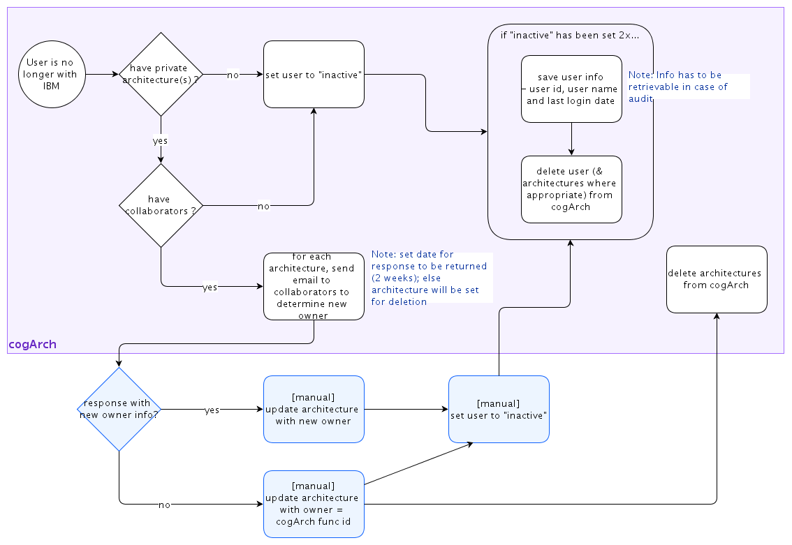

## Diagram

### Name

IIAA-4534 : Removal of users (& their architectures)

### Description

Monthly job of Removal of users (&amp; their architectures) who are no longer with IBM and...
 

<ol><li>do not have any private architectures (may be a collaborator on other architectures)</li><li>only have private architectures - all architectures do not have collaborators</li><li>have at least 1 private architecture with collaborators</li></ol>
 

Need to handle Kyndryl users in the same way.

 

Notes:

- actual removal of user info (&amp; arch) is done 2 months after initial detection (in case there are issues with userID validation)

- actual removal of "orphaned" architectures, i.e. those with owner = cogArch func id is done 2 months later

 

 

### Reference(s)

### Label

