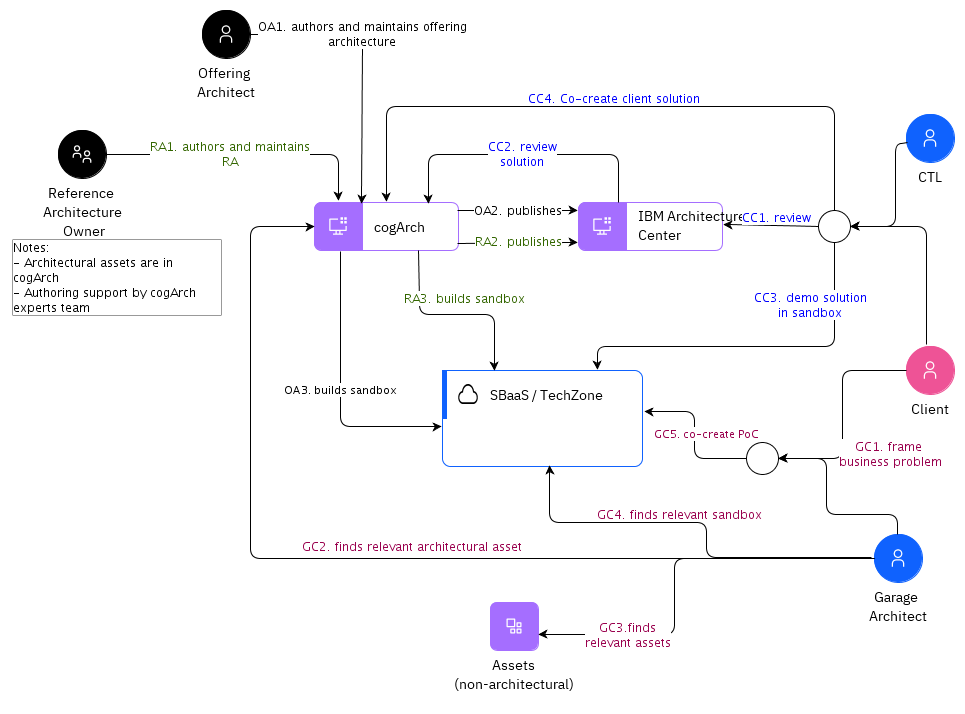

## Diagram

### Name

e2e flow

### Description

5 actors (including Client)
4 scenarios

 

1) Offering Management:

<ol><li>Offering Architect authors and maintains offering architecture in cogArch</li><li>When ready, publishes to Architecture Center</li><li>Builds offering in sandbox env</li></ol>

 

2) Reference Architecture (RA):

<ol><li>RA Owner/Architect authors and maintains offering architecture in cogArch </li><li>When ready, publishes to Architecture Center </li><li>Builds RA in sandbox env </li></ol>

 

3) CTL &amp; Client Collaboration:

<ol><li>Review relevant reference/solution architecture in IBM Architecture Center</li><li>Review details of architecture in cogArch / archAssistant</li><li>CTL demos solution in sandbox</li><li>Co-create client solution in archAssistant</li></ol>

 

4) Garage &amp; Client PoC Co-creation:

<ol><li>Frame business problem</li><li>GA finds relevant architectural asset in cogArch</li><li>GA finds relevant assets in Git/etc</li><li>GA finds relevant sandbox that can be used as the base for PoC</li><li>Co-create PoC </li></ol>

 

Step prefix convention:

Offering Architect - OA

Reference Architecture Owner - RA

CTL &amp; Client - CC

Garage &amp; Client - GC

### Reference(s)

### Label

