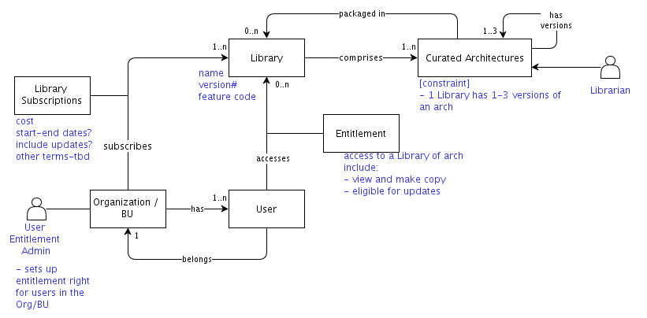

## Diagram

### Name

libraries

### Description

A Library is a bundle of curated architectures that are available for purchase.
 

Each architecture has to be well-formed, contains all relevant information, and has been reviewed for quality.

 

Options for purchase:

<ul><li>per library</li><li>per group of libraries</li><li>all libraries</li></ul><blockquote style="margin: 0 0 0 40px; border: none; padding: 0px;">- with option to include updates</blockquote><blockquote style="margin: 0 0 0 40px; border: none; padding: 0px;">- metering &amp; charging not needed since payment is up front with purchase of library(s)</blockquote>

 

All libraries are read-only and entitlement to the libraries means that they can be viewed and copied.

 

An architecture in a library may have up to 3 versions - current + previous 2 versions. If/When a new version is available, notifications will be sent. For clients with their own instances, allow them to choose when/how to get the updates

 

Others:

<ul><li>There will be free libraries of architectures that are available on the internet.</li><li>sell libraries for use with offline version? yes, but give access only through online eg multi-tenant instance - needs tbd</li><li>look into providing a "paid" multi-tenant instance for clients; charge by bundling SaaS + libraries</li></ul>

 

Functions:

- notification mechanism

- dashboard for monitoring usage

- set up of entitlement

- management of libraries + curated architectures

- how to view libraries &amp; associated architectures

 

Governance:

new libraries/curated architectures - only need COO and verify architecture is of quality and we have rights to icons used

- process for submission of curated arch to be added

 

### Reference(s)

### Label

