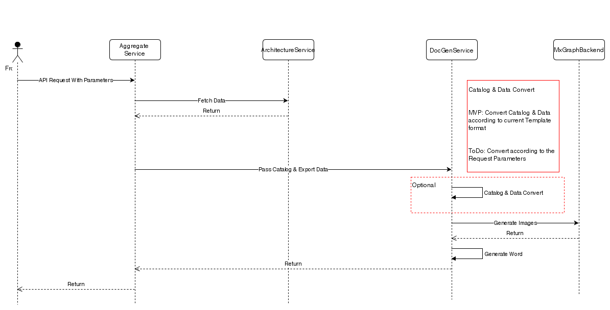

# Auto-Return Pen Design & In-App Notification

Key points: <ol><li>Actively editing status for teal pen: </li><ul><li>pervious pen holder has updates in last 30mins OR in 10mins waiting period</li></ul><li>Inactive status for auto return pen (return pen immediately):</li><ul><li>pen holder has no updates in last 30mins OR not in arch detail page</li></ul><li>Popup window only show up in current arch’s detail page</li></ol>  Issues Identify user is offline from CA <blockquote><ul><li>When user connect to socket server, subscribe all arches’ pen channels - psubscribe</li><li>When user disconnect from socket server, unsubscribe all arches’ pen channel - punsubscribe</li><li>If no subscriber for specified pen channel, then user is offline, return pen automatically for this arch</li></ul></blockquote>Page is not refreshed after pen is auto returned if in arch list page Time delay for release cache asynchronously – get old data from cache  Redis data is lost if restart redis service or redis server <blockquote><ul><li>Option 1: rebuild redis keys from pen info in mongo</li><li>Option 2: do redis persistence and may remove pen info from mongo</li></ul></blockquote>Duplicated message – multiple instances on prod for load balance, need extra process Reconnect issue History message

