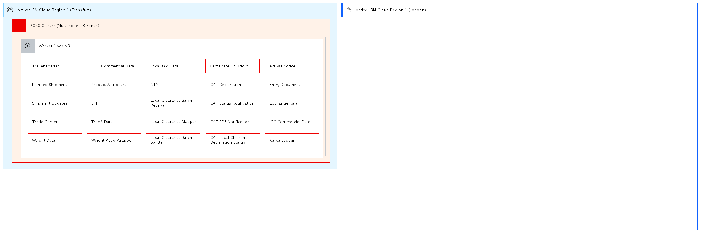

## Diagram

### Name

POC

### Description

### Reference(s)

## Element

[Expand all](#){ .md-button .diff-line }

### Actor

    

### Subsystem

### OMLocation

    

Active: IBM Cloud Region 1 (Frankfurt)

<table>
    <caption></caption>
    <thead>
        <tr>
            <th></th>
            <th></th>
        </tr>
    </thead>
    <tr>
        <td> <strong>Name</strong> </td>
        <td>Active: IBM Cloud Region 1 (Frankfurt)</td>
    </tr>
    <tr>
        <td> <strong>Description</strong> </td>
        <td></td>
    </tr>
</table>

    

Active: IBM Cloud Region 1 (London)

<table>
    <caption></caption>
    <thead>
        <tr>
            <th></th>
            <th></th>
        </tr>
    </thead>
    <tr>
        <td> <strong>Name</strong> </td>
        <td>Active: IBM Cloud Region 1 (London)</td>
    </tr>
    <tr>
        <td> <strong>Description</strong> </td>
        <td></td>
    </tr>
</table>

    

### Logical Connection

    

### Logical Node

    

Planned Shipment

<table>
    <caption></caption>
    <thead>
        <tr>
            <th></th>
            <th></th>
        </tr>
    </thead>
    <tr>
        <td> <strong>Name</strong> </td>
        <td>Planned Shipment</td>
    </tr>
    <tr>
        <td> <strong>Description</strong> </td>
        <td></td>
    </tr>
    <tr>
        <td> <strong>Type</strong> </td>
        <td></td>
    </tr>
    <tr>
        <td> <strong>Primary Capability</strong> </td>
        <td>
            
        </td>
    </tr>
    <tr>
        <td> <strong>Implementation</strong> </td>
        <td>
            
        </td>
    </tr>
    <tr>
        <td> <strong>Architectural Decision</strong> </td>
        <td>
            
        </td>
    </tr>
    <tr>
        <td> <strong>Non Functional Requirement</strong> </td>
        <td>
            
        </td>
    </tr>
    <tr>
        <td> <strong>Generic Group</strong> </td>
        <td></td>
    </tr>
    <tr>
        <td> <strong>Sub-level Diagram</strong> </td>
        <td></td>
    </tr>
    <tr>
        <td> <strong>Related Diagrams</strong> </td>
        <td>
            
                
<a href="../../Logical Operational View/lomview_BkV_guiVqgGi_rJcFBkpqi">CCP LOM</a>

            
                
<a href="../../Prescribed Operational View/pomview_H1F2xOiVcxMj_rJcFBkpqi">POC</a>

            
        </td>
    </tr>
    <tr>
        <td> <strong>Related Elements</strong> </td>
        <td>
            
                
Planned Shipment

                
                    
                    <li><a href="../../Prescribed Operational View/pomview_H1F2xOiVcxMj_rJcFBkpqi">POC</a></li>
                    
                
            
                
Active: IBM Cloud Region 1 (Frankfurt)

                
                    
                    <li><a href="../../Prescribed Operational View/pomview_H1F2xOiVcxMj_rJcFBkpqi">POC</a></li>
                    
                    <li><a href="../../Logical Operational View/lomview_BkV_guiVqgGi_rJcFBkpqi">CCP LOM</a></li>
                    
                
            
            
                
Shipment Initiation Integration

                
                    
                    <li>
<a href="../../Prescribed Operational View/pomview_H1F2xOiVcxMj_rJcFBkpqi">POC</a>
</li>
                    
                    <li>
<a href="../../Logical Operational View/lomview_BkV_guiVqgGi_rJcFBkpqi">CCP LOM</a>
</li>
                    
                    <li>
<a href="../../Static View/cmstaticview_Bkh5xuoE5ezo_rJcFBkpqi">Component Overview</a>
</li>
                    
                
            
        </td>
    </tr>
    
</table>

    

Shipment Updates

<table>
    <caption></caption>
    <thead>
        <tr>
            <th></th>
            <th></th>
        </tr>
    </thead>
    <tr>
        <td> <strong>Name</strong> </td>
        <td>Shipment Updates</td>
    </tr>
    <tr>
        <td> <strong>Description</strong> </td>
        <td></td>
    </tr>
    <tr>
        <td> <strong>Type</strong> </td>
        <td></td>
    </tr>
    <tr>
        <td> <strong>Primary Capability</strong> </td>
        <td>
            
        </td>
    </tr>
    <tr>
        <td> <strong>Implementation</strong> </td>
        <td>
            
        </td>
    </tr>
    <tr>
        <td> <strong>Architectural Decision</strong> </td>
        <td>
            
        </td>
    </tr>
    <tr>
        <td> <strong>Non Functional Requirement</strong> </td>
        <td>
            
        </td>
    </tr>
    <tr>
        <td> <strong>Generic Group</strong> </td>
        <td></td>
    </tr>
    <tr>
        <td> <strong>Sub-level Diagram</strong> </td>
        <td></td>
    </tr>
    <tr>
        <td> <strong>Related Diagrams</strong> </td>
        <td>
            
                
<a href="../../Logical Operational View/lomview_BkV_guiVqgGi_rJcFBkpqi">CCP LOM</a>

            
                
<a href="../../Prescribed Operational View/pomview_H1F2xOiVcxMj_rJcFBkpqi">POC</a>

            
        </td>
    </tr>
    <tr>
        <td> <strong>Related Elements</strong> </td>
        <td>
            
                
Shipment Updates

                
                    
                    <li><a href="../../Prescribed Operational View/pomview_H1F2xOiVcxMj_rJcFBkpqi">POC</a></li>
                    
                
            
                
Active: IBM Cloud Region 1 (Frankfurt)

                
                    
                    <li><a href="../../Prescribed Operational View/pomview_H1F2xOiVcxMj_rJcFBkpqi">POC</a></li>
                    
                    <li><a href="../../Logical Operational View/lomview_BkV_guiVqgGi_rJcFBkpqi">CCP LOM</a></li>
                    
                
            
            
                
ICC Shipment Updates

                
                    
                    <li>
<a href="../../Prescribed Operational View/pomview_H1F2xOiVcxMj_rJcFBkpqi">POC</a>
</li>
                    
                    <li>
<a href="../../Logical Operational View/lomview_BkV_guiVqgGi_rJcFBkpqi">CCP LOM</a>
</li>
                    
                    <li>
<a href="../../Static View/cmstaticview_Bkh5xuoE5ezo_rJcFBkpqi">Component Overview</a>
</li>
                    
                
            
        </td>
    </tr>
    
</table>

    

Trade Content

<table>
    <caption></caption>
    <thead>
        <tr>
            <th></th>
            <th></th>
        </tr>
    </thead>
    <tr>
        <td> <strong>Name</strong> </td>
        <td>Trade Content</td>
    </tr>
    <tr>
        <td> <strong>Description</strong> </td>
        <td></td>
    </tr>
    <tr>
        <td> <strong>Type</strong> </td>
        <td></td>
    </tr>
    <tr>
        <td> <strong>Primary Capability</strong> </td>
        <td>
            
        </td>
    </tr>
    <tr>
        <td> <strong>Implementation</strong> </td>
        <td>
            
        </td>
    </tr>
    <tr>
        <td> <strong>Architectural Decision</strong> </td>
        <td>
            
        </td>
    </tr>
    <tr>
        <td> <strong>Non Functional Requirement</strong> </td>
        <td>
            
        </td>
    </tr>
    <tr>
        <td> <strong>Generic Group</strong> </td>
        <td></td>
    </tr>
    <tr>
        <td> <strong>Sub-level Diagram</strong> </td>
        <td></td>
    </tr>
    <tr>
        <td> <strong>Related Diagrams</strong> </td>
        <td>
            
                
<a href="../../Logical Operational View/lomview_BkV_guiVqgGi_rJcFBkpqi">CCP LOM</a>

            
                
<a href="../../Prescribed Operational View/pomview_H1F2xOiVcxMj_rJcFBkpqi">POC</a>

            
        </td>
    </tr>
    <tr>
        <td> <strong>Related Elements</strong> </td>
        <td>
            
                
Trade Content

                
                    
                    <li><a href="../../Prescribed Operational View/pomview_H1F2xOiVcxMj_rJcFBkpqi">POC</a></li>
                    
                
            
                
Active: IBM Cloud Region 1 (Frankfurt)

                
                    
                    <li><a href="../../Prescribed Operational View/pomview_H1F2xOiVcxMj_rJcFBkpqi">POC</a></li>
                    
                    <li><a href="../../Logical Operational View/lomview_BkV_guiVqgGi_rJcFBkpqi">CCP LOM</a></li>
                    
                
            
            
                
Trade Content Integration

                
                    
                    <li>
<a href="../../Prescribed Operational View/pomview_H1F2xOiVcxMj_rJcFBkpqi">POC</a>
</li>
                    
                    <li>
<a href="../../Logical Operational View/lomview_BkV_guiVqgGi_rJcFBkpqi">CCP LOM</a>
</li>
                    
                    <li>
<a href="../../Static View/cmstaticview_Bkh5xuoE5ezo_rJcFBkpqi">Component Overview</a>
</li>
                    
                
            
        </td>
    </tr>
    
</table>

    

Trailer Loaded App

<table>
    <caption></caption>
    <thead>
        <tr>
            <th></th>
            <th></th>
        </tr>
    </thead>
    <tr>
        <td> <strong>Name</strong> </td>
        <td>Trailer Loaded App</td>
    </tr>
    <tr>
        <td> <strong>Description</strong> </td>
        <td></td>
    </tr>
    <tr>
        <td> <strong>Type</strong> </td>
        <td></td>
    </tr>
    <tr>
        <td> <strong>Primary Capability</strong> </td>
        <td>
            
        </td>
    </tr>
    <tr>
        <td> <strong>Implementation</strong> </td>
        <td>
            
        </td>
    </tr>
    <tr>
        <td> <strong>Architectural Decision</strong> </td>
        <td>
            
        </td>
    </tr>
    <tr>
        <td> <strong>Non Functional Requirement</strong> </td>
        <td>
            
        </td>
    </tr>
    <tr>
        <td> <strong>Generic Group</strong> </td>
        <td></td>
    </tr>
    <tr>
        <td> <strong>Sub-level Diagram</strong> </td>
        <td></td>
    </tr>
    <tr>
        <td> <strong>Related Diagrams</strong> </td>
        <td>
            
                
<a href="../../Logical Operational View/lomview_BkV_guiVqgGi_rJcFBkpqi">CCP LOM</a>

            
                
<a href="../../Prescribed Operational View/pomview_H1F2xOiVcxMj_rJcFBkpqi">POC</a>

            
        </td>
    </tr>
    <tr>
        <td> <strong>Related Elements</strong> </td>
        <td>
            
                
Trailer Loaded

                
                    
                    <li><a href="../../Prescribed Operational View/pomview_H1F2xOiVcxMj_rJcFBkpqi">POC</a></li>
                    
                
            
                
Active: IBM Cloud Region 1 (Frankfurt)

                
                    
                    <li><a href="../../Prescribed Operational View/pomview_H1F2xOiVcxMj_rJcFBkpqi">POC</a></li>
                    
                    <li><a href="../../Logical Operational View/lomview_BkV_guiVqgGi_rJcFBkpqi">CCP LOM</a></li>
                    
                
            
            
                
Trailer Loaded Integration

                
                    
                    <li>
<a href="../../Prescribed Operational View/pomview_H1F2xOiVcxMj_rJcFBkpqi">POC</a>
</li>
                    
                    <li>
<a href="../../Logical Operational View/lomview_BkV_guiVqgGi_rJcFBkpqi">CCP LOM</a>
</li>
                    
                    <li>
<a href="../../Static View/cmstaticview_Bkh5xuoE5ezo_rJcFBkpqi">Component Overview</a>
</li>
                    
                
            
        </td>
    </tr>
    
</table>

    

### Physical Connection

    

### Physical Node

    

Arrival Notice

<table>
    <caption></caption>
    <thead>
        <tr>
            <th></th>
            <th></th>
        </tr>
    </thead>
    <tr>
        <td> <strong>Name</strong> </td>
        <td>Arrival Notice</td>
    </tr>
    <tr>
        <td> <strong>Description</strong> </td>
        <td></td>
    </tr>
    <tr>
        <td> <strong>Cardinality</strong> </td>
        <td>1</td>
    </tr>
    <tr>
        <td> <strong>CPU/Cores</strong> </td>
        <td></td>
    </tr>
    <tr>
        <td> <strong>Memory</strong> </td>
        <td></td>
    </tr>
    <tr>
        <td> <strong>Network ports</strong> </td>
        <td></td>
    </tr>
    <tr>
        <td> <strong>OS/Hyper-visor</strong> </td>
        <td></td>
    </tr>
    <tr>
        <td> <strong>Deploy</strong> </td>
        <td></td>
    </tr>
    <tr>
        <td> <strong>Deploy Provisioning</strong> </td>
        <td></td>
    </tr>
</table>

    

C4T Declaration

<table>
    <caption></caption>
    <thead>
        <tr>
            <th></th>
            <th></th>
        </tr>
    </thead>
    <tr>
        <td> <strong>Name</strong> </td>
        <td>C4T Declaration</td>
    </tr>
    <tr>
        <td> <strong>Description</strong> </td>
        <td></td>
    </tr>
    <tr>
        <td> <strong>Cardinality</strong> </td>
        <td>1</td>
    </tr>
    <tr>
        <td> <strong>CPU/Cores</strong> </td>
        <td></td>
    </tr>
    <tr>
        <td> <strong>Memory</strong> </td>
        <td></td>
    </tr>
    <tr>
        <td> <strong>Network ports</strong> </td>
        <td></td>
    </tr>
    <tr>
        <td> <strong>OS/Hyper-visor</strong> </td>
        <td></td>
    </tr>
    <tr>
        <td> <strong>Deploy</strong> </td>
        <td></td>
    </tr>
    <tr>
        <td> <strong>Deploy Provisioning</strong> </td>
        <td></td>
    </tr>
</table>

    

C4T Local Clearance Declaration Status

<table>
    <caption></caption>
    <thead>
        <tr>
            <th></th>
            <th></th>
        </tr>
    </thead>
    <tr>
        <td> <strong>Name</strong> </td>
        <td>C4T Local Clearance Declaration Status</td>
    </tr>
    <tr>
        <td> <strong>Description</strong> </td>
        <td></td>
    </tr>
    <tr>
        <td> <strong>Cardinality</strong> </td>
        <td>1</td>
    </tr>
    <tr>
        <td> <strong>CPU/Cores</strong> </td>
        <td></td>
    </tr>
    <tr>
        <td> <strong>Memory</strong> </td>
        <td></td>
    </tr>
    <tr>
        <td> <strong>Network ports</strong> </td>
        <td></td>
    </tr>
    <tr>
        <td> <strong>OS/Hyper-visor</strong> </td>
        <td></td>
    </tr>
    <tr>
        <td> <strong>Deploy</strong> </td>
        <td></td>
    </tr>
    <tr>
        <td> <strong>Deploy Provisioning</strong> </td>
        <td></td>
    </tr>
</table>

    

C4T PDF Notification

<table>
    <caption></caption>
    <thead>
        <tr>
            <th></th>
            <th></th>
        </tr>
    </thead>
    <tr>
        <td> <strong>Name</strong> </td>
        <td>C4T PDF Notification</td>
    </tr>
    <tr>
        <td> <strong>Description</strong> </td>
        <td></td>
    </tr>
    <tr>
        <td> <strong>Cardinality</strong> </td>
        <td>1</td>
    </tr>
    <tr>
        <td> <strong>CPU/Cores</strong> </td>
        <td></td>
    </tr>
    <tr>
        <td> <strong>Memory</strong> </td>
        <td></td>
    </tr>
    <tr>
        <td> <strong>Network ports</strong> </td>
        <td></td>
    </tr>
    <tr>
        <td> <strong>OS/Hyper-visor</strong> </td>
        <td></td>
    </tr>
    <tr>
        <td> <strong>Deploy</strong> </td>
        <td></td>
    </tr>
    <tr>
        <td> <strong>Deploy Provisioning</strong> </td>
        <td></td>
    </tr>
</table>

    

C4T Status Notification

<table>
    <caption></caption>
    <thead>
        <tr>
            <th></th>
            <th></th>
        </tr>
    </thead>
    <tr>
        <td> <strong>Name</strong> </td>
        <td>C4T Status Notification</td>
    </tr>
    <tr>
        <td> <strong>Description</strong> </td>
        <td></td>
    </tr>
    <tr>
        <td> <strong>Cardinality</strong> </td>
        <td>1</td>
    </tr>
    <tr>
        <td> <strong>CPU/Cores</strong> </td>
        <td></td>
    </tr>
    <tr>
        <td> <strong>Memory</strong> </td>
        <td></td>
    </tr>
    <tr>
        <td> <strong>Network ports</strong> </td>
        <td></td>
    </tr>
    <tr>
        <td> <strong>OS/Hyper-visor</strong> </td>
        <td></td>
    </tr>
    <tr>
        <td> <strong>Deploy</strong> </td>
        <td></td>
    </tr>
    <tr>
        <td> <strong>Deploy Provisioning</strong> </td>
        <td></td>
    </tr>
</table>

    

Certificate Of Origin

<table>
    <caption></caption>
    <thead>
        <tr>
            <th></th>
            <th></th>
        </tr>
    </thead>
    <tr>
        <td> <strong>Name</strong> </td>
        <td>Certificate Of Origin</td>
    </tr>
    <tr>
        <td> <strong>Description</strong> </td>
        <td></td>
    </tr>
    <tr>
        <td> <strong>Cardinality</strong> </td>
        <td>1</td>
    </tr>
    <tr>
        <td> <strong>CPU/Cores</strong> </td>
        <td></td>
    </tr>
    <tr>
        <td> <strong>Memory</strong> </td>
        <td></td>
    </tr>
    <tr>
        <td> <strong>Network ports</strong> </td>
        <td></td>
    </tr>
    <tr>
        <td> <strong>OS/Hyper-visor</strong> </td>
        <td></td>
    </tr>
    <tr>
        <td> <strong>Deploy</strong> </td>
        <td></td>
    </tr>
    <tr>
        <td> <strong>Deploy Provisioning</strong> </td>
        <td></td>
    </tr>
</table>

    

Entry Document

<table>
    <caption></caption>
    <thead>
        <tr>
            <th></th>
            <th></th>
        </tr>
    </thead>
    <tr>
        <td> <strong>Name</strong> </td>
        <td>Entry Document</td>
    </tr>
    <tr>
        <td> <strong>Description</strong> </td>
        <td></td>
    </tr>
    <tr>
        <td> <strong>Cardinality</strong> </td>
        <td>1</td>
    </tr>
    <tr>
        <td> <strong>CPU/Cores</strong> </td>
        <td></td>
    </tr>
    <tr>
        <td> <strong>Memory</strong> </td>
        <td></td>
    </tr>
    <tr>
        <td> <strong>Network ports</strong> </td>
        <td></td>
    </tr>
    <tr>
        <td> <strong>OS/Hyper-visor</strong> </td>
        <td></td>
    </tr>
    <tr>
        <td> <strong>Deploy</strong> </td>
        <td></td>
    </tr>
    <tr>
        <td> <strong>Deploy Provisioning</strong> </td>
        <td></td>
    </tr>
</table>

    

Exchange Rate

<table>
    <caption></caption>
    <thead>
        <tr>
            <th></th>
            <th></th>
        </tr>
    </thead>
    <tr>
        <td> <strong>Name</strong> </td>
        <td>Exchange Rate</td>
    </tr>
    <tr>
        <td> <strong>Description</strong> </td>
        <td></td>
    </tr>
    <tr>
        <td> <strong>Cardinality</strong> </td>
        <td>1</td>
    </tr>
    <tr>
        <td> <strong>CPU/Cores</strong> </td>
        <td></td>
    </tr>
    <tr>
        <td> <strong>Memory</strong> </td>
        <td></td>
    </tr>
    <tr>
        <td> <strong>Network ports</strong> </td>
        <td></td>
    </tr>
    <tr>
        <td> <strong>OS/Hyper-visor</strong> </td>
        <td></td>
    </tr>
    <tr>
        <td> <strong>Deploy</strong> </td>
        <td></td>
    </tr>
    <tr>
        <td> <strong>Deploy Provisioning</strong> </td>
        <td></td>
    </tr>
</table>

    

ICC Commercial Data

<table>
    <caption></caption>
    <thead>
        <tr>
            <th></th>
            <th></th>
        </tr>
    </thead>
    <tr>
        <td> <strong>Name</strong> </td>
        <td>ICC Commercial Data</td>
    </tr>
    <tr>
        <td> <strong>Description</strong> </td>
        <td></td>
    </tr>
    <tr>
        <td> <strong>Cardinality</strong> </td>
        <td>1</td>
    </tr>
    <tr>
        <td> <strong>CPU/Cores</strong> </td>
        <td></td>
    </tr>
    <tr>
        <td> <strong>Memory</strong> </td>
        <td></td>
    </tr>
    <tr>
        <td> <strong>Network ports</strong> </td>
        <td></td>
    </tr>
    <tr>
        <td> <strong>OS/Hyper-visor</strong> </td>
        <td></td>
    </tr>
    <tr>
        <td> <strong>Deploy</strong> </td>
        <td></td>
    </tr>
    <tr>
        <td> <strong>Deploy Provisioning</strong> </td>
        <td></td>
    </tr>
</table>

    

Kafka Logger

<table>
    <caption></caption>
    <thead>
        <tr>
            <th></th>
            <th></th>
        </tr>
    </thead>
    <tr>
        <td> <strong>Name</strong> </td>
        <td>Kafka Logger</td>
    </tr>
    <tr>
        <td> <strong>Description</strong> </td>
        <td></td>
    </tr>
    <tr>
        <td> <strong>Cardinality</strong> </td>
        <td>1</td>
    </tr>
    <tr>
        <td> <strong>CPU/Cores</strong> </td>
        <td></td>
    </tr>
    <tr>
        <td> <strong>Memory</strong> </td>
        <td></td>
    </tr>
    <tr>
        <td> <strong>Network ports</strong> </td>
        <td></td>
    </tr>
    <tr>
        <td> <strong>OS/Hyper-visor</strong> </td>
        <td></td>
    </tr>
    <tr>
        <td> <strong>Deploy</strong> </td>
        <td></td>
    </tr>
    <tr>
        <td> <strong>Deploy Provisioning</strong> </td>
        <td></td>
    </tr>
</table>

    

Local Clearance Batch Receiver

<table>
    <caption></caption>
    <thead>
        <tr>
            <th></th>
            <th></th>
        </tr>
    </thead>
    <tr>
        <td> <strong>Name</strong> </td>
        <td>Local Clearance Batch Receiver</td>
    </tr>
    <tr>
        <td> <strong>Description</strong> </td>
        <td></td>
    </tr>
    <tr>
        <td> <strong>Cardinality</strong> </td>
        <td>1</td>
    </tr>
    <tr>
        <td> <strong>CPU/Cores</strong> </td>
        <td></td>
    </tr>
    <tr>
        <td> <strong>Memory</strong> </td>
        <td></td>
    </tr>
    <tr>
        <td> <strong>Network ports</strong> </td>
        <td></td>
    </tr>
    <tr>
        <td> <strong>OS/Hyper-visor</strong> </td>
        <td></td>
    </tr>
    <tr>
        <td> <strong>Deploy</strong> </td>
        <td></td>
    </tr>
    <tr>
        <td> <strong>Deploy Provisioning</strong> </td>
        <td></td>
    </tr>
</table>

    

Local Clearance Batch Splitter

<table>
    <caption></caption>
    <thead>
        <tr>
            <th></th>
            <th></th>
        </tr>
    </thead>
    <tr>
        <td> <strong>Name</strong> </td>
        <td>Local Clearance Batch Splitter</td>
    </tr>
    <tr>
        <td> <strong>Description</strong> </td>
        <td></td>
    </tr>
    <tr>
        <td> <strong>Cardinality</strong> </td>
        <td>1</td>
    </tr>
    <tr>
        <td> <strong>CPU/Cores</strong> </td>
        <td></td>
    </tr>
    <tr>
        <td> <strong>Memory</strong> </td>
        <td></td>
    </tr>
    <tr>
        <td> <strong>Network ports</strong> </td>
        <td></td>
    </tr>
    <tr>
        <td> <strong>OS/Hyper-visor</strong> </td>
        <td></td>
    </tr>
    <tr>
        <td> <strong>Deploy</strong> </td>
        <td></td>
    </tr>
    <tr>
        <td> <strong>Deploy Provisioning</strong> </td>
        <td></td>
    </tr>
</table>

    

Local Clearance Mapper

<table>
    <caption></caption>
    <thead>
        <tr>
            <th></th>
            <th></th>
        </tr>
    </thead>
    <tr>
        <td> <strong>Name</strong> </td>
        <td>Local Clearance Mapper</td>
    </tr>
    <tr>
        <td> <strong>Description</strong> </td>
        <td></td>
    </tr>
    <tr>
        <td> <strong>Cardinality</strong> </td>
        <td>1</td>
    </tr>
    <tr>
        <td> <strong>CPU/Cores</strong> </td>
        <td></td>
    </tr>
    <tr>
        <td> <strong>Memory</strong> </td>
        <td></td>
    </tr>
    <tr>
        <td> <strong>Network ports</strong> </td>
        <td></td>
    </tr>
    <tr>
        <td> <strong>OS/Hyper-visor</strong> </td>
        <td></td>
    </tr>
    <tr>
        <td> <strong>Deploy</strong> </td>
        <td></td>
    </tr>
    <tr>
        <td> <strong>Deploy Provisioning</strong> </td>
        <td></td>
    </tr>
</table>

    

Localized Data

<table>
    <caption></caption>
    <thead>
        <tr>
            <th></th>
            <th></th>
        </tr>
    </thead>
    <tr>
        <td> <strong>Name</strong> </td>
        <td>Localized Data</td>
    </tr>
    <tr>
        <td> <strong>Description</strong> </td>
        <td></td>
    </tr>
    <tr>
        <td> <strong>Cardinality</strong> </td>
        <td>1</td>
    </tr>
    <tr>
        <td> <strong>CPU/Cores</strong> </td>
        <td></td>
    </tr>
    <tr>
        <td> <strong>Memory</strong> </td>
        <td></td>
    </tr>
    <tr>
        <td> <strong>Network ports</strong> </td>
        <td></td>
    </tr>
    <tr>
        <td> <strong>OS/Hyper-visor</strong> </td>
        <td></td>
    </tr>
    <tr>
        <td> <strong>Deploy</strong> </td>
        <td></td>
    </tr>
    <tr>
        <td> <strong>Deploy Provisioning</strong> </td>
        <td></td>
    </tr>
</table>

    

NTN

<table>
    <caption></caption>
    <thead>
        <tr>
            <th></th>
            <th></th>
        </tr>
    </thead>
    <tr>
        <td> <strong>Name</strong> </td>
        <td>NTN</td>
    </tr>
    <tr>
        <td> <strong>Description</strong> </td>
        <td></td>
    </tr>
    <tr>
        <td> <strong>Cardinality</strong> </td>
        <td>1</td>
    </tr>
    <tr>
        <td> <strong>CPU/Cores</strong> </td>
        <td></td>
    </tr>
    <tr>
        <td> <strong>Memory</strong> </td>
        <td></td>
    </tr>
    <tr>
        <td> <strong>Network ports</strong> </td>
        <td></td>
    </tr>
    <tr>
        <td> <strong>OS/Hyper-visor</strong> </td>
        <td></td>
    </tr>
    <tr>
        <td> <strong>Deploy</strong> </td>
        <td></td>
    </tr>
    <tr>
        <td> <strong>Deploy Provisioning</strong> </td>
        <td></td>
    </tr>
</table>

    

OCC Commercial Data

<table>
    <caption></caption>
    <thead>
        <tr>
            <th></th>
            <th></th>
        </tr>
    </thead>
    <tr>
        <td> <strong>Name</strong> </td>
        <td>OCC Commercial Data</td>
    </tr>
    <tr>
        <td> <strong>Description</strong> </td>
        <td></td>
    </tr>
    <tr>
        <td> <strong>Cardinality</strong> </td>
        <td>1</td>
    </tr>
    <tr>
        <td> <strong>CPU/Cores</strong> </td>
        <td></td>
    </tr>
    <tr>
        <td> <strong>Memory</strong> </td>
        <td></td>
    </tr>
    <tr>
        <td> <strong>Network ports</strong> </td>
        <td></td>
    </tr>
    <tr>
        <td> <strong>OS/Hyper-visor</strong> </td>
        <td></td>
    </tr>
    <tr>
        <td> <strong>Deploy</strong> </td>
        <td></td>
    </tr>
    <tr>
        <td> <strong>Deploy Provisioning</strong> </td>
        <td></td>
    </tr>
</table>

    

Planned Shipment

<table>
    <caption></caption>
    <thead>
        <tr>
            <th></th>
            <th></th>
        </tr>
    </thead>
    <tr>
        <td> <strong>Name</strong> </td>
        <td>Planned Shipment</td>
    </tr>
    <tr>
        <td> <strong>Description</strong> </td>
        <td></td>
    </tr>
    <tr>
        <td> <strong>Cardinality</strong> </td>
        <td>1</td>
    </tr>
    <tr>
        <td> <strong>CPU/Cores</strong> </td>
        <td></td>
    </tr>
    <tr>
        <td> <strong>Memory</strong> </td>
        <td></td>
    </tr>
    <tr>
        <td> <strong>Network ports</strong> </td>
        <td></td>
    </tr>
    <tr>
        <td> <strong>OS/Hyper-visor</strong> </td>
        <td></td>
    </tr>
    <tr>
        <td> <strong>Deploy</strong> </td>
        <td></td>
    </tr>
    <tr>
        <td> <strong>Deploy Provisioning</strong> </td>
        <td></td>
    </tr>
</table>

    

Product Attributes

<table>
    <caption></caption>
    <thead>
        <tr>
            <th></th>
            <th></th>
        </tr>
    </thead>
    <tr>
        <td> <strong>Name</strong> </td>
        <td>Product Attributes</td>
    </tr>
    <tr>
        <td> <strong>Description</strong> </td>
        <td></td>
    </tr>
    <tr>
        <td> <strong>Cardinality</strong> </td>
        <td>1</td>
    </tr>
    <tr>
        <td> <strong>CPU/Cores</strong> </td>
        <td></td>
    </tr>
    <tr>
        <td> <strong>Memory</strong> </td>
        <td></td>
    </tr>
    <tr>
        <td> <strong>Network ports</strong> </td>
        <td></td>
    </tr>
    <tr>
        <td> <strong>OS/Hyper-visor</strong> </td>
        <td></td>
    </tr>
    <tr>
        <td> <strong>Deploy</strong> </td>
        <td></td>
    </tr>
    <tr>
        <td> <strong>Deploy Provisioning</strong> </td>
        <td></td>
    </tr>
</table>

    

ROKS Cluster (Multi Zone - 3 Zones)

<table>
    <caption></caption>
    <thead>
        <tr>
            <th></th>
            <th></th>
        </tr>
    </thead>
    <tr>
        <td> <strong>Name</strong> </td>
        <td>ROKS Cluster (Multi Zone - 3 Zones)</td>
    </tr>
    <tr>
        <td> <strong>Description</strong> </td>
        <td></td>
    </tr>
    <tr>
        <td> <strong>Cardinality</strong> </td>
        <td>1</td>
    </tr>
    <tr>
        <td> <strong>CPU/Cores</strong> </td>
        <td></td>
    </tr>
    <tr>
        <td> <strong>Memory</strong> </td>
        <td></td>
    </tr>
    <tr>
        <td> <strong>Network ports</strong> </td>
        <td></td>
    </tr>
    <tr>
        <td> <strong>OS/Hyper-visor</strong> </td>
        <td></td>
    </tr>
    <tr>
        <td> <strong>Deploy</strong> </td>
        <td>Managed</td>
    </tr>
    <tr>
        <td> <strong>Deploy Provisioning</strong> </td>
        <td>Delivered by Cloud</td>
    </tr>
</table>

    

Shipment Updates

<table>
    <caption></caption>
    <thead>
        <tr>
            <th></th>
            <th></th>
        </tr>
    </thead>
    <tr>
        <td> <strong>Name</strong> </td>
        <td>Shipment Updates</td>
    </tr>
    <tr>
        <td> <strong>Description</strong> </td>
        <td></td>
    </tr>
    <tr>
        <td> <strong>Cardinality</strong> </td>
        <td>1</td>
    </tr>
    <tr>
        <td> <strong>CPU/Cores</strong> </td>
        <td></td>
    </tr>
    <tr>
        <td> <strong>Memory</strong> </td>
        <td></td>
    </tr>
    <tr>
        <td> <strong>Network ports</strong> </td>
        <td></td>
    </tr>
    <tr>
        <td> <strong>OS/Hyper-visor</strong> </td>
        <td></td>
    </tr>
    <tr>
        <td> <strong>Deploy</strong> </td>
        <td></td>
    </tr>
    <tr>
        <td> <strong>Deploy Provisioning</strong> </td>
        <td></td>
    </tr>
</table>

    

STP

<table>
    <caption></caption>
    <thead>
        <tr>
            <th></th>
            <th></th>
        </tr>
    </thead>
    <tr>
        <td> <strong>Name</strong> </td>
        <td>STP</td>
    </tr>
    <tr>
        <td> <strong>Description</strong> </td>
        <td></td>
    </tr>
    <tr>
        <td> <strong>Cardinality</strong> </td>
        <td>1</td>
    </tr>
    <tr>
        <td> <strong>CPU/Cores</strong> </td>
        <td></td>
    </tr>
    <tr>
        <td> <strong>Memory</strong> </td>
        <td></td>
    </tr>
    <tr>
        <td> <strong>Network ports</strong> </td>
        <td></td>
    </tr>
    <tr>
        <td> <strong>OS/Hyper-visor</strong> </td>
        <td></td>
    </tr>
    <tr>
        <td> <strong>Deploy</strong> </td>
        <td></td>
    </tr>
    <tr>
        <td> <strong>Deploy Provisioning</strong> </td>
        <td></td>
    </tr>
</table>

    

Trade Content

<table>
    <caption></caption>
    <thead>
        <tr>
            <th></th>
            <th></th>
        </tr>
    </thead>
    <tr>
        <td> <strong>Name</strong> </td>
        <td>Trade Content</td>
    </tr>
    <tr>
        <td> <strong>Description</strong> </td>
        <td></td>
    </tr>
    <tr>
        <td> <strong>Cardinality</strong> </td>
        <td>1</td>
    </tr>
    <tr>
        <td> <strong>CPU/Cores</strong> </td>
        <td></td>
    </tr>
    <tr>
        <td> <strong>Memory</strong> </td>
        <td></td>
    </tr>
    <tr>
        <td> <strong>Network ports</strong> </td>
        <td></td>
    </tr>
    <tr>
        <td> <strong>OS/Hyper-visor</strong> </td>
        <td></td>
    </tr>
    <tr>
        <td> <strong>Deploy</strong> </td>
        <td></td>
    </tr>
    <tr>
        <td> <strong>Deploy Provisioning</strong> </td>
        <td></td>
    </tr>
</table>

    

Trailer Loaded

<table>
    <caption></caption>
    <thead>
        <tr>
            <th></th>
            <th></th>
        </tr>
    </thead>
    <tr>
        <td> <strong>Name</strong> </td>
        <td>Trailer Loaded</td>
    </tr>
    <tr>
        <td> <strong>Description</strong> </td>
        <td></td>
    </tr>
    <tr>
        <td> <strong>Cardinality</strong> </td>
        <td>1</td>
    </tr>
    <tr>
        <td> <strong>CPU/Cores</strong> </td>
        <td></td>
    </tr>
    <tr>
        <td> <strong>Memory</strong> </td>
        <td></td>
    </tr>
    <tr>
        <td> <strong>Network ports</strong> </td>
        <td></td>
    </tr>
    <tr>
        <td> <strong>OS/Hyper-visor</strong> </td>
        <td></td>
    </tr>
    <tr>
        <td> <strong>Deploy</strong> </td>
        <td></td>
    </tr>
    <tr>
        <td> <strong>Deploy Provisioning</strong> </td>
        <td></td>
    </tr>
</table>

    

TreqR Data

<table>
    <caption></caption>
    <thead>
        <tr>
            <th></th>
            <th></th>
        </tr>
    </thead>
    <tr>
        <td> <strong>Name</strong> </td>
        <td>TreqR Data</td>
    </tr>
    <tr>
        <td> <strong>Description</strong> </td>
        <td></td>
    </tr>
    <tr>
        <td> <strong>Cardinality</strong> </td>
        <td>1</td>
    </tr>
    <tr>
        <td> <strong>CPU/Cores</strong> </td>
        <td></td>
    </tr>
    <tr>
        <td> <strong>Memory</strong> </td>
        <td></td>
    </tr>
    <tr>
        <td> <strong>Network ports</strong> </td>
        <td></td>
    </tr>
    <tr>
        <td> <strong>OS/Hyper-visor</strong> </td>
        <td></td>
    </tr>
    <tr>
        <td> <strong>Deploy</strong> </td>
        <td></td>
    </tr>
    <tr>
        <td> <strong>Deploy Provisioning</strong> </td>
        <td></td>
    </tr>
</table>

    

Weight Data

<table>
    <caption></caption>
    <thead>
        <tr>
            <th></th>
            <th></th>
        </tr>
    </thead>
    <tr>
        <td> <strong>Name</strong> </td>
        <td>Weight Data</td>
    </tr>
    <tr>
        <td> <strong>Description</strong> </td>
        <td></td>
    </tr>
    <tr>
        <td> <strong>Cardinality</strong> </td>
        <td>1</td>
    </tr>
    <tr>
        <td> <strong>CPU/Cores</strong> </td>
        <td></td>
    </tr>
    <tr>
        <td> <strong>Memory</strong> </td>
        <td></td>
    </tr>
    <tr>
        <td> <strong>Network ports</strong> </td>
        <td></td>
    </tr>
    <tr>
        <td> <strong>OS/Hyper-visor</strong> </td>
        <td></td>
    </tr>
    <tr>
        <td> <strong>Deploy</strong> </td>
        <td></td>
    </tr>
    <tr>
        <td> <strong>Deploy Provisioning</strong> </td>
        <td></td>
    </tr>
</table>

    

Weight Repo Wrapper

<table>
    <caption></caption>
    <thead>
        <tr>
            <th></th>
            <th></th>
        </tr>
    </thead>
    <tr>
        <td> <strong>Name</strong> </td>
        <td>Weight Repo Wrapper</td>
    </tr>
    <tr>
        <td> <strong>Description</strong> </td>
        <td></td>
    </tr>
    <tr>
        <td> <strong>Cardinality</strong> </td>
        <td>1</td>
    </tr>
    <tr>
        <td> <strong>CPU/Cores</strong> </td>
        <td></td>
    </tr>
    <tr>
        <td> <strong>Memory</strong> </td>
        <td></td>
    </tr>
    <tr>
        <td> <strong>Network ports</strong> </td>
        <td></td>
    </tr>
    <tr>
        <td> <strong>OS/Hyper-visor</strong> </td>
        <td></td>
    </tr>
    <tr>
        <td> <strong>Deploy</strong> </td>
        <td></td>
    </tr>
    <tr>
        <td> <strong>Deploy Provisioning</strong> </td>
        <td></td>
    </tr>
</table>

    

Worker Node x3

<table>
    <caption></caption>
    <thead>
        <tr>
            <th></th>
            <th></th>
        </tr>
    </thead>
    <tr>
        <td> <strong>Name</strong> </td>
        <td>Worker Node x3</td>
    </tr>
    <tr>
        <td> <strong>Description</strong> </td>
        <td></td>
    </tr>
    <tr>
        <td> <strong>Cardinality</strong> </td>
        <td>3</td>
    </tr>
    <tr>
        <td> <strong>CPU/Cores</strong> </td>
        <td></td>
    </tr>
    <tr>
        <td> <strong>Memory</strong> </td>
        <td></td>
    </tr>
    <tr>
        <td> <strong>Network ports</strong> </td>
        <td></td>
    </tr>
    <tr>
        <td> <strong>OS/Hyper-visor</strong> </td>
        <td></td>
    </tr>
    <tr>
        <td> <strong>Deploy</strong> </td>
        <td></td>
    </tr>
    <tr>
        <td> <strong>Deploy Provisioning</strong> </td>
        <td></td>
    </tr>
</table>

    

