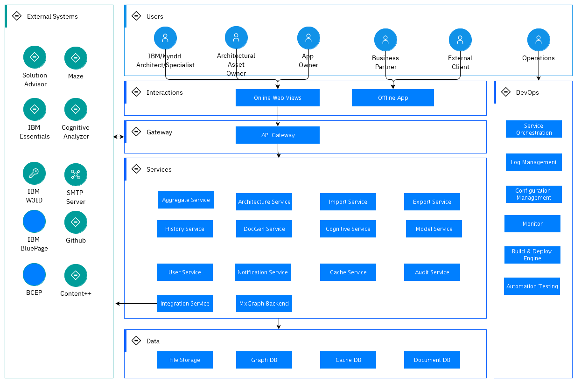

## Diagram

### Name

Architecture Overview

### Description

### Reference(s)

## Element

[Expand all](#){ .md-button .diff-line }

### Actor

    

App Owner

<table>
    <caption></caption>
    <thead>
        <tr>
            <th></th>
            <th></th>
        </tr>
    </thead>
    <tr>
        <td> <strong>Name</strong> </td>
        <td>App Owner</td>
    </tr>
    <tr>
        <td> <strong>Description</strong> </td>
        <td>The user who has admin permission. For example, publish architecture, grant user new role, send app In-App Notification.</td>
    </tr>
    <tr>
        <td> <strong>Type</strong> </td>
        <td>Human</td>
    </tr>
    <tr>
        <td> <strong>Generic Group</strong> </td>
<td>
        
</td>
    </tr>
</table>

    

Architectural Asset Owner

<table>
    <caption></caption>
    <thead>
        <tr>
            <th></th>
            <th></th>
        </tr>
    </thead>
    <tr>
        <td> <strong>Name</strong> </td>
        <td>Architectural Asset Owner</td>
    </tr>
    <tr>
        <td> <strong>Description</strong> </td>
        <td>The user who owns published Architecture</td>
    </tr>
    <tr>
        <td> <strong>Type</strong> </td>
        <td>Human</td>
    </tr>
    <tr>
        <td> <strong>Generic Group</strong> </td>
<td>
        
</td>
    </tr>
</table>

    

BCEP

<table>
    <caption></caption>
    <thead>
        <tr>
            <th></th>
            <th></th>
        </tr>
    </thead>
    <tr>
        <td> <strong>Name</strong> </td>
        <td>BCEP</td>
    </tr>
    <tr>
        <td> <strong>Description</strong> </td>
        <td>Business Continuity Engineering Platform (BCEP) is a centralized managed engineering platform which provides tools for supporting end to end client project engagement and delivery. This platform enable different personas of the teams to deliver to clients faster, more effectively and transparently, from geo-distributed locations.</td>
    </tr>
    <tr>
        <td> <strong>Type</strong> </td>
        <td>IT System</td>
    </tr>
    <tr>
        <td> <strong>Generic Group</strong> </td>
<td>
        
</td>
    </tr>
</table>

    

Business Partner

<table>
    <caption></caption>
    <thead>
        <tr>
            <th></th>
            <th></th>
        </tr>
    </thead>
    <tr>
        <td> <strong>Name</strong> </td>
        <td>Business Partner</td>
    </tr>
    <tr>
        <td> <strong>Description</strong> </td>
        <td>The client facing IBMers</td>
    </tr>
    <tr>
        <td> <strong>Type</strong> </td>
        <td>Human</td>
    </tr>
    <tr>
        <td> <strong>Generic Group</strong> </td>
<td>
        
</td>
    </tr>
</table>

    

Cognitive Analyzer

<table>
    <caption></caption>
    <thead>
        <tr>
            <th></th>
            <th></th>
        </tr>
    </thead>
    <tr>
        <td> <strong>Name</strong> </td>
        <td>Cognitive Analyzer</td>
    </tr>
    <tr>
        <td> <strong>Description</strong> </td>
        <td>It analyzes RFPs and automatically and creates the solution. It integrates Cognitive Architect to provide the options to the user to modify the automatically created solution, by referencing to reference architecture and add or remove solution components. Also modify the solution to a different technology platform.</td>
    </tr>
    <tr>
        <td> <strong>Type</strong> </td>
        <td>IT System</td>
    </tr>
    <tr>
        <td> <strong>Generic Group</strong> </td>
<td>
        
</td>
    </tr>
</table>

    

Content++

<table>
    <caption></caption>
    <thead>
        <tr>
            <th></th>
            <th></th>
        </tr>
    </thead>
    <tr>
        <td> <strong>Name</strong> </td>
        <td>Content++</td>
    </tr>
    <tr>
        <td> <strong>Description</strong> </td>
        <td></td>
    </tr>
    <tr>
        <td> <strong>Type</strong> </td>
        <td>IT System</td>
    </tr>
    <tr>
        <td> <strong>Generic Group</strong> </td>
<td>
        
</td>
    </tr>
</table>

    

External Client

<table>
    <caption></caption>
    <thead>
        <tr>
            <th></th>
            <th></th>
        </tr>
    </thead>
    <tr>
        <td> <strong>Name</strong> </td>
        <td>External Client</td>
    </tr>
    <tr>
        <td> <strong>Description</strong> </td>
        <td>IBM Clients who can review/edit the IBM Provided Architectures through offline version.</td>
    </tr>
    <tr>
        <td> <strong>Type</strong> </td>
        <td>Human</td>
    </tr>
    <tr>
        <td> <strong>Generic Group</strong> </td>
<td>
        
</td>
    </tr>
</table>

    

Github

<table>
    <caption></caption>
    <thead>
        <tr>
            <th></th>
            <th></th>
        </tr>
    </thead>
    <tr>
        <td> <strong>Name</strong> </td>
        <td>Github</td>
    </tr>
    <tr>
        <td> <strong>Description</strong> </td>
        <td>Leverages Github for Architecture Data Archive</td>
    </tr>
    <tr>
        <td> <strong>Type</strong> </td>
        <td>IT System</td>
    </tr>
    <tr>
        <td> <strong>Generic Group</strong> </td>
<td>
        
</td>
    </tr>
</table>

    

IBM BluePage

<table>
    <caption></caption>
    <thead>
        <tr>
            <th></th>
            <th></th>
        </tr>
    </thead>
    <tr>
        <td> <strong>Name</strong> </td>
        <td>IBM BluePage</td>
    </tr>
    <tr>
        <td> <strong>Description</strong> </td>
        <td>IBM BluePage provides users profile information, including firstnName, lastName, avatar, notesId</td>
    </tr>
    <tr>
        <td> <strong>Type</strong> </td>
        <td>IT System</td>
    </tr>
    <tr>
        <td> <strong>Generic Group</strong> </td>
<td>
        
</td>
    </tr>
</table>

    

IBM Essentials

<table>
    <caption></caption>
    <thead>
        <tr>
            <th></th>
            <th></th>
        </tr>
    </thead>
    <tr>
        <td> <strong>Name</strong> </td>
        <td>IBM Essentials</td>
    </tr>
    <tr>
        <td> <strong>Description</strong> </td>
        <td></td>
    </tr>
    <tr>
        <td> <strong>Type</strong> </td>
        <td>IT System</td>
    </tr>
    <tr>
        <td> <strong>Generic Group</strong> </td>
<td>
        
</td>
    </tr>
</table>

    

IBM W3ID

<table>
    <caption></caption>
    <thead>
        <tr>
            <th></th>
            <th></th>
        </tr>
    </thead>
    <tr>
        <td> <strong>Name</strong> </td>
        <td>IBM W3ID</td>
    </tr>
    <tr>
        <td> <strong>Description</strong> </td>
        <td>Leverage IBM W3ID for IBMer authentication</td>
    </tr>
    <tr>
        <td> <strong>Type</strong> </td>
        <td>IT System</td>
    </tr>
    <tr>
        <td> <strong>Generic Group</strong> </td>
<td>
        
</td>
    </tr>
</table>

    

IBM/Kyndrl Architect/Specialist

<table>
    <caption></caption>
    <thead>
        <tr>
            <th></th>
            <th></th>
        </tr>
    </thead>
    <tr>
        <td> <strong>Name</strong> </td>
        <td>IBM/Kyndrl Architect/Specialist</td>
    </tr>
    <tr>
        <td> <strong>Description</strong> </td>
        <td>The user with the basic permission, like Architecture Compose, Search, Collaborate</td>
    </tr>
    <tr>
        <td> <strong>Type</strong> </td>
        <td>Human</td>
    </tr>
    <tr>
        <td> <strong>Generic Group</strong> </td>
<td>
        
</td>
    </tr>
</table>

    

Maze

<table>
    <caption></caption>
    <thead>
        <tr>
            <th></th>
            <th></th>
        </tr>
    </thead>
    <tr>
        <td> <strong>Name</strong> </td>
        <td>Maze</td>
    </tr>
    <tr>
        <td> <strong>Description</strong> </td>
        <td>Cognitive Architect integrated Maze for Cloud Deployment Diagram Render and Auto Deployment</td>
    </tr>
    <tr>
        <td> <strong>Type</strong> </td>
        <td>IT System</td>
    </tr>
    <tr>
        <td> <strong>Generic Group</strong> </td>
<td>
        
</td>
    </tr>
</table>

    

Operations

<table>
    <caption></caption>
    <thead>
        <tr>
            <th></th>
            <th></th>
        </tr>
    </thead>
    <tr>
        <td> <strong>Name</strong> </td>
        <td>Operations</td>
    </tr>
    <tr>
        <td> <strong>Description</strong> </td>
        <td>The user who maintains the system infrastructure & DevOps</td>
    </tr>
    <tr>
        <td> <strong>Type</strong> </td>
        <td>Human</td>
    </tr>
    <tr>
        <td> <strong>Generic Group</strong> </td>
<td>
        
</td>
    </tr>
</table>

    

SMTP Server

<table>
    <caption></caption>
    <thead>
        <tr>
            <th></th>
            <th></th>
        </tr>
    </thead>
    <tr>
        <td> <strong>Name</strong> </td>
        <td>SMTP Server</td>
    </tr>
    <tr>
        <td> <strong>Description</strong> </td>
        <td>Uses Internal SMTP Server to send email notification</td>
    </tr>
    <tr>
        <td> <strong>Type</strong> </td>
        <td>IT System</td>
    </tr>
    <tr>
        <td> <strong>Generic Group</strong> </td>
<td>
        
</td>
    </tr>
</table>

    

Solution Advisor

<table>
    <caption></caption>
    <thead>
        <tr>
            <th></th>
            <th></th>
        </tr>
    </thead>
    <tr>
        <td> <strong>Name</strong> </td>
        <td>Solution Advisor</td>
    </tr>
    <tr>
        <td> <strong>Description</strong> </td>
        <td>Leverage solution Advisor to generate project effort estimation & plan</td>
    </tr>
    <tr>
        <td> <strong>Type</strong> </td>
        <td>IT System</td>
    </tr>
    <tr>
        <td> <strong>Generic Group</strong> </td>
<td>
        
</td>
    </tr>
</table>

    

### Subsystem

    

Data

<table>
    <caption></caption>
    <thead>
        <tr>
            <th></th>
            <th></th>
        </tr>
    </thead>
    <tr>
        <td> <strong>Name</strong> </td>
        <td>Data</td>
    </tr>
    <tr>
        <td> <strong>Description</strong> </td>
        <td></td>
    </tr>
    
</table>

    

DevOps

<table>
    <caption></caption>
    <thead>
        <tr>
            <th></th>
            <th></th>
        </tr>
    </thead>
    <tr>
        <td> <strong>Name</strong> </td>
        <td>DevOps</td>
    </tr>
    <tr>
        <td> <strong>Description</strong> </td>
        <td></td>
    </tr>
    
</table>

    

External Systems

<table>
    <caption></caption>
    <thead>
        <tr>
            <th></th>
            <th></th>
        </tr>
    </thead>
    <tr>
        <td> <strong>Name</strong> </td>
        <td>External Systems</td>
    </tr>
    <tr>
        <td> <strong>Description</strong> </td>
        <td></td>
    </tr>
    
</table>

    

Gateway

<table>
    <caption></caption>
    <thead>
        <tr>
            <th></th>
            <th></th>
        </tr>
    </thead>
    <tr>
        <td> <strong>Name</strong> </td>
        <td>Gateway</td>
    </tr>
    <tr>
        <td> <strong>Description</strong> </td>
        <td></td>
    </tr>
    
</table>

    

Interactions

<table>
    <caption></caption>
    <thead>
        <tr>
            <th></th>
            <th></th>
        </tr>
    </thead>
    <tr>
        <td> <strong>Name</strong> </td>
        <td>Interactions</td>
    </tr>
    <tr>
        <td> <strong>Description</strong> </td>
        <td></td>
    </tr>
    
</table>

    

Services

<table>
    <caption></caption>
    <thead>
        <tr>
            <th></th>
            <th></th>
        </tr>
    </thead>
    <tr>
        <td> <strong>Name</strong> </td>
        <td>Services</td>
    </tr>
    <tr>
        <td> <strong>Description</strong> </td>
        <td></td>
    </tr>
    
</table>

    

Users

<table>
    <caption></caption>
    <thead>
        <tr>
            <th></th>
            <th></th>
        </tr>
    </thead>
    <tr>
        <td> <strong>Name</strong> </td>
        <td>Users</td>
    </tr>
    <tr>
        <td> <strong>Description</strong> </td>
        <td></td>
    </tr>
    
</table>

    

### Logical Component

    

Service   Orchestration

<table>
    <caption></caption>
    <thead>
        <tr>
            <th></th>
            <th></th>
        </tr>
    </thead>
    <tr>
        <td> <strong>Name</strong> </td>
        <td>Service   Orchestration</td>
    </tr>
    <tr>
        <td> <strong>Description</strong> </td>
        <td>Cognitive Architect leverages IBM Cloud Private</td>
    </tr>
    
    
</table>

    

Aggregate Service

<table>
    <caption></caption>
    <thead>
        <tr>
            <th></th>
            <th></th>
        </tr>
    </thead>
    <tr>
        <td> <strong>Name</strong> </td>
        <td>Aggregate Service</td>
    </tr>
    <tr>
        <td> <strong>Description</strong> </td>
        <td>Aggregate Service to compose different internal services.
</td>
    </tr>
    
    
</table>

    

API Gateway

<table>
    <caption></caption>
    <thead>
        <tr>
            <th></th>
            <th></th>
        </tr>
    </thead>
    <tr>
        <td> <strong>Name</strong> </td>
        <td>API Gateway</td>
    </tr>
    <tr>
        <td> <strong>Description</strong> </td>
        <td>API Gateway to provide following capabilities:
1. API Security Control
2. API Route
3. Error Handler
4. Scheduler

</td>
    </tr>
    
    
</table>

    

Architecture Service

<table>
    <caption></caption>
    <thead>
        <tr>
            <th></th>
            <th></th>
        </tr>
    </thead>
    <tr>
        <td> <strong>Name</strong> </td>
        <td>Architecture Service</td>
    </tr>
    <tr>
        <td> <strong>Description</strong> </td>
        <td>Core Service, Provides Architecture related operations API, like create, update, copy, delete APIs.</td>
    </tr>
    
    
</table>

    

Audit Service

<table>
    <caption></caption>
    <thead>
        <tr>
            <th></th>
            <th></th>
        </tr>
    </thead>
    <tr>
        <td> <strong>Name</strong> </td>
        <td>Audit Service</td>
    </tr>
    <tr>
        <td> <strong>Description</strong> </td>
        <td>Service to audit user key operations. Like delete Instance, update instance, etc.</td>
    </tr>
    
    
</table>

    

Automation Testing

<table>
    <caption></caption>
    <thead>
        <tr>
            <th></th>
            <th></th>
        </tr>
    </thead>
    <tr>
        <td> <strong>Name</strong> </td>
        <td>Automation Testing</td>
    </tr>
    <tr>
        <td> <strong>Description</strong> </td>
        <td>Support GUI & API Automation Testing
</td>
    </tr>
    
    
</table>

    

Build & Deploy Engine

<table>
    <caption></caption>
    <thead>
        <tr>
            <th></th>
            <th></th>
        </tr>
    </thead>
    <tr>
        <td> <strong>Name</strong> </td>
        <td>Build & Deploy Engine</td>
    </tr>
    <tr>
        <td> <strong>Description</strong> </td>
        <td>Leverage Jenkins to Build & Deploy Services

And use Harbor to store images</td>
    </tr>
    
    
</table>

    

Cache DB

<table>
    <caption></caption>
    <thead>
        <tr>
            <th></th>
            <th></th>
        </tr>
    </thead>
    <tr>
        <td> <strong>Name</strong> </td>
        <td>Cache DB</td>
    </tr>
    <tr>
        <td> <strong>Description</strong> </td>
        <td>1. Users' frequent response data is stored in Redis
2. Leverage Redis subscribe/publish to support In-App Notification</td>
    </tr>
    
    
</table>

    

Cache Service

<table>
    <caption></caption>
    <thead>
        <tr>
            <th></th>
            <th></th>
        </tr>
    </thead>
    <tr>
        <td> <strong>Name</strong> </td>
        <td>Cache Service</td>
    </tr>
    <tr>
        <td> <strong>Description</strong> </td>
        <td>Cache users' frequent response data
Top10, 
User Bookmarked Arches
User Private Arches
User Collaborated Arches, etc.

Cache data for integration</td>
    </tr>
    
    
</table>

    

Cognitive Service

<table>
    <caption></caption>
    <thead>
        <tr>
            <th></th>
            <th></th>
        </tr>
    </thead>
    <tr>
        <td> <strong>Name</strong> </td>
        <td>Cognitive Service</td>
    </tr>
    <tr>
        <td> <strong>Description</strong> </td>
        <td>Capability combine different AI Models and expose business apis</td>
    </tr>
    
    
</table>

    

Configuration Management

<table>
    <caption></caption>
    <thead>
        <tr>
            <th></th>
            <th></th>
        </tr>
    </thead>
    <tr>
        <td> <strong>Name</strong> </td>
        <td>Configuration Management</td>
    </tr>
    <tr>
        <td> <strong>Description</strong> </td>
        <td>Different Environment configurations are stored in github. 
DevOps scripts choose different environment configuration in deployment phase

Credential Information is stored in Box with permission control
</td>
    </tr>
    
    
</table>

    

DocGen Service

<table>
    <caption></caption>
    <thead>
        <tr>
            <th></th>
            <th></th>
        </tr>
    </thead>
    <tr>
        <td> <strong>Name</strong> </td>
        <td>DocGen Service</td>
    </tr>
    <tr>
        <td> <strong>Description</strong> </td>
        <td>Export service to export Word</td>
    </tr>
    
    
</table>

    

Document DB

<table>
    <caption></caption>
    <thead>
        <tr>
            <th></th>
            <th></th>
        </tr>
    </thead>
    <tr>
        <td> <strong>Name</strong> </td>
        <td>Document DB</td>
    </tr>
    <tr>
        <td> <strong>Description</strong> </td>
        <td>User Data, History Data, Audit Data, Model Data, Integration related data are stored in Mongodb</td>
    </tr>
    
    
</table>

    

Export Service

<table>
    <caption></caption>
    <thead>
        <tr>
            <th></th>
            <th></th>
        </tr>
    </thead>
    <tr>
        <td> <strong>Name</strong> </td>
        <td>Export Service</td>
    </tr>
    <tr>
        <td> <strong>Description</strong> </td>
        <td>Export service to export pptx, excel</td>
    </tr>
    
    
</table>

    

File Storage

<table>
    <caption></caption>
    <thead>
        <tr>
            <th></th>
            <th></th>
        </tr>
    </thead>
    <tr>
        <td> <strong>Name</strong> </td>
        <td>File Storage</td>
    </tr>
    <tr>
        <td> <strong>Description</strong> </td>
        <td>Users' custom images, attachments are stored in File System</td>
    </tr>
    
    
</table>

    

Graph DB

<table>
    <caption></caption>
    <thead>
        <tr>
            <th></th>
            <th></th>
        </tr>
    </thead>
    <tr>
        <td> <strong>Name</strong> </td>
        <td>Graph DB</td>
    </tr>
    <tr>
        <td> <strong>Description</strong> </td>
        <td>Architecture data is stored in Neo4j</td>
    </tr>
    
    
</table>

    

History Service

<table>
    <caption></caption>
    <thead>
        <tr>
            <th></th>
            <th></th>
        </tr>
    </thead>
    <tr>
        <td> <strong>Name</strong> </td>
        <td>History Service</td>
    </tr>
    <tr>
        <td> <strong>Description</strong> </td>
        <td>Provides the Statistics Data calculation</td>
    </tr>
    
    
</table>

    

Import Service

<table>
    <caption></caption>
    <thead>
        <tr>
            <th></th>
            <th></th>
        </tr>
    </thead>
    <tr>
        <td> <strong>Name</strong> </td>
        <td>Import Service</td>
    </tr>
    <tr>
        <td> <strong>Description</strong> </td>
        <td>Import service to import excel data with architecture information like architectural decision, nfr, etc. </td>
    </tr>
    
    
</table>

    

Integration Service

<table>
    <caption></caption>
    <thead>
        <tr>
            <th></th>
            <th></th>
        </tr>
    </thead>
    <tr>
        <td> <strong>Name</strong> </td>
        <td>Integration Service</td>
    </tr>
    <tr>
        <td> <strong>Description</strong> </td>
        <td>Service to integrate 3-party back-end services</td>
    </tr>
    
    
</table>

    

Log Management

<table>
    <caption></caption>
    <thead>
        <tr>
            <th></th>
            <th></th>
        </tr>
    </thead>
    <tr>
        <td> <strong>Name</strong> </td>
        <td>Log Management</td>
    </tr>
    <tr>
        <td> <strong>Description</strong> </td>
        <td>For Cognitive Architect
Gather the log information and analyze
1. FileBeat collect container log
2. ELK store the log
3. Kibana show the log</td>
    </tr>
    
    
</table>

    

Model Service

<table>
    <caption></caption>
    <thead>
        <tr>
            <th></th>
            <th></th>
        </tr>
    </thead>
    <tr>
        <td> <strong>Name</strong> </td>
        <td>Model Service</td>
    </tr>
    <tr>
        <td> <strong>Description</strong> </td>
        <td>Provides the capability to train and store NLP Models</td>
    </tr>
    
    
</table>

    

Monitor

<table>
    <caption></caption>
    <thead>
        <tr>
            <th></th>
            <th></th>
        </tr>
    </thead>
    <tr>
        <td> <strong>Name</strong> </td>
        <td>Monitor</td>
    </tr>
    <tr>
        <td> <strong>Description</strong> </td>
        <td>Leverage Instana, including alert capability like below:
1. Infrastructure monitor
2. Container, API, Browser monitor
3. Alert to Slack or PageDuty
</td>
    </tr>
    
    
</table>

    

MxGraph Backend

<table>
    <caption></caption>
    <thead>
        <tr>
            <th></th>
            <th></th>
        </tr>
    </thead>
    <tr>
        <td> <strong>Name</strong> </td>
        <td>MxGraph Backend</td>
    </tr>
    <tr>
        <td> <strong>Description</strong> </td>
        <td>MxGraph Backend provides the capability to export diagram to png gif, etc format. </td>
    </tr>
    
    
</table>

    

Notification Service

<table>
    <caption></caption>
    <thead>
        <tr>
            <th></th>
            <th></th>
        </tr>
    </thead>
    <tr>
        <td> <strong>Name</strong> </td>
        <td>Notification Service</td>
    </tr>
    <tr>
        <td> <strong>Description</strong> </td>
        <td>Provide In-App and Email Notification</td>
    </tr>
    
    
</table>

    

Offline App

<table>
    <caption></caption>
    <thead>
        <tr>
            <th></th>
            <th></th>
        </tr>
    </thead>
    <tr>
        <td> <strong>Name</strong> </td>
        <td>Offline App</td>
    </tr>
    <tr>
        <td> <strong>Description</strong> </td>
        <td>CogArch Offline Version, provides the foundation architecture compose capabilities. </td>
    </tr>
    
    
</table>

    

Online Web Views

<table>
    <caption></caption>
    <thead>
        <tr>
            <th></th>
            <th></th>
        </tr>
    </thead>
    <tr>
        <td> <strong>Name</strong> </td>
        <td>Online Web Views</td>
    </tr>
    <tr>
        <td> <strong>Description</strong> </td>
        <td>CA Web Application for Online Version, with full-set capabilities, including architecture compose, search, collaboration, dashboard, etc. 
</td>
    </tr>
    
    
</table>

    

User Service

<table>
    <caption></caption>
    <thead>
        <tr>
            <th></th>
            <th></th>
        </tr>
    </thead>
    <tr>
        <td> <strong>Name</strong> </td>
        <td>User Service</td>
    </tr>
    <tr>
        <td> <strong>Description</strong> </td>
        <td>Authentication/Authorization Service, User Profile and Team Service</td>
    </tr>
    
    
</table>

    

### Logical Connector

    

<table>
    <caption></caption>
    <thead>
        <tr>
            <th></th>
            <th></th>
        </tr>
    </thead>
    <tr>
        <td> <strong>Name</strong> </td>
        <td></td>
    </tr>
    <tr>
        <td> <strong>Description</strong> </td>
        <td></td>
    </tr>
</table>

    

<table>
    <caption></caption>
    <thead>
        <tr>
            <th></th>
            <th></th>
        </tr>
    </thead>
    <tr>
        <td> <strong>Name</strong> </td>
        <td></td>
    </tr>
    <tr>
        <td> <strong>Description</strong> </td>
        <td></td>
    </tr>
</table>

    

<table>
    <caption></caption>
    <thead>
        <tr>
            <th></th>
            <th></th>
        </tr>
    </thead>
    <tr>
        <td> <strong>Name</strong> </td>
        <td></td>
    </tr>
    <tr>
        <td> <strong>Description</strong> </td>
        <td></td>
    </tr>
</table>

    

<table>
    <caption></caption>
    <thead>
        <tr>
            <th></th>
            <th></th>
        </tr>
    </thead>
    <tr>
        <td> <strong>Name</strong> </td>
        <td></td>
    </tr>
    <tr>
        <td> <strong>Description</strong> </td>
        <td></td>
    </tr>
</table>

    

<table>
    <caption></caption>
    <thead>
        <tr>
            <th></th>
            <th></th>
        </tr>
    </thead>
    <tr>
        <td> <strong>Name</strong> </td>
        <td></td>
    </tr>
    <tr>
        <td> <strong>Description</strong> </td>
        <td></td>
    </tr>
</table>

    

<table>
    <caption></caption>
    <thead>
        <tr>
            <th></th>
            <th></th>
        </tr>
    </thead>
    <tr>
        <td> <strong>Name</strong> </td>
        <td></td>
    </tr>
    <tr>
        <td> <strong>Description</strong> </td>
        <td></td>
    </tr>
</table>

    

<table>
    <caption></caption>
    <thead>
        <tr>
            <th></th>
            <th></th>
        </tr>
    </thead>
    <tr>
        <td> <strong>Name</strong> </td>
        <td></td>
    </tr>
    <tr>
        <td> <strong>Description</strong> </td>
        <td></td>
    </tr>
</table>

    

<table>
    <caption></caption>
    <thead>
        <tr>
            <th></th>
            <th></th>
        </tr>
    </thead>
    <tr>
        <td> <strong>Name</strong> </td>
        <td></td>
    </tr>
    <tr>
        <td> <strong>Description</strong> </td>
        <td></td>
    </tr>
</table>

    

<table>
    <caption></caption>
    <thead>
        <tr>
            <th></th>
            <th></th>
        </tr>
    </thead>
    <tr>
        <td> <strong>Name</strong> </td>
        <td></td>
    </tr>
    <tr>
        <td> <strong>Description</strong> </td>
        <td></td>
    </tr>
</table>

    

<table>
    <caption></caption>
    <thead>
        <tr>
            <th></th>
            <th></th>
        </tr>
    </thead>
    <tr>
        <td> <strong>Name</strong> </td>
        <td></td>
    </tr>
    <tr>
        <td> <strong>Description</strong> </td>
        <td></td>
    </tr>
</table>

    

<table>
    <caption></caption>
    <thead>
        <tr>
            <th></th>
            <th></th>
        </tr>
    </thead>
    <tr>
        <td> <strong>Name</strong> </td>
        <td></td>
    </tr>
    <tr>
        <td> <strong>Description</strong> </td>
        <td></td>
    </tr>
</table>

    

